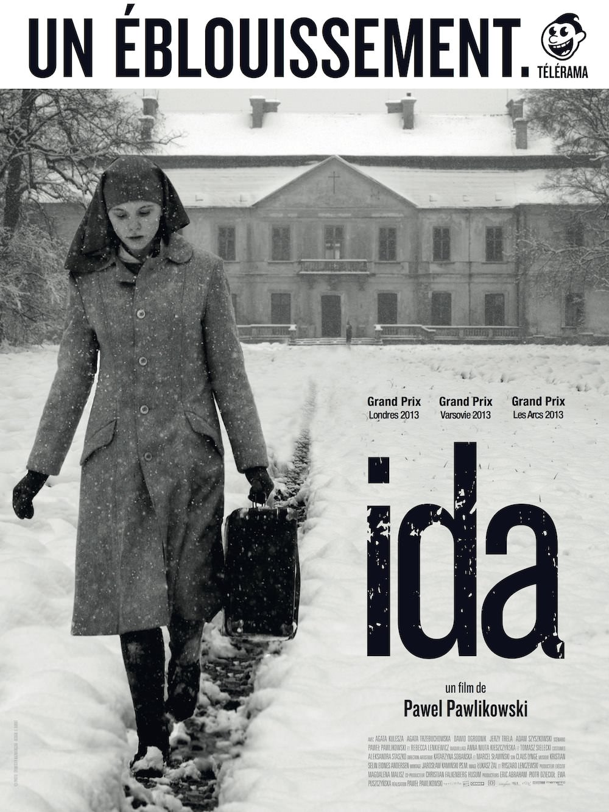
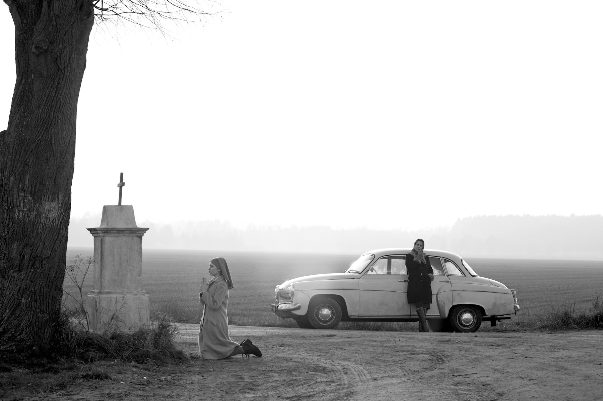
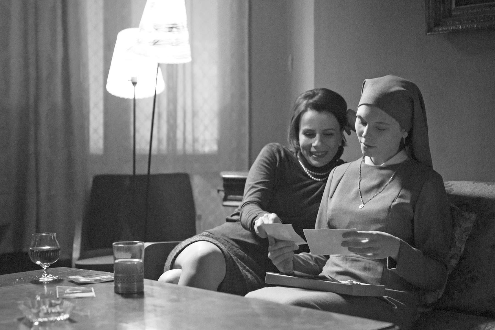

+++
type = "post"
titre = "<em>Ida</em>, Pawel Pawlikowski"
title = "Ida, Pawel Pawlikowski"
url = "/ida-pawlikowski"
date = "2014-02-18T22:13:21"
Lastmod = "2014-03-27T15:43:49"
cover = "ida-pawel-pawlikowski-agata-trzebuchowska.jpg"
categorie = [ "À voir" ]
tag = [ "Drame", "Famille", "Histoire", "Politique", "Religion", "Sorties du mois" ]
createur = [ "Pawel Pawlikowski" ]
acteur = [ "Agata Kulesza", "Agata Trzebuchowska", "Dawid Ogrodnik" ]
annee = [ "2014" ]
weight = 2014
pays = [ "Pologne" ]

+++

Sur le papier, <em>Ida</em> n’est pas forcément le film le plus séduisant qui soit. Ce film polonais qui raconte l’histoire d’une jeune novice qui veut retrouver ses origines avant de prononcer ses vœux, le tout dans un format carré et en noir et blanc, a de quoi effrayer. Et pourtant, le quatrième long-métrage de Pawel Pawlikowski n’a rien du film intellectuel et aride que l’on pourrait craindre. Loin des clichés du genre, il impose son récit avec beaucoup de douceur et propose une histoire passionnante et bien plus violente qu’au premier abord. À travers ce récit qui aurait pu être « inspiré d’une histoire vraie », c’est une partie de l’histoire de la Pologne qui est offerte. <em>Ida</em> est un film étonnant, à ne surtout pas rater.

Dès les premières images dans le couvent où Anna loge depuis qu’elle est orpheline, dans sa plus tendre enfance, <em>Ida</em> frappe par sa photographie et sa mise en scène d’une rigueur absolue. Pawel Pawlikowski a opté pour un format carré, non pas pour donner le sentiment d’un pastiche façon <a href="/artist-hazanavicius/" title="The Artist, Michel Hazanavicius"><em>The Artist</em></a>, mais par une vraie motivation artistique. Dans son film, chaque plan est composé avec soin, comme s’il s’agissait d’une photo. Un sentiment d’ailleurs renforcé par une caméra totalement statique jusqu’à la toute fin : le cinéaste compose son plan et les personnages évoluent éventuellement à l’intérieur, même si l’ensemble est assez posé. Le résultat est vraiment sublime : la photographie impose un noir et blanc assez doux, une subtilité qui met encore mieux en valeur les plans souvent magnifiques du film. Les personnages sont très rarement au centre de l’image, mais quasiment à chaque fois poussés en bas, voire dans un coin de l’écran. On peut reprocher au réalisateur un côté un peu systématique et il est vrai que l’on comprend assez vite un mécanisme répété pendant une heure trente, mais le résultat est malgré tout indéniable. <em>Ida</em> est un film magnifique, mais aussi très dur. Pawel Pawlikowski a choisi de montrer le maximum, pour en dire le minimum et ses choix de mise en scène en disent déjà long sur la situation des personnages et de la Pologne. En repoussant les visages dans les coins, il les isole tout en les écrasant dans des décors d’autant plus impressionnants qu’ils sont souvent vides. La posture passive du personnage principal n’en ressort que mieux : on sent bien que cette jeune femme qui n’a jamais connu autre chose que le couvent et qui apprend brutalement qu’elle a une famille et qu’elle n’est pas celle qu’elle pensait éprouve un grand sentiment de vide. Sentiment qui est transmis par ces cadrages et ces choix de mise en scène.

On pourrait parler longtemps de la forme et il faut reconnaître qu’elle prend peut-être un peu le dessus sur le fond. <em>Ida</em> n’est pas un film totalement vain pour autant et ce qu’il dit de la Pologne des années 1960 est passionnant, surtout quand on ne connaît pas parfaitement l’histoire du pays comme c’est probablement le cas de la majorité des spectateurs. Le pays est encore sous le contrôle total de l’URSS et on le ressent sans le voir tout à fait. Anna va voir sa tante dont elle ignorait l’existence et qui n’a jamais voulu la récupérer : cette femme désabusée a été une juge intraitable qui a condamné à mort un nombre incalculable de personnes jugées ennemies du peuple. Ce personnage regrette sans doute ce qu’elle a fait, mais cette mention introduit la terrible histoire du pays de façon brutale. C’est surtout le traitement des Juifs pendant la Seconde Guerre mondiale qui secoue le film. Avant de prononcer ses vœux, Anna est envoyée par la mère supérieure voir sa tante. La jeune femme découvre ainsi ses origines, à commencer par sa judéité qu’elle ignorait totalement jusqu’alors. Elle découvre aussi que ses parents sont morts pendant la guerre et <em>Ida</em> se transforme quasiment en thriller, alors que ses deux personnages principaux tentent de savoir ce qu’il est advenu des parents. Elles enquêtent dans le village où ils habitaient, retrouvent rapidement la trace de l’homme qui les a protégés pendant la guerre, mais cette enquête n’est pas très bien accueillie, et pour cause. Même si ce n’est pas son objectif premier, Pawel Pawlikowski entretient le mystère et on s’en voudrait de dévoiler des éléments importants de l’intrigue, mais ce retour vers le passé est passionnant. Ce long-métrage n’a pas l’intensité d’un film à gros budget, mais c’est sa force : il s’impose avec une évidence confondante et on se passionne autant pour le passé, que pour l’avenir de cette bonne sœur un peu déboussolée.

<em>Ida</em> n’est absolument pas la caricature de film intellectuel que l’on pouvait imaginer. Pawel Pawlikowski signe une œuvre puissante et assez dure, même si son long-métrage fait passer ses idées avec une douceur rare. Le film mérite d’être vu ne serait-ce que pour sa photographie et ses cadres sublimes, mais il dit aussi des choses passionnantes sur la Pologne des années 1960. Bref, <em>Ida</em> est une réussite que vous auriez tort de bouder…

