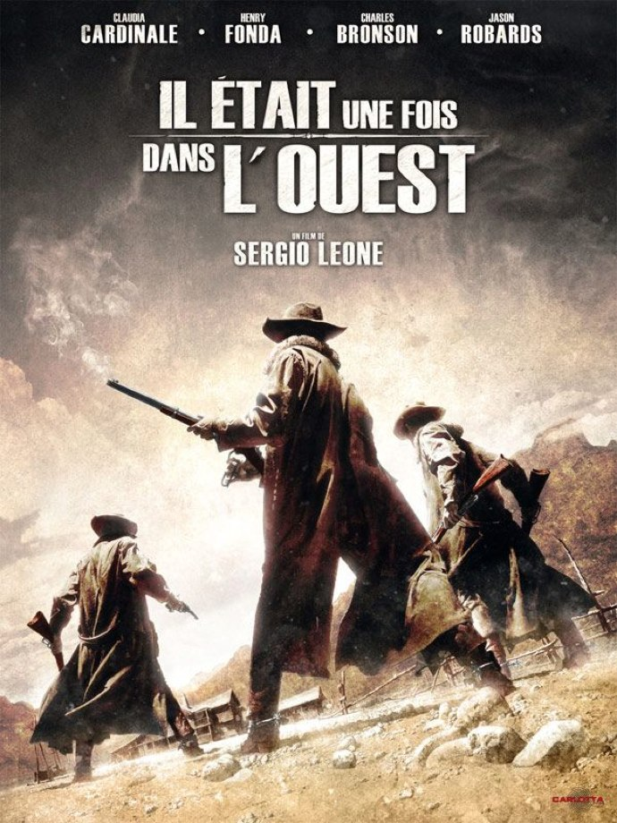
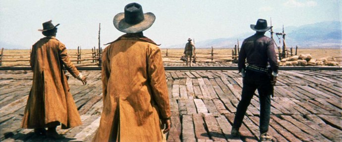
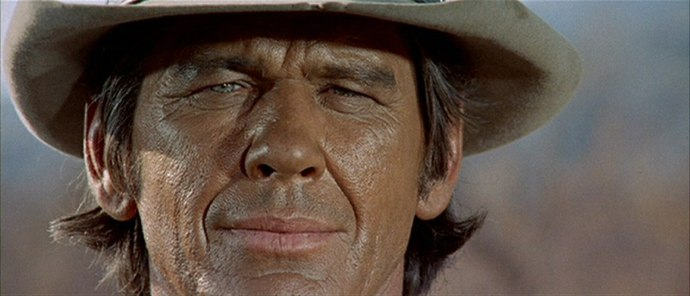

+++
titre = "Il était une fois dans l&rsquo;ouest, Sergio Leone"
title = "Il était une fois dans l'ouest, Sergio Leone"
url = "/il-etait-une-fois-dans-ouest-leone"
date = "2010-08-01T00:39:50"
Lastmod = "2013-04-01T13:53:59"
cover = "il-etait-une-fois-dans-l-ouest-serio-leone.jpg"
categorie = [ "À voir" ]
tag = [ "Chef-d'œuvre", "Cinéma classique", "Histoire", "Mort", "Société", "Western" ]
createur = [ "Sergio Leone" ]
acteur = [ "Charles Bronson", "Claudia Cardinale", "Henry Fonda" ]
annee = [ "1969" ]
weight = 1969
pays = [ "États-Unis" ]
original = "Once Upon a Time in the West"

+++

<em>Il était une fois dans l&rsquo;Ouest</em> fait partie des films entrés durablement dans la légende du cinéma tout court. Western dit &laquo;&nbsp;spaghetti&nbsp;&raquo; réalisé par Sergio Leone, c&rsquo;est un chef d&rsquo;œuvre contemplatif, lent et magnifique qui raconte, au-delà d&rsquo;une histoire personnelle de vengeance, un bout de l&rsquo;histoire des États-Unis. Mais par ce grand film, Sergio Leone donnait aussi le coup de grâce au genre du western qui était déjà mal au point. Le film est ressorti récemment dans une version restaurée : l&rsquo;occasion idéale pour (re)voir ce classique sur un grand écran<a href="#footnote_0_3744" id="identifier_0_3744" class="footnote-link footnote-identifier-link" title="&Agrave; Paris, le film ne passe qu&rsquo;au Grand Action dans le Quartier Latin. La qualit&eacute; n&rsquo;est pas mauvaise, m&ecirc;me si la bande est d&eacute;j&agrave; fatigu&eacute;e, donc n&rsquo;attendez pas trop pour le voir.">1</a>.

Comme tous les westerns, <em>Il était une fois dans l&rsquo;ouest</em> se déroule au XIXe siècle dans les plaines du Grand Ouest américain. Le film de Sergio Leone ne précise ni la date, ni le lieu, mais ce n&rsquo;est pas nécessaire : quand le film sort, en 1969, le western est un genre ancien entré dans les grands genres du cinéma et qui ne nécessite pas d&rsquo;explications. Les paysages filmés par le réalisateur suffisent, en particulier la Monument Valley identifiée au genre par <a href="http://voiretmanger.fr/createur/john-ford/">John Ford</a>, tandis que les chapeaux et les colts campent immédiatement des cow-boys archétypiques. L&rsquo;histoire du film est également très classique. Ses deux histoires plutôt puisque <em>Il était une fois dans l&rsquo;ouest</em> suit deux intrigues en parallèle, l&rsquo;une centrée sur la vengeance d&rsquo;un mystérieux cow-boy bon joueur d&rsquo;harmonica et tireur hors pair, l&rsquo;autre évoquant la construction du chemin de fer et donc la seconde conquête de l&rsquo;Ouest après celle des pionniers. Ces deux histoires sont liées par Franck, cow-boy sombre qui travaille dans l&rsquo;ombre d&rsquo;un riche entrepreneur qui fait construire le chemin de fer et a besoin d&rsquo;un assistant pour éliminer tous les problèmes qui pourraient se dresser devant les voies du chemin de fer. Les deux histoires s&rsquo;entrecroisent, mais le récit se fait avare en explications et ces dernières n&rsquo;arrivent de toute façon que tardivement.

Comme tout western qui se respecte, <em>Il était une fois dans l&rsquo;ouest</em> décrit une page de l&rsquo;histoire américaine et constitue la mythologie du Far West, la conquête des grands espaces et la constitution d&rsquo;un État continent. L&rsquo;histoire de la vengeance est centrale, mais en toile de fond c&rsquo;est bien de conquête qu&rsquo;il est question. Le territoire a été déjà balisé par une poignée de pionniers venus souvent d&rsquo;Europe et qui ont acheté des lopins de terre au milieu de nulle part, constituant souvent des petites villes entrées dans l&rsquo;image habituelle du Far West. Ces pionniers, ce sont aussi les cow-boys, les héros du film qui préfèrent la solitude des grandes plaines et leurs chevaux à la vie urbaine et qui mettent un point d&rsquo;honneur à défendre leur honneur, quitte à traquer sans relâche un ennemi durant des années. Suivant de quelques années ces premiers occupants, la conquête du territoire américain s&rsquo;est organisée depuis la côte est et prend une forme concrète : des voies de chemin de fer. Le train doit pouvoir relier les deux océans et permettre le contrôle de cet immense espace sauvage : les États-Unis n&rsquo;ont pas réinventé la roue dans le domaine, tout État contrôle son territoire notamment par des voies de communication efficaces. Les Américains l&rsquo;ont cependant fait à l&rsquo;américaine, en laissant faire les initiatives privées : c&rsquo;est donc un entrepreneur qui, dans <em>Il était une fois dans l&rsquo;ouest</em>, fait construire le train. C&rsquo;est lui aussi qui rachète les terrains voire, parfois, force la main des propriétaires. Le film se concentre autour du ranch d&rsquo;un pionnier irlandais, Sweetwater, lieu nommé ainsi en raison de la présence d&rsquo;une source d&rsquo;eau au milieu du désert. Cet espace n&rsquo;est pas encore atteint par le train, mais ce dernier arrive tout au long du film et c&rsquo;est tout une ville qui va se construire autour du ranch. Une conquête chasse l&rsquo;autre et Sergio Leone filme la fin d&rsquo;un monde, celui des pionniers et de la loi du plus fort. Le film met à mort tous ces pionniers inadaptés au nouveau monde, qu&rsquo;il s&rsquo;agisse d&rsquo;une mise à mort réelle ou d&rsquo;une exclusion. Le réalisateur ne s&rsquo;attarde pas vraiment sur la nouvelle conquête, qui ne l&rsquo;intéresse qu&rsquo;à la marge, hors champ : on voit bien la construction du chemin de fer et avec elle la naissance de nouvelles villes, mais la caméra ne s&rsquo;y attarde jamais vraiment.

En parallèle de la fin d&rsquo;un monde, <em>Il était une fois dans l&rsquo;ouest</em> signe l&rsquo;arrêt de mort du genre du western en le pervertissant totalement. Tous les codes et clichés du genre sont pourtant là : les grands espaces bien sûr, les cow-boys solitaires qui s&rsquo;affrontent dans les rues désertées des villes, les duels au colt, les ranchs ou encore la prostituée, seule femme de tout le film. Ils sont tous là, mais le film s&rsquo;amuse à déjouer nos attentes et à cet égard, la fameuse scène d&rsquo;ouverture est très révélatrice. Sur quasiment 15 minutes, Sergio Leone plante trois cow-boys typiques, qui pourraient être le trio de <em>Le Bon, la Brute et le Truand</em>, le précédent film du réalisateur. Quand la cible apparaît enfin, on entend d&rsquo;abord le son de l&rsquo;harmonica, avant de voir la silhouette et enfin le visage du quatrième cow-boy. Quelques paroles font encore monter le suspense, et puis les coups de feu claquent. En l&rsquo;espace d&rsquo;une seconde ou deux, Sergio Leone plie l&rsquo;affaire et passe à autre chose, comme si l&rsquo;issue même du combat n&rsquo;avait aucun intérêt, ou plutôt était attendu. Tout le film semble ainsi assez désinvolte sur les combats, n&rsquo;hésitant pas à étendre le temps à l&rsquo;infini avant et à expédier ensuite les combats comme s&rsquo;ils n&rsquo;avaient aucun intérêt. Les trois personnages principaux du film paraissent par ailleurs fatigués, lassés par la vie qu&rsquo;ils mènent et sont en tout cas très éloignés de l&rsquo;enthousiasme des westerns de la grande époque : le passage d&rsquo;une époque à une autre évoqué précédemment se lit jusque dans les traits tirés des personnages. On pourrait ainsi multiplier les exemples d&rsquo;archétypes détournés, comme la figure féminine qui est ici une femme libre, presque une féministe (tout reste relatif) qui n&rsquo;hésite pas à utiliser ses talents pour parvenir à ses fins. Le genre du western est non seulement mis à mort par Sergio Leone dans <em>Il était une fois dans l&rsquo;ouest</em>, mais il est aussi enterré, comme s&rsquo;il était déjà mort, finalement. L&rsquo;âge d&rsquo;or du western résiste mal à la Guerre Froide : les États-Unis sont désormais très bien constitués et le western, genre américano-américain, est passé de mode. En témoigne, d&rsquo;ailleurs, l&rsquo;échec commercial du film outre-Atlantique, alors qu&rsquo;il a plutôt bien fonctionné sur le Vieux Continent.

Il est vrai que Sergio Leone n&rsquo;aide pas vraiment ses spectateurs avec son film lent et contemplatif. La scène introductive fait figure de manifeste en concentrant tous les aspects remarquables du film. Les plans fixes se multiplient, tantôt des plans larges sur l&rsquo;immensité des paysages, tantôt des plans rapprochés sur un visage, une paire d&rsquo;yeux parfois seulement. Quand la caméra bouge, c&rsquo;est toujours en lents, mais très impressionnants techniquement travellings. Les personnages parlent peu et se contentent de regards lourds de sens, tandis que la caméra se concentre sur quelques éléments qui constituent le personnage, comme des articulations craquées ou un jeu avec une mouche emprisonnée dans le canon d&rsquo;un revolver. La bande-son est essentielle, les pales d&rsquo;une éolienne ponctuent la scène de ses couinements, la mouche virevolte autour d&rsquo;un visage et bien sûr, il y a la musique magique d&rsquo;Ennio Morricone. Compositeur associé pour toujours au genre du western, il propose ici une musique tellement connue et qui a inspiré tant d&rsquo;autres compositeurs de films qu&rsquo;elle semblerait presque constituer une caricature. La musique joue un rôle essentiel chez Sergio Leone : très présente, mais pas omniprésente comme elle l&rsquo;est aujourd&rsquo;hui dans tous les blockbusters, elle caractérise les personnages ou donne instantanément une coloration particulière à une scène. Reprenant le principe bien connu depuis les opéras de Wagner de la mélodie associée à un personnage (exemple bien connu ici de l&rsquo;harmonica du cow-boy vengeur qui suffit à signaler sa présence), la musique de Morricone est si centrale qu&rsquo;elle deviendrait presque un personnage à part entière. Quand elle est absente, la bande-son reste d&rsquo;une richesse extrême et joue un rôle jusque dans l&rsquo;action : les grillons s&rsquo;arrêtent de chanter pour annoncer la fin prochaine, par exemple. Quarante ans après, le film reste une magistrale leçon de cinéma, que ce soit dans la gestion élastique du temps qui introduit et maintient le suspens, ou dans ces plans magistraux, qui surprennent parfois (notamment certaines contre-plongées) et ne cessent de rappeler, si besoin était, l&rsquo;influence qu&rsquo;a eu Sergio Leone sur le cinéma. Du grand art, tout simplement.

<em>Il était une fois dans l&rsquo;ouest</em> est un film qui semble inépuisable. Que l&rsquo;on s&rsquo;intéresse à la mise à mort du western, à l&rsquo;histoire des États-Unis, aux techniques cinématographiques ou à tout ça à la fois, on pourrait trouver encore tant à dire sur le film de Sergio Leone. Force est de constater que ce film mérite son statut de film culte, un de ces films qui résisteront sans aucun doute à l&rsquo;épreuve du temps et qui resteront un classique pour tous ceux qui veulent faire du cinéma. Si vous ne l&rsquo;avez jamais vu, cette nouvelle version est l&rsquo;occasion rêvée et pour les autres, le voir sur un écran panoramique vaut indéniablement le déplacement.

Avis unanimes sur le film dans la blogosphère, que ce soit chez <a href="http://www.filmosphere.com/2010/06/critique-il-etait-une-fois-dans-l-ouest-c-era-una-volta-il-west-1968/">Nicolas</a> (qui révèle une information intéressante : les trois personnages du début auraient dû être joués par les trois acteurs de <em>Le Bon, la Brute et le Truand</em>…) ou chez <a href="http://www.plan-c.fr/article-grand-classique-il-etait-une-fois-dans-l-ouest-1969--42998054.html">Alexandre</a> qui conclut en faisant simplement du film &laquo;&nbsp;<em>l&rsquo;un des 5 plus grands films américains de l&rsquo;histoire</em>.&nbsp;&raquo; Que dire de plus ?

<h3>Vous voulez m&rsquo;aider ?<a href="#footnote_1_3744" id="identifier_1_3744" class="footnote-link footnote-identifier-link" title="&Agrave; propos de la publicit&eacute;&hellip;">2</a></h3>
<ul>
<li><a href="http://www.amazon.fr/gp/product/B004V4GY42/ref=as_li_ss_tl?ie=UTF8&#038;tag=leblogdenic07-21&#038;linkCode=as2&#038;camp=1642&#038;creative=19458&#038;creativeASIN=B004V4GY42">Acheter le film en Blu-Ray et DVD sur Amazon</a></li>
<li><a href="http://www.amazon.fr/gp/product/B0002LHXCK/ref=as_li_ss_tl?ie=UTF8&#038;tag=leblogdenic07-21&#038;linkCode=as2&#038;camp=1642&#038;creative=19458&#038;creativeASIN=B0002LHXCK">Acheter le film en DVD sur Amazon</a></li>
<li><a href="http://itunes.apple.com/fr/movie/il-etait-une-fois-dans-louest/id419725216">Acheter ou louer le film sur l&rsquo;iTunes Store</a></li>
</ul>

<ol class="footnotes"><li id="footnote_0_3744" class="footnote">À Paris, le film ne passe qu&rsquo;au Grand Action dans le Quartier Latin. La qualité n&rsquo;est pas mauvaise, même si la bande est déjà fatiguée, donc n&rsquo;attendez pas trop pour le voir. [<a href="#identifier_0_3744" class="footnote-link footnote-back-link">&#8617;</a>]</li><li id="footnote_1_3744" class="footnote"><a href="http://voiretmanger.fr/soutien/">À propos de la publicité…</a> [<a href="#identifier_1_3744" class="footnote-link footnote-back-link">&#8617;</a>]</li></ol>
