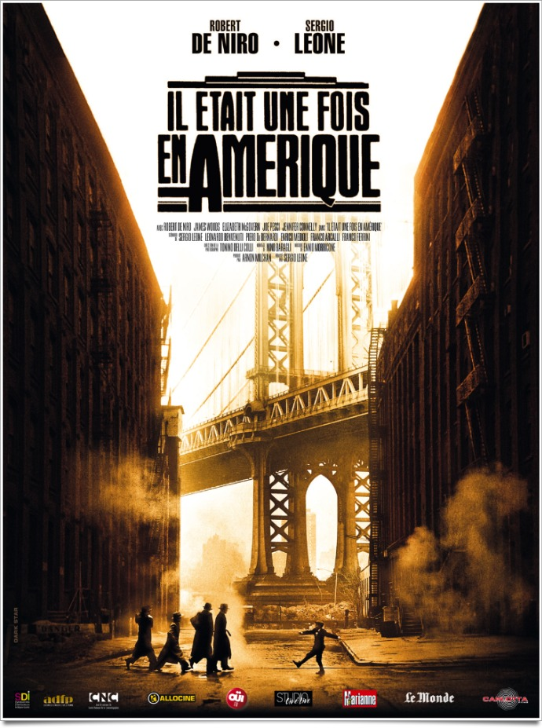
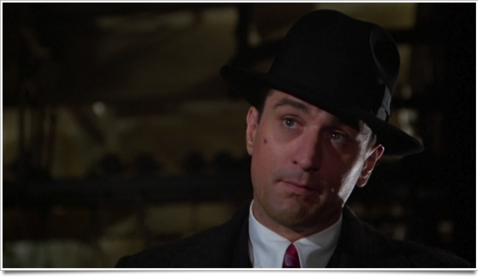

+++
titre = "Il était une fois en Amérique, Sergio Leone"
title = "Il était une fois en Amérique, Sergio Leone"
url = "/il-etait-une-fois-en-amerique-leone"
date = "2012-01-08T18:26:12"
Lastmod = "2013-04-01T13:59:42"
cover = "once-upon-a-time-in-america-sergio-leone.jpg"
categorie = [ "À voir" ]
tag = [ "Chef-d'œuvre", "Drame", "Histoire", "Mafia", "Société", "Violence" ]
createur = [ "Sergio Leone" ]
acteur = [ "Elizabeth McGovern", "James Woods", "Robert De Niro", "Treat Williams" ]
annee = [ "1984" ]
weight = 1984
pays = [ "États-Unis" ]
original = "Once Upon a Time in America"

+++

<em>Il était une fois en Amérique</em> clôt la trilogie commencée seize ans plus tôt avec <em><a href="http://voiretmanger.fr/2010/08/01/il-etait-une-fois-dans-ouest-leone/">Il était une fois dans l&rsquo;Ouest</a></em>, mais aussi la carrière de Sergio Leone. Pour son dernier film, le cinéaste italien se penche sur une période mythique de l&rsquo;histoire américaine : les années de la prohibition et l&rsquo;âge d&rsquo;or des gangsters. Cette longue fresque de près de quatre heures est un chef-d&rsquo;œuvre qui n&rsquo;a pas pris une ride.

New York, années 1960. David Aaronson, plus connu sous le surnom de &laquo;&nbsp;Noodles&nbsp;&raquo;, est de retour dans une ville qu&rsquo;il a quittée une trentaine d&rsquo;années auparavant. Son passé a fait un retour fracassant avec le déménagement d&rsquo;un cimetière qui contenait les tombes de trois de ses amis. Il ne lui en faut pas plus pour chercher à revenir en arrière, d&rsquo;autant que son départ précipité a laissé des zones floues. Dans les années 1920, Noodles est à la tête d&rsquo;une bande de quatre garnements qui commettent quelques forfaits et volent des passants souls. C&rsquo;est à cette époque que Noodles rencontre Max, un garçon qui arrive dans le quartier. Une amitié durable naît vite entre les deux et ils décident ensemble d&rsquo;en faire plus et s&rsquo;en prennent au gangster local. Dix ans après, Noodles sort de prison après avoir tué un policier ; on est en pleine période de la prohibition et avec Max et le reste de la bande, ils pratiquent le commerce au noir d&rsquo;alcool. Un business rentable, mais qui s&rsquo;interrompt avec la fin de l&rsquo;interdiction. La légalisation de l&rsquo;alcool interrompt les agissements de la bande et provoque la fuite de Noodles loin de la ville de son enfance…

Les trois films composant la trilogie <em>Il était une fois</em> évoquent des moments de transition, la fin d&rsquo;une époque et le début d&rsquo;une nouvelle : l&rsquo;arrivée du train et la fin du western dans <em>Il était une fois dans l&rsquo;ouest</em>, la révolution mexicaine dans <em>Il était une fois la révolution</em>. <em>Il était une fois en Amérique</em> ne fait pas exception avec la fin du crime organisé qui avait émergé en même temps que l&rsquo;interdiction de l&rsquo;alcool. Tout le film est vu par le Noodles des années 1960 et il se présente sous la forme de flashbacks nostalgiques. Noodles regrette l&rsquo;époque où il commettait de petits larcins avec ses compagnons ou celle, plus tard, qui lui permettait de vivre du commerce de l&rsquo;alcool. La séquence où la bande propose une idée pour retrouver l&rsquo;alcool qui a été jeté à la mer pour ne pas se faire prendre est une séquence joyeuse, représentative de la vision des années 1920. Les années 1930 restent plutôt positives, mais déjà une ombre est portée sur l&rsquo;histoire au fur et à mesure que l&rsquo;arrêt de la prohibition s&rsquo;approche. Le présent de l&rsquo;histoire, les années 1960, est quant à lui très sombre et Noodles apparaît comme un personnage vieilli et désabusé, bien loin de ce qu&rsquo;il était plus jeune.

Le dernier film de Sergio Leone se déroule à trois époques, mais sa grande force est d&rsquo;entremêler constamment ces époques. <em>Il était une fois en Amérique</em> n&rsquo;est pas un film chronologique : il commence en 1933 par la mise à mort de la bande de gangsters autour de Noodles, il se poursuit par le retour de ce dernier à New York en 1968, avant de revenir en arrière par des flashbacks, en 1922 d&rsquo;abord, puis à nouveau en 1933. Cet assemblage des époques aurait pu être explicité par des cartons, mais il apparaît ici comme une sorte de puzzle temporel. Sergio Leone multiplie les ellipses et ne précise jamais les dates de son récit. Seule la force du montage, mais aussi du maquillage, permet de comprendre que l&rsquo;on change d&rsquo;époques, avec plusieurs coups de force. Quand Noodles quitte New York dans les années 1930, c&rsquo;est devant une publicité pour Coney Island. La caméra ne bouge pas, mais on voit le personnage vieillir brusquement dans le miroir et quand il se déplace, la publicité a changé : on est 30 ans plus tard. Plus tard, <em>Il était une fois en Amérique</em> renouvelle l&rsquo;exploit avec des phares : ceux d&rsquo;un camion poubelle en 1968 se transforment en phares de voiture de 1933. La maîtrise formelle de Sergio Leone sur ce dernier film est vraiment fascinante et elle sert parfaitement son propos.

À bien des égards, <em>Il était une fois en Amérique</em> est un film proustien. Comme pour <em>À la recherche du temps perdu</em>, le personnage se souvient de bribes de son passé, mais il ne s&rsquo;agit pas d&rsquo;un récit parfaitement net et linéaire. Il s&rsquo;agit bien plus de sensations, comme chez Marcel Proust : quand Noodles revient dans les années 1960 dans le bar qui a servi de QG à sa bande de gangsters, il retourne dans les toilettes pour regarder à travers le trou qu&rsquo;il avait aménagé dans la cloison. Ce trou lui permettait d&rsquo;espionner la sœur de son ami Moe pendant qu&rsquo;elle dansait et de refaire le geste vieux lui rappelle ses premiers émois, dans les années 1920. Ce geste correspond à la madeleine du narrateur de Proust et c&rsquo;est alors tout le reste qui remonte à la surface. <em>Il était une fois en Amérique</em> conserve toutefois une large part de mystères. Sergio Leone mélange les époques sans prévenir son spectateur qui doit ainsi constamment rester sur ses gardes et suivre vraiment l&rsquo;histoire. Loin des productions actuelles qui ont plutôt tendance à tout expliquer et même trop expliquer, le spectateur est ici appelé à réfléchir et il n&rsquo;aura pas toutes les clés. On ne voit jamais la mise à mort des gangsters alors qu&rsquo;elle est essentielle, par exemple. Le scénario d&rsquo;<em>Il était une fois en Amérique</em> brille aussi par sa capacité à ne donner les informations qu&rsquo;en temps voulu, ce qui renforce le sentiment d&rsquo;un vaste puzzle à compléter.

<em>Il était une fois en Amérique</em> est un film à la fois long et complexe avec sa structure narrative qui exclut toute linéarité chronologique et qui privilégie au contraire l&rsquo;ellipse. Voilà qui aurait de quoi effrayer, mais l&rsquo;extraordinaire maîtrise technique du cinéaste rend le film parfaitement fluide et totalement compréhensible. À condition de suivre quand même, le spectateur n&rsquo;est jamais perdu et suit la reconstitution du passé de Noodles avec intérêt et même fascination. Il fallait aussi pour cela un acteur d&rsquo;envergure et Robert de Niro fournit une prestation à la hauteur. Tout en sobriété, il rend à merveille la complexité de son personnage qui est dans l&rsquo;ensemble plutôt positif, mais commet tout de même deux viols à l&rsquo;écran. La musique d&rsquo;Ennio Morricone complète le tableau avec une composition extrêmement réussie. Mention spéciale aux deux thèmes du film qui reviennent à plusieurs reprises par touches discrètes et plus particulièrement à la relecture du &laquo;&nbsp;Yesterday&nbsp;&raquo; des Beatles.

Exigeant au regard des productions actuelles, certes, l&rsquo;effort requis pour regarder <em>Il était une fois en Amérique</em> en vaut la chandelle. Sergio Leone signe là un très grand film que tout amateur de cinéma se doit d&rsquo;avoir vu… Un chef d&rsquo;œuvre, tout simplement.

<h3>Vous voulez m&rsquo;aider ?<a href="#footnote_0_5477" id="identifier_0_5477" class="footnote-link footnote-identifier-link" title="&Agrave; propos de la publicit&eacute;&hellip;">1</a></h3>
<ul>
<li><a href="http://www.amazon.fr/gp/product/B0069RWKCY/ref=as_li_ss_tl?ie=UTF8&#038;tag=leblogdenic07-21&#038;linkCode=as2&#038;camp=1642&#038;creative=19458&#038;creativeASIN=B0069RWKCY">Acheter le film en Blu-Ray sur Amazon</a></li>
<li><a href="http://www.amazon.fr/gp/product/B000FORALS/ref=as_li_ss_tl?ie=UTF8&#038;tag=leblogdenic07-21&#038;linkCode=as2&#038;camp=1642&#038;creative=19458&#038;creativeASIN=B000FORALS">Acheter le film en DVD sur Amazon</a></li>
<li><a href="https://itunes.apple.com/fr/movie/il-etait-une-fois-en-amerique/id389360541">Acheter ou louer le film sur l&rsquo;iTunes Store</a></li>
</ul>

<ol class="footnotes"><li id="footnote_0_5477" class="footnote"><a href="http://voiretmanger.fr/a-propos/publicite/">À propos de la publicité…</a> [<a href="#identifier_0_5477" class="footnote-link footnote-back-link">&#8617;</a>]</li></ol>
