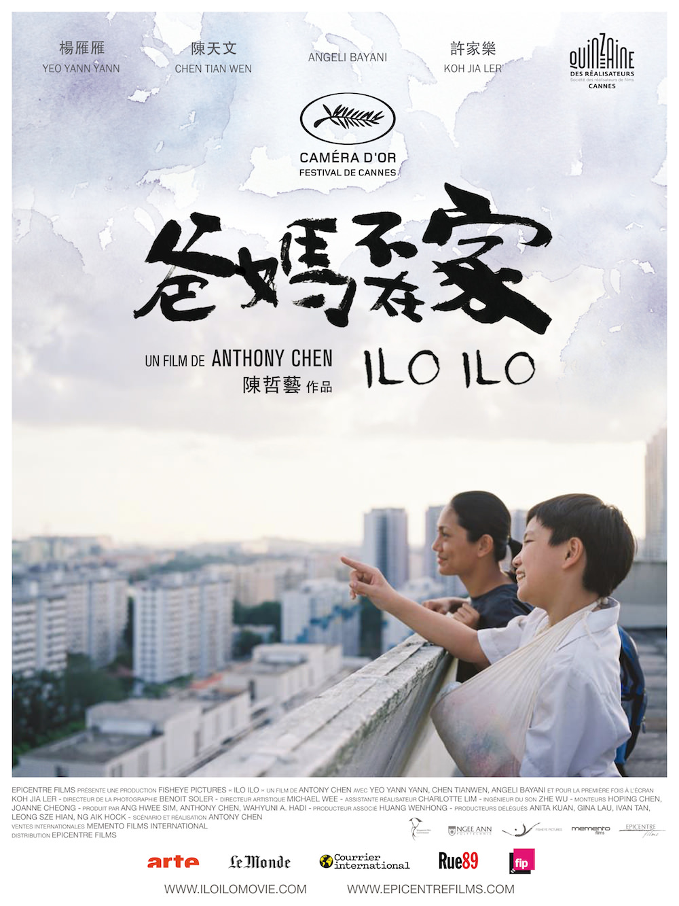
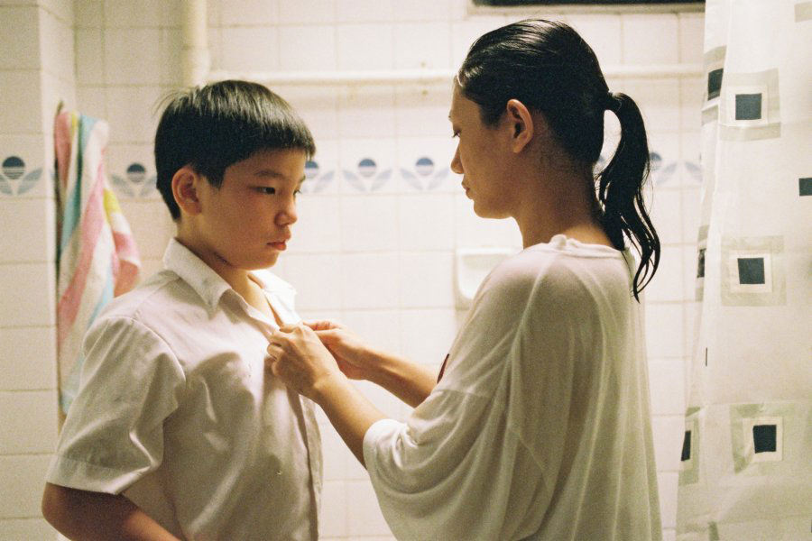

+++
titre = "<em>Ilo Ilo</em>, Anthony Chen"
title = "Ilo Ilo, Anthony Chen"
url = "/ilo-ilo-chen"
date = "2013-08-04T10:22:50"
Lastmod = "2013-08-03T10:46:47"
cover = "ilo-ilo-chen.jpg"
categorie = [ "À voir" ]
tag = [ "Crise", "Drame", "Enfance", "Famille", "Société", "Sorties du mois" ]
createur = [ "Anthony Chen" ]
acteur = [ "Angeli Bayani", "Chen Tianwen", "Koh Jia Ler", "Yeo Yann Yann" ]
annee = [ "2013" ]
weight = 2013
pays = [ "Singapour" ]
festival = [ "Lama 2013" ]

+++

Récompensé par la Caméra d’or cannoise, <em>Ilo Ilo</em> est un premier long-métrage singapourien, un pays encore méconnu pour son cinéma, peut-être parce qu’il est écrasé par tous les pays asiatiques très cinéphiles dans les alentours. Anthony Chen passe en tout cas au format du long-métrage avec ce drame tout en douceur sur une bonne qui vient des Philippines à la fin des années 1990. Même si le cinéaste se défend d’avoir réalisé une autobiographie, il a puisé dans son enfance pour construire ce récit sans surprise, certes, mais extrêmement bien mené. Une réussite.

Singapour, pendant la crise financière qui a touché toute l’Asie à partir de 1997. On découvre Jiale, un garçon turbulent d’une dizaine d’années, et ses deux parents. Sa mère est à nouveau enceinte et son travail exténuant ne lui laisse pas beaucoup de temps pour s’occuper de lui. Son père, touché de plein fouet par la crise, essaie de s’occuper et passe des journées à ne rien faire, si ce n’est fumer. <em>Ilo Ilo</em> commence quand la mère décide d’employer une nounou pour s’occuper de Jiale et la soulager en attendant son accouchement. À l’époque, toutes les familles aisées de Singapour embauchaient une femme à plein temps, le plus souvent en allant chercher au plus près, dans les Philippines. Anthony Chen décrit bien la situation proche de l’esclavagisme de ces femmes qui vivent dans les familles qui les emploient, parfois dans des conditions précaires et qui n’ont aucun droit et des congés seulement un jour par moi. Teresa est obligée de venir à Singapour s’occuper d’un garçon qui n’est pas le sien alors que son propre fils n’a qu’un an et même si le film ne quitte jamais la ville État et ne s’intéresse ainsi pas vraiment à la situation dans son pays d’origine, on en a un bon aperçu. <em>Ilo Ilo</em> dresse le portrait d’une société impitoyable où tout le monde a « sa nounou » et l’exhibe comme un signe de réussite, mais où dans le même temps on la traite moins que rien. On imagine la paie dérisoire, mais dans le même temps, Teresa doit faire tout ce que sa patronne demande, y compris repasser une énorme pile de linge au milieu de la nuit. On la fait manger à part lors des fêtes de famille et elle doit partager sa chambre avec Jiale, sur un vague matelas en guise de lit. Quand on sait qu’en plus, son passeport est gardé par ses patrons de peur qu’elle s’enfuie, on comprend bien que la situation de Teresa est loin d’être idéale et Anthony Chen le montre bien, sans en faire un film à argument pour autant.

<em>Ilo Ilo</em> est avant tout une histoire familiale et même le récit d’une amitié entre deux êtres. Quand Teresa arrive pour la première fois dans la famille, Jiale est hostile à son encontre et le gamin fait tout pour lui casser les pieds, voire pour la faire renvoyer. Un peu désespérée, la jeune femme s’accroche malgré tout et parvient à se faire une place auprès du jeune garçon qui, peu à peu, se laisse amadouer. Bientôt, les deux ne se quitteront plus, si bien que la mère du garçon commence à ne plus supporter cette proximité et ne manque pas de rappeler sa bonne à l’ordre quand elle juge qu’elle la remplace un petit peu trop. Anthony Chen s’est inspiré de sa propre histoire pour imaginer celle de son premier film qui ne fait pas preuve d’une originalité folle. La bande-annonce résume assez largement le scénario et on ne regardera pas <em>Ilo Ilo</em> pour cette raison. Le long-métrage se rattrape en revanche sur la finesse d’écriture de ses personnages : que ce soit la mère (Yeo Yann Yann), Teresa (Angeli Bayani) ou Jiale (Koh Jia Ler, parfait dans ce premier rôle), ils sont tous très bien écrits et parviennent tous à être parfaitement crédibles et réalistes. Le cinéaste ne juge pas ses personnages, il les présente simplement avec leurs qualités et leurs défauts. La mère paraît terrible à certains moments, mais elle finit par se rattraper avec une petite touche d’attention qui montre qu’elle n’est pas insensible. Ce sont ces personnages — et les acteurs qui les interprètent — qui sauvent <em>Ilo Ilo</em> de la banalité et qui le rendent passionnant malgré son récit sans grande originalité. Anthony Chen prouve en tout cas avec ce premier film en long format qu’il est un cinéaste à suivre : âgé d’à peine 30 ans, il fait preuve d’une maîtrise formelle déjà assez étonnante.

La justesse des sentiments et des émotions provoquées : voilà bien le succès d’<em>Ilo Ilo</em>, à défaut d’un récit radicalement original. De fait, qu’importe le récit, Anthony Chen nous plonge au cœur d’une famille parfaitement crédible, le temps d’une histoire touchante maîtrisée et réussie. Il n’a pas l’ambition d’être un grand film radical, mais <em>Ilo Ilo</em> touche exactement là où il faut et mérite pour cette raison d’être vu. 

<em>Sortie le 4 septembre</em>

