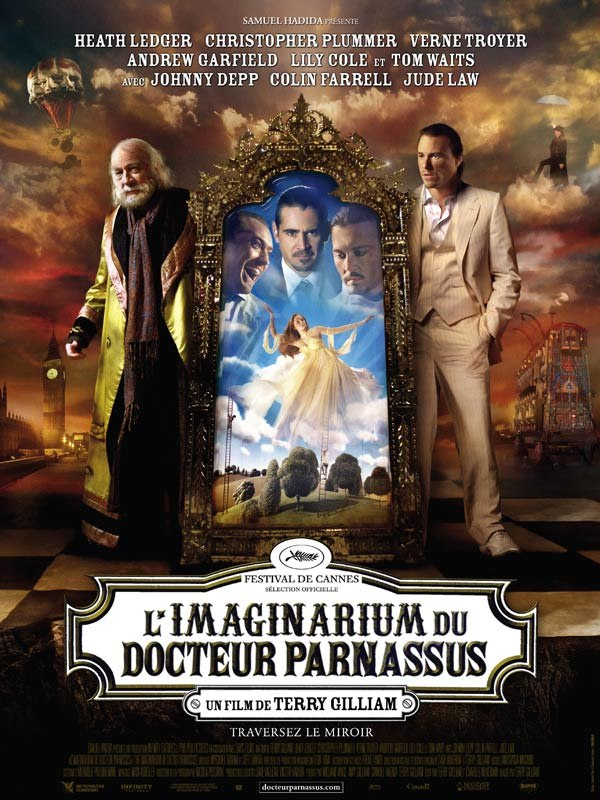
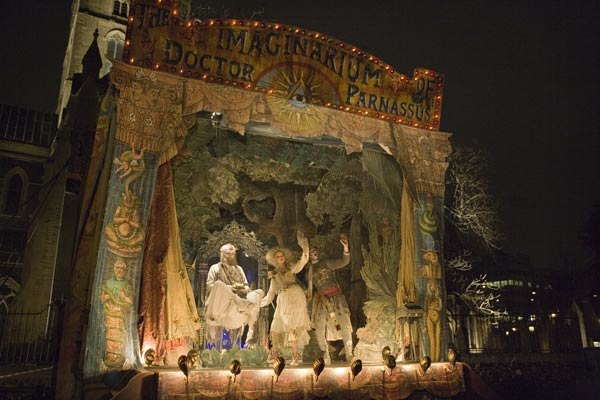
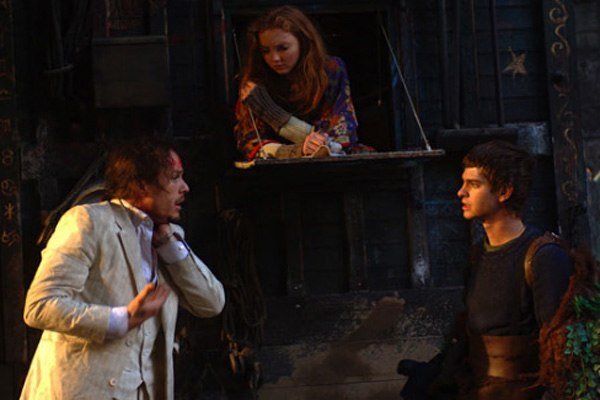
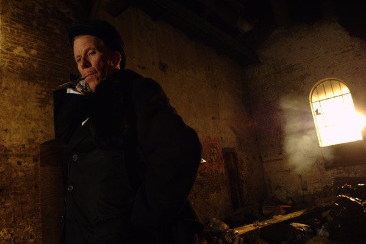

+++
titre = "L&rsquo;Imaginarium du Docteur Parnassus, Terry Gilliam"
title = "L'Imaginarium du Docteur Parnassus, Terry Gilliam"
url = "/imaginarium-docteur-parnassus-gilliam"
date = "2009-11-18T23:16:27"
Lastmod = "2012-12-30T23:10:38"
cover = "imaginarium-parnassus-heath-ledger.jpg"
categorie = [ "À voir" ]
tag = [ "Fantastique", "Vite oublié" ]
acteur = [ "Andrew Garfield", "Christopher Plummer", "Colin Farrell", "Heath Ledger", "Johnny Depp", "Jude Law", "Lily Cole", "Tom Waits" ]
annee = [ "2009" ]
weight = 2009
pays = [ "France" ]

+++

Je ne devais pas aller le voir ce soir, mais les très fortes fréquentations des blockbusters un mercredi soir de sortie<a href="#footnote_0_2088" id="identifier_0_2088" class="footnote-link footnote-identifier-link" title="Quelle id&eacute;e aussi de vouloir regarder Twilight &agrave; Ch&acirc;telet un mercredi &agrave; 17 heures, sans avoir r&eacute;serv&eacute; ?">1</a> m&rsquo;ont (heureusement ?) contraint à changer mon fusil d&rsquo;épaule. Ne reculant pas devant l&rsquo;adversité, je suis donc allé voir <em>L&rsquo;imaginarium du Docteur Parnassus</em>, le dernier film de Terry Gilliam qui m&rsquo;avait intrigué à l&rsquo;époque par sa bande-annonce incompréhensible. <em>In fine</em>, un délire visuel complet, qui n&rsquo;est finalement pas si déplaisant que prévu, à condition de se laisser porter&#8230;

L&rsquo;histoire est finalement assez simple, c&rsquo;est du Faust revisité par tous les délires de l&rsquo;ancien Monthy Python. En gros, en échange de l&rsquo;immortalité, le docteur Parnassus du titre fait un pacte avec le Diable : tous ses enfants reviendront à ce dernier à l&rsquo;âge de 16 ans. Or il se trouve que ce docteur a une fille qui aura bientôt 16 ans&#8230; Le Diable propose un pari au pauvre docteur désespéré de voir partir sa fille : le premier qui gagne cinq âmes dans l&rsquo;Imaginarium conserve la fille. L&rsquo;Imaginarium étant un monde parallèle directement issu des pensées du Docteur Parnassus et auquel on accède par un miroir installé sur la fragile scène d&rsquo;une roulotte aussi improbable que l&rsquo;est le film dans son ensemble.

Vous avez perdu le fil de l&rsquo;histoire dès la deuxième phrase du paragraphe précédent ? C&rsquo;est à la fois normal, et finalement pas si grave. Pour le dire franchement, l&rsquo;histoire de <em>L&rsquo;Imaginarium du Docteur Parnassus</em>, on s&rsquo;en fout, et pas qu&rsquo;un peu. Le tout est de comprendre que deux êtres, dont rien de moins que le Diable, s&rsquo;affrontent autour d&rsquo;une jeune fille, avec également deux amants potentiels qui gravitent au tour. Les premiers s&rsquo;occupent de l&rsquo;âme, les seconds du cœur, mais même l&rsquo;issue de ce double combat importe peu. À dire vrai, il n&rsquo;y a pas grand-chose qui importe vraiment chez Terry Gilliam&#8230;

Le tableau semble un peu désastreux, mais il ne faut pas s&rsquo;y fier. <em>L&rsquo;Imaginarium du Docteur Parnassus</em> est d&rsquo;abord et avant tout un gros délire visuel où l&rsquo;on retrouve tout Terry Gilliam, depuis le <em>Flying Circus</em> des Monthy Python. On retrouve d&rsquo;ailleurs jusqu&rsquo;à l&rsquo;esthétique de cette série des années 1970 (par exemple les bouches grossièrement animées sur des images fixes au départ), et autant dire que l&rsquo;image n&rsquo;est pas toujours du meilleur goût, surtout dans l&rsquo;Imaginarium. Disons à tout le moins que le film a une esthétique propre très marquée&#8230; Certains plans sont magnifiques, d&rsquo;autres oscillent entre mauvais goût et ridicule prononcé.

On ne pourra par contre pas critiquer l&rsquo;inventivité visuelle du film, même si de nombreuses scènes seront familières aux amateurs de Terry Gilliam. Son univers loufoque plait ou déplait totalement, mais il faut être prévenu avant d&rsquo;aller voir le film, cet univers est là et bien là et mieux vaut s&rsquo;habituer sous peine de trouver le temps vraiment long. Chercher à comprendre quelque chose serait une grave erreur, il faut au contraire se laisser porter, regarder avec admiration (ou pas) ce qui passe à l&rsquo;écran. Et le résultat est parfois assez poétique&#8230; quand il n&rsquo;est pas juste très laid.

<em>L&rsquo;Imaginarium du Docteur Parnassus</em> est aussi un film atypique par ses acteurs. Comme apparemment pour tous ses films, le pauvre Terry Gilliam a eu la malchance de voir la disparition d&rsquo;un acteur principal de son film en la personne du regretté Heath Ledger, admiré à juste titre dans le dernier <em><a href="http://nicolasfurno.com/wordpress/2008/08/04/the-dark-night/">Batman</a></em>. Il campe ici aussi un personnage complexe des plus passionnants qui ne peut que faire regretter l&rsquo;acteur qu&rsquo;il aurait pu être. La disparition du &laquo;&nbsp;héros&nbsp;&raquo; d&rsquo;un film aurait fait vaciller la plupart des réalisateurs, mais pas Terry Gilliam qui a tout simplement demandé à trois autres acteurs de remplacer Heath Ledger dans les parties Imaginarium. Cela fait sens dans l&rsquo;univers du film (de toute manière, on voit mal ce qui ne ferait pas sens) et le résultat n’est pas mauvais, d&rsquo;autant que ces acteurs ne sont pas n&rsquo;importe qui (rien de moins que Johnny Depp, Colin Farrell et Jude Law&#8230;).

Les autres acteurs sont bons, notamment Andrew Garfield, déjà repéré dans <em><a href="http://nicolasfurno.com/wordpress/?p=1372">Boy A</a></em>, confirme qu&rsquo;il est un acteur à suivre de près. Le choix de Tom Waits pour incarner le Diable est pour le moins étonnant, mais finalement, il n&rsquo;est pas si mauvais dans ce rôle de dandy diabolique.

Devant un tel film, les avis sont au moins mitigés. Certains <a href="http://cinema-ici-ailleurs.over-blog.com/article-imaginarium-docteur-parnassus-39415187.html">adorent le film</a> (<a href="http://www.surlarouteducinema.com/archive/2009/11/12/l-imaginarium-du-docteur-parnassus-de-terry-gilliam.html">ou ici, dans une moindre mesure</a>), <a href="http://www.toujoursraison.com/2009/10/limaginarium-du-docteur-parnassus.html">d&rsquo;autres sont plus sceptiques</a>&#8230; À l&rsquo;heure des bilans, je dirais que j&rsquo;ai passé un moment agréable en compagnie d&rsquo;une bande de dingues dans un univers incompréhensible, mais je ne suis pas sûr qu&rsquo;il en restera grand-chose demain.

<h3>Vous voulez m&rsquo;aider ?<a href="#footnote_1_2088" id="identifier_1_2088" class="footnote-link footnote-identifier-link" title="&Agrave; propos de la publicit&eacute;&hellip;">2</a></h3>
<ul>
<li><a href="http://www.amazon.fr/gp/product/B003BGAT10/ref=as_li_ss_tl?ie=UTF8&#038;tag=leblogdenic07-21&#038;linkCode=as2&#038;camp=1642&#038;creative=19458&#038;creativeASIN=B003BGAT10">Acheter le film en Blu-Ray sur Amazon</a></li>
<li><a href="http://www.amazon.fr/gp/product/B003BGAT0Q/ref=as_li_ss_tl?ie=UTF8&#038;tag=leblogdenic07-21&#038;linkCode=as2&#038;camp=1642&#038;creative=19458&#038;creativeASIN=B003BGAT0Q">Acheter le film en DVD sur Amazon</a></li>
<li><a href="https://itunes.apple.com/fr/movie/limaginarium-du-docteur-parnassus/id485563344">Acheter ou louer le film sur l&rsquo;iTunes Store</a></li>
</ul>

<ol class="footnotes"><li id="footnote_0_2088" class="footnote">Quelle idée aussi de vouloir regarder <em>Twilight</em> à Châtelet un mercredi à 17 heures, sans avoir réservé ? [<a href="#identifier_0_2088" class="footnote-link footnote-back-link">&#8617;</a>]</li><li id="footnote_1_2088" class="footnote"><a href="http://voiretmanger.fr/soutien/">À propos de la publicité…</a> [<a href="#identifier_1_2088" class="footnote-link footnote-back-link">&#8617;</a>]</li></ol>
