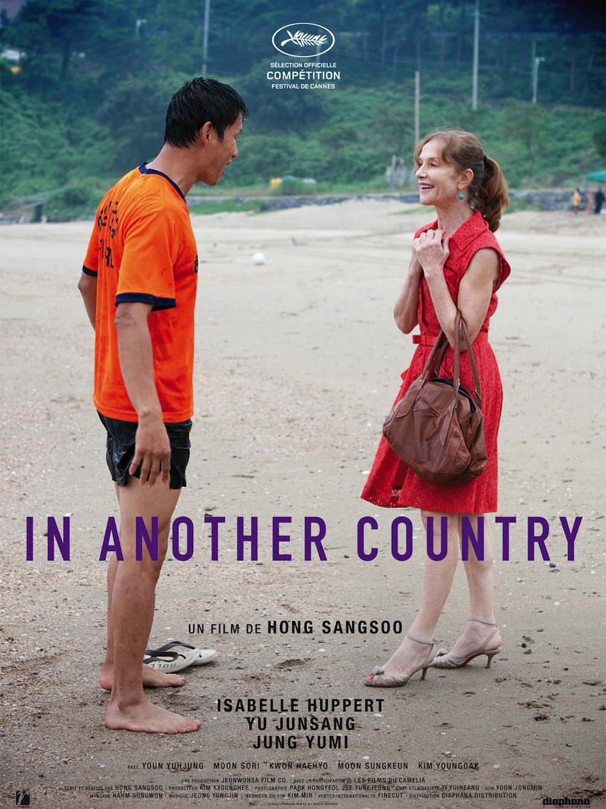

+++
type = "post"
titre = "In Another Country, Hong Sang-soo"
title = "In Another Country, Hong Sang-soo"
url = "/in-another-country-sang-soo"
date = "2013-04-01T09:50:40"
Lastmod = "2013-03-31T17:58:26"
cover = "in-another-country-hong-sang-soo.jpg"
categorie = [ "À voir" ]
tag = [ "Amour", "Drame", "Metafilm", "Société" ]
createur = [ "Hong Sang-soo" ]
acteur = [ "Isabelle Huppert", "Youn Yuh-jung", "Yu Junsang", "Yumi Jung" ]
annee = [ "2012" ]
weight = 2012
pays = [ "Corée du Sud" ]
original = "Da-Reun Na-Ra-e-Suh"

+++

Trois histoires légèrement différentes, un même lieu, les mêmes acteurs… le dispositif mis en place dans <em>In Another Country</em> n’est pas sans rappeler un <a href="http://voiretmanger.fr/2013/03/12/cloud-atlas-wachowski-tykwer/" title="Cloud Atlas, Lana et Andy Wachowski et Tom Tykwer - À voir et à manger">blockbuster récent</a>, mais aussi, et surtout <em>Oki&rsquo;s Movie</em> sorti en 2010. Dans les deux cas, Hong Sang-soo raconte histoires d’amours déçues pour des films fragiles qui ne tiennent que par une mise en scène et une écriture très fine. <em>In Another Country</em> ajoute une touche supplémentaire avec la présence d’une étrangère et la dernière réalisation de Hong Sang-soo parvient à convaincre, à condition de se laisser porter…

Anne est une réalisatrice française en visite en Corée du Sud chez son ami, également réalisateur ; avec la femme enceinte de ce dernier, ils vont passer quelques jours à Mohang-ni, une station balnéaire à trois heures de Séoul. Anne est aussi l’épouse française d’un riche industriel qui vient à Mohang-ni pour le tromper avec un réalisateur coréen. Anne est enfin la Française trompée par son mari qui vient de la quitter pour une Coréenne et qui décide d’oublier en allant en vacances en Corée, voir une vieille amie dans la station de Mohang-ni. Trois Anne, trois histoires aussi qui se suivent et se ressemblent, sans toutefois s’aligner. Le dispositif scénaristique d’<em>In Another Country</em> est ambitieux et il joue sur la redite et la variation. Dans chaque partie, on retrouve en effet de nombreux points communs, mais aussi des différences plus ou moins subtiles. Les acteurs déjà tissent des relations entre les trois parties : la Française est toujours jouée par Isabelle Huppert, tandis que l’on retrouve à ses côtés deux hommes qui ont toujours le même rôle, un maître-nageur d’une part, un réalisateur d’autre part. Si le premier est toujours joué par Yu Junsang, jeune acteur fétiche de Hang Sang-soo, le réalisateur est joué en alternance par Hyehyo Kwon et Sungkeun Moon, deux acteurs, mais un seul rôle. Ce jeu permanent sur les points communs et les différences fait le cœur d’<em>In Another Country</em>, le film allant jusqu’à reproduire, quasiment à l’identique, certaines scènes. Dans chaque segment, on a ainsi un dialogue entre Anne et Wonju, la responsable des appartements où se déroule à chaque fois l’action. On retrouve aussi les mêmes dialogues entre Anne et le maître-nageur, ou encore un repas arrosé au <a href="http://fr.wikipedia.org/wiki/Soju">soju</a>, un alcool fort coréen. 

Avec autant de points communs entre chacune des trois parties, <em>In Another Country</em> pourrait donner le sentiment de tourner en rond pendant 1h30. Il n’en est rien : Hong Sang-soo a réussi à proposer une œuvre unie et malgré sa répétition sur trois parties, ce n’est absolument pas un film qui bégaie. Les différences subtiles sont suffisantes pour faire comme un jeu de piste et le spectateur lui-même finit par attendre telle ou telle scène, en se demandant ce qui va se passer par la suite. Exemple autour d’une impasse qui mène à deux chemins : à trois reprises, Anne arrive à cet endroit et se demande quelle direction prendre, et nous avec. <em>In Another Country</em> est à cet égard remarquablement écrit, même s’il convient de signaler qu’il est aussi très vide, du moins au regard du cinéma populaire. Il ne se passe pas grand-chose ici, et Hong Sang-soo privilégie les plans fixes simplement rompus par l’utilisation constante du zoom, une originalité formelle de son cinéma. Du vide, certes, mais <em>In Another Country</em> n’est pas une œuvre vaine pour autant et elle dit au contraire beaucoup sur le fait de découvrir un territoire étranger. Le titre dit beaucoup sur le contenu du long-métrage : Anne est une Française qui ne parle pas un mot de coréen et qui se retrouve perdue dans cet univers. Les dialogues, majoritairement en anglais, sont les plus intéressants quand le coréen revient et quand le personnage principal ne les comprend pas. Le spectateur, qui a toujours des sous-titres, prend alors l’avantage sur le personnage qu’interprète Isabelle Huppert qui ne peut dès lors que reposer sur la traduction. La sensation de se trouver dans un pays et au sein d’une culture qui lui résiste totalement est alors forte et c’est l’une des réussites de ce film intrigant et passionnant à la fois. 

Hang Sang-soo a choisi une française pour interpréter le personnage principal de son dernier film et la présence d’Isabelle Huppert fait beaucoup dans la réussite d’<em>In Another Country</em>. L’actrice excelle dans ce triple rôle et elle parvient, avec une moue légèrement différente, quelques accessoires ou encore des postures légèrement modifiées, à interpréter trois Anne différentes, sans pour autant suivre les méthodes à l’américaine. Une belle leçon de cinéma, tout comme l’écriture très fine de Hang Sang-soo qui sait, à partir d’une histoire variée à trois reprises, composer un film juste et touchant. 

<h3>Vous voulez m&rsquo;aider ?<a href="#footnote_0_8990" id="identifier_0_8990" class="footnote-link footnote-identifier-link" title="&Agrave; propos de la publicit&eacute;&hellip;">1</a></h3>
<ul>
<li><a href="http://www.amazon.fr/gp/product/B00ABIPJQG/ref=as_li_ss_tl?ie=UTF8&#038;tag=leblogdenic07-21&#038;linkCode=as2&#038;camp=1642&#038;creative=19458&#038;creativeASIN=B00ABIPJQG">Acheter le film en DVD sur Amazon</a></li>
<li><a href="https://itunes.apple.com/fr/movie/in-another-country-vost/id590379471">Acheter ou louer le film sur l&rsquo;iTunes Store</a></li>
</ul>

<ol class="footnotes"><li id="footnote_0_8990" class="footnote"><a href="http://voiretmanger.fr/soutien/">À propos de la publicité…</a> [<a href="#identifier_0_8990" class="footnote-link footnote-back-link">&#8617;</a>]</li></ol>
