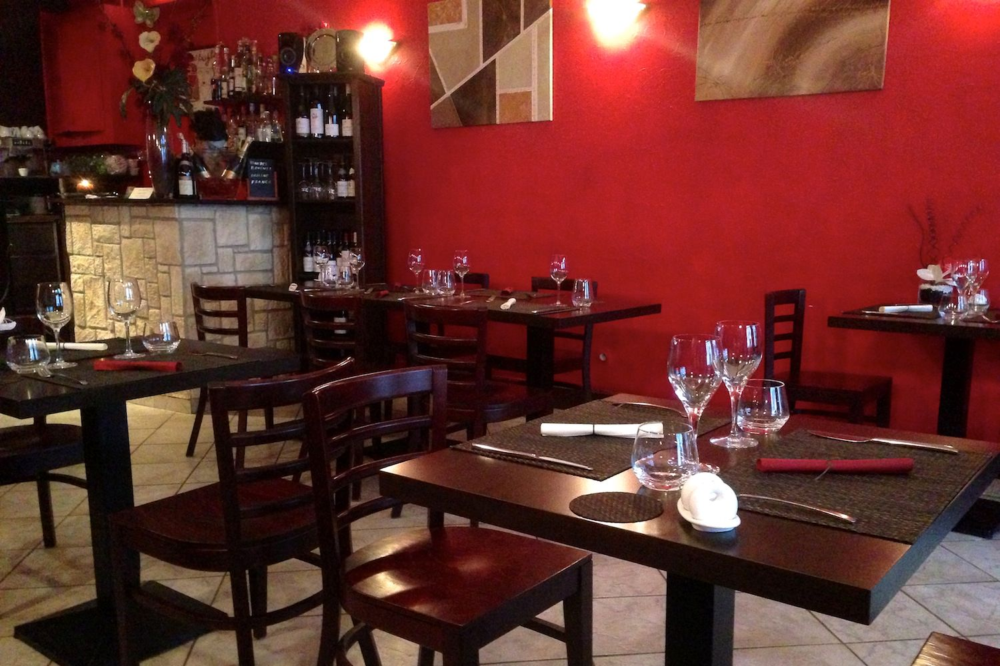
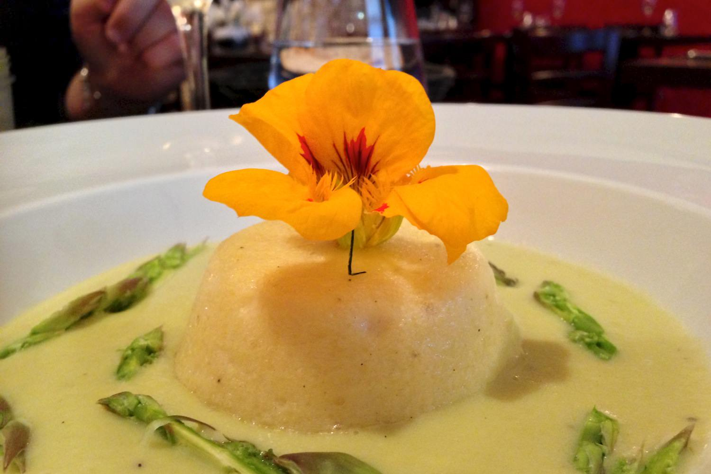
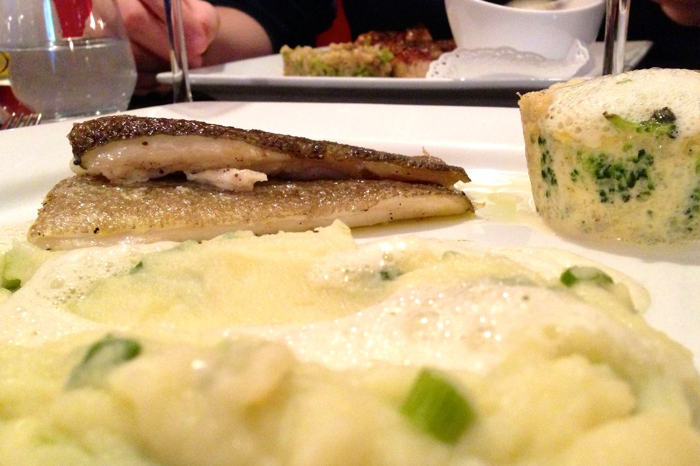
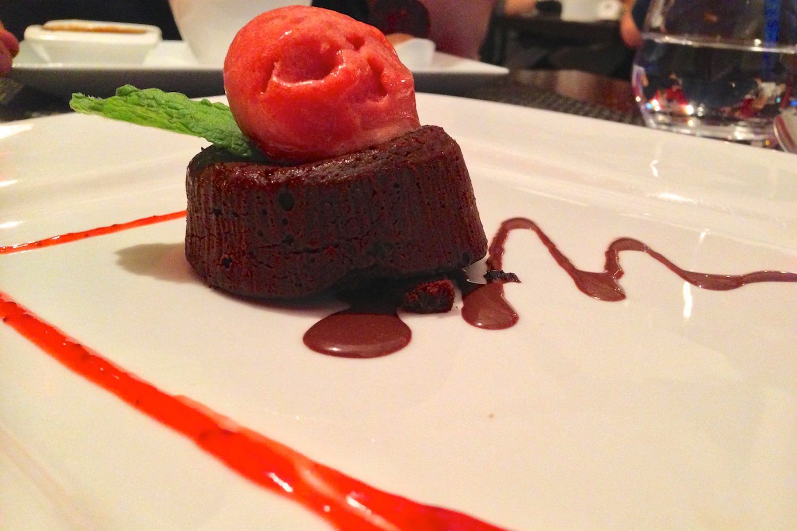

+++
titre = "L&rsquo;Inattendu à Lyon"
title = "L'Inattendu à Lyon"
url = "/inattendu-lyon"
date = "2013-06-01T10:33:52"
Lastmod = "2013-06-01T10:37:45"
cover = "restaurant-inattendu-lyon.jpg"
categorie = [ "À manger" ]
tag = [ "Cuisine française" ]

+++

Au cœur du sixième arrondissement lyonnais, dans l’une des innombrables rues étroites du quartier entre Brotteaux et Massena, <a href="http://www.lyonresto.com/restaurant-Lyon/restaurant-L-Inattendu-Lyon/restaurant-L-Inattendu-Lyon-2795.html"><strong>L’Inattendu</strong></a> est un petit restaurant qui entend vous surprendre. Au-delà du contraste entre sa devanture plutôt sérieuse et sa salle très colorée, la carte allèche par ses plats variés et laisse espérer une cuisine inventive, mais pas trop. Une très belle adresse, parfaite pour manger des petits plats savoureux sans se ruiner. 

Quand on passe la porte de <strong>L’Inattendu</strong>, la première chose que l’on n’attendait pas, c’est le rouge vif qui orne tous les murs. Cette touche très colorée n’est pas désagréable et égaye la salle qui serait sans cela assez triste : avec le temps pluvieux que l’on avait ce soir-là, ce n’était pas de trop… Le restaurant est petit et une vingtaine de personnes seulement pourront s’y restaurer à chaque repas. La réputation de l’adresse semble faite, toujours est-il que tout était complet ce vendredi soir : pensez donc à réserver à l’avance pour avoir le droit de déguster les plats du chef. Très calme en début de soirée, la salle s’est vite remplie et le niveau sonore a logiquement augmenté, mais les tables restent suffisamment éloignées les unes des autres pour profiter de son repas en toute intimité. Les propriétaires ont fait le choix judicieux de ne pas placer autant de tables que possible, et c’est agréable. 

Au programme, des assiettes qui essaient de provoquer l’inattendu pour les papilles avec des associations originales. On est curieux de goûter l’association asperge et noix de Saint Jacques parmi les entrées du moment, et chaque plat de <strong>L’Inattendu</strong> trouve également de quoi susciter la curiosité. On peut se contenter d’une assiette ou deux, mais le restaurant met, à raison, ses deux menus en avant : pour 25 ou 30 €, vous avez le choix entre deux menus complets composés à chaque fois de deux ou trois assiettes possibles pour les entrées, les plats et les desserts. Des prix très corrects, surtout dans ce quartier où ils ont parfois tendance à augmenter plus que de raison. Nul exotisme ici, on reste bien en France avec une cuisine qui équilibre les poissons et les viandes sans les faire rencontrer : il y en aura pour tous les goûts. La carte change totalement tous les deux mois, ce qui est toujours un gage de qualité pour un petit restaurant. On accompagne nos menus d’un verre de vin qui, bien rempli, fera l’affaire autant pour l’apéro que pour le repas, et on s’en tire pour environ 35 € par personne, un tarif plus que raisonnable. 

Dans les assiettes, le chef de <strong>L’Inattendu</strong> propose une cuisine simple, mais pas simpliste, et surtout savoureuse. En entrée, le fondant de noix de Saint Jacques et sa crème d’asperge était excellent, même si on aurait aimé un peu de noix dans le fondant. La crème autour était fine et ne couvrait pas le goût des Saint Jaques, tandis que les pointes d’asperge crues apportaient à la fois du croquant et une saveur différente qui explose en bouche. Sur le dessus, la fleur n’est pas que de la décoration, elle est comestible et ajoute elle aussi du croquant et une saveur très subtile. Une très belle entrée, toute en finesse qui ouvre admirablement le repas… En face, la royale de foie gras était recouverte d’une crème de céleris qui couvrait un peu trop le foie gras, ce qui n’a pas empêché l’assiette d’être rapidement terminée. Le poisson du jour était du cabillaud, un choix classique, mais qui fonctionne toujours. Sa peau aurait pu être mieux grillée et on aurait préféré un gros morceau plutôt que deux fins, mais c’était très bon et la purée rehaussée d’oignons nouveaux crus réveillait admirablement l’assiette. L’autre plat du menu, de la volaille de Bresse farcie aux morilles, était également très bon, les suprêmes parfaitement grillés tout en restant bien moelleux. Le gâteau minute au chocolat noir proposé en dessert était incontournable, mais c’est la déception du soir. Trop petit, ce gâteau ne fondait pas et il manquait surtout de goût : difficile de savoir, en fermant les yeux, qu’il s’agissait de chocolat. Le cœur de fraise retrouvait cependant l’association classique chocolat/fruits rouges qui fonctionne toujours. L’autre dessert à la carte en revanche était une réussite totale : &laquo;&nbsp;Plaisirs et gourmandise aux bonbons réglisse, fraise tagada et carambar&nbsp;&raquo; ressemblait en fait à un café gourmand avec trois petits desserts. Il y a une crème brulée au réglisse, une mousse aux bonbons aux fraises et une glace au carambar : les saveurs originales sont bien là, ce n’est pas trop sucré et donc pas écœurant, un délice. 

Bilan positif pour <strong>L’Inattendu</strong> qui sert une cuisine simple, mais de qualité et des plats qui tentent parfois des associations originales, sans aller trop loin. On pouvait peut-être attendre un petit peu plus de folie dans les assiettes, mais on y mange bien et c’est une adresse parfaite pour une agréable soirée à petit prix. 

