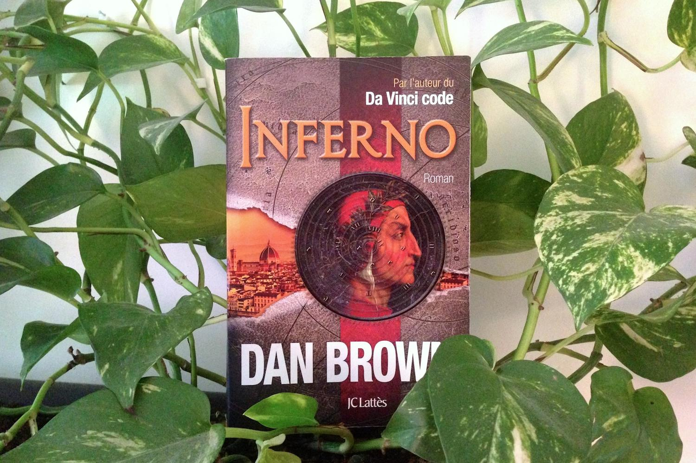

+++
titre = "<em>Inferno</em>, Dan Brown"
title = "Inferno, Dan Brown"
url = "/inferno-brown"
date = "2013-08-26T08:15:33"
Lastmod = "2015-01-01T12:08:27"
cover = "inferno-dan-brown.jpg"
categorie = [ "À lire" ]
tag = [ "Dante", "Maladie", "Roman", "Thriller", "Vite oublié" ]
createur = [ "Dan Brown" ]
annee = [ "2013" ]
weight = 2013
pays = [ "États-Unis" ]

+++

Dix ans après son <em>Da Vinci Code</em> qui s’est vendu par millions et qui a propulsé son auteur au rang d’écrivain millionnaire et de superstar, Dan Brown revient avec les nouvelles aventures de Robert Langdon, son personnage fétiche. <em>Inferno</em> reprend la même formule qui a fait le succès du premier roman, avec un thriller construit sur des symboles religieux ou mythologiques. Cette fois, il n’est pas question d’un complot de l’Église ou d’une obscure secte, mais d’un savant fou qui a un projet infernal pour sauver l’humanité. Dan Brown exploite cette fois Dante et son chef d’œuvre, <em>La Divine Comédie</em> pour construire un roman de plage parfaitement maîtrisé. Le suspense est au rendez-vous, mais l’efficacité de l’ensemble est un peu gâché par un récit taillé pour le blockbuster qu’il deviendra dès 2015. <em>Inferno</em> se lit rapidement et s’oublie aussi facilement qu’il aura été lu… idéal pour les vacances, en somme.

Dan Brown respecte le cahier des charges du bon thriller à la lettre. Dès les premières pages, l’auteur américain embarque son lecteur dans une aventure totalement folle qui commence dans une chambre d’hôpital de Florence. <em>Inferno</em> met en scène Robert Langdon, le professeur de symbologie qui était déjà le héros des précédents romans de l’écrivain, alors qu’il se remet avec difficulté d’un accident. Son crâne est cicatrisé et il ne se souvient de rien et surtout pas des dernières heures. Il n’était pas censé être à Florence et il ne sait pas comment il a eu cet accident qui n’en était pas un puisque, comme le lui révèlent rapidement les docteurs, on lui a tiré dessus. À partir de ce point de départ, Dan Brown élabore un récit complexe où l’on voyage dans tout Florence, puis à Venise et enfin en Turquie, et où un immense piège se révèle. L’intérêt du roman étant de découvrir avec le héros ce piège, on en dira le moins possible, mais disons simplement que c’est Dante, sa <em>Divine Comédie</em> et tout l’univers autour du poète qui permettent à Robert de comprendre ce qui se passe et de déjouer les intentions du méchant de l’histoire. L’ensemble est totalement improbable, mais ce n’est pas très grave et <em>Inferno</em> tient à peu près la route en terme de cohérence interne. On regrette quand même la façon un peu désinvolte qu’a l’auteur pour introduire des coups de théâtre qui annulent tout ce que l’on croyait jusque-là, mais c’est le jeu du genre. L’ensemble reste divertissant et relativement prenant, même si on se doute assez vite de ce qu’il va se passer dans les grandes lignes.

<em>Inferno</em> n’a pas la prétention d’être un chef d’œuvre, c’est indéniable. Ajoutons à cela que la traduction menée dans un bunker par deux personnes n’avantage certainement pas un texte qui n’a, de manière générale, aucun intérêt sur le plan stylistique. Les phrases sont courtes, les paragraphes découpés à la hache et le vocabulaire est limité au strict nécessaire. Dan Brown écrit pour le cinéma et cela se sent autant dans le découpage des scènes que dans les dialogues ou encore dans la description de l’action. De fait, on lit quasiment un scénario et on imagine que celui de l’adaptation au cinéma qui est déjà prévue ne demandera pas tant de travail qu’un autre roman. Chaque roman de l’auteur a été adapté au grand écran et on se doute qu’il a une bonne expérience dans ce domaine et qu’il fait tout pour optimiser son écriture dans cet objectif. Pour le dire autrement, <em>Inferno</em> n’est pas un objet littéraire bien intéressant et s’il parvient à tenir en haleine, c’est plus pour son histoire que par son style. Dans un contexte de lecture facile, tout ceci n’est pas gênant. En revanche, la propension du texte à tout expliciter est pénible. Plutôt que de faire confiance à l’intelligence de ses lecteurs, l’écrivain préfère ne rien laisser au hasard et il décrit et détaille tout, autant pour ce qui concerne l’action ou les personnages, que pour tous les monuments et autres œuvres d’art croisées par les personnages. C’est un autre trait caractéristique de l’écriture de Dan Brown, et un trait particulièrement pénible à la longue : il entend éduquer son lecteur en lui offrant le plus d’explications historiques ou culturelles. On peut ouvrir <em>Inferno</em> à n’importe quelle page pour tomber sur des explications sur un tableau, une statut, un palais florentin ou autre chose encore.

<blockquote class="pull-quote">
Inventés par les Sumériens en 3500 avant Jésus-Christ, les sceaux-cylindres furent les précurseurs de la taille-douce, l’intaglio des Italiens, le premier procédé de gravure en série. Sculpté d’images, un sceau était percé d’un orifice longitudinal à travers lequel on insérait un axe afin de pouvoir faire rouler le cylindre, à la manière des rouleaux de peinture modernes, sur une tablette d’argile, pour imprimer une suite récurrente de symboles, d’images ou de textes.<cite class="author"> — Dan Brown, Inferno, Chapitre 13</cite>

</blockquote>

Les paragraphes de ce genre sont monnaie courante alors qu’ils sont contre-productifs. Ils coupent l’action d’<em>Inferno</em> sans apporter en général une explication vraiment utile, ni même souvent intéressante. Ils devraient inciter à la curiosité, mais ils ont plutôt tendance à énerver le lecteur qui n’aime pas être pris pour un imbécile. Au total, même si on ne connaît pas et si l’on pourrait apprendre quelque chose, on a tendance à ne plus lire ces paragraphes. Dan Brown aime en outre répéter certaines de ces explications, si bien que l’on a vite le sentiment de lire une dissertation médiocre, plutôt qu’un bon roman…

Inutile de le nier, <em>Inferno</em> se lit très facilement, sur la plage ou pour passer le temps pendant un voyage. Dan Brown écrit d’ailleurs précisément pour cette raison et son dernier ouvrage est assez divertissant. Le plaisir de la simple lecture d’un thriller est toutefois quelque peu gâché par cette habitude pénible de répéter des explications culturelles inutiles, mais aussi de tout expliciter pour ne laisser aucune ombre à l’intrigue. Le romancier américain semble vouloir oublier que ses lecteurs ne sont pas stupides et en ne faisant pas confiance à leur intelligence ou tout simplement à leur imagination, il propose un roman efficace, certes, mais qu’on oublie au fur et à mesure. <em>Inferno</em> ne dépasse pas le statut de lecture facile de vacances, mais c’est après tout ce pour quoi il existe.

<h3>Vous voulez m&rsquo;aider ?</h3>
<ul>
<li><a href="http://www.amazon.fr/gp/product/270964374X/ref=as_li_ss_tl?ie=UTF8&#038;tag=leblogdenic07-21&#038;linkCode=as2&#038;camp=1642&#038;creative=19458&#038;creativeASIN=270964374X">Acheter le livre en français sur Amazon</a> (<a href="http://www.amazon.fr/gp/product/B00C0UXSC0/ref=as_li_ss_tl?ie=UTF8&#038;tag=leblogdenic07-21&#038;linkCode=as2&#038;camp=1642&#038;creative=19458&#038;creativeASIN=B00C0UXSC0">format Kindle</a>)</li>
<li><a href="http://www.amazon.fr/gp/product/0385537859/ref=as_li_ss_tl?ie=UTF8&#038;tag=leblogdenic07-21&#038;linkCode=as2&#038;camp=1642&#038;creative=19458&#038;creativeASIN=0385537859">Acheter le livre en anglais sur Amazon</a> (<a href="http://www.amazon.fr/gp/product/B00B1AHNVC/ref=as_li_ss_tl?ie=UTF8&#038;tag=leblogdenic07-21&#038;linkCode=as2&#038;camp=1642&#038;creative=19458&#038;creativeASIN=B00B1AHNVC">format Kindle</a>)</li>
<li><a href="https://itunes.apple.com/fr/book/inferno-version-francaise/id624516123?mt=11">Acheter le livre en français sur l&rsquo;iBookstore</a> (<a href="https://itunes.apple.com/fr/book/inferno/id593855874?mt=11">en anglais</a>)</li>
</ul>

