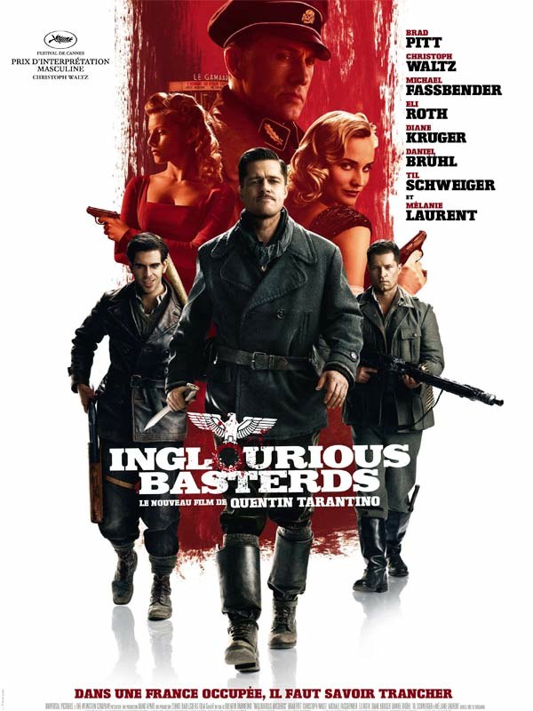
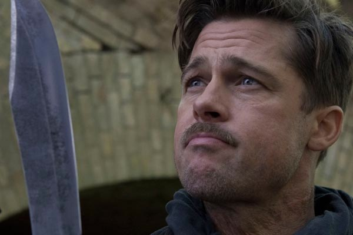
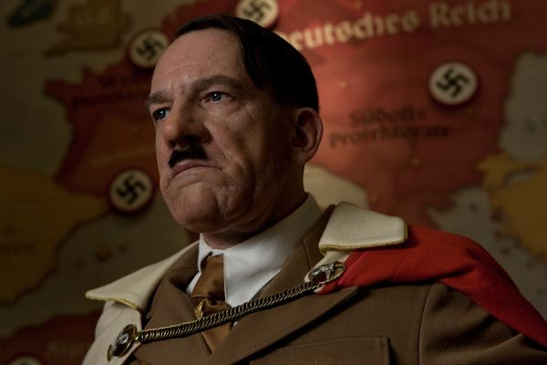
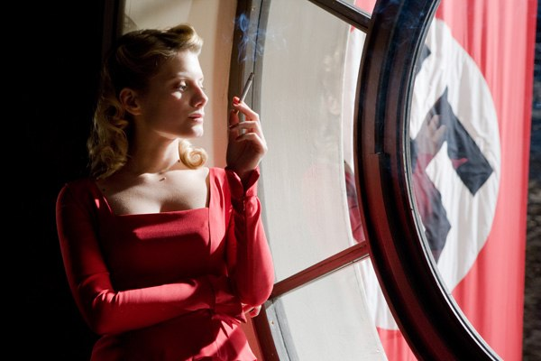

+++
titre = "<em>Inglourious Basterds</em>, Quentin Tarantino"
title = "Inglourious Basterds, Quentin Tarantino"
url = "/inglourious-basterds-tarantino"
date = "2009-08-22T01:50:38"
Lastmod = "2014-02-18T14:34:59"
cover = "inglourious_basterds_home.jpg"
categorie = [ "À voir" ]
tag = [ "Histoire", "Humour" ]
createur = [ "Quentin Tarantino" ]
acteur = [ "Brad Pitt", "Christoph Waltz", "Diane Kruger", "Eli Roth", "Mélanie Laurent", "Michael Fassbender" ]
annee = [ "2009" ]
weight = 2009
pays = [ "États-Unis" ]

+++

Voir un film de Tarantino, c&rsquo;est plus que simplement aller au cinéma, c&rsquo;est presque aller à un office. Le déroulement est connu d&rsquo;avance, on n&rsquo;est jamais dépaysé, mais en même temps l&rsquo;évolution est là pour garder le plaisir intact, toujours renouvelé. Après avoir vu <em>Inglourious Basterds</em>, le cru 2009, le constat presque décevant s&rsquo;impose : je suis incapable de ne pas aimer un film de Quentin Tarantino&#8230;

Le film commence par un long dialogue (une vingtaine de minutes) qui, sous des apparences de dialogue anodin, se révèle en fait un véritable duel à mort. D&rsquo;emblée, le ton et l&rsquo;atmosphère indiquent très clairement le film de Tarantino. Dès les images introductives d&rsquo;ailleurs, où l&rsquo;on voit une maison de paysans dans une France des années 1940 conforme aux archétypes. Le réalisateur reprend avec soins tous les clichés, l&rsquo;herbe bien verte, la lessive bien blanche qui sèche, et l&rsquo;homme qui coupe du bois. Mais le son d&rsquo;une voiture interrompt la scène idyllique et rappelle à la dure réalité de la guerre. Immédiatement, le film change de ton et devient un pastiche des westerns de la grande époque, ceux de Siergo Leone en particulier, avec ces plans fixes sur les personnages, et cette musique&#8230; Le long dialogue commence encore, toujours cordial jusqu&rsquo;aux dernières minutes ou brusquement la tension monte, avant une bouffée de violence finale aussi violente qu&rsquo;inattendue.

En une vingtaine de minutes, le cinéma de Tarantino semble se résumer. Introduite par un chapitre, comme dans plusieurs de ses films, la scène condense ce qui fait sa patte : l&rsquo;art du dialogue présent uniquement pour le plaisir du dialogue, entrecoupé de quelques accès de violence aussi barbares et inutiles que jouissifs. Mais si Tarantino reste Tarantino par certains aspects, <em>Inglourious Basterds</em> n&rsquo;est pas une redite de la filmographie qui le précède.

D&rsquo;une part, c&rsquo;est la première fois que le réalisateur se penche sur un sujet historique, en l&rsquo;occurrence la Seconde guerre mondiale en France, et la résistance à l&rsquo;occupation. Le film entremêle deux fils, qui sont autant de vengeances contre des nazis : celle des bâtards du titre, des juifs américains emmenés par Brad Pitt qui parcourent la France, tuent des Nazis et récupèrent leurs scalps (dans des scènes qui justifient l&rsquo;interdiction au moins de 12 ans) ; celle, par ailleurs, de Soshanna, miraculée du premier massacre qui fomente un improbable piège pour tuer les plus hauts dignitaires nazis dans un cinéma. Le fond historique est, comme toujours, plus une excuse qu&rsquo;autre chose et d&rsquo;ailleurs, Quentin Tarantino prend un malin plaisir à jouer de nos attentes et changer complètement la fin puisqu&rsquo;il tue Hitler dans cette salle de cinéma. Un film en costumes d&rsquo;époque est néanmoins quelque chose de nouveau dans la cinématographie du réalisateur.

La langue reste un élément central du film, mais Inglourious Basters contient une nouveauté des plus intéressantes puisque le film fait place à la diversité linguistique. On parle alternativement anglais, français, allemand et même italien. Ces changements font sens, les personnages passent d&rsquo;une langue à l&rsquo;autre en fonction du contexte. Ainsi, dans la première scène, le dialogue se fait en anglais puisque les Juifs qui se cachent sous le plancher ne comprennent pas cette langue. La langue est aussi ce qui trahit, comme en témoigne la scène très drôle où l&rsquo;on apprend en même temps que les personnages que le méchant parle parfaitement italien et met en miettes le camouflage et le plan. Le choix du multilinguisme, apparemment imposé aux États-Unis, apporte aussi une touche de réalisme au film : non, les Allemands ne parlaient pas un anglais hollywoodien parfait.

On dit souvent que le cinéma de Tarantino n&rsquo;a rien à dire, qu&rsquo;il s&rsquo;amuse en permanence et fait des films vides, pour le simple plaisir des dialogues et du sang. C&rsquo;est partiellement vrai, mais surtout faux, particulièrement dans <em>Inglourious Basterds</em>. Il est vrai qu&rsquo;il ne faut pas forcément chercher à tout comprendre : certaines scènes sont parfois uniquement justifiées par le plaisir simple de faire la scène. Si le réalisateur a envie de réaliser une scène &laquo;&nbsp;à la Sergio Leone&nbsp;&raquo;, il la filme et elle se justifie alors uniquement par elle-même. Je comprends ainsi la scène du maquillage, quand Mélanie Laurent se fait belle pour l&rsquo;avant-première d&rsquo;un film dans son cinéma : ralentis constants, gros plans, musique de David Bowie&#8230; on sent que la présence de cette scène répond à un caprice du réalisateur. Il faut le savoir avant de voir ses films, Tarantino aime faire ce qu&rsquo;il a envie de faire, sans nécessairement de raison de le faire.

D&rsquo;ailleurs, tout le film dans son ensemble peut répondre au désir de faire comme dans les films de guerre de la grande époque (celle de la <em>Grande évasion</em> par exemple), avec des Allemands ridicules (le comble étant Hitler lui-même, dans une version encore plus ridicule que celle de Chaplin&#8230; et c&rsquo;est peu dire) et tout le décorum qui va avec. Mais <em>Inglorious Basters</em> n&rsquo;est pas que ça, c&rsquo;est aussi un film plein de sens.

Quentin Tarantino célèbre d&rsquo;abord dans son dernier film le cinéma et sa puissance. Jugez un peu, un film peut réécrire l&rsquo;histoire complètement, et tuer Hitler (et Goebbels et tous les autres hauts dignitaires du régime) à la projection d&rsquo;une avant-première dans un cinéma parisien. Le pouvoir du cinéma est omniprésent, et le réalisateur n&rsquo;a pas pu s&rsquo;empêcher de le traduire au premier degré. C&rsquo;est donc dans un cinéma que l&rsquo;histoire se réécrit, à l&rsquo;aide même de bobines de film puisque ce sont elles qui déclenchent l&rsquo;incendie mortel. Le monde du cinéma gravite en permanence à travers les personnages : on croise des projectionnistes, un critique de cinéma et des acteurs, à commencer par le redoutable et redouté méchant qui passe d&rsquo;une langue à l&rsquo;autre et d&rsquo;un ton à un autre.

Dans un autre registre, le film se veut aussi manifeste en faveur de la diversité culturelle. En choisissant de faire des langues un personnage à part entière, Tarantino ne fait pas que relever le réalisme de son film, il dit aussi quelque chose sur l&rsquo;identité des personnages à travers la langue. Au passage, il joue des clichés, comme en témoigne le très fort accent américain de Brad Pitt qui tranche nettement avec celui des Britanniques. Si <em>Inglourious Basters</em> est sans conteste antinazi, il n&rsquo;est pas germanophone, bien au contraire même.

Un mot s&rsquo;impose à propos du grand méchant du film, le colonel Hans Landa brillamment joué par Christoph Waltz. Le prix d&rsquo;interprétation masculine que ce dernier a obtenu à Cannes s&rsquo;imposait effectivement tant sa prestation, suave et ferme à la fois, est assez époustouflante. J&rsquo;ai toujours pensé que les méchants étaient les plus intéressants dans une histoire, mais la comparaison avec Brad Pitt me donne ici entièrement raison. Ce dernier paraît bien fade face à son adversaire nazi. La majorité des scènes de dialogue se fait avec Christoph Waltz, et c&rsquo;est à chaque fois un plaisir renouvelé de l&rsquo;entendre torturer ses interlocuteurs virtuellement. Le plan où il éteint sa cigarette dans la crème de son gâteau symbolise à elle seule sa méthode, violente sous des apparences douces.

Je pourrais encore écrire des lignes et des lignes sur <em>Inglourious Basterds</em>, mais j&rsquo;en ai déjà trop fait. Je me contenterai donc de renouveler mes recommandations (courez le voir si ce n&rsquo;est pas déjà fait !) et de renvoyer à la lecture de la critique de <em><a href="http://www.telerama.fr/cinema/films/inglourious-basterds,389337,critique.php">Télérama</a></em> ou à celle, aussi riche qu&rsquo;intéressante de <a href="http://www.critikat.com/Inglourious-Basterds.html">Critikat</a>. Ces derniers n&rsquo;ont pas aimé le film et apportent des arguments tout à fait recevables. Ils n&rsquo;ont pas tort quand ils disent que les dialogues de <a href="http://voiretmanger.fr/2011/06/26/boulevard-de-la-mort-tarantino/" title="Boulevard de la Mort, Quentin Tarantino"><em>Boulevard de la Mort</em></a> étaient plus forts, incisifs, bref mieux réussis. Mais je dirais qu&rsquo;ils étaient aussi très différents, et que je suis reconnaissant à Tarantino d&rsquo;avoir su se renouveler et éviter la redite&#8230;

<h3>Vous voulez m&rsquo;aider ?<a href="#footnote_0_1718" id="identifier_0_1718" class="footnote-link footnote-identifier-link" title="&Agrave; propos de la publicit&eacute;&hellip;">1</a></h3>
<ul>
<li><a href="http://www.amazon.fr/gp/product/B0047N08IK/ref=as_li_ss_tl?ie=UTF8&#038;tag=leblogdenic07-21&#038;linkCode=as2&#038;camp=1642&#038;creative=19458&#038;creativeASIN=B0047N08IK">Acheter le film en Blu-Ray sur Amazon</a></li>
<li><a href="http://www.amazon.fr/gp/product/B002MRRUDE/ref=as_li_ss_tl?ie=UTF8&#038;tag=leblogdenic07-21&#038;linkCode=as2&#038;camp=1642&#038;creative=19458&#038;creativeASIN=B002MRRUDE">Acheter le film en DVD sur Amazon</a></li>
<li><a href="http://itunes.apple.com/fr/movie/inglourious-basterds/id367285921">Acheter ou louer le film sur l&rsquo;iTunes Store</a></li>
</ul>

<ol class="footnotes"><li id="footnote_0_1718" class="footnote"><a href="http://voiretmanger.fr/soutien/">À propos de la publicité…</a> [<a href="#identifier_0_1718" class="footnote-link footnote-back-link">&#8617;</a>]</li></ol>
