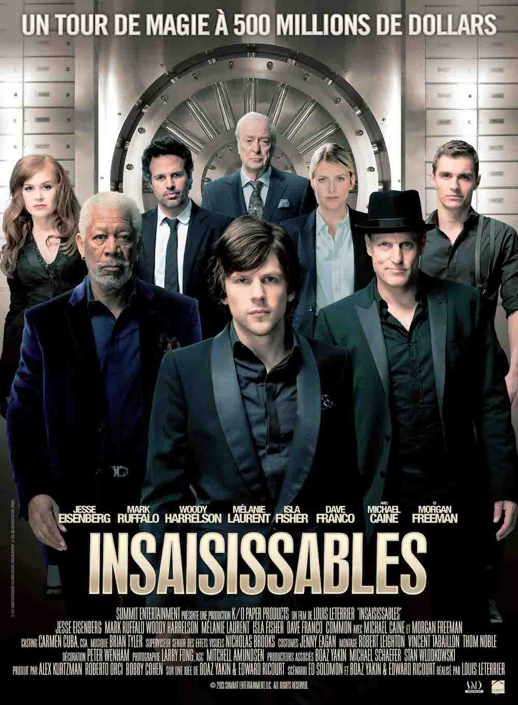
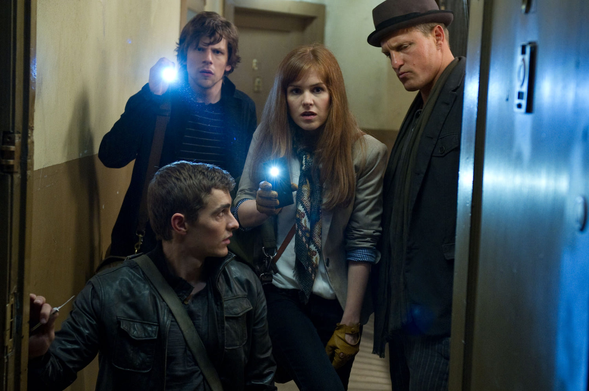
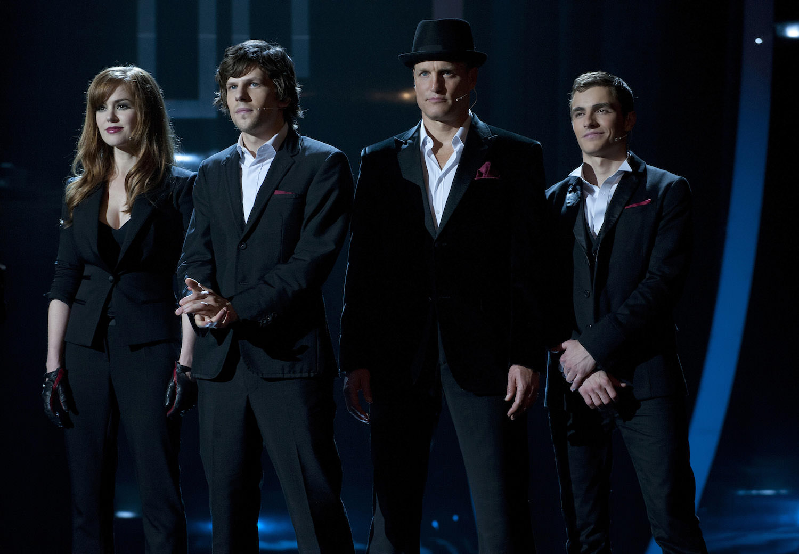

+++
titre = "<em>Insaisissables</em>, Louis Leterrier"
title = "Insaisissables, Louis Leterrier"
url = "/insaisissables-leterrier"
date = "2013-09-08T01:11:54"
Lastmod = "2013-09-08T01:22:45"
cover = "insaisissables-jesse-eisenberg-leterrier.jpg"
categorie = [ "À voir" ]
tag = [ "Argent", "Blockbuster", "Enquête", "Magie", "Police", "Sorties du mois", "Thriller", "Vite oublié" ]
createur = [ "Louis Leterrier" ]
acteur = [ "Dave Franco", "Isla Fisher", "Jesse Eisenberg", "Mark Ruffalo", "Mélanie Laurent", "Michael Caine", "Morgan Freeman", "Woody Harrelson" ]
annee = [ "2013" ]
weight = 2013
pays = [ "États-Unis", "France" ]
original = "Now You See Me"

+++

L’affiche place tous les personnages devant un coffre-fort. Ajoutons à cela son titre et son slogan — « <em>Un tour de magie à 500 millions de dollars</em> » — et on a une idée assez précise du scénario d’<em>Insaisissables</em>. Le dernier film de Louis Leterrier, cinéaste français spécialisé dans les blockbusters <a href="http://voiretmanger.fr/choc-titans-leterrier/" title="Le choc des Titans, Louis Leterrier">pas toujours réussis</a>, ne fait pas dans l’originalité, mais ce n’est pas son ambition. Sur le papier, ce blockbuster est un thriller policier fun, entre magie et voleur dans l’esprit de Robin des Bois. En réalité, <em>Insaisissables</em> est gêné par son scénario exagérément alambiqué et parfois trop facile. Au total, ce défilé de stars se regarde sans peine, mais sans plaisir non plus : on suit une histoire trop invraisemblable et qui plus est trop explicitée, pour un spectacle que l’on oubliera aussi vite qu’on l’a vu. 

Le début d’<em>Insaisissables</em> ressemble à s’y méprendre à celui de <a href="http://voiretmanger.fr/prestige-nolan/" title="Le Prestige, Christopher Nolan"><em>Le Prestige</em></a>, l’excellent film de Christopher Nolan. Les deux films partagent un même sujet, l’illusion, et même s’ils se déroulent dans deux cadres qui n’ont rien à voir, ils ont la même approche, du moins au départ. Tous deux font le pari de vous prévenir dès le départ, de dire clairement aux spectateurs que ce qui va suivre va les perdre avec du futile pour les écarter de la vérité. Un pari audacieux, puisqu’il dévoile le twist final dès les premières minutes ; un pari qui impose ensuite un scénario tout en finesse pour qu’on oublie cette introduction et qu’on puisse ainsi se faire avoir par l’illusion, malgré tout. Louis Leterrier n’est pas Christopher Nolan malheureusement, et cela se ressent. Le cinéaste a beau multiplier les fausses pistes pour tenter de nous perdre, on n’oublie jamais vraiment qu’on cherche à nous tromper et les preuves sont trop nombreuses pour ne pas comprendre rapidement ce qui se passera à la toute fin. À cet égard, <em>Insaisissables</em> est tristement prévisible et si les héros du long-métrage ne sont effectivement jamais saisis, le spectateur n’aura, lui, aucun mal à saisir les tenants et les aboutissants. Inutile de trop en dire ici pour ne pas dévoiler la surprise — malgré tout, elle est bien présente —, mais toujours est-il que le cinéaste ne parvient guère à surprendre. Un mauvais point déjà pour ce film qui voulait nous perdre en nous approchant au maximum de l’illusion.

<em>Insaisissables</em> partait sur une excellente piste : des illusionnistes qui exploitent leur don pour masquer l’objectif véritable de leur coup, un vol. La <a href="http://www.youtube.com/watch?v=jd_VyJJiABc">bande-annonce</a> plutôt alléchante laissait espérer que le vol d’une banque à Paris depuis une salle de Las Vegas était le clou du spectacle, il n’en est rien. En fait, Louis Leterrier ouvre pratiquement son film sur ce numéro qui est le premier d’une trilogie de numéros montant crescendo. Dans le premier, les quatre illusionnistes qui composent « Les Quatre Cavaliers » font croire qu’ils envoient un parisien dans la salle de Las Vegas au coffre de sa banque, à Paris pour voler tous les billets qui s’y trouvent. Tels de bons Robin des Bois, ils offrent les trois millions volés au public, mais ils s’attirent en même temps l’intérêt du FBI et même d’Interpol. Une enquête s’ouvre, mais les autorités n’ont rien contre eux et on découvre vite l’explication rationnelle à base de coffre dupliqué sous la scène. En fait, ce n’est pas le plus important et <em>Insaisissables</em> rebondit vite avec un deuxième numéro encore plus surprenant où les magiciens volent cette fois le compte d’un banquier pas net pour le reverser aux victimes de Katrina. Tout cela mène au troisième numéro, un climax qui se base aussi sur le vol d’une grosse somme d’argent et surtout sur la disparition des quatre magiciens. Louis Leterrier commet plusieurs erreurs, mais la première serait sans doute d’opter pour un scénario parfaitement linéaire. De la rencontre des quatre magiciens au tout début, jusqu’à la résolution de la grande énigme à la fin, le spectateur est pris par la main et <em>Insaisissables</em> manque de cette audace d’écriture qui rendrait l’ensemble bien plus intéressant. On pourrait aussi pointer du doigt le nombre de personnages et surtout un vrai défilé de stars qui dessert le film : Jesse Eisenberg, Mark Ruffalo, Woody Harrelson, Dave Franco, Morgan Freeman, Michael Caine et même Mélanie Laurent… ils ont tous du talent, mais ils sont noyés ici par une superproduction qui a oublié d’imaginer des personnages crédibles ou une histoire vraiment intéressante. 

Le projet de départ était ambitieux et <em>Insaisissables</em> aurait pu être un excellent blockbuster estival, prenant et fun, à défaut d’être très original. Si l’on ne reproche pas à Louis Leterrier de ne pas faire un film suffisamment novateur, on regrette malgré tout la surenchère de stars et d’effets au détriment d’une histoire solide. Filmé sans aucune recherche, porté par une bande-son aussi présente qu’insipide, <em>Insaisissables</em> n’a décidément pas grand-chose pour lui. Et certainement son twist final qui est censé être une grande révélation, mais que l’on comprend bien plus tôt… Dommage !

