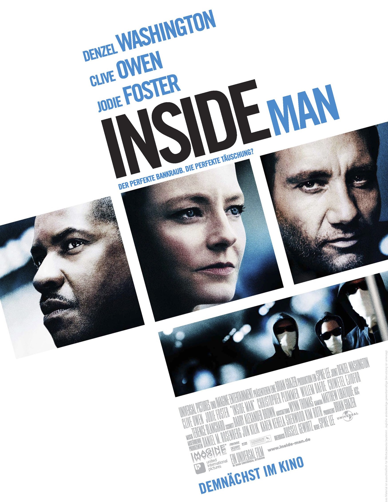
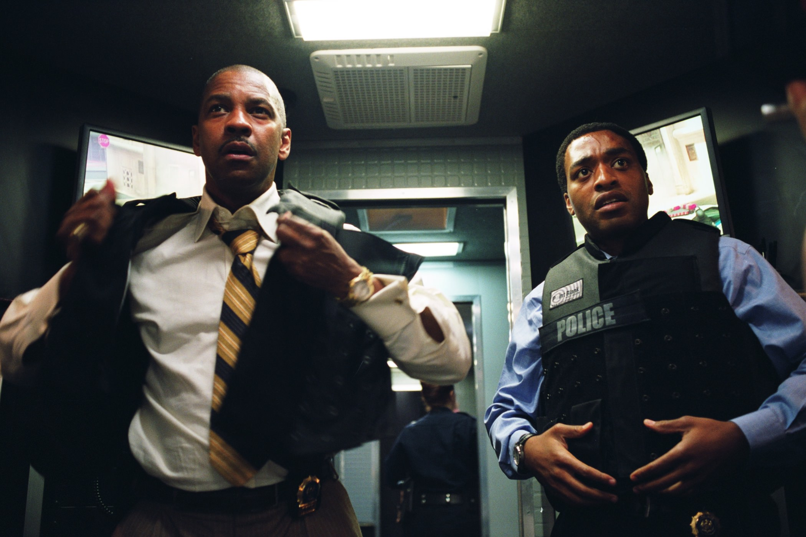

+++
type = "post"
titre = "<em>Inside Man : l&rsquo;Homme de l&rsquo;intérieur</em>, Spike Lee"
title = "Inside Man : l'Homme de l'intérieur, Spike Lee"
url = "/inside-man-homme-interieur-lee"
date = "2015-01-12T10:47:13"
Lastmod = "2015-01-12T18:23:13"
cover = "inside-man-homme-interieur-clive-owen.jpg"
categorie = [ "À voir" ]
tag = [ "Action", "Braquage", "Film de gangsters", "Mensonge", "Police", "Puzzle", "Thriller" ]
createur = [ "Spike Lee" ]
acteur = [ "Chiwetel Ejiofor", "Christopher Plummer", "Clive Owen", "Denzel Washington", "Jodie Foster" ]
annee = [ "2006" ]
weight = 2006
pays = [ "États-Unis" ]
original = "Inside Man"

+++

<em>Inside Man : l&rsquo;Homme de l&rsquo;intérieur</em> est un film de braquage, mais sa toute première scène évacue d&rsquo;emblée la majeure partie du scénario attendu. Face caméra, l&rsquo;auteur du braquage se dévoile sans détour et explique ce qu&rsquo;il a fait et pourquoi. Le film de Spike Lee n&rsquo;a pas commencé que l&rsquo;on sait déjà qu&rsquo;une banque va être braquée dans les heures qui suivent, puisque ce n&rsquo;est pas ça l&rsquo;intérêt. Tous les enjeux du long-métrage ne se concentrent pas sur les personnes ou les motifs, mais bien plus sur la méthode. Comme le dit Dalton, le braqueur, dans cette première séquence, la seule question qui reste est : « <em>Comment ?</em> ». Il va sans dire qu&rsquo;il faut absolument voir <em>Inside Man : l&rsquo;Homme de l&rsquo;intérieur</em> au moins une fois sans avoir cette réponse, sous peine de perdre une partie du spectacle. Si vous ne l&rsquo;avez pas vu, arrêtez-vous là, mais ruez vous sur le film de Spike Lee avant de revenir lire la suite…

Là où beaucoup de films auraient commencé en présentant les différents protagonistes avant les faits avec l&rsquo;objectif de permettre aux spectateurs de se familiariser avec les principaux personnages secondaires et à leurs histoires, <em>Inside Man : l&rsquo;Homme de l&rsquo;intérieur</em> reste concentré sur son sujet. De fait, après l&rsquo;introduction avec Dalton face caméra, on embraye immédiatement sur le braquage. Et même si, tout en faisant avancer les gangsters, le scénario accorde un peu de temps à deux clients de la banque d&rsquo;une part et à l&rsquo;histoire d&rsquo;amour de Keith, le deuxième personnage principal de Spike Lee, ce n&rsquo;est qu&rsquo;un piège. On s&rsquo;attend à voir ces histoires développées par la suite, car c&rsquo;est ainsi que n&rsquo;importe quel blockbuster lambda serait construit. On imagine qu&rsquo;il arrivera quelque chose de dramatique au policier, ou que son couple instable sera renforcé à la fin du film… alors que l&rsquo;on s&rsquo;en fiche royalement. Par ailleurs, le scénario ne prend pas la peine de nous expliquer comment les malfrats ont mis en place leur plan : on commence directement dans la banque, avec le hold-up. <em>Inside Man : l&rsquo;Homme de l&rsquo;intérieur</em> est si précipité qu&rsquo;il surprend et pourrait même sembler un peu trop facile : une lampe spéciale éteint les caméras de sécurité, les cambrioleurs entrent déguisés en peintre et en deux minutes, ils contrôlent la banque. Naturellement, on ne sait pas encore qu&rsquo;ils ont tout prévu, mais la première demi-heure est troublante par la rapidité et la simplicité de la mise en place. Tout se déroule parfaitement et on ne sait pas encore le comment, mais on peut voir que les gangsters ont méticuleusement préparé leur attaque et qu&rsquo;ils n&rsquo;ont rien laissé au hasard. Ils font déshabiller leurs otages pour leur donner des costumes similaires aux leurs et ainsi troubler la police tout en creusant dans un coin de la banque. Pourquoi ? On ne sait pas, et c&rsquo;est naturellement ce qui fait tout l&rsquo;intérêt du film.

Avec son scénario, Spike Lee semble lancer un défi : arriverez-vous à comprendre comment ce braquage va déjouer les forces de l&rsquo;ordre qui s&rsquo;amassent vite en grand nombre aux portes de la banque ? Inutile de dire que tout comprendre est vraiment difficile, d&rsquo;autant que <em>Inside Man : l&rsquo;Homme de l&rsquo;intérieur</em> trouble le jeu en introduisant une troisième personne. L&rsquo;intrigue ne se résume pas à la confrontation entre les braqueurs menés par Dalton et la police menée par Keith, il faut aussi compter sur Madeleine White. Envoyée par le patron de la banque, cette spécialiste des négociations compliquées pour les plus riches de ce monde doit s&rsquo;assurer qu&rsquo;un coffre en particulier n&rsquo;est pas touché. Sans surprise, c&rsquo;est précisément ce coffre que les gangsters visent, mais on ne sait rien, au départ, quant à son contenu. Et quand on le découvre, le scénario ajoute une couche de mystère en ne définissant pas vraiment les positions des uns et des autres. Le long-métrage se transforme ainsi en une sorte de partie d&rsquo;échecs avec trois joueurs impliqués et jusqu&rsquo;au bout, le doute est permis sur le rôle des uns et des autres. Sans compter que, jusqu&rsquo;au dernier moment aussi, on ne sait pas exactement comment le braquage a pu être un succès. <em>Inside Man : l&rsquo;Homme de l&rsquo;intérieur</em> finit par nous apprendre la supercherie des assaillants qui n&rsquo;étaient pas armés et qui se sont cachés parmi les otages pour sortir, mais ce n&rsquo;est qu&rsquo;une partie de l&rsquo;histoire. L&rsquo;astuce trouvée par Russell Gewirtz, scénariste amateur à l&rsquo;époque, est vraiment brillante : tous les braqueurs ne sortent pas, Dalton reste dans la banque pendant une semaine, derrière un faux-mur créé dans l&rsquo;une des pièces en sous-sol. Il fallait y penser et quand on la découvre pour la première fois, on ne peut qu&rsquo;être soufflé par sa simplicité, en même temps que par la complexité de sa mise en œuvre (il ne fallait, évidemment, pas se faire remarquer).

<em>Inside Man : l&rsquo;Homme de l&rsquo;intérieur</em> fait partie de ces films qui s&rsquo;apprécient beaucoup plus la première fois qu&rsquo;on les voit et que l&rsquo;on ne sait absolument rien à leur sujet. Une fois que l&rsquo;on connaît le scénario, le long-métrage de Spike Lee ne perd pas en intérêt pour autant et on peut regarder ce thriller de nombreuses fois, toujours avec autant de plaisir. Au-delà de la question posée dans cette première scène — « <em>Comment ?</em> » —, les interprètes tous excellents participent au plaisir du film. Denzel Washington travaille pour la quatrième fois avec le réalisateur et il est vraiment excellent dans ce rôle de flic que tout le monde sous-estime. Face à lui, Clive Owen a failli renoncer au rôle parce que son personnage était tout le temps masqué<a href="#fn-12829-1" rel="footnote">1</a>, mais il est lui aussi très convaincant par son calme. Jodie Foster complète le trio et l&rsquo;actrice est parfaite dans ce rôle de messagère des puissants. En matière de films de braquage, <em>Inside Man : l&rsquo;Homme de l&rsquo;intérieur</em> est incontestablement un grand exemple, à voir et à revoir !

<h3>Vous voulez <a href="http://voiretmanger.fr/soutien/">m&rsquo;aider</a> ?</h3>
<ul>
<li><a href="http://www.amazon.fr/gp/product/B001W2Z0SM/ref=as_li_ss_tl?ie=UTF8&amp;tag=leblogdenic07-21&amp;linkCode=as2&amp;camp=1642&amp;creative=19458&amp;creativeASIN=B001W2Z0SM">Acheter le film en Blu-ray sur Amazon</a></li>
<li><a href="http://www.amazon.fr/gp/product/B000H0MJFM/ref=as_li_ss_tl?ie=UTF8&amp;tag=leblogdenic07-21&amp;linkCode=as2&amp;camp=1642&amp;creative=19458&amp;creativeASIN=B000H0MJFM">Acheter le film en DVD sur Amazon</a></li>
<li><a href="https://itunes.apple.com/fr/movie/inside-man/id376151622">Acheter ou louer le film sur l&rsquo;iTunes Store</a></li>
<li><a href="http://www.netflix.com/WiMovie/70044379?trkid=13462100">Regarder le film sur Netflix</a></li>
</ul>

<ol>
<li id="fn-12829-1">
Il faut reconnaître que son personnage est quasiment tout le temps masqué et derrière des lunettes de soleil. Des scènes ont ainsi été ajoutées pour permettre à Clive Owen de se montrer au naturel, mais on peut d&rsquo;autant plus saluer le travail de l&rsquo;acteur que l&rsquo;on ne voit presque jamais ses yeux. Tout passe par la voix, et c&rsquo;est bien suffisant.&#160;<a href="#fnref-12829-1" rev="footnote">&#8617;</a>
</li>
</ol>

