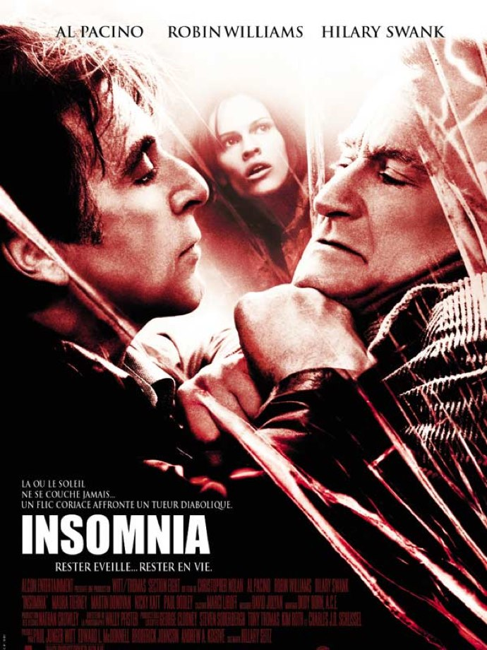
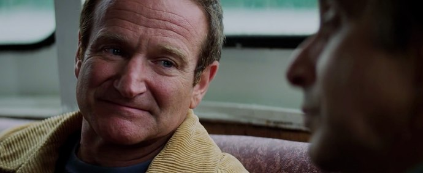

+++
type = "post"
titre = "<em>Insomnia</em>, Christopher Nolan"
title = "Insomnia, Christopher Nolan"
url = "/insomnia-nolan"
date = "2010-08-23T00:36:59"
Lastmod = "2015-06-13T13:05:48"
cover = "insomnia-al-pacino-nolan.jpg"
categorie = [ "À voir" ]
tag = [ "Mémoire", "Police", "Regret", "Thriller" ]
createur = [ "Christopher Nolan" ]
acteur = [ "Al Pacino", "Hilary Swank", "Martin Donovan", "Robin Williams" ]
annee = [ "2002" ]
weight = 2002
pays = [ "États-Unis" ]

+++

Deux ans après le bluffant jeu scénaristique proposé par Christopher Nolan dans <em><a href="/2010/08/10/memento-nolan/">Memento</a></em>, le réalisateur revient à un thriller plus classique… au moins en apparence. Car si la chronologie reprend ses droits dans <em>Insomnia</em>, les enjeux restent tout aussi faibles et importent peu. Ce qui intéresse encore et toujours Christopher Nolan, c&rsquo;est un homme torturé cette fois par la fatigue et les remords d&rsquo;une vie. Passionnant.

Will Dormer et Hap sont deux flics de Los Angeles envoyés dans le fin fond de l&rsquo;Alaska pour aider la police locale à résoudre un meurtre. On apprend vite que cette aide s&rsquo;apparente un peu à une mise à l&rsquo;ombre des deux hommes mouillés jusqu&rsquo;au cou dans des affaires internes de corruption. Les &laquo;&nbsp;bœufs-carottes&nbsp;&raquo; comme on les appelle de ce côté-ci de l&rsquo;Océan sont sur leur dos, enfin surtout sur celui de Hap et ce dernier veut collaborer avec eux. Léger problème, sa collaboration impliquera forcément Will, vieux flic brisé par une trop longue carrière. Légende du milieu étudiée par les jeunes recrues, il a cependant fait de nombreuses erreurs impardonnables aux yeux de la loi, même si elles ont été faites pour la bonne cause. Will aimerait mieux qu&rsquo;on laisse son passé là où il est, ce qui se comprend aisément, mais Hap, plus jeune, ne l&rsquo;entend pas de cette oreille et préfère collaborer pour s&rsquo;en tirer sans trop de problèmes. C&rsquo;est dans ce contexte tendu qu&rsquo;ils arrivent à &laquo;&nbsp;la Mecque de la Morue&nbsp;&raquo;, une petite ville d&rsquo;Alsaka accessible uniquement en hydravion et qui semble entourée de forêts vides à des kilomètres à la ronde. L&rsquo;enquête commence alors et avance rapidement sous l&rsquo;impulsion des deux policiers, mais lors d&rsquo;une course-poursuite dans le brouillard, Will tue Hap par erreur. Une longue descente aux enfers commence alors pour le policier qui a été vu par le tueur et ce dernier fait pression sur Will pour inculper un autre à sa place en échange de son silence.

<em>Insomnia</em> n&rsquo;est pas un thriller où le nom du tueur est le centre des enjeux. Si le film ne le dévoile pas d&rsquo;emblée, on ne tarde quand même pas à le voir, puis à connaître son identité. Son identité, ou même ses motivations ne sont donc pas vraiment des enjeux et d&rsquo;ailleurs le film ne précisera jamais vraiment les raisons qui ont conduit le meurtrier à passer à l&rsquo;acte, ni ses relations avec la victime. Pourquoi une jeune adolescente s&rsquo;est-elle entichée de cet auteur de romans policiers un peu minable ? Comment imaginer qu&rsquo;il n&rsquo;ait pu rien se passer entre eux ? Ces questions ne sont pas absentes du film, mais Christopher Nolan ne prend pas la peine d&rsquo;y répondre, comme si elles étaient vraiment bien peu intéressantes. <em>Insomnia</em> a beau sembler plus classique, avec son histoire scrupuleusement chronologique et assez simple, étant resserrée sur un seul homme et quasiment une seule intrigue, on décèle rapidement de nombreuses failles dans ce dispositif classique. Ce qui ne devait être qu&rsquo;une enquête de plus dans le long palmarès d&rsquo;un policier se révèle beaucoup plus que cela. Certes, il y a en permanence les agissements de la police des polices en arrière-plan, la mort de Hap venant à point nommé pour Will qui devient donc forcément un suspect. Mais, comme le titre l&rsquo;indique, il y a aussi l&rsquo;insomnie.

Le film s&rsquo;étend sur une poignée de jours, six ou sept environ. Une semaine pendant laquelle Will ne dort jamais vraiment. Il faut dire que ce pays très septentrional ne l&rsquo;aide pas :en été, il ne fait jamais nuit en Alaska. Dormir quand il fait grand jour et même soleil dehors, ce n&rsquo;est pas évident, même si apparemment pire que la nuit permanente de l&rsquo;hiver. <em>Insomnia</em> restitue bien les ambiances si particulières de ces espaces de bout du monde, les pertes de repères liées à l&rsquo;absence de cycles nocturnes, les lumières allumées dans les rues pour signaler la nuit, les interminables couchers de soleil qui offrent d&rsquo;ailleurs de sublimes lumières sur des paysages très photogéniques. On ressent également bien le vide de cette vie sans doute difficile et souvent noyée dans l&rsquo;alcool : les habitants sont peu nombreux et ont bien peu d&rsquo;activités possibles. Il pleut le plus souvent, et c&rsquo;est un pays mélancolique qui nous est présenté. Will a du mal à dormir à cause de cette lumière permanente et ses tentatives pour pallier la faiblesse des rideaux de sa chambre seront bien vaines. Mais ce n&rsquo;est pas la seule raison. <em>Insomnia</em>, au-delà du thriller et de l&rsquo;enquête, est d&rsquo;abord l&rsquo;histoire d&rsquo;un homme fatigué par la vie. Ces six jours sans dormir le conduisent certes à un état d&rsquo;épuisement tellement intense qu&rsquo;il a des hallucinations permanentes. Mais il est arrivé en Alaska déjà fatigué, les traits tirés. Sa vie d&rsquo;enquête et de meurtres l&rsquo;a abimé et à l&rsquo;heure des bilans, il se souvient surtout de ce qu&rsquo;il n&rsquo;aurait pas dû faire. Il y a en particulier cette affaire, il était sûr d&rsquo;avoir coincé le meurtrier d&rsquo;un petit garçon, mais les preuves n&rsquo;étaient pas suffisantes et il est allé ajouter du sang du garçon dans l&rsquo;appartement du meurtrier. Une image, des gouttes de sang qui tombent sur du tissu, revient sans cesse à son esprit, un souvenir qu&rsquo;il ne peut effacer et qui le tourmente. Décidément, la thématique de la mémoire est une constante chez Christopher Nolan.

<em>Insomnia</em> n&rsquo;est pas aussi bluffant que son prédécesseur. Le choix d&rsquo;une structure narrative classique est plus convenu et permet également au film d&rsquo;être plus accessible que les précédents travaux de Christopher Nolan. Ce film est sans doute son premier film vraiment grand public et le choix de faire jouer des stars aussi importantes qu&rsquo;Al Pacino ou Robin Williams n&rsquo;y est sans doute pas étranger. Grand public, certes, mais cela ne nuit en rien à la qualité d&rsquo;<em>Insomnia</em>, tenu de bout en bout d&rsquo;une main de maître comme le réalisateur a coutume de le faire dans tous ses films. Cette maîtrise est la caractéristique qui m&rsquo;impressionne le plus chez Nolan : elle n&rsquo;a l&rsquo;air de rien, comme ça, mais il est finalement rare de voir des films sûrs d&rsquo;eux, qui vont d&rsquo;un commencement à une fin sans dévier. Même avec <em>Insomnia</em>, pourtant porté par un scénario moins prenant, le réalisateur conserve son efficacité, ne laisse aucun temps mort, mais prend son temps pour instiller la mélancolie nécessaire au projet. Al Pacino est brillant dans ce rôle de vieux flic fatigué et il apporte indéniablement beaucoup au film.

Christopher Nolan gère sa carrière de la même manière qu&rsquo;il conduit ses films, d&rsquo;un pas assuré. <em>Insomnia</em> ajoute une brique à l&rsquo;ensemble, affirme l&rsquo;intérêt du réalisateur pour certaines thématiques comme la mémoire, déjà longuement abordée dans <em>Memento</em> ou même le sommeil qui reviendra dans <em><a href="/2010/07/17/inception-nolan/">Inception</a></em>. De film en film, les moyens à la disposition de Nolan augmentent, une tendance que son film suivant, <em>Batman Begins</em>, ne fera que confirmer. Mais cette augmentation n&rsquo;est pas l&rsquo;occasion pour le réalisateur se de reposer en refaisant le même film : <em>Insomnia</em> est unique dans l&rsquo;œuvre du Christopher Nolan, tout en s&rsquo;intégrant à l&rsquo;ensemble par les thèmes ou la réalisation. Beau travail, qui force le respect.

<h3>Vous voulez m&rsquo;aider ?</h3>
<ul>
<li><a href="http://www.amazon.fr/gp/product/B003Z421EG/ref=as_li_ss_tl?ie=UTF8&tag=leblogdenic07-21&linkCode=as2&camp=1642&creative=19458&creativeASIN=B003Z421EG">Acheter le film en Blu-Ray sur Amazon</a></li>
<li><a href="http://www.amazon.fr/gp/product/B00007K6JV/ref=as_li_ss_tl?ie=UTF8&tag=leblogdenic07-21&linkCode=as2&camp=1642&creative=19458&creativeASIN=B00007K6JV">Acheter le film en DVD sur Amazon</a></li>
<li><a href="http://itunes.apple.com/fr/movie/insomnia/id380832621">Acheter ou louer le film sur l&rsquo;iTunes Store</a></li>
</ul>

