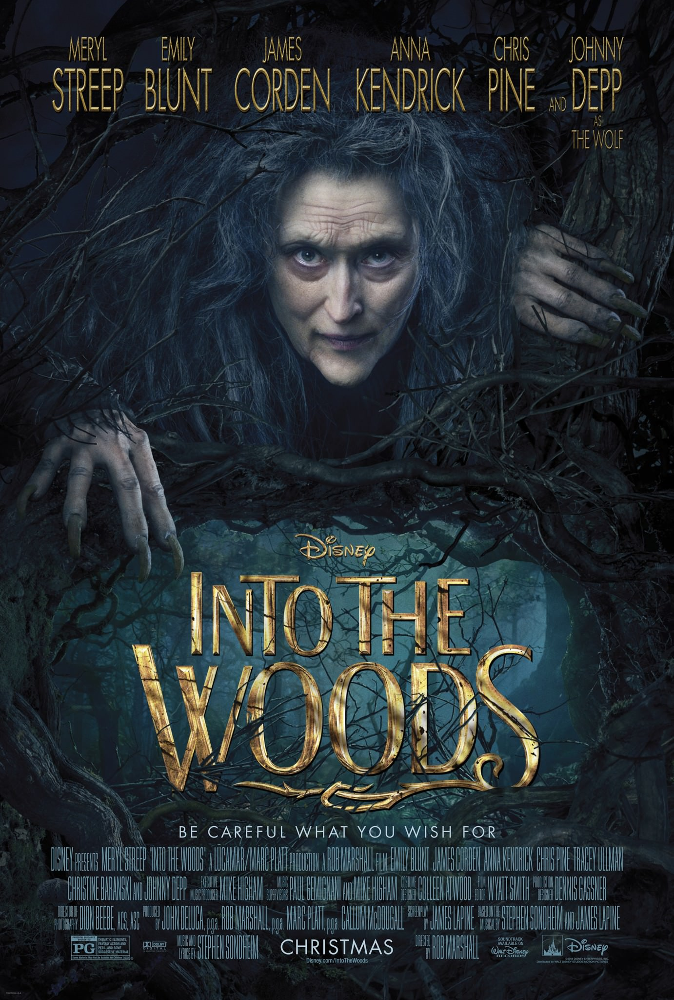
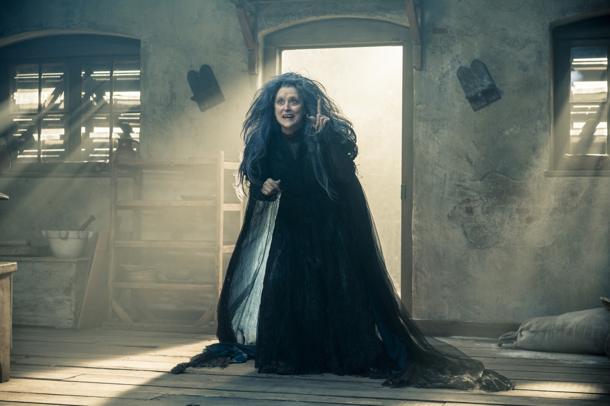
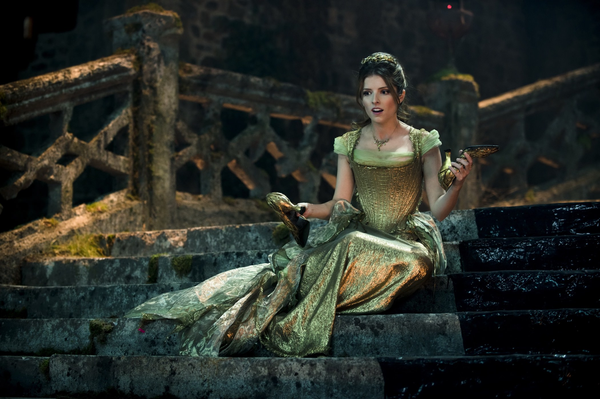

+++
type = "post"
titre = "<em>Into the Woods, Promenons-nous dans les bois</em>, Rob Marshall"
title = "Into the Woods, Promenons-nous dans les bois, Rob Marshall"
url = "/into-the-woods-promenons-nous-dans-les-bois-marshall"
date = "2015-02-03T23:55:18"
Lastmod = "2015-02-03T23:59:41"
cover = "into-the-woods-rob-marshall.jpg"
categorie = [ "À voir" ]
tag = [ "Adaptation musical", "Comédie musicale", "Conte", "Fantastique", "Kitsch", "Magie", "Parodie", "Princesse", "Sorcellerie", "Sorties du mois" ]
createur = [ "Rob Marshall" ]
acteur = [ "Anna Kendrick", "Chris Pine", "Emily Blunt", "James Corden", "Johnny Depp", "Meryl Streep" ]
annee = [ "2015" ]
weight = 2015
pays = [ "États-Unis" ]
original = "Into The Woods"

+++

<em>Into the Woods</em> était au départ une comédie musicale sortie à Broadway au milieu des années 1980 et qui a connu un immense succès auprès du public. Une adaptation au cinéma était dès lors inévitable, mais il a fallu attendre 2015 pour que ce conte revisité à partir des œuvres des frères Grimm sorte sur le grand écran. Derrière la caméra, le spécialiste des comédies musicales Rob Marshall naturellement ; devant, une palanquée de stars pour assurer le succès de cette adaptation signée Disney. À l&rsquo;arrivée, <em>Into the Woods, Promenons-nous dans les bois</em><a href="#fn-13069-1" rel="footnote">1</a> est un film musical kitschissime, mais qui assume totalement son côté ridicule et le contrecarre dans un premier temps par un second degré bienvenu. Dommage que ce bon départ soit contredit par une fin conventionnelle et à la morale d&rsquo;une lourdeur infinie…

Prenez tous les contes de Grimm que vous connaissez, de <em>Cendrillon</em> à <em>Raiponce</em>, en passant par <em>Jack et le Haricot Magique</em> et <em>Le Petit Chaperon Rouge</em>. Rassemblez-les vaguement avec un scénario qui n&rsquo;a pas beaucoup d&rsquo;importance, si ce n&rsquo;est faire une forme de liant. Ajoutez quelques chansons, mixez-bien le tout, vous obtiendrez <em>Into the Woods, Promenons-nous dans les bois</em>. Le principe de base est assez simple et il est même assez bête. Dès le début, Rob Marshall rappelle que l&rsquo;on est en présence d&rsquo;un film musical et on a ainsi une chanson qui présente chaque protagoniste. Certains sont bien identifiés avec les contes originaux — la petite fille avec son habit rouge qui veut porter du pain à sa grand-mère, ou encore la souillon qui doit faire avec une marâtre insupportable et ses deux filles qui le sont tout autant —, d&rsquo;autres sont des pièces rapportées. C&rsquo;est que le scénario veut lier le maximum de contes originaux que possible et il lui fallait une excuse pour cela : ce sera un couple de boulangers qui ne peut pas avoir d&rsquo;enfants à cause d&rsquo;un sort lancé plusieurs années auparavant par leur voisine, qui est aussi une terrible sorcière. Pour conjurer le sort, ils doivent rassembler une cape rouge, une mèche de cheveux blonds, une chaussure dorée et une vache blanche. Les trois premiers tissent le lien nécessaire avec trois contes, quant au quatrième, le scénario d&rsquo;<em>Into the Woods, Promenons-nous dans les bois</em> imagine une autre astuce : Jack, celui du haricot magique, se rend dans la forêt pour vendre la vache de la famille. Et voilà, la comédie musicale originale et Rob Marshall ont de quoi tisser une histoire autour de cette base.

Rassembler autant de contes différents et qui n&rsquo;ont rien à voir n&rsquo;a pas vraiment de sens, et le film en a bien conscience. Dans toute sa première partie, <em>Into the Woods, Promenons-nous dans les bois</em> a le bon sens de rester sur le mode parodique et le film parvient à arracher plusieurs sourires, à défaut d&rsquo;être vraiment drôle. Les personnages sont si caricaturaux, de leur costume à leurs attitudes, qu&rsquo;on ne peut pas les prendre au sérieux. Tout respire la parodie, bien loin des relectures au premier degré des contes qui se sont multipliées ces dernières années et c&rsquo;est aussi kitsch qu&rsquo;amusant. Dans ce contexte, les chansons ne sont pas gênantes, elles rendent cet univers encore plus impensable, ce qui est exactement ce qu&rsquo;il fallait. Rob Marshall culmine sur cette bonne lancée avec une scène pour le coup vraiment trop drôle où les deux princes charmants — oui, pour ce film, il en fallait au moins deux — chantent et dansent sur une cascade. C&rsquo;est d&rsquo;un ridicule assumé et Chris Pine et Billy Magnussen s&rsquo;en donnent à cœur joie, explosant même leur haut pour mieux mettre en avant leurs pectoraux saillants. Hélas, cette scène est la plus drôle du film, mais c&rsquo;est aussi celle où <em>Into the Woods, Promenons-nous dans les bois</em> bascule. Plus le long-métrage avance en effet, et plus il oublie qu&rsquo;il est une parodie et plus il devient sérieux. Sans perdre son kitsch et son absurdité, ce qui le place dans une position inconfortable. Parti sur de bonnes bases, Rob Marshall finit par nous ennuyer, malgré les prestations souvent excellentes de ses acteurs, Meryl Streep en tête. L&rsquo;actrice semble adorer jouer les sorcières maléfiques et elle le fait vraiment bien. À condition d&rsquo;apprécier ce genre de musique, la bande-originale extraite du spectacle de Broadway est également divertissante, avec quelques morceaux réussis. Malgré tout cela, on finit par s&rsquo;ennuyer et c&rsquo;est bien dommage.

Est-ce que le matériau de base était mauvais, ou est-ce l&rsquo;adaptation mise en image par Rob Marshall qui est fautive ? Qu&rsquo;importe, le bilan pour <em>Into the Woods, Promenons-nous dans les bois</em> n&rsquo;est pas aussi positif que sa première partie le laissait espérer, et c&rsquo;est bien dommage. Le récit aurait mieux fait de rester sur la parodie et de mieux exploiter certaines idées excellentes, comme la réaction de Cendrillon face au Prince charmant, ou bien encore le fait que le prince trompe immédiatement celle qu&rsquo;il est censé aimer. Disney oblige, le <em>musical</em> original a été largement aseptisé pour ce passage au grand écran. Dans ces conditions, pourquoi ne pas aller carrément vers la comédie ? <em>Into the Woods, Promenons-nous dans les bois</em> est dans un entre-deux intéressant, mais qui finit par le desservir, dommage.

<ol>
<li id="fn-13069-1">
La malédiction des titres français traduits n&rsquo;importe comment à encore frappé. Les producteurs n&rsquo;ont manifestement pas su choisir entre la version originale ou une traduction plutôt bonne — on comprenait bien l&rsquo;allusion aux contes avec « <em>Promenons-nous dans les bois</em> ». Ils n&rsquo;ont pas choisi, et on doit donc se farcir un titre à rallonge et mauvais.&#160;<a href="#fnref-13069-1" rev="footnote">&#8617;</a>
</li>
</ol>

