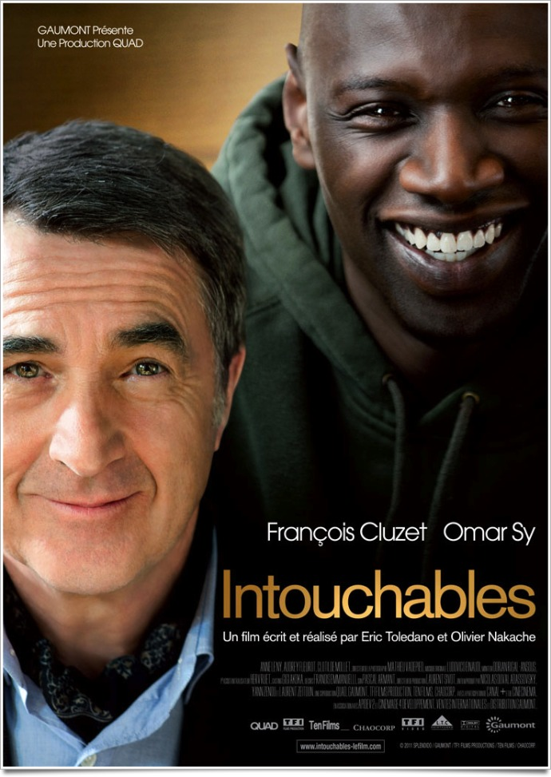
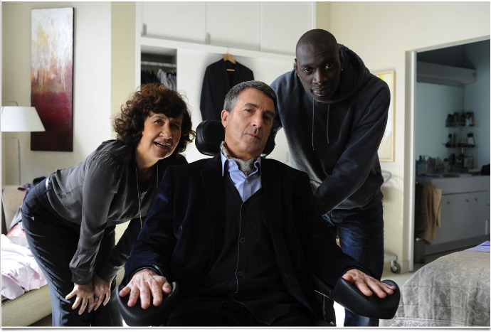
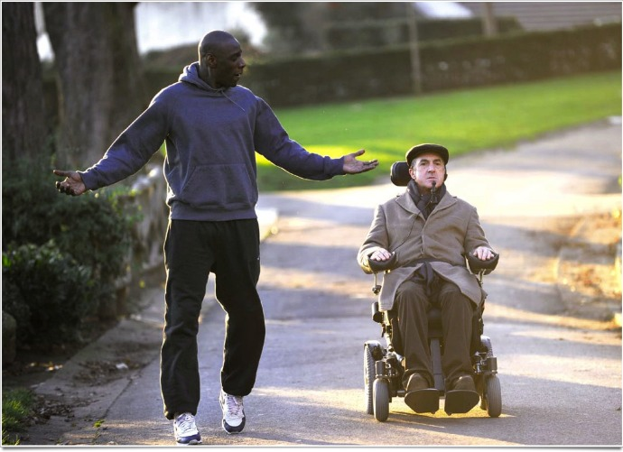

+++
titre = "<em>Intouchables</em>, Eric Toledano et Olivier Nakache"
title = "Intouchables, Eric Toledano et Olivier Nakache"
url = "/intouchables-toledano-nakache"
date = "2011-11-08T00:02:29"
Lastmod = "2014-12-07T18:36:37"
cover = "intouchables-sy-cluzet.jpg"
categorie = [ "À voir" ]
tag = [ "Comédie", "Drame", "Handicap", "Humour", "Maladie", "Société" ]
createur = [ "Eric Toledano", "Olivier Nakache" ]
acteur = [ "Anne Le Ny", "Audrey Fleurot", "François Cluzet", "Omar Sy" ]
annee = [ "2011" ]
weight = 2011
pays = [ "France" ]

+++

L&rsquo;histoire vraie d&rsquo;un richissime tétraplégique assisté par un jeune des banlieues. Un tel sujet avait de quoi faire frémir : toutes les composantes les plus casse-gueules du cinéma social à la française étaient réunies. Autant dire que je suis allé voir <em>Intouchables</em>, le dernier film d&rsquo;Eric Toledano et Olivier Nakache, à reculons. Je suis sorti de la salle le sourire aux lèvres, heureux d&rsquo;avoir passé deux heures en compagnie de ce duo improbable. Loin de tout misérabilisme, <em>Intouchables</em> est un film drôle et assez émouvant à la fois, une réussite.

Philippe est riche, très riche, mais un accident de parapente l&rsquo;a rendu presque totalement paraplégique. Seule la tête bouge encore, tout le reste est définitivement immobile. L&rsquo;homme est totalement dépendant et il embauche quelqu&rsquo;un pour l&rsquo;aider et être en permanence à ses côtés. La position est bien payée, mais difficile toutefois et les entretiens se multiplient régulièrement pour trouver quelqu&rsquo;un d&rsquo;autre. C&rsquo;est au cours d&rsquo;un de ces entretiens que Philippe fait la rencontre de Driss. Jeune homme des banlieues, il n&rsquo;est venu dans ce splendide hôtel particulier parisien que pour justifier sa position auprès des Assedics. Inutile de dire que Driss tranche par rapport au milieu et à son propriétaire, mais c&rsquo;est justement ça qui séduit Philippe. Ce dernier décide alors de l&rsquo;engager et Driss, à sa grande surprise, accepte le boulot et finit même par l&rsquo;apprécier. Entre les deux hommes se noue vite une histoire d&rsquo;amitié aussi forte qu&rsquo;elle était improbable sur le papier…

Tout film sur le handicap et sur des handicapés risque de tomber dans le pathos ou le misérabilisme. Celui-ci, en raison de son origine réelle, plus que tout autre sans doute. <em>Intouchables</em> l&rsquo;évite néanmoins en s&rsquo;en tenant constamment éloigné par le recours à la comédie. La maladie n&rsquo;est jamais considérée par le film comme un problème, elle au contraire constamment tournée en dérision. Driss est un personnage toujours enjoué qui a l&rsquo;humour manifestement facile et il ne se gêne pas pour se moquer de son employeur. C&rsquo;est cette franchise, cette absence de gants quand il évoque la tétraplégie, qui plait immédiatement à Philippe. Il a envie d&rsquo;être bousculé dans son quotidien et quand Driss part à un moment du film, il se laisse totalement aller. L&rsquo;humour est peut-être un élément clé de sa survie et <em>Intouchables</em> est à cet égard un film vraiment drôle. S&rsquo;ils ne parviennent pas toujours à éviter un côté film à sketchs, Eric Toledano et Olivier Nakache réussissent à faire rire de bon cœur la salle tout en évoquant un sujet grave et c&rsquo;est déjà beaucoup. Par certains aspects, <em>Intouchables</em> rappelle un peu <em><a href="http://voiretmanger.fr/2010/12/14/oxygene-van-nuffel/">Oxygène</a></em>, film flamand sur la mucoviscidose : on retrouve cette même volonté de vivre et de rire malgré la maladie qui est ici aussi bien restituée.

<em>Intouchables</em> est un film drôle, très drôle même, mais Eric Toledano et Olivier Nakache ont réussi malgré tout à apporter à leur film une véritable touche d&rsquo;émotion. Entre Philippe et Driss se noue une véritable relation d&rsquo;amitié qui les prend presque par surprise. Ces deux hommes n&rsquo;ont rien à voir, ils n&rsquo;ont rien en commun si ce n&rsquo;est peut-être l&rsquo;humour. Ils viennent de deux milieux très différents, mais Philippe s&rsquo;amuse du regard neuf qu&rsquo;il juge rafraichissant porté par Driss ; ce dernier au contraire est fasciné par la richesse de Philippe, certes, mais aussi sa culture et peut-être sa gentillesse. Peu à peu, les deux hommes apprennent à se connaître et à se respecter et ce qui n&rsquo;était au départ qu&rsquo;une excuse pour les Assedics puis un vrai travail devient vite beaucoup plus que cela. Quand le film se termine, l&rsquo;amitié entre les deux est profonde et réelle et on sent que ce n&rsquo;est pas le handicap qui retient Driss, mais plutôt Philippe, l&rsquo;homme. Cette touche d&rsquo;émotion sait rester discrète, mais elle est bienvenue : <em>Intouchables</em> n&rsquo;est pas qu&rsquo;une grossière comédie, c&rsquo;est aussi un drame touchant. On regrette un peu les passages dans la cité d&rsquo;origine de Driss qui sonnent un peu comme des moments obligés et qui constituent des scènes un peu forcées. Fort heureusement, Eric Toledano et Olivier Nakache ont la bonne idée de ne pas trop insister sur ses points, évitant de tomber dans l&rsquo;écueil du film politique. Reste l&rsquo;humour et surtout l&rsquo;amitié entre Philippe et son employé.

Eric Toledano et Olivier Nakache sont des cinéastes populaires et <em>Intouchables</em> est également un film populaire qui assume d&rsquo;ailleurs ce statut. Visuellement, leur dernier film n&rsquo;innove pas vraiment et ne propose pas de mise en scène complexe et pour cause, ce n&rsquo;est pas le propos. <em>Intouchable</em> n&rsquo;est pas qu&rsquo;un vulgaire téléfilm néanmoins, il s&rsquo;agit d&rsquo;un véritable film de qualité, avec quelques plans très réussis. Les performances des deux acteurs sont bien évidemment essentielles et ni Omard Sy, ni François Cluzet ne déméritent. Ce dernier est évidemment époustouflant dans ce rôle, toujours difficile à tenir, mais on retient encore plus particulièrement le premier. Bien loin du <em>SAV des Émissions</em> de Canal Plus, il compose ici un rôle tout en finesse, une vraie réussite.

<em>Intouchables</em> n&rsquo;est pas le chef-d&rsquo;œuvre de l&rsquo;année, incontestablement, mais il n&rsquo;en a pas non plus l&rsquo;ambition. Eric Toledano et Olivier Nakache signent là un film drôle et réussi. Le handicap est vu avec humour et c&rsquo;est vraiment amusant, tandis que la relation d&rsquo;amitié entre les deux hommes est bien rendue. Non, ce n&rsquo;est pas un chef-d&rsquo;œuvre, mais c&rsquo;est un film plaisant que l&rsquo;on recommandera sans peine : ce soir-là, la salle a ri de bon cœur pendant deux heures, ce qui est déjà pas mal…

<h3>Vous voulez <a href="http://voiretmanger.fr/soutien/">m&rsquo;aider</a> ?</h3>
<ul>
<li><a href="http://www.amazon.fr/gp/product/B0064JV4RY/ref=as_li_ss_tl?ie=UTF8&amp;tag=leblogdenic07-21&amp;linkCode=as2&amp;camp=1642&amp;creative=19458&amp;creativeASIN=B0064JV4RY">Acheter le film en Blu-Ray sur Amazon</a></li>
<li><a href="http://www.amazon.fr/gp/product/B0064JV4LU/ref=as_li_ss_tl?ie=UTF8&amp;tag=leblogdenic07-21&amp;linkCode=as2&amp;camp=1642&amp;creative=19458&amp;creativeASIN=B0064JV4LU">Acheter le film en DVD sur Amazon</a></li>
<li><a href="https://itunes.apple.com/fr/movie/intouchables/id494842667">Acheter ou louer le film sur l&rsquo;iTunes Store</a></li>
</ul>

