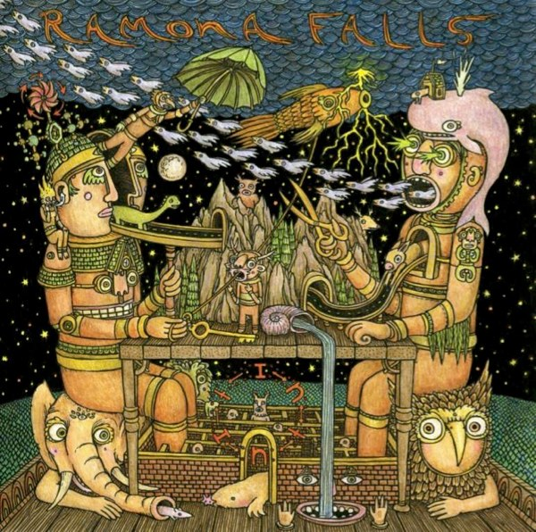

+++
type = "post"
titre = "Intuit, Ramona Falls"
title = "Intuit, Ramona Falls"
url = "/intuit-ramona-falls"
date = "2010-01-11T21:01:32"
Lastmod = "2010-02-04T10:30:24"
cover = ""
categorie = [ "Musique" ]
tag = [ "Rock", "Top des blogueurs" ]
createur = [ "Brent Knopf" ]
annee = [ "2009" ]
weight = 2009
pays = [ "États-Unis" ]

+++

Je n&rsquo;ai découvert <em>Intuit</em> des Ramona Falls que très récemment, à l&rsquo;occasion du <a href="http://www.topdesblogueurs.fr/">top des blogueurs 2009</a>. Le premier album du classement m&rsquo;était inconnu, cela ne pouvait pas durer et j&rsquo;ai alors acheté l&rsquo;album sans jamais l&rsquo;avoir précédemment écouté. Depuis, il quitte rarement ma playlist iTunes&#8230; Attention, voilà un album à ne pas rater et un artiste (Brent Knopf) à suivre !

La première décennie de ce nouveau siècle (et millénaire) fut sans aucun doute placée, concernant la musique, sous le signe du mélange. Les genres ont définitivement explosé et Ramona Falls ne fait pas exception à la règle. Je n&rsquo;aime pas les classements et avec des albums comme <em>Intuit</em>, je suis bien en peine pour faire ne serait-ce qu&rsquo;un rangement. Dans la grosse catégorie fourre-tout &laquo;&nbsp;Rock&nbsp;&raquo; dans iTunes, &laquo;&nbsp;expérimental&nbsp;&raquo; et &laquo;&nbsp;indie rock&nbsp;&raquo; selon les <a href="http://www.lastfm.fr/music/Ramona+Falls/+tags">utilisateurs de Last.fm</a>. Mais faut-il vraiment classer Ramona Falls ?

La musique de Ramona Falls est en tout cas également complexe à définir. À l&rsquo;oreille, elle semble totalement naturelle, mais si l&rsquo;on s&rsquo;y penche de plus près, on découvre une musique polymorphe, mêlant des instruments variés dans des titres aux structures pas si simples. Les instruments s&rsquo;accumulent pour former une bande-son tantôt riche, tantôt au contraire minimaliste, avec seulement une guitare et la voix sur &laquo;&nbsp;<em>Diamond Shovel</em>&nbsp;&raquo; qui est le titre de l&rsquo;apaisement après un album riche en montées en puissance. Le ton peut ainsi brusquement changer, un instrument faire son apparition et le cours de la chanson en est transformée. &laquo;&nbsp;Expérimental&nbsp;&raquo; me semble vraiment exagéré, mais il est vrai que cela dépend du référentiel. Les sentiers battus de la chanson de trois minutes avec couplets/refrains faciles à identifier ne sont pas vraiment la marque de fabrique de Ramona Falls, et c&rsquo;est tant mieux.

Les voix ont une place bien particulière. Il y a celle du chanteur, et il y a celle des chœurs, dont la présence est parfois remarquée, je pense notamment à &laquo;&nbsp;<em>Always Right.</em>&nbsp;&raquo; J&rsquo;ai toujours été un grand amateur des artistes &laquo;&nbsp;à voix&nbsp;&raquo;, ceux qui ont une voix particulière et reconnaissable entre mille. Certains artistes me plaisent uniquement pour leur voix. Brent Knopf ne fait pas exception, même si son album est bien plus qu&rsquo;une voix. Cette dernière me semble en tout cas très belle, plaisante à l&rsquo;oreille et efficace.

Plus le temps passe, plus j&rsquo;écoute des musiques différentes (et souvent complètement dingues), plus je me dis que la perfection en musique est atteinte quand l&rsquo;auditeur est frappé par la transparence de ce qu&rsquo;il entend, comme si la musique s&rsquo;imposait d&rsquo;elle-même. Mais en même temps, derrière cette transparence se dévoile au fil des écoutes une complexité qui permet à la musique de ne pas lasser, de sorte qu&rsquo;après plusieurs écoutes, on peut encore découvrir de nouvelles choses, une note, une composition… <em>Intuit</em> entre parfaitement dans cette catégorie : dès la première écoute, on accroche à la musique, on enregistre très vite des mélodies que l&rsquo;on se surprend vite à siffloter. Mais l&rsquo;album se déroule ensuite, morceau après morceau, on repère les structures, on entend les mélodies, les voix se mêler… Peu à peu, c&rsquo;est un album virtuose qui se dévoile, sans jamais perdre de sa beauté J&rsquo;ai dépassé les vingt écoutes et je ne me suis pas encore lassé.

Comme j&rsquo;ai toujours autant de mal à écrire sur la musique, je m&rsquo;arrête là. D&rsquo;autres blogueurs ont déjà admirablement écrit sur Intuit, à commencer par <a href="http://www.smahut.com/BlogQuenelle/2009/09/04/ramona-falls-intuit-2009/">Thibault</a> qui évoquait (en septembre<a href="#footnote_0_2460" id="identifier_0_2460" class="footnote-link footnote-identifier-link" title="Il m&rsquo;en a fallu du temps pour d&eacute;couvrir l&rsquo;album&nbsp;!">1</a>), et l&rsquo;on ne saurait mieux dire, &laquo;&nbsp;<em>un compositeur formidable, capable de faire apparaître la plus simple et pure des beautés au sein d’un environnement sonore riche et instable.</em>&nbsp;&raquo; <a href="http://www.playlistsociety.fr/2009/12/ramona-falls-intuit-8510.html">Benjamin</a> a également rédigé un article très personnel et beau sur <em>Intuit</em>.

Si l&rsquo;album est sorti aux États-Unis depuis août 2009, il ne sortira en France qu&rsquo;en 2010. Il est disponible en import chez certains marchands ou carrément chez <a href="http://www.barsuk.com/shop/bark090">la maison de disque</a>. Sinon, les joies d&rsquo;Internet permettent de le trouver <a href="http://www.tunespro.com/album/47626/ramona-falls/intuit">légalement</a><a href="#footnote_1_2460" id="identifier_1_2460" class="footnote-link footnote-identifier-link" title="Enfin, je suppose, je ne comprends pas comment on peut vendre des albums l&eacute;galement &agrave; m&ecirc;me pas 2&nbsp;$&hellip; La qualit&eacute; n&rsquo;est pas extra cependant, il faut bien une contrepartie quelque part.">2</a> et pour une bouchée de pain.

<ol class="footnotes"><li id="footnote_0_2460" class="footnote">Il m&rsquo;en a fallu du temps pour découvrir l&rsquo;album ! [<a href="#identifier_0_2460" class="footnote-link footnote-back-link">&#8617;</a>]</li><li id="footnote_1_2460" class="footnote">Enfin, je suppose, je ne comprends pas comment on peut vendre des albums légalement à même pas 2 $&#8230; La qualité n&rsquo;est pas extra cependant, il faut bien une contrepartie quelque part. [<a href="#identifier_1_2460" class="footnote-link footnote-back-link">&#8617;</a>]</li></ol>
