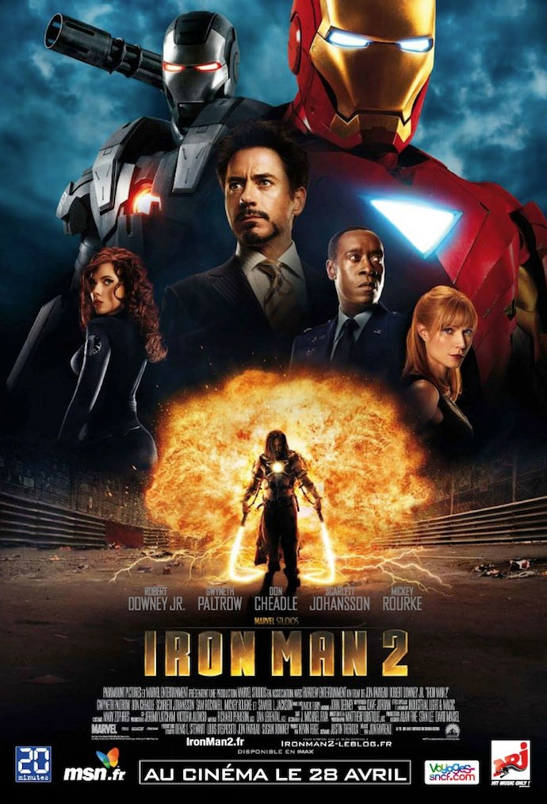
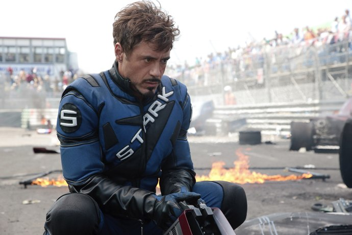
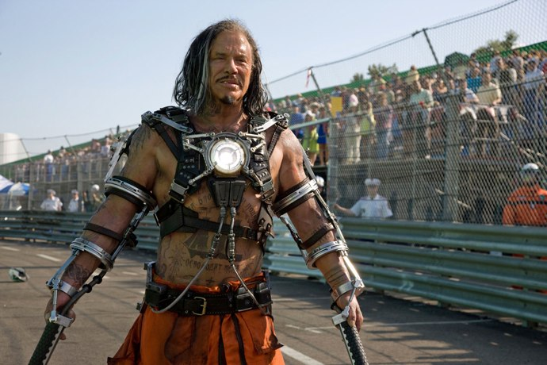
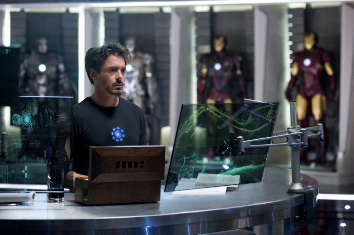

+++
titre = "<em>Iron Man 2</em>, Jon Favreau"
title = "Iron Man 2, Jon Favreau"
url = "/iron-man-2-favreau"
date = "2010-04-29T00:53:52"
Lastmod = "2015-02-26T00:08:59"
cover = "iron-man-2-favreau.jpg"
categorie = [ "À voir" ]
tag = [ "Avengers", "Blockbuster", "Comics", "Humour", "Iron Man", "Société", "Vite oublié" ]
createur = [ "Jon Favreau" ]
acteur = [ "Don Cheadle", "Mickey Rourke", "Robert Downey Jr", "Samuel L Jackson", "Scarlett Johansson" ]
annee = [ "2010" ]
weight = 2010
saga = [ "Avengers", "Iron Man" ]
pays = [ "États-Unis" ]

+++

Parmi les nombreuses adaptations de comics qui ont déferlé ces dernières années sur grand écran, celle d&rsquo;<a href="http://voiretmanger.fr/2012/01/18/iron-man-favreau/" title="Iron Man, Jon Favreau"><em>Iron Man</em></a> m&rsquo;avait semblé de très bonne qualité, avec un bon équilibre entre action, humour tout en faisant la part belle aux problématiques désormais inévitables autour de la condition de super héros. J&rsquo;espérais et craignais beaucoup du second opus, les suites étant rarement de bonnes surprises, mais je n&rsquo;ai pas été déçu. <em>Iron Man 2</em> ne brille ni par son originalité, ni par une réalisation de maître, mais c&rsquo;est assurément un divertissement de qualité.

À la fin d&rsquo;<em>Iron Man</em>, les États-Unis (donc le monde entier, il va de soi) découvraient qui était réellement Iron Man. Belle fin pour un blockbuster, pas fermée évidemment, mais pas trop ouvertement ouverte et intéressante. Qu&rsquo;allait-il pouvoir se passer ensuite, maintenant que les États-Unis (et donc le monde, toujours) avaient un héros pour les protéger ? Tout l&rsquo;épisode 2 tourne autour de cette question : peut-on faire confiance à un seul homme, fut-il Iron Man, pour protéger un État ? Des intérêts privés — ceux de Stark Enterprises, compagnie d&rsquo;armement appartenant à Tony Stark — peuvent-ils protéger un État ? Ce dernier, à travers son armée, ne devrait-il pas plutôt prendre en charge cette défense en récupérant à son compte les technologies ? Le film s&rsquo;ouvre d&rsquo;ailleurs très adroitement sur successivement deux évènements : l&rsquo;ouverture des expositions Stark, équivalent modernisé des Expositions Universelles européennes, pour lesquels le héros national fait son véritable show sur AC/DC ; une audition organisée par le gouvernement américain pour demander à Stark de se justifier et tenter de lui imposer de livrer son savoir et surtout ses armes à l&rsquo;armée américaine par le biais d&rsquo;un concurrent.

Dans les deux cas, Iron Man tout puissant se montre, fait le pitre et amuse la galerie avec une efficacité redoutable. Tony Stark a le sens de la répartie et joue sur son image de beau gosse qui fait craquer l&rsquo;Amérique tout entière. Pourtant, <em>Iron Man 2</em> dévoile d&rsquo;emblée une faille dans ce show bien huilé : le super héros fait plusieurs tests sanguins et les résultats ne font qu&rsquo;empirer. On comprend vite que l&rsquo;utilisation de sa carapace et surtout du cœur miracle à la couleur bleutée sont autant les causes de sa survie que celles de sa mort. Plus il l&rsquo;utilise, plus la qualité de son sang se dégrade et Tony sent qu&rsquo;il n&rsquo;en a plus pour longtemps. Il pavane donc comme si c&rsquo;étaient ses derniers instants, et c&rsquo;est aussi ce qui le conduit à piloter la Formule 1 de son entreprise à Monaco et donc à rencontrer le grand méchant du film, car il en faut toujours un, Whiplash, un russe pas commode. Whiplash veut venger son père coauteur des découvertes du père de Stark oublié et mort dans la misère noire. Pour le venger, il attaque Tony Stark avec ses propres armes et la même technologie, prenant ce dernier de court.

<em>Iron Man 2</em> est très classique dans sa structure narrative. Le superhéros doit affronter un méchant à sa hauteur, tandis qu&rsquo;il doit affronter ses propres démons comme c&rsquo;est désormais la règle. Le méchant est dans la pure tradition des comics, d&rsquo;autant que c&rsquo;est un Russe et que le film réveille quelques habitudes dignes de l&rsquo;époque de la guerre froide qui sont plutôt amusantes. Même si l&rsquo;ennemi reste toujours implicite et n&rsquo;est jamais nommé, on sent comme un retour à l&rsquo;affrontement entre blocs de l&rsquo;après-guerre, alors que le terrorisme n&rsquo;est jamais évoqué par exemple. Pas grand chose à dire de plus sur ce méchant, si ce n&rsquo;est qu&rsquo;il est très moche, diabolique et aussi extrêmement doué. C&rsquo;est un peu un double négatif de Tony Stark, un double qui agit dans l&rsquo;ombre en commandant à distance des drones.

Mais Iron Man ne peut se concentrer sur un seul ennemi puisqu&rsquo;il est aussi son propre ennemi, un ennemi insidieux puisqu&rsquo;il prend forme du cœur miraculeux que Tony place sur sa poitrine, ce mini-réacteur bleuté qui lui donne aussi une force surhumaine en alimentant son armure et lui a permis de survivre. Pourtant, la matière qu&rsquo;il contient le consume aussi petit à petit et il assiste impuissant à sa propre mise à mort. <em>Iron Man 2</em> est de ce fait un film également mélancolique et cela se ressent dès le départ : sous la carapace de l&rsquo;homme d&rsquo;affaires à l&rsquo;égo surdimensionné se cache en fait un être fragile et souffrant seul puisqu&rsquo;il ne l&rsquo;a dit à personne, si ce n&rsquo;est à son ordinateur. Toute la première partie du film est ainsi une lente descente aux enfers qui commence par l&rsquo;humiliation publique de Monaco pour atteindre un point culminant avec sa soirée d&rsquo;anniversaire qui voit la destruction d&rsquo;une bonne partie de sa maison à cause d&rsquo;un combat avec son ami militaire. Après cela, ça n&rsquo;est plus qu&rsquo;une loque incapable de se battre que seule une mystérieuse organisation secrète parviendra à remotiver par le biais de son père. Il y parvient juste à temps pour le traditionnel combat final où il doit affronter, entre autres, des droïdes construits sur son modèle. Ces ennemis-là sont beaucoup moins intéressants que l&rsquo;idée du réacteur à la fois condition de sa survie et mal intérieur qui le ronge.

Si <em>Iron Man 2</em> brasse des thématiques de fond — la relation entre le superhéros et une nation, ou encore, plus convenue, les relations père-fils —, le film n&rsquo;en oublie pas pour autant son efficacité. Le réalisateur tient le rythme de bout en bout, il n&rsquo;y a pas une seconde de vide et c&rsquo;est tant mieux. Avant même le générique de début, on entend une conférence sur le statut d&rsquo;Iron Man, avant d&rsquo;embrayer directement sur le méchant, puis d&rsquo;entrer dans le vif du sujet avec l&rsquo;ouverture de l&rsquo;exposition Stark. Les combats ne sont pas très nombreux, mais ils sont réguliers et structurent efficacement le film. C&rsquo;est peut-être un blockbuster surveillé de près par les studios et Marvel, il n&rsquo;en reste pas moins que c&rsquo;est un modèle d&rsquo;efficacité. Comme pour le premier épisode, <em>Iron Man 2</em> est imprégné d&rsquo;un humour tournant beaucoup autour du couple Tony/Pepper. L&rsquo;amour est évidemment un enjeu et on s&rsquo;amuse beaucoup à voir Tony se faire réprimander comme un petit garçon parce qu&rsquo;il aimerait bien approcher d&rsquo;un peu plus près une fille.

Le film doit beaucoup à celui qui incarne Iron Man, Robert Downey Jr, toujours aussi bon et efficace pour cacher sa douleur derrière l&rsquo;humour ou le spectacle. Son jeu n&rsquo;est pas très original, on pense parfois au Sherlock Holmes qu&rsquo;il <a href="http://voiretmanger.fr/2010/02/06/sherlock-holmes-ritchie/">incarnait chez Ritchie</a>, mais il est très bien venu dans ce cas. Les autres acteurs ne sont pas en reste, en tout cas en ce qui concerne les rôles masculins (Scarlett Johansson n&rsquo;est pas bien passionnante et sert apparemment surtout à attirer la gent masculine dans les salles). Mikey Rourke est très bien en Russe patibulaire et évidemment, il y a Samuel L. Jackson fidèle à lui-même dans son rôle habituel, rien à dire, il en impose.

<em>Iron Man 2</em> n&rsquo;est certes pas un modèle d&rsquo;originalité ou de légèreté. Mais attend-on vraiment de l&rsquo;adaptation au cinéma d&nbsp;&raquo;un comics de l&rsquo;originalité ou de la légèreté ? Ce film est un divertissement grand public, et un bon. On ne s&rsquo;ennuie pas une seule seconde, c&rsquo;est effectivement <a href="http://voiretmanger.fr/tag/vite-oublie/">vite oublié</a>, mais qu&rsquo;importe. Je regretterai juste, à titre personnel, le manque flagrant de titres d&rsquo;AC/DC alors que l&rsquo;on nous promettait une bande originale composée par les Australiens. Quelle déception de ne les avoir entendus que deux ou trois fois sur l&rsquo;ensemble du film !

La blogosphère n&rsquo;a pas tellement apprécié ce Iron Man cuvée 2010… Déception ainsi chez <a href="http://www.filmosphere.com/2010/04/critique-iron-man-2-2010/">Filmosphère</a> (malgré une note élevée, comme quoi, les notes, c&rsquo;est le mal) où, manifestement, on attendait beaucoup plus du film. Même topo sur <a href="http://www.cinemateaser.com/?p=8578">Cinemateaser</a>, par contre je suis tout à fait d&rsquo;accord avec <a href="http://www.critikat.com/Iron-Man-2.html">Critikat</a> qui livre une nouvelle fois une analyse très fine du film.

(article 200 du blog !)

<h3>Vous voulez m&rsquo;aider ?</h3>
<ul>
<li><a href="http://www.amazon.fr/gp/product/B001E08TVM/ref=as_li_ss_tl?ie=UTF8&#038;tag=leblogdenic07-21&#038;linkCode=as2&#038;camp=1642&#038;creative=19458&#038;creativeASIN=B001E08TVM">Acheter le film en Blu-Ray sur Amazon</a></li>
<li><a href="http://www.amazon.fr/gp/product/B001E08TVW/ref=as_li_ss_tl?ie=UTF8&#038;tag=leblogdenic07-21&#038;linkCode=as2&#038;camp=1642&#038;creative=19458&#038;creativeASIN=B001E08TVW">Acheter le film en DVD sur Amazon</a></li>
<li><a href="http://www.amazon.fr/gp/product/B005A8E7TC/ref=as_li_ss_tl?ie=UTF8&#038;tag=leblogdenic07-21&#038;linkCode=as2&#038;camp=1642&#038;creative=19458&#038;creativeASIN=B005A8E7TC">Acheter le coffret <em>Iron Man 1</em> et <em>Iron Man 2</em> en DVD sur Amazon</a></li>
<li><a href="http://itunes.apple.com/fr/movie/iron-man/id369765796">Acheter le film sur l&rsquo;iTunes Store</a></li>
</ul>

