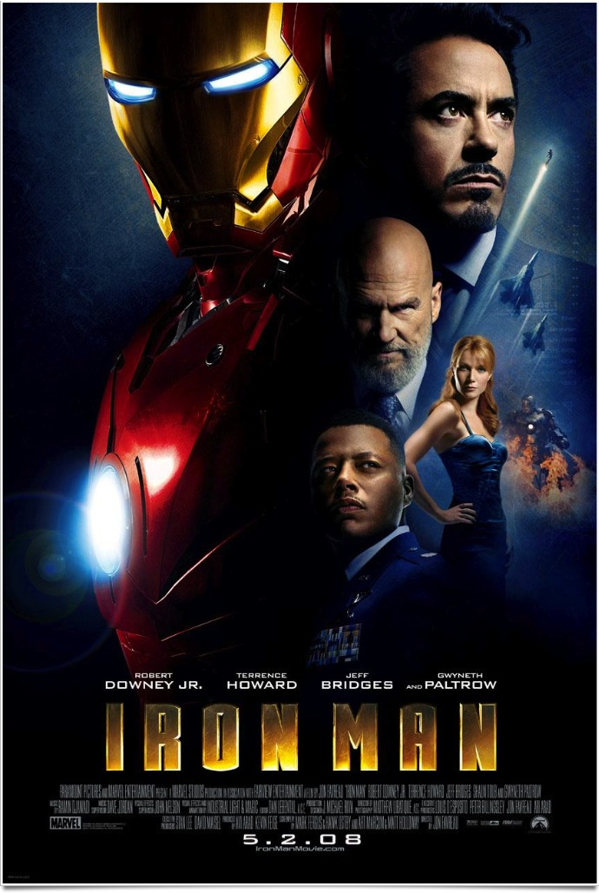
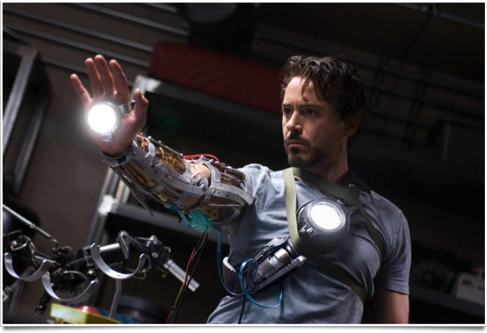
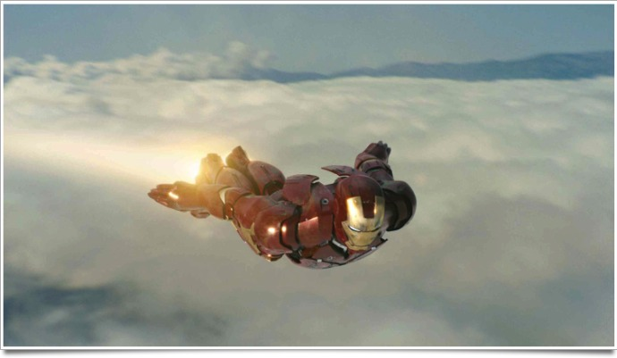

+++
type = "post"
titre = "<em>Iron Man</em>, Jon Favreau"
title = "Iron Man, Jon Favreau"
url = "/iron-man-favreau"
date = "2012-01-18T00:15:11"
Lastmod = "2015-04-26T17:43:11"
cover = "iron-man-robert-downey-jr.jpg"
categorie = [ "À voir" ]
tag = [ "Avengers", "Blockbuster", "Comics", "Humour", "Iron Man", "Superhéros" ]
createur = [ "Jon Favreau" ]
acteur = [ "Gwyneth Paltrow", "Jeff Bridges", "Robert Downey Jr", "Terrence Howard" ]
annee = [ "2008" ]
weight = 2008
saga = [ "Avengers", "Iron Man" ]
pays = [ "États-Unis" ]

+++

Jon Favreau ouvre avec <em>Iron Man</em> la lente marche vers <a href="/saga/avengers/">les <em>Avengers</em></a>. Cette nouvelle adaptation d&rsquo;un comics Marvel propose un cocktail qui marche d&rsquo;autant mieux qu&rsquo;il est ici très bien dosé : une bonne dose d&rsquo;action, de l&rsquo;humour et un superhéros qui doute de lui et qui n&rsquo;agit pas mécaniquement. Le résultat est parfaitement divertissant, même si <em>Iron Man</em> peut pâtir de l&rsquo;effet film d&rsquo;introduction.

Tony Stark est à la tête d&rsquo;un empire, une énorme entreprise qui produit des armes pour le compte de l&rsquo;armée américaine, entre autres. Il est ainsi riche, très riche et c&rsquo;est un homme mondain qui aime se faire plaisir. Pour lui, les armes ne sont qu&rsquo;un moyen comme un autre de gagner sa vie et il ne les prend pas vraiment au sérieux. Quand il présente la dernière création de son entreprise à l&rsquo;armée américaine dans un pays qui ressemble fort à l&rsquo;Afghanistan, il le fait avec les lunettes de soleil, comme une star qui présente sa dernière œuvre. C&rsquo;est alors qu&rsquo;il est fait prisonnier par un groupe de terroristes et qu&rsquo;il est emprisonné dans une grotte. Pendant deux mois, il va construire un moyen de s&rsquo;évader et ce moyen va aussi l&rsquo;amener à changer en profondeur. Iron Man naît dans cette grotte à l&rsquo;autre bout du monde…

Iron Man est un superhéros intéressant à plus d&rsquo;un titre. À l&rsquo;image de Batman, il n&rsquo;a pas droit à des superpouvoirs surnaturels, mais il construit son personnage grâce à sa fortune et des techniques connues et presque normales. Contrairement à Batman toutefois, il construit lui-même l&rsquo;armure volante qui fait de lui un superhéros. <em>Iron Man</em> prend beaucoup de soin à détailler la naissance du héros et le film de Jon Favreau est à cet égard assez proche de <em><a href="/2010/08/30/batman-begins-nolan/">Batman Begins</a></em>. On découvre d&rsquo;abord le personnage odieux de Tony Stark dans son quotidien, avant de le retrouver au fin fond de cette grotte sombre et humide où il construit sa première combinaison. On le voit alors la bricoler avec tout ce qu&rsquo;il a sous la main et le résultat est encore loin de l&rsquo;habit rouge et or que l&rsquo;on connaît si bien. Il s&rsquo;agit d&rsquo;un ensemble disparate de pièces de métal grossièrement assemblées. Ce n&rsquo;est pas sophistiqué, mais ce n&rsquo;est qu&rsquo;un brouillon : ce travail est vraiment bien vu, il renforce le réalisme du héros exactement comme le faisait <em>Batman Begins</em>. Rentré chez lui, Tony continue ses expériences et affine peu à peu sa combinaison après avoir fait des essais : il n&rsquo;a pas prévu d&rsquo;emblée le problème de la glace qui peut se former en altitude par exemple. <em>Iron Man</em> est le témoignage d&rsquo;un travail en cours, un travail qui hésite pour un superhéros qui le devient presque par erreur, au cours d&rsquo;expérimentations. Originalité supplémentaire du personnage : Iron Man se dévoile finalement et c&rsquo;est l&rsquo;une des rares fois où l&rsquo;identité derrière le masque d&rsquo;un superhéros est connue.

Comme tous les superhéros, Iron Man n&rsquo;existe que pour une noble cause. Là où cela devient intéressant, c&rsquo;est que Tony Stark est à la fois un superhéros et un constructeur d&rsquo;armes de destruction massive. Quand il apprend que son entreprise a vendu en douce des armes aux ennemis des États-Unis qu&rsquo;il pensait défendre, quelque chose change pour toujours et Tony Stark devient superhéros. Sans pour autant parler de film politique, <em>Iron Man</em> propose malgré tout un angle original où l&rsquo;armée américaine en prend pour son grade. Le film montre le superhéros au combat essentiellement dans ce pays indéterminé que l&rsquo;on peut résumer à l&rsquo;Afghanistan alors qu&rsquo;aux États-Unis, il ne combat que son ex-mentor qui entend le supprimer. <em><a href="/2010/04/29/iron-man-2-favreau/">Iron Man 2</a></em> est de ce fait beaucoup plus conventionnel : le superhéros existe et il combat son ennemi. Dans ce film introductif, la lutte du superhéros n&rsquo;est pas encore au centre du film, elle est presque secondaire et elle s&rsquo;inscrit parfaitement dans une histoire américaine qui pourrait être crédible. Le film de Jon Favreau bénéficie de fait d&rsquo;une certaine aura réaliste, même s&rsquo;il présente aussi de nombreux éléments qui relèvent purement de la science-fiction.

Jon Favreau ne dispose pas d&rsquo;un style particulièrement marqué, mais <em>Iron Man</em> est un blockbuster très efficace, même s&rsquo;il pêche peut-être par un début assez lent. L&rsquo;introduction au superhéros est assez longue puisque le cinéaste prend, comme Christopher Nolan, le temps de mettre en place l&rsquo;intrigue. On apprécie ou non ce soin apporté aux premières explications, mais un rythme intense reprend vite le dessus quand Iron Man nait. Le film bénéficie également d&rsquo;un humour constant plutôt réussi, car relativement léger. Il doit beaucoup à Robert Downey Jr qui cabotine ici de manière mesurée et propose un spectacle vraiment réussi. L&rsquo;ensemble est très plaisant et <em>Iron Man</em> a le bon sens de ne pas trop se prendre au sérieux.

La naissance du superhéros est toujours un sujet passionnant et Jon Favreau s&rsquo;en sort très bien avec celle d&rsquo;Iron Man. <em>Iron Man</em> est une introduction qui paraîtra peut-être longue à un personnage complexe qui entend revenir sur ce qu&rsquo;il a fait toute sa vie en détruisant les armes conçues par Tony Stark. Une ouverture ambitieuse pour un film plaisant : mission réussie.

<h3>Vous voulez <a href="/soutien/">m&rsquo;aider</a> ?</h3>
<ul>
<li><a href="http://www.amazon.fr/gp/product/B001E08TVW/ref=as_li_ss_tl?ie=UTF8&amp;tag=leblogdenic07-21&amp;linkCode=as2&amp;camp=1642&amp;creative=19458&amp;creativeASIN=B001E08TVW">Acheter le film en Blu-ray sur Amazon</a></li>
<li><a href="http://www.amazon.fr/gp/product/B001E08TVM/ref=as_li_ss_tl?ie=UTF8&amp;tag=leblogdenic07-21&amp;linkCode=as2&amp;camp=1642&amp;creative=19458&amp;creativeASIN=B001E08TVM">Acheter le film en DVD sur Amazon</a></li>
<li><a href="https://itunes.apple.com/fr/movie/iron-man/id369765796">Acheter ou louer le film sur l&rsquo;iTunes Store</a></li>
</ul>

