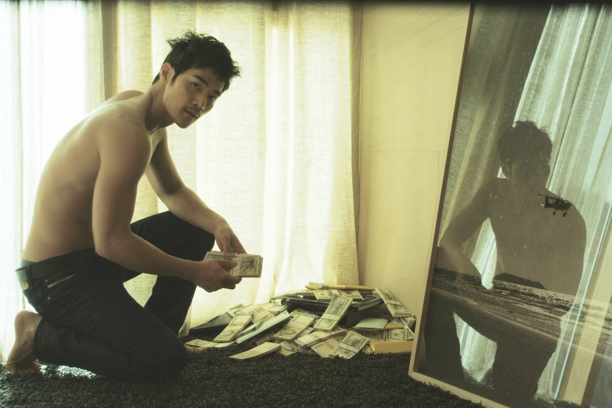

+++
type = "post"
titre = "L&rsquo;ivresse de l&rsquo;argent, Im Sang-soo"
title = "L'ivresse de l'argent, Im Sang-soo"
url = "/ivresse-argent-sang-soo"
date = "2013-01-24T23:12:54"
Lastmod = "2013-03-31T18:00:34"
cover = "ivresse-argent-im-sang-soo-yun-yeo-jung.jpg"
categorie = [ "À voir" ]
tag = [ "Amour", "Argent", "Famille", "Folie", "Sexe", "Société" ]
createur = [ "Im Sang-soo" ]
acteur = [ "Hyo-jin Kim", "Kim Kang-woo", "Youn Yuh-jung", "Yun-Shik Baek" ]
annee = [ "2013" ]
weight = 2013
pays = [ "Corée du Sud" ]
original = "Do-nui Mat"

+++

Dans la grande famille du cinéma coréen, Im Sang-soo s’est fait remarquer à plusieurs reprises par le passé pour ses films très esthétiques et critiques à la fois. <em>L’ivresse de l’argent</em>, son dernier long-métrage reparti bredouille de Cannes, ne fait pas figure d’exception, bien au contraire. En posant ses caméras au cœur d’une famille extrêmement riche et puissante, mais surtout totalement folle, le cinéaste dresse un portrait glaçant d’une haute société coréenne prête à tout pour assurer sa domination et assouvir ses passions.

<em>L’ivresse de l’argent</em> commence par une scène qui, on le comprendra bien vite, se répète très régulièrement. Deux hommes entrent dans un coffre où des millions de billets sont strictement rangés, prêts à être utiliser. Pour les spectateurs, comme pour Young-jak, c’est une première. Le jeune homme est le secrétaire personnel du président et père de famille depuis 10 ans, il appartient un peu à la famille et cette dernière vient justement de lui faire confiance. Deux valises sont vite remplies de ces quelques billets, puis ils repartent ensemble, mettent les valises dans une voiture pour retrouver un autre homme. Le temps de transférer les valises de voiture et chacun repart de son côté. En une scène, Im Sang-soo a montré le moteur principal de la famille qu’il va ensuite montrer pendant tout le film. <em>L’ivresse de l’argent</em> se déroule au sein de la très haute bourgeoisie coréenne. Riche à millions, la famille tourne  autour du président, Kyung-sun, mais c’est surtout sa femme — la terrible Keumok — qui tient les rênes du pouvoir en ayant la maîtrise de l’argent familial. Quand Chul, le fils de la famille, se fait encore avoir par la justice du pays, cette immense fortune est immédiatement mise à profit pour payer les bonnes personnes et le faire sortir en moins de temps qu’il ne faut pour sortir les billets du coffre. Une famille qui peut tout se permettre, au sein de laquelle le jeune Young-jak doit trouver sa place. 

Plus facile à dire qu’à faire, dans une telle famille. Im Sang-soo n’a pas raté sa critique de la bourgeoisie coréenne, il frappe fort avec ses personnages. C’est bien simple, il n’y a pas un membre de la famille pour sauver l’autre dans <em>L’ivresse de l’argent</em>. Il y a d’abord le grand-père, sorte de parrain de la petite mafia que constitue la famille, qui n’est physiquement plus très capable, mais qui conserve toute son énergie et qui agit beaucoup, même si c’est dans la discrétion. Il y a ensuite sa fille, la mère de famille : Keumok est une femme autoritaire et très sèche qui dirige les siens et surtout l’argent familial d’une main de fer. À ses côtés, son mari n’a rien à dire et cette pièce rapportée par leur mariage a été incapable de s’imposer et il se venge en trompant son épouse avec toutes les femmes qui passent par sa route. La dernière en date, c’est Eva, la bonne venue de Philippines, et cette fois il croit l’aimer. Quand Kyung-sun annonce qu’il veut quitter la famille pour s’installer avec elle, il déclenche la colère de sa femme, une colère qui emporte tout et ne laisse personne intact. Surtout pas les deux enfants de la famille, que ce soit Nami, la fille qui est peut-être aussi la plus fragile derrière ses apparences hautaines, ou Chul, l’incorrigible fils qui se trouve toujours dans les pires coups.

Tous ces personnages sont marqués par la même faiblesse qu’Im Sang-soo a astucieusement annoncé dès son titre. <em>L’ivresse de l’argent</em>, c’est ce qui les a tous emporté et ce qui, <em>in fine</em>, a provoqué leur folie dévastatrice. Dans la première scène qui contient déjà tout le film, le personnage de Young-jak entre pour la première fois dans le coffre de la famille, il touche pour la première fois l’argent et, incité par le père, prend une liasse et la hume, comme s’il s’agissait d’une drogue à inhaler. Ce geste ressemble un peu à un acte d’initiation, le jeune homme entre dans cour des grands et après dix ans de bons et loyaux services, il peut enfin toucher l’argent. Comment ne pas résister à cet appel des billets qui offrent tout ? Kyung-sun lui-même n’a pas su résister et c’est justement cet attrait de l’argent facile qui l’a poussé à épouser celle qui est devenue sa femme, mais aussi son porte-monnaie. Pendant toute la durée de <em>L’ivresse de l’argent</em>, il essaie de convaincre le jeune homme de s’éloigner de la voie qu’il a suivie, mais Young-jak ne l’entend pas de cette oreille, pas forcément par goût de l’argent d’ailleurs, mais plus par loyauté. Même quand sa patronne lui fait des avances qu’il ne peut refuser, Young-jak finit par ravaler son dégoût et reste au service de la famille. Dans un film par ailleurs assez caricatural — une caricature que l’on sent totalement assumée —, ce personnage plus complexe est bienvenu et ses doutes et questions apportent un peu d’épaisseur à l’ensemble. 

Dès les premiers plans, la photographie extrêmement léchée et le soin apporté aux cadres sont évidents. Im Sang-soo prend le soin de filmer ses personnages et son décor — une énorme maison avec tant de pièces que l’on a du mal à se repérer — et le résultat est magnifique et souvent assez proche de l’esthétique de la publicité. C’est très beau, mais <em>L’ivresse de l’argent</em> n’est pas un long-métrage chaleureux, au contraire il est plutôt froid, comme le papier glacé d’une publicité papier. On apprécie malgré tout le petit grain de folie que l’on peut déceler parfois, quand la caméra abandonne la symétrie et la rigueur pour filmer un personnage de biais, ce qui donne justement une bonne idée de sa propre folie. Outre cette mise en scène précise et belle, Im Sang-soo avait besoin d’acteurs capables de représenter ces êtres odieux et ceux qu’il a rassemblés ici sont tous très bons. Kim Kang-woo joue très bien son rôle de beau gosse plus complexe qu’il peut en avoir l’air dans un premier temps, Hyo-jin Kim impose elle aussi sa beauté presque surnaturelle en interprétant la fille de la famille, mais c’est surtout la mère qui impressionne. Youn Yuh-jung impose sa domination froide et totale avec une puissance glaçante, dans ce rôle pas facile, notamment parce que l’actrice doit se dénuder largement. Ce n’est pas la seule d’ailleurs, tous les personnages ou presque sont, à un moment ou à un autre, nus dans <em>L’ivresse de l’argent</em>. Une manière aussi de rappeler que l’argent, le pouvoir et le sexe sont toujours intimement liés.

Im Sang-soo n’est pas le cinéaste le plus fin que l’on ait pu voir et son cinéma agace précisément pour cette raison. Reste que <em>l’ivresse de l’argent</em> est un film très efficace qui dépeint une famille peut-être caricaturale, mais qui porte une belle part de vérité. Il faut les voir se moquer du pouvoir en place avec une franchise déconcertante pour retrouver certains personnages publics pas si éloignés de nous… C’est en cela que le long-métrage est finalement plus intéressant qu’il pouvait paraître. À défaut d’être un grand film, <em>L’ivresse de l’argent</em> est un long-métrage très plaisant et fascinant à regarder. 

<h3>Vous voulez m’aider ?<a href="#footnote_0_8407" id="identifier_0_8407" class="footnote-link footnote-identifier-link" title="&Agrave; propos de la publicit&eacute;&hellip;">1</a></h3>
<ul>
<li><a href="http://www.amazon.fr/gp/product/B002KDRE9A/ref=as_li_ss_tl?ie=UTF8&tag=leblogdenic07-21&linkCode=as2&camp=1642&creative=19458&creativeASIN=B002KDRE9A">Acheter le film en Blu-Ray sur Amazon</a></li>
<li><a href="http://www.amazon.fr/gp/product/B002L6Z4CU/ref=as_li_ss_tl?ie=UTF8&tag=leblogdenic07-21&linkCode=as2&camp=1642&creative=19458&creativeASIN=B002L6Z4CU">Acheter le film en DVD sur Amazon</a></li>
</ul>

<ol class="footnotes"><li id="footnote_0_8407" class="footnote"><a href="/soutien/">À propos de la publicité…</a> [<a href="#identifier_0_8407" class="footnote-link footnote-back-link">&#8617;</a>]</li></ol>
