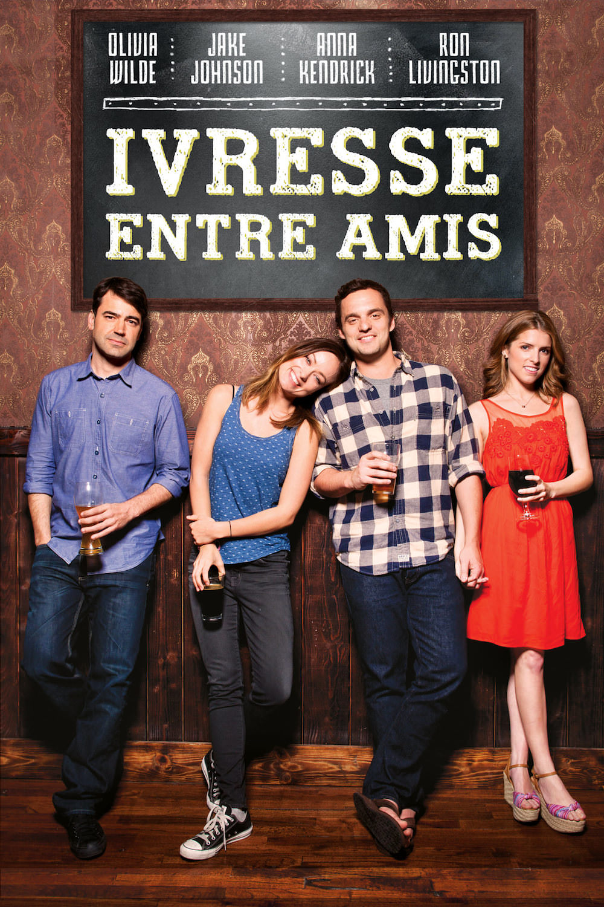
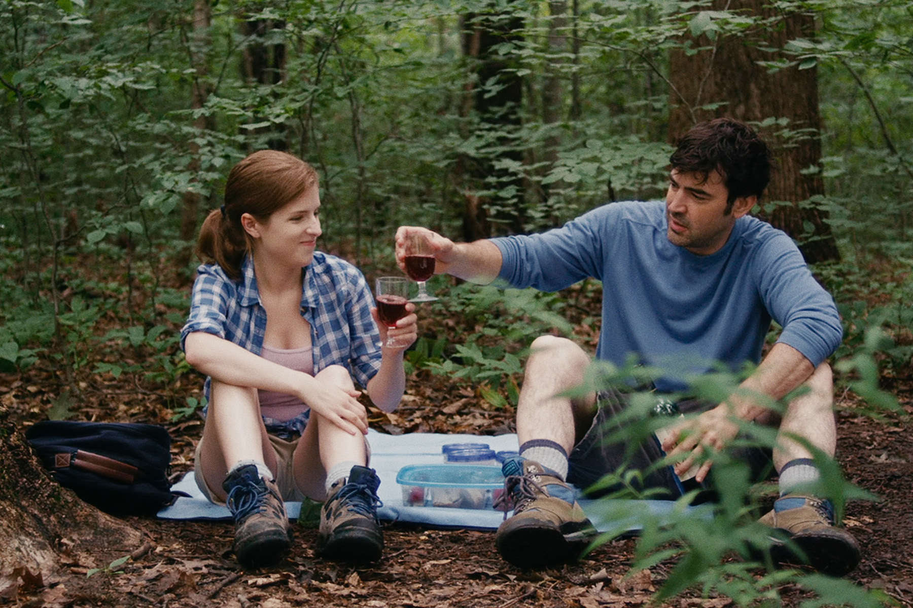

+++
type = "post"
titre = "<em>Ivresse entre amis</em>, Joe Swanberg"
title = "Ivresse entre amis, Joe Swanberg"
url = "/ivresse-entre-amis-swanberg"
date = "2014-01-14T09:36:58"
Lastmod = "2014-01-12T19:40:54"
cover = "ivresse-entre-amis-olivia-wilde-jake-johnson-joe-swanberg.jpg"
categorie = [ "À voir" ]
tag = [ "Alcool", "Amitié", "Amour", "Comédie romantique", "Improvisation" ]
createur = [ "Joe Swanberg" ]
acteur = [ "Anna Kendrick", "Jake Johnson", "Olivia Wilde", "Ron Livingston" ]
annee = [ "2013" ]
weight = 2013
pays = [ "États-Unis" ]
original = "Drinking Buddies"

+++

<em>Ivresse entre amis</em> est sorti l’été dernier aux États-Unis sous le titre <em>Drinking Buddies</em>, mais le long-métrage réalisé par Joe Swanberg n’a eu aucune attention en France. Il n’est pas sorti en salles et il ne bénéficie que d’une sortie limitée en VOD seulement. Le fait que Quentin Tarantino en personne le place dans <a href="http://www.tarantino.info/2013/10/05/quentin-tarantinos-top-10-films-2013-far/">son top 10</a> de l’année n’y fait rien : <em>Ivresse entre amis</em> sort dans l’indifférence quasiment générale. Et pourtant, ce film étrange mériterait qu’on s’y intéresse un petit peu plus. Son synopsis annonce une comédie romantique sans intérêt, mais l’improvisation renouvelle le genre et apporte une fraicheur inattendue à l’ensemble. 

Le titre ne laisse guère de place au doute : on boit beaucoup dans <em>Ivresse entre amis</em>. De fait, Kate et Luke, les deux personnages principaux, travaillent dans une brasserie et ils passent leur temps dans la bière, à la mettre en bouteille et à en boire. Le soir, ils se retrouvent souvent entre collègues pour boire un coup et ils décident de partir en week-end ensemble. Chacun emmène sa petite amie ou son copain du moment : pendant deux jours à la campagne, Kate et Chris côtoient Luke et Jill qui doivent se marier bientôt. On s’en doute, les relations perdent un peu en netteté et des tensions naissent entre les deux couples. Le dernier long-métrage de Joe Swamberg semble ainsi totalement prévisible et dans une certaine mesure, il l’est effectivement. Comme on peut s’y attendre, les deux couples se séparent le temps d’une balade et il se passe des choses qui n’auraient pas dû se passer. Reste que le long-métrage n’est absolument pas ennuyeux et on peut même le qualifier de surprenant. Appartenant au <a href="http://en.wikipedia.org/wiki/Mumblecore">sous-genre Mumblecore</a>, <em>Ivresse entre amis</em> est un petit film réalisé sans budget et sans scénario. Le réalisateur s’est contenté de poser les situations, donner quelques consignes et ce sont ensuite les acteurs qui font tout le travail, improvisent et agissent comme s’il ne s’agissait pas d’un film, mais d’une situation réelle.

À l’écran, le résultat est vraiment bluffant. Loin des situations téléphonées que l’on pouvait attendre, <em>Ivresse entre amis</em> avance avec un réalisme troublant et quelques scènes parviennent à toucher avec un naturel que l’on voit rarement. C’est notamment le cas lors du pique-nique organisé par deux personnages qui ont, après le repas, envie d’aller plus loin sans oser faire le premier pas. On ressent toute la gêne des personnages et il ne fait guère de doute que c’est par l’improvisation que les deux acteurs parviennent à faire ressentir tout ce qui passe à ce moment-là. Avec un scénario, on aurait eu un résultat sans doute très bon, mais on dépasse ici le stade « <em>Actors Studio</em> » et on comprend bien le choix de Joe Swanberg. Dans les scènes où l’alcool coule à flots, on imagine que les acteurs buvaient vraiment, ce qui explique leurs réactions le plus souvent un peu barrées. Peut-être même que la blessure d’un personnage lors d’un déménagement n’était pas prévue. Dans tous les cas, <em>Ivresse entre amis</em> parvient, grâce à cette méthode, à s’extraire de son caractère prévisible et offre un scénario finalement plus surprenant qu’au premier abord. Il peut compter sur d’excellents acteurs, en particulier pour les quatre personnages qui forment les deux couples en week-end. Jake Johnson, Anna Kendrick et Ron Livingston sont très bien, mais c’est surtout la prestation épatante d’Olivia Wilde que l’on retiendra du film.

Joe Swanberg n’a pas signé le chef-d’œuvre de l’année, c’est une évidence. Difficile malgré tout de comprendre pourquoi les distributeurs l’ont boudé en France : <em>Ivresse entre amis</em> aurait sans aucun doute mérité une sortie en salles. L’idée de départ n’est pas originale, c’est vrai, mais le film qui se construit à partir de cette idée est beaucoup plus surprenant grâce à l’utilisation exclusive de l’improvisation. Joe Swanberg offre un divertissement rafraichissant, à découvrir. 

<em>Sortie sur l’iTunes Store et sur d’autres boutiques de VOD le 22 janvier.</em>

<h3>Vous voulez m’aider ?<a href="#footnote_0_10935" id="identifier_0_10935" class="footnote-link footnote-identifier-link" title="&Agrave; propos de la publicit&eacute;&hellip;">1</a></h3>
<ul>
<li><a href="https://itunes.apple.com/fr/movie/ivresse-entre-amis/id782250884">Acheter ou louer le film sur l’iTunes Store</a></li>
</ul>

<ol class="footnotes"><li id="footnote_0_10935" class="footnote"><a href="http://voiretmanger.fr/soutien/">À propos de la publicité…</a> [<a href="#identifier_0_10935" class="footnote-link footnote-back-link">&#8617;</a>]</li></ol>
