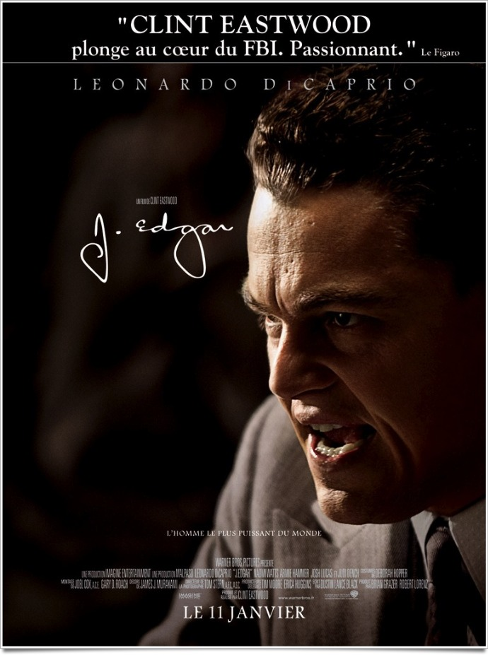
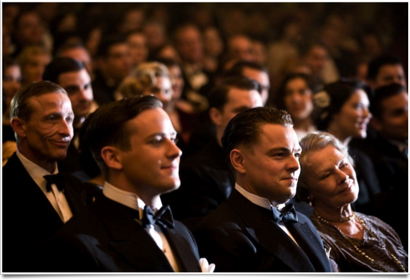
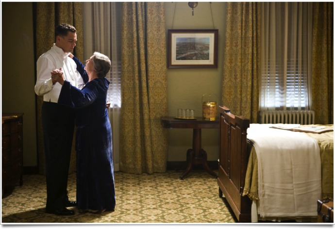

+++
type = "post"
titre = "<em>J. Edgar</em>, Clint Eastwood"
title = "J. Edgar, Clint Eastwood"
url = "/j-edgar-eastwood"
date = "2012-01-14T00:15:59"
Lastmod = "2013-12-09T15:58:08"
cover = "leonardo-dicaprio-j-edgar.jpg"
categorie = [ "À voir" ]
tag = [ "Biopic", "Histoire", "Homosexualité", "Police", "Politique", "Société" ]
createur = [ "Clint Eastwood" ]
acteur = [ "Armie Hammer", "Leonardo Di Caprio", "Naomi Watts" ]
annee = [ "2012" ]
weight = 2012
pays = [ "États-Unis" ]

+++

Décidément aussi productif qu&rsquo;un Woody Allen pour le pire comme pour le meilleur, Clint Eastwood revient cette année encore avec un nouveau film. Depuis <em><a href="http://voiretmanger.fr/2009/02/25/gran-torino-eastwood/">Gran Torino</a></em>, ses productions font pourtant de plus en plus peur avec un <em><a href="http://voiretmanger.fr/2010/01/16/invictus-clint-eastwood/">Invictus</a></em> assez convenu et un <em><a href="http://voiretmanger.fr/2011/01/20/au-dela-eastwood/">Au-Delà</a></em> plutôt moyen. Autant dire, on pouvait craindre le pire avec le cru 2012, un biopic sur Edgar Hoover, le célèbre créateur du FBI. Le cinéaste s&rsquo;en sort pourtant très bien et son <em>J. Edgar</em> est indéniablement une réussite à ne pas rater.

J. Edgar Hoover est un jeune homme brillant et ambitieux dans les années 1920 aux États-Unis. Au lendemain de la Première Guerre mondiale qui a contribué au développement communisme soviétique, le communisme international devient une priorité pour les États-Unis. Les partisans de ce parti politique n&rsquo;hésitent pas à user de la force pour imposer leurs points de vue et ils font exploser plusieurs bombes dans le pays. Hoover travaille alors pour un homme politique qui fait tout pour détruire les partisans communistes après avoir été visé par un attentat. C&rsquo;est lui qui prend la tête du mouvement en inventant notamment un gigantesque système de classement des suspects. Peu après, il prend la tête de ce qui deviendra le FBI et qui est alors un bureau d&rsquo;investigation. Il ne le quittera plus jusqu&rsquo;à sa mort, 48 ans plus tard. Pendant près d&rsquo;un demi-siècle, il est &laquo;&nbsp;l&rsquo;homme le plus puissant du monde&nbsp;&raquo; pour reprendre la formule de l&rsquo;affiche de <em>J. Edgar</em>, au moins des États-Unis. Tenant tête même aux présidents, il contrôle d&rsquo;une main de maître le bureau qu&rsquo;il a créé et se maintient ainsi tant bien que mal au pouvoir.

En s&rsquo;intéressant à la vie de J. Edgar Hoover, le dernier film de Clint Eastwood se penche mécaniquement sur l&rsquo;histoire du FBI. <em>J. Edgar</em> suit notamment la création du bureau : d&rsquo;abord lié à une politique plus large, ce qui deviendra plus tard le FBI prend vite la forme d&rsquo;un organe indépendant sous la direction de Hoover. Ce dernier a bien compris que pour être efficace, son agence devait être la plus indépendante possible : le FBI va surveiller de près de nombreux hommes politiques, y compris l&rsquo;entourage immédiat des différents présidents américains. On sait ainsi que le bureau avait des informations sensibles sur la femme du président Roosevelt, des informations qui ont d&rsquo;ailleurs servi au patron du FBI. Si l&rsquo;indépendance est indispensable pour qu&rsquo;une telle institution existe, c&rsquo;est aussi le meilleur moyen pour J. Edgar Hoover de rester à sa place. À chaque élection présidentielle, il devait aller dans le bureau ovale de la Maison-Blanche et convaincre le nouveau venu de conserver le FBI et surtout de rester à sa tête. Tous les moyens sont bons, y compris les écoutes non autorisées ou le chantage sur la base de preuves douteuses. Clint Eastwood n&rsquo;est peut-être pas allé assez loin sur ces points d&rsquo;ailleurs : on aimerait en savoir plus, mais ce n&rsquo;est finalement pas le sujet principal de <em>J. Edgar</em>.

<em>J. Edgar</em> n&rsquo;est pas un documentaire sur la naissance du FBI, mais bien plus un film sur l&rsquo;histoire du fondateur du bureau. En apparence, le film a toutes les caractéristiques d&rsquo;un biopic convenu, mais Clint Eastwood a su éviter les pièges et poncifs du genre pour composer un film passionnant à plus d&rsquo;un titre. L&rsquo;intérêt est évidemment la complexité du personnage. Froid et extrêmement rigoureux en apparence, Edgar est un homme fragile qui n&rsquo;a jamais su se défaire de l&rsquo;influence écrasante de sa mère. Jusqu&rsquo;à la mort de cette dernière, il a vécu au domicile familial, veillé et encouragé par une mère qui promettait à son fils encore tout jeune qu&rsquo;il serait l&rsquo;homme le plus puissant du pays. <em>J. Edgar</em> a l&rsquo;excellente idée de ne pas s&rsquo;appesantir sur l&rsquo;enfance de son sujet, mais on imagine l&rsquo;éducation du petit Hoover très stricte. Sa mère, croyante intégriste qui refuse de se faire soigner et préfère compter sur sa foi, est à la fois à l&rsquo;origine de son ambition et son juge le plus terrible qui soit. Le résultat était attendu : J. Edgar ne s&rsquo;est jamais marié. Pis, il craignait les femmes qu&rsquo;il ne parvenait manifestement pas à comprendre comme en témoigne bien cette demande en mariage trop précoce au début du film. <em>J. Edgar</em> évoque immanquablement un sujet qui passionne : l&rsquo;homosexualité supposée de Hoover. Le patron du FBI a embauché très tôt Clyde Tolson, un beau jeune homme qui va vite devenir son bras droit et même son ami très proche. Les deux hommes passeront leur vie ensemble, mangeant tous les jours à la même table et passant même des vacances ensemble. Le film ne fait aucun doute sur les goûts et l&rsquo;amour de Tolson pour Hoover, mais il ne montre pour autant aucune relation charnelle entre ces deux hommes qui ont pu très bien en rester à une relation fraternelle.

L&rsquo;homosexualité de Hoover est certainement le meilleur indicateur de la réussite de <em>J. Edgar</em>. Le sujet est traité avec une grande finesse et Clint Eastwood esquisse toujours des pistes sans jamais les concrétiser à l&rsquo;écran. Hoover semble tellement effrayé par ces questions qu&rsquo;il pourrait très bien n&rsquo;avoir jamais touché Clyde et rester dans une relation simplement platonique. Les deux hommes pourraient tout autant avoir partagé régulièrement le même lit : on ne sait pas et c&rsquo;est tant mieux ainsi. L&rsquo;autre bonne idée du film est d&rsquo;avoir oublié la linéarité chronologique au profit d&rsquo;un montage qui entremêle plusieurs époques de manière plus originale et intéressante. On découvre ainsi pendant tout le film un Hoover jeune et ambitieux et le patron en fin de carrière, un homme toujours puissant, mais devenu anachronique. <em>J. Edgar</em> gagne ainsi en dynamisme et les 2h15 du film passent sans y penser. Clint Eastwood a su également bien s&rsquo;entourer et Leonardo DiCaprio est brillant en Hoover. Son maquillage qui vise à le vieillir est réussi et l&rsquo;acteur incarne son personnage sans trop en faire dans le mimétisme. L&rsquo;ensemble est classique, mais très efficace et réussi : la maîtrise de l&rsquo;ancien acteur passée derrière la caméra est indéniable.

Hoover a traqué toute sa vie les secrets des autres avec l&rsquo;ambition folle de tout connaître sur tous les citoyens américains. Était-ce parce qu&rsquo;il était lui-même un homme de secret qui menait une double vie un peu folle ? <em>J. Edgar</em> a l&rsquo;excellente idée d&rsquo;esquisser ce type d&rsquo;hypothèses sans y répondre totalement. Le traitement de l&rsquo;homosexualité est remarquable et le dernier film de Clint Eastwood s&rsquo;avère passionnant. Contrairement à de nombreux biopics, le cinéaste n&rsquo;a pas choisi de raconter toute l&rsquo;histoire de son personnage et c&rsquo;est bien là l&rsquo;essentiel : en omettant volontairement de nombreux éléments, <em>J. Edgar</em> se concentre sur une personnalité complexe et donc intéressante. Une vraie réussite, à voir sans hésitation.

<h3>Vous voulez m&rsquo;aider ?<a href="#footnote_0_5485" id="identifier_0_5485" class="footnote-link footnote-identifier-link" title="&Agrave; propos de la publicit&eacute;&hellip;">1</a></h3>
<ul>
<li><a href="http://www.amazon.fr/gp/product/B007GE87E4/ref=as_li_ss_tl?ie=UTF8&tag=leblogdenic07-21&linkCode=as2&camp=1642&creative=19458&creativeASIN=B007GE87E4">Acheter le film en Blu-Ray et DVD sur Amazon</a></li>
<li><a href="http://www.amazon.fr/gp/product/B006VC5VCI/ref=as_li_ss_tl?ie=UTF8&tag=leblogdenic07-21&linkCode=as2&camp=1642&creative=19458&creativeASIN=B006VC5VCI">Acheter le film en DVD sur Amazon</a></li>
</ul>

<ol class="footnotes"><li id="footnote_0_5485" class="footnote"><a href="http://voiretmanger.fr/a-propos/publicite/">À propos de la publicité…</a> [<a href="#identifier_0_5485" class="footnote-link footnote-back-link">&#8617;</a>]</li></ol>
