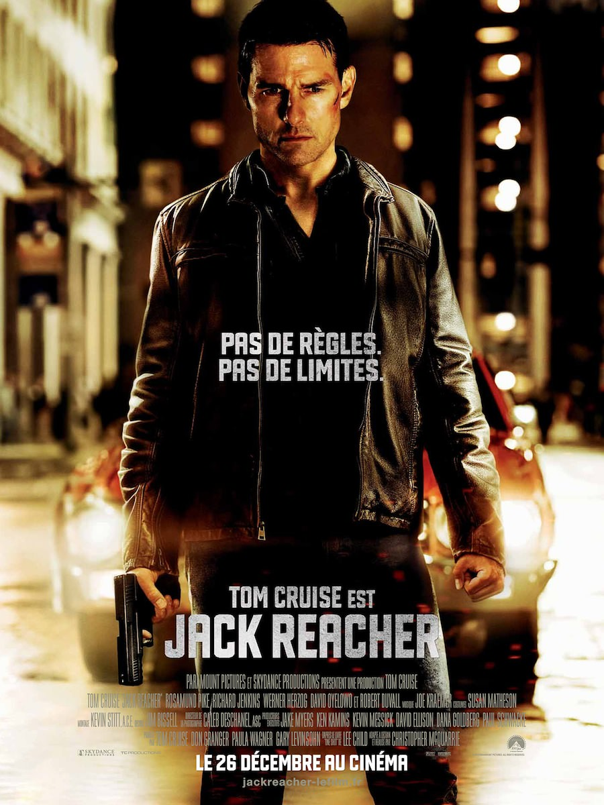
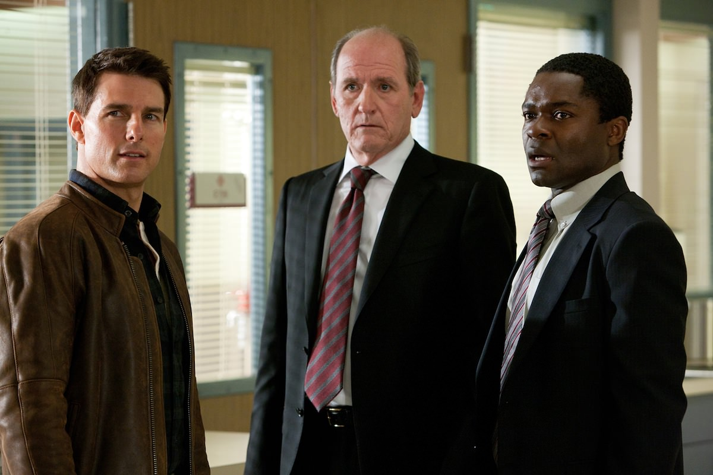

+++
titre = "Jack Reacher, Christopher McQuarrie"
title = "Jack Reacher, Christopher McQuarrie"
url = "/jack-reacher-mcquarrie"
date = "2012-12-28T00:07:41"
Lastmod = "2013-05-23T13:18:21"
cover = "jack-reacher-tom-cruise.jpg"
categorie = [ "À voir" ]
tag = [ "Action", "Blockbuster", "Suspense", "Thriller", "Vite oublié" ]
createur = [ "Christopher McQuarrie" ]
acteur = [ "David Oyelowo", "Jai Courtney", "Richard Jenkins", "Robert Duvall", "Rosamund Pike", "Tom Cruise" ]
annee = [ "2012" ]
weight = 2012
pays = [ "États-Unis" ]

+++

Avec <em>Jack Reacher</em>, Christopher McQuarrie nous promet un retour au blockbuster d’action à l’ancienne, au thriller efficace qui ne dévie pas de son scénario bien écrit. L’affiche annonce la couleur d’un slogan adéquat (« <em>Pas de Règles. Pas de limites.</em> ») et la présence du vieillissant, mais toujours très en forme, Tom Cruise ne pouvait que rassurer quant à la réussite du projet. De fait, <em>Jack Reacher</em> est un film d’action très réussi dans le genre et parfait pour une séance agréable à oublier rapidement…

Pris d’un coup de folie, un homme tue avec un sniper cinq personnes innocentes. Très vite, la police parvient à remonter jusqu’au tueur qui a laissé quelques traces sur le lieu de son action. L’ancien soldat qui a fait la guerre en Irak est connu pour son envie de tuer qu’il a eu du mal à réfréner pendant ses années sur le terrain et tout semble l’accabler. Pourtant, sa seule réponse pendant les interrogatoires invite son avocate à contacter Jack Reacher. Cet homme, un ancien soldat également, a été totalement perdu de vue deux ans auparavant et il est réputé impossible à trouver. Or le voilà justement qui réapparaît de lui-même : il a eu vent de la tuerie et il semble particulièrement intéressé pour aider la police à faire condamner le suspect. Sauf qu’une fois lancé sur l’enquête, rien ne se déroule comme prévu et Jack Reacher suspecte qu’il y a anguille sous roche… 

<em>Jack Reacher</em> commence par une folie meurtrière aussi brève qu’intense, suivie par une enquête policière tout aussi rapide. Christopher McQuarrie prend bien le soin de faire avancer l’enquête rapidement, trop rapidement, tout en offrant à ses spectateurs toutes les clés pour comprendre que quelque chose cloche dans l’affaire. Certes, tout semble accabler James Barr, cet ancien soldat que tout le monde dit un peu fou, mais il y a des éléments troublants, comme cette pièce laissée dans le parcmètre qui contredit les gants en latex que l’on croit apercevoir. Jack Reacher lui-même considère rapidement que quelque chose ne va pas. Cet ancien policier qui travaillait pour l’armée fait confiance à son instinct qui lui souffle que James est une victime trop idéale, ou encore que la scène du crime est trop accablante. Peu à peu, <em>Jack Reacher</em> élabore un scénario qui se complexifie autour d’une théorie du complot d’abord absurde, mais qui gagne vite en crédibilité alors que le héros poursuit son enquête. Pourquoi s’en prendre à lui dans un bar ? Qui sont ces hommes qui le suivent sans arrêt ? Sa présence semble gêner quelqu’un, mais on ne sait pas qui et Christopher McQuarrie parvient à parfaitement entretenir ce suspense pendant toute cette première partie. Tant que les tenants et les aboutissants de cette affaire qui dépasse largement le coup de folie initial ne sont pas dévoilés, <em>Jack Reacher</em> impose un suspense de haut niveau et le spectateur n’a qu’une envie : savoir qui est vraiment derrière toute l’affaire. 

Une fois l’intrigue démêlée, <em>Jack Reacher</em> devient un petit peu plus banal et déroule son histoire, alors que le film semble placé sur des rails. Il y a des courses-poursuites, des combats jusqu’au dénouement, mais le suspense initial n’y est plus, sachant qu’il ne pourrait rien arriver de bien grave au héros. Qu’importe, Christopher McQuarrie a su entretenir l’ambiance et le rythme d’un film d’action à l’ancienne et <em>Jack Reacher</em> vaut tout autant pour l’action qui préside à la fin du long-métrage. Parfaitement maîtrisée, elle s’avère prenante et ne manque pas de rebondissements. On apprécie notamment la scène de la carrière où le scénario multiplie les surprises et parvient à tenir en haleine les spectateurs, même s’ils savent naturellement très bien à quoi s’attendre. Le succès du film tient aussi à celui de son personnage principal : calculateur froid et en apparence insensible, Jack Reacher est une formidable machine à enquêter et à tuer quand il le faut. Son côté implacable est sensible et on le ressent tout comme les personnages de <em>Jack Reacher</em>. L’ensemble est vraiment plaisant pour qui aime les films d’action à l’ancienne, même si le film n’est jamais original ou novateur. Ce n’est pas l’ambition de Christopher McQuarrie qui préfère ne jamais s’éloigner des contours du genre, mais au contraire s’appliquer à les respecter et à proposer une nouvelle variation, très efficace encore une fois.

C’est ce même esprit que l’on retrouve côté réalisation. <em>Jack Reacher</em> emporte ses spectateurs dans une histoire invraisemblable, mais rendue parfaitement crédible par un scénario extrêmement bien ficelé. Christopher McQuarrie n’essaie jamais de perdre avec des éléments inutiles, il va au contraire à l’essentiel avec un film d’action parfaitement tenu et à l’efficacité jamais remise en cause. Sans aucun temps mort, mais en laissant malgré tout le temps nécessaire à l’installation de l’histoire, il avance jusqu’à la découverte des vrais responsables, puis jusqu’à leur élimination logique et attendue. Inutile encore une fois de chercher de l’originalité ici, mais <em>Jack Reacher</em> bénéficie d’une réalisation très soignée, avec même quelques plans assez beaux dans la nuit ou sous la pluie. Présent comme à l’accoutumée à tous les niveaux du projet, Tom Cruise surprend par sa vivacité : malgré ses 50 ans, l’acteur ne démérite pas dans ce rôle qui lui convient parfaitement et il impose à nouveau son jeu très convaincant. N’allez pas voir ce film si vous détestez son acteur principal en revanche, il est de tous les plans… Autour de lui, les personnages secondaires ne sont pas moins soignés, avec une Rosamund Pike parfaite en avocate bornée, un Robert Duvall très réussi et qui ne fait pas son âge, lui non plus. La palme de la bizarrerie revient peut-être à la présence de Werner Herzog dans le rôle du grand méchant : le cinéaste allemand n’a pas l’habitude de participer aux grosses productions hollywoodiennes, mais il est tout à fait à sa place et s’avère assez glaçant. 

Un film peut-être classique, s’il est bien fait et c’est assurément le cas de <em>Jack Reacher</em>. Le long-métrage de Christopher McQuarrie n’innove en rien et il se fera vite oublier, c’est un fait, mais en attendant vous aurez passé une très bonne soirée au cinéma. À condition de ne pas détester Tom Cruise ou les blockbusters d’action, c’est un excellent conseil pour cette fin d’année…

<h3>Vous voulez m&rsquo;aider ?<a href="#footnote_0_8165" id="identifier_0_8165" class="footnote-link footnote-identifier-link" title="&Agrave; propos de la publicit&eacute;&hellip;">1</a></h3>
<ul>
<li><a href="http://www.amazon.fr/gp/product/B00AQXLN7A/ref=as_li_ss_tl?ie=UTF8&#038;tag=leblogdenic07-21&#038;linkCode=as2&#038;camp=1642&#038;creative=19458&#038;creativeASIN=B00AQXLN7A">Acheter le film en Blu-Ray sur Amazon</a></li>
<li><a href="http://www.amazon.fr/gp/product/B00AQXLMUS/ref=as_li_ss_tl?ie=UTF8&#038;tag=leblogdenic07-21&#038;linkCode=as2&#038;camp=1642&#038;creative=19458&#038;creativeASIN=B00AQXLMUS">Acheter le film en DVD sur Amazon</a></li>
<li><a href="https://itunes.apple.com/fr/movie/jack-reacher/id621961104">Acheter ou louer le film sur l&rsquo;iTunes Store</a></li>
</ul>

<ol class="footnotes"><li id="footnote_0_8165" class="footnote"><a href="http://voiretmanger.fr/soutien/">À propos de la publicité…</a> [<a href="#identifier_0_8165" class="footnote-link footnote-back-link">&#8617;</a>]</li></ol>
