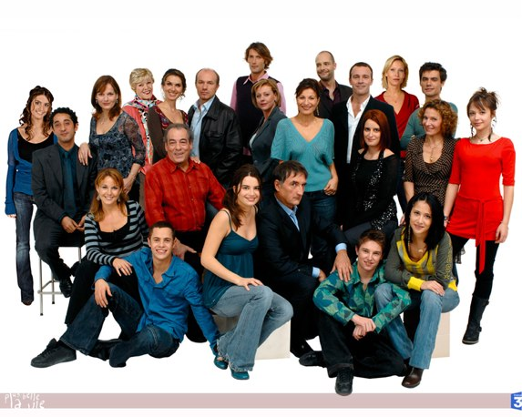

+++
type = "post"
titre = "J&rsquo;ai regardé Plus Belle la Vie&#8230;"
title = "J'ai regardé Plus Belle la Vie&#8230;"
url = "/jai-regarde-plus-belle-la-vie"
date = "2009-01-11T22:58:29"
Lastmod = "2013-09-08T00:29:31"
cover = ""
categorie = [ "À voir" ]
tag = [ "Coup de gueule", "Série", "Société" ]
pays = [ "France" ]

+++

Eh oui, tout arrive, j&rsquo;ai regardé un épisode de <em>Plus Belle la Vie</em>&#8230; Oui, je sais, la honte et le déshonneur s&rsquo;abattent sur ma famille pour les 10 générations à venir.

Mais que voulez-vous, je voulais connaître LE phénomène, l&rsquo;émission qui a réussi l&rsquo;exploit de détourner les regards de TF1, il fallait le faire ! Une émission regardée chaque jour par plus de 6 millions de Français et qui a une ribambelle de fans. Une série qui a quand même à son compteur dépassé le millier d&rsquo;épisodes&#8230; Bref, je voulais savoir ce que c&rsquo;était, histoire de ne pas mourir idiot. Ayant récemment profité des soldes et acquis une clé TNT, j&rsquo;ai donc enregistré un épisode diffusé sur France 4 jeudi dernier, donc je n&rsquo;ai aucune idée de quel épisode il s&rsquo;agit, et de toute façon, peu importe.

Peu importe parce que je ne sais pas combien sont payés les scénaristes, mais franchement, l&rsquo;histoire n&rsquo;est pas trop compliquée à suivre. On sent bien les grosses ficelles du récit, et on sent bien que le scénario de base doit tenir pendant 4256 épisodes, coûte que coûte. C&rsquo;est d&rsquo;un intérêt, donc très limité. Oh, ça n&rsquo;est pas moins intéressant que les <em>Feux de l&rsquo;amour</em>, par exemple, mais pas plus non plus. On suit donc la vie de petites gens, vous savez, la fameuse France d&rsquo;en bas. Ils ont des vies moyennes dans un Marseille imaginaire de carton-pâte qu&rsquo;un Américain n&rsquo;aurait pas renié. Ah les clichés, ça y va ! Ne serait-ce que le soleil (il fait toujours beau), le bar bien sûr, lieu de vie commune par excellence (oui oui, c&rsquo;est une série de 2008, pas 1950), bref, on baigne dans le cliché le plus basique.

Ce qui est bien, avec ce genre de série, c&rsquo;est que tu peux regarder n&rsquo;importe quel épisode, tu sais tout ce qui a précédé et tu sais même tout ce qui suit ! Le coup du &laquo;&nbsp;je t&rsquo;aime&nbsp;&raquo; sur fond violoneux se voyait dix minutes avant, ben ça n&rsquo;a pas manqué. Ah, et cette fin façon cliffhanger de série américaine, c&rsquo;en est tellement radical que j&rsquo;ai éclaté de rire. Mort de rire parce que pas une seconde vous ne pouvez penser qu&rsquo;il arrivera du mal à cette pauvre femme&#8230;

Le mal, voilà le pire dans <em>Plus Belle la Vie</em>, touchée du syndrome des Chtis, à moins que ça ne soit l&rsquo;inverse. Les personnages sont nombreux, mais ils sont tous gentils, sincères, ils font le bien toute la journée, ils se disent tout, ils s&rsquo;aiment, mais c&rsquo;est d&rsquo;un déprimant ! À la fin, on a envie de voir un film bien méchant, je ne sais pas moi, <em>No Country For Old Men</em>, la série des <em>Hannibal</em>, un <em>Alien</em> même, enfin peu importe, mais on a envie de voir enfin un méchant ! Je ne sais pas d&rsquo;où vient cette maladie du cinéma français, mais vraiment, vraiment, ils n&rsquo;ont pas compris que le plus intéressant, dans l&rsquo;humanité, c&rsquo;était le mal. Il y a bien des méchants dans <em>Plus Belle la Vie</em>, attention hein, des très méchants. Tenez-vous bien, ils&#8230; volent des porte-monnaie !

Bon et ça dégouline de bons sentiments à en vomir. Rien que la chanson du générique, quelle horreur (faut aimer la vie, c&rsquo;est mieux) ! Et alors je vous explique le fond philosophique : le racisme, l&rsquo;homophobie, la drogue (brr, j&rsquo;en frémis), c&rsquo;est le mal. La famille, l&rsquo;amour, l&rsquo;amitié, la sincérité, le soleil, c&rsquo;est le bien (aaaah, ça va mieux). Je vous assure, c&rsquo;est d&rsquo;un déprimant&#8230; Ah, inutile de dire, je pense, que c&rsquo;est aussi gnangnan et cul cul la praline comme c&rsquo;est pas permis&#8230;

Enfin, je ne vais pas continuer ainsi, j&rsquo;ai vu un épisode, voilà, c&rsquo;est fait, maintenant je peux oublier à jamais cette série. Mais quand même, je me demande : pourquoi est-ce que ça marche si bien ? C&rsquo;est comme les Chtis ça, on dirait qu&rsquo;il faut absolument que tout le monde il est beau, tout le monde il est gentil, sinon ça ne va pas. Mais m&#8230; à la fin, Desproges était drôle parce que méchant ! À côté, Dany Boon ou même Gad Elmaleh, ils sont mignons, mais ils ne valent pas grand-chose à côté&#8230;

C&rsquo;était le coup de gueule du jour de Nicolinux, vous pouvez maintenant éteindre l&rsquo;écran de votre ordinateur et reprendre une activité normale&#8230; 😀

