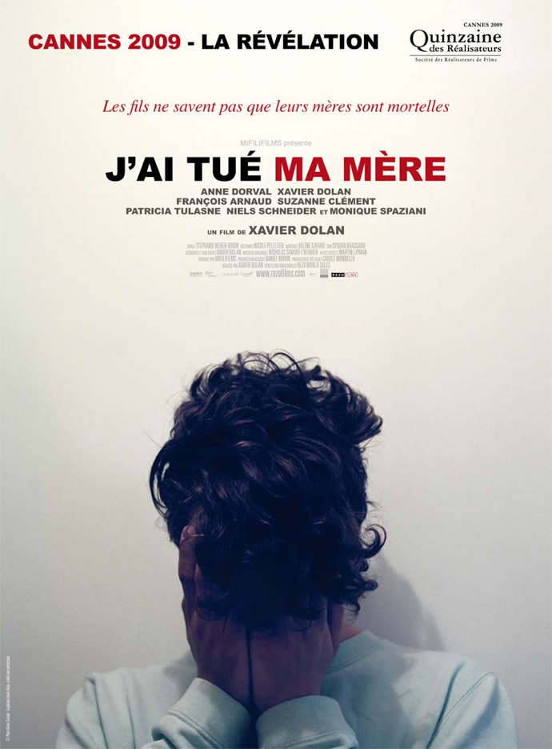
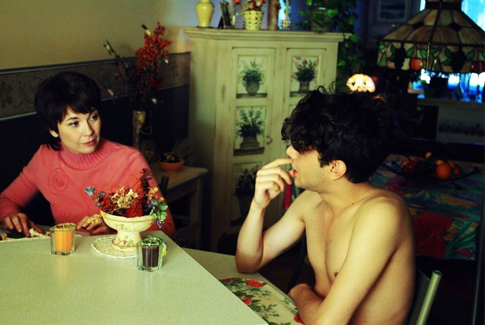

+++
type = "post"
titre = "<em>J&rsquo;ai tué ma mère</em>, Xavier Dolan"
title = "J'ai tué ma mère, Xavier Dolan"
url = "/jai-tue-ma-mere-dolan"
date = "2010-08-17T00:21:26"
Lastmod = "2014-04-17T22:54:33"
cover = "xavier-dolan-j-ai-tue-ma-mere.jpg"
categorie = [ "À voir" ]
tag = [ "Adolescence", "Autobiographie", "Famille", "Homosexualité" ]
createur = [ "Xavier Dolan" ]
acteur = [ "Anne Dorval", "Xavier Dolan" ]
annee = [ "2009" ]
weight = 2009
pays = [ "Canada" ]

+++

<em>J&rsquo;ai tué ma mère</em> est le premier film de Xavier Dolan, jeune cinéaste québécois d&rsquo;une vingtaine d&rsquo;années. Non content de réaliser, produire et scénariser son premier film, Xavier Dolan en est aussi l&rsquo;acteur principal pour un film en large partie autobiographique. Un sujet courageux pour un film assez bluffant quand on pense à l&rsquo;âge et la faible expérience de son auteur. Un réalisateur qu&rsquo;il ne faudra pas manquer de suivre…

&nbsp;

<em>J&rsquo;ai tué ma mère</em> raconte l&rsquo;histoire de Hubert Minel, jeune adolescent de seize ans. Il vit seul avec sa mère et les relations entre les deux sont pour le moins tendues comme le titre le laissait entendre. C&rsquo;est bien simple, Hubert n&rsquo;en peut plus de sa mère, de ses goûts au kitsch assumé, de sa manière de manger, de ses remarques dans la voiture… Toutes ces petites choses du quotidien qui donnent au jeune homme des dizaines de raisons de se plaindre, ce qu&rsquo;il ne manque pas de faire savoir bruyamment auprès de sa mère. Son langage est assez cru et il est suffisamment mature pour savoir frapper là où cela fait mal et sa mère en prend pour son grade. Elle supporte, tantôt avec humour, tantôt avec fatalisme les sautes d&rsquo;humeur de son fils jusqu&rsquo;à la rupture qui la conduit, avec l&rsquo;aval du père, à envoyer Hubert en pensionnat. Une rupture dans une vie déjà compliquée que le jeune homme supporte mal, d&rsquo;autant qu&rsquo;il a un petit copain, Antonin, et que c&rsquo;est une sorte de pilier pour lui, un repère avec cette mère complice avec son fils, un idéal peut-être. La mère de Hubert ne sait rien de l&rsquo;homosexualité de son fils, ce qui va entraîner de nouveaux sujets de friction entre les deux. Dans tout cette vie déjà complexe vient s&rsquo;ajouter une prof de Hubert qui peine à cacher son intérêt pour cet élève qui préfère mentir et dire que sa mère est morte plutôt que de travailler sur elle et qui n&rsquo;hésite pas à se réfugier chez elle quand cela va mal. Il ne se passe rien entre les deux, mais ses sentiments laissent peu de place au doute et elle finit par aller loin, à l&rsquo;autre bout du Canada, pour éviter de craquer sans doute.

Le film de Xavier Dolan avait tout pour constituer un banal <em>teen movie</em>, mais <em>J&rsquo;ai tué ma mère</em> est plus que cela. C&rsquo;est d&rsquo;abord, on l&rsquo;a évoqué, une œuvre en partie autobiographique au moins. Le scénario s&rsquo;inspire de faits ayant réellement eu lieu et les dialogues sont même en partie issus de véritables dialogues entre le réalisateur et sa mère. Si le film maintient en permanence le doute entre ce qui relève de la réalité et ce qui appartient à la fiction, on sent quand même pendant tout le film une sincérité réelle, jamais feinte ou travaillée. Comme dans toute œuvre autobiographique, on a le point de vue de son auteur, point de vue nécessairement biaisé, mais Xavier Dolan a fait un effort pour consacrer à tous les personnages un peu d&rsquo;attention. Ainsi, sa mère n&rsquo;est pas présentée comme un personnage intégralement noir comme on pouvait s&rsquo;y attendre : si elle a des faiblesses, elle a aussi des bons aspects tandis que son fils lui mène vraiment la vie dure et est souvent injuste avec elle. On sent que son premier film a été réalisé après la colère, quand les esprits se sont calmés. Sans doute que le Xavier Dolan de 20 ans n&rsquo;en veut plus autant à sa mère que le Xavier Dolan de 16 ans et <em>J&rsquo;ai tué ma mère</em> est aussi une manière pour lui de se racheter, de s&rsquo;excuser pour sa dureté auprès d&rsquo;une mère qu&rsquo;il aime quand même, malgré tout, de tout son cœur. Cet aspect est très beau dans ce film marqué par l&rsquo;émotion, une émotion qui, là encore, n&rsquo;est jamais provoquée, mais toujours présente, sur le fil, derrière les engueulades. Au fond, Xavier Dolan fait une très belle déclaration d&rsquo;amour à sa mère avec son premier film.

<em>J&rsquo;ai tué ma mère</em> est malgré tout un film aussi assez dur et marqué par un humour très noir. Les personnages de ce film ne se font aucun cadeau et s&rsquo;envoient des vacheries monstrueuses à longueur de temps, ce qui donne autant de répliques savoureuses. Il est vrai que la langue n&rsquo;aide pas les oreilles françaises à trouver ce langage sérieux : peut-être est-ce lié aux fameuses et hilarantes &laquo;&nbsp;Têtes à claques&nbsp;&raquo;, mais l&rsquo;accent et le vocabulaire désuet sont vraiment très amusants. Les sous-titres parsèment régulièrement le film, tant il n&rsquo;est pas évident de suivre et comprendre un langage très riche et extrêmement imagé. Sans doute que le film est en fait beaucoup plus noir aux oreilles des Québécois, mais voilà, pour des Français cette langue provoque à elle seule la bonne humeur, voire l&rsquo;hilarité. Je pense néanmoins que l&rsquo;auteur joue avec sa langue en accentuant notamment plus que de raison le côté désuet qui fait même réagir sa mère à un moment. Il y a un temps pour tout et l&rsquo;humour cède parfois totalement la place au sérieux, notamment sur tous les sujets autour de l&rsquo;adolescence et de l&rsquo;homosexualité. L&rsquo;adolescence, âge des changements et des remises en cause, âge aussi des oppositions contre l&rsquo;ordre et d&rsquo;abord l&rsquo;ordre parental, âge enfin de tous les possibles. Tout cela est très bien rapporté par le film, en particulier le conflit enfant/parent, mais pas seulement. Cette professeur qui vient à peine de sortir de l&rsquo;université et qui ne sait pas trop comment réagir face à un adolescent à peine plus jeune qu&rsquo;elle et qui appelle à l&rsquo;aide est essentielle dans le récit. L&rsquo;homosexualité est un sujet central sans <em>J&rsquo;ai tué ma mère</em> et pourtant, il n&rsquo;est jamais abordé comme tel, et c&rsquo;est certainement sa grande force. Ce n&rsquo;est nullement un film sur l&rsquo;homosexualité, mais le sujet est évoqué par touches discrètes : la mère qui l&rsquo;apprend au détour d&rsquo;une conversation, l&rsquo;homophobie exacerbée par l&rsquo;environnement d&rsquo;un lycée privé catholique, les corps qui s&rsquo;enlacent. Quand le film s&rsquo;ouvre, Hubert aime déjà Antonin et Xavier Dolan parvient à le faire comprendre sans le dire, par petites touches subtiles.

Ce premier film impressionne à bien des égards. Je n&rsquo;aime pas tellement m&rsquo;attarder sur le fait qu&rsquo;il s&rsquo;agisse d&rsquo;un premier film en règle générale, mais il est vrai que l&rsquo;on constate rarement une telle maitrise et un tel point de vue dans un premier film, surtout quand le film en question est l&rsquo;œuvre d&rsquo;un jeune homme d&rsquo;à peine 20 ans. Sa maturité est frappante, tant par sur la forme que sur le fond. Sur le fond, on a déjà eu l&rsquo;occasion d&rsquo;évoquer la façon qu&rsquo;avait le film de traiter les relations houleuses entre la mère et son fils, sans manichéisme exacerbé. C&rsquo;est le point de vue d&rsquo;un homme mûr et non d&rsquo;un adolescent qui nous est proposé ici. L&rsquo;amour homosexuel est également marqué par un point de vue étonnamment réfléchi pour une personne de 20 ans. On sent qu&rsquo;il a pris le temps de réfléchir et que ce n&rsquo;est pas le résultat d&rsquo;un coup de tête après une soirée bien arrosée et où le tabac n&rsquo;est pas la seule substance qui a été consommée. La maitrise est aussi technique et là encore, on ne peut être qu&rsquo;impressionné. Xavier Dolan propose un véritable point de vue, fait preuve de nombreux choix de mise en scène qui témoignent de la présence d&rsquo;un vrai réalisateur loin des faiseurs de bobines au kilomètre que l&rsquo;on a si souvent l&rsquo;occasion de voir au cinéma. Les influences sont revendiquées, on pense notamment à Wong Kar-wai dans le traitement de la musique liée à des scènes au ralenti. Et si ces choix sont parfois un peu trop systématiques et conduisent à un film un peu maniéré, le résultat force le respect. On aimerait que des réalisateurs avec une longue expérience fassent aussi bien, quand il ne s&rsquo;agit là que d&rsquo;un premier film. Voilà en tout cas un réalisateur à suivre de très près et qui semble vouloir enchainer les films à un rythme important si l&rsquo;on en juge à la sortie de son prochain long-métrage, un an seulement après celui-ci.

<em>J&rsquo;ai tué ma mère</em> force vraiment le respect. Le sujet n&rsquo;était pas simple et aurait pu conduire à une comédie bateau sur l&rsquo;adolescent en conflit avec ses parents. Certes, le film de Xavier Dolan est cela, mais c&rsquo;est aussi une œuvre plus ambitieuse, partiellement autobiographique et portée par des choix esthétiques courageux. Si le film se révèle parfois un peu trop systématique — par exemple dans les cadrages décalés des dialogues —, <em>J&rsquo;ai tué ma mère</em> impressionne par sa maitrise de bout en bout et la maturité de son point de vue. Xavier Dolan est clairement un jeune artiste à suivre : à condition de ne pas s&rsquo;enfermer dans ce premier succès, il pourrait réaliser des œuvres passionnantes. Début de réponse avec <em>Amours imaginaires</em>, son prochain film.

<h3>Vous voulez <a href="http://voiretmanger.fr/soutien/">m&rsquo;aider</a> ?</h3>
<ul>
<li><a href="http://www.amazon.fr/gp/product/B002QBWS9W/ref=as_li_ss_tl?ie=UTF8&amp;tag=leblogdenic07-21&amp;linkCode=as2&amp;camp=1642&amp;creative=19458&amp;creativeASIN=B002QBWS9W">Acheter le film en DVD sur Amazon</a></li>
<li><a href="https://itunes.apple.com/fr/movie/jai-tue-ma-mere/id385968549">Acheter ou louer le film sur l&rsquo;iTunes Store</a></li>
</ul>

