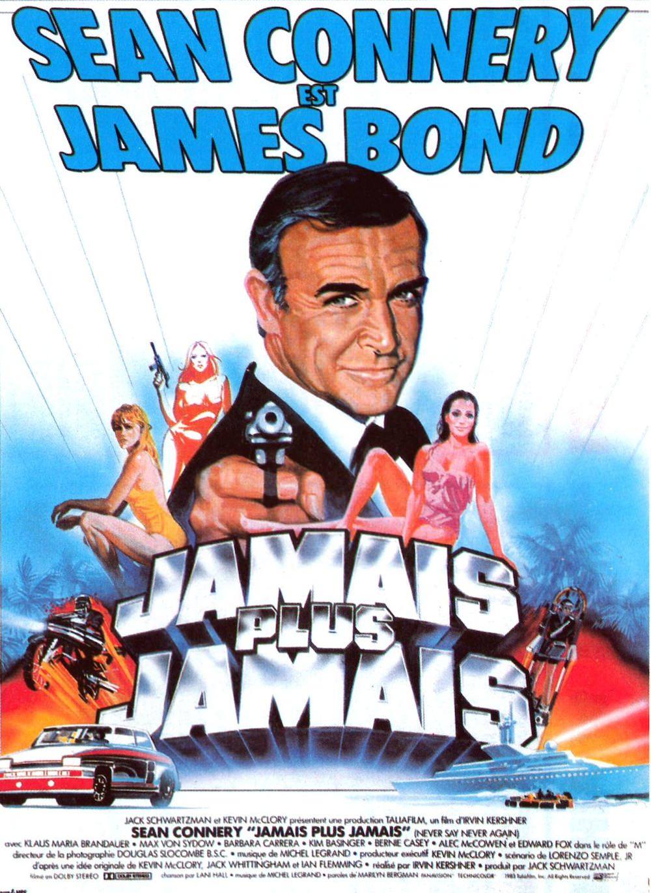
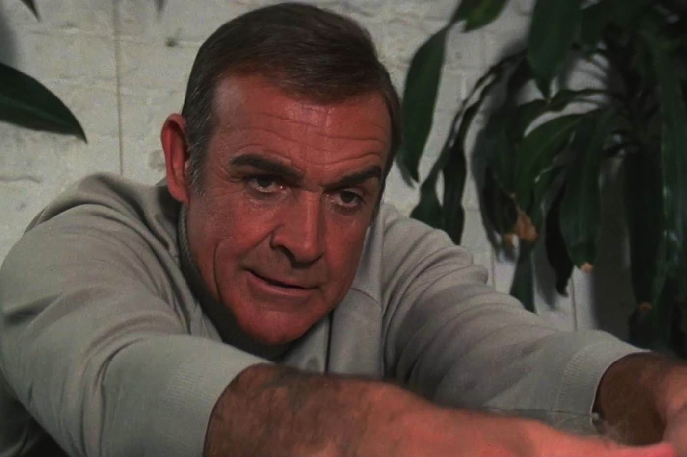

+++
titre = "<em>Jamais plus jamais</em>, Irvin Kershner"
title = "Jamais plus jamais, Irvin Kershner"
url = "/jamais-plus-jamais-kershner"
date = "2013-04-21T10:34:39"
Lastmod = "2013-05-11T10:03:59"
cover = "jamais-plus-jamais-klaus-maria-brandauer-kerschner.jpg"
categorie = [ "À voir" ]
tag = [ "Blockbuster", "Espionnage", "James Bond", "Vite oublié" ]
createur = [ "Irvin Kershner" ]
acteur = [ "Kim Basinger", "Klaus Maria Brandauer", "Sean Connery" ]
annee = [ "1983" ]
weight = 1983
pays = [ "États-Unis" ]
original = "Never Say Never Again"

+++

En 1983, les spectateurs du monde entier ont eu non pas, un mais deux <em>James Bond</em>. Outre <a href="http://voiretmanger.fr/2013/03/17/octopussy-glen/" title="Octopussy, John Glen - À voir et à manger"><em>Octopussy</em></a> interprété par Roger Moore qui donne son visage à 007 depuis cinq films, <em>Jamais plus jamais</em> sort sur les salles du monde entier. Et contrairement à <em>Casino Royale</em>, il ne s’agit en rien d’une comédie totalement délurée, mais d’un épisode très sérieux. Suite à une incroyable procédure judiciaire, le scénariste Kevin McClory a obtenu de la justice le droit de tourner un <em>James Bond</em> sans l’accord d’En Productions, la société qui a fait tourner tous les épisodes de la saga officielle. Obtenant le retour de Sean Connery, il met en place un film qui entend faire mieux que la saga officielle. Son argument principal, c’est son acteur et son affiche ne laisse aucun doute sur la question. Est-ce suffisant pour faire un bon film ? <em>Jamais plus jamais</em> essaie de retrouver une formule qui a fait ses preuves, mais ce n’est pas cette nouvelle adaptation d’une histoire déjà sortie au cinéma qui permet à cet épisode réalisé par Irvin Kershner de sortir du lot. Divertissant, mais trop conventionnel…

De manière assez étonnante, son titre fait référence à la promesse de Sean Connery de ne jamais tourner à nouveau dans un <em>James Bond</em>. C’était après <a href="http://voiretmanger.fr/2013/02/03/les-diamants-sont-eternels-hamilton/" title="Les diamants sont éternels, Guy Hamilton - À voir et à manger"><em>Les diamants sont éternels</em></a>, un épisode qui essayait déjà de renouer avec un succès passé en le copiant sans rien y ajouter. Après cet échec relatif, l’acteur s’était promis de ne pas y revenir, mais des finances l’ont finalement poussé à changer d’avis et le cachet mirobolant de 5 millions de dollars promis pour <em>Jamais plus jamais</em> a fait l’affaire. Sean Connery est l’ajout principal de cet épisode officieux, c’est même sans doute son seul atout et l’acteur qui le sait bien parvient à imposer des conditions jamais vues, à commencer par un contrôle total sur le film. Difficile pour Irvin Kershner, dès lors, d’imposer ses conditions et le film ne brille pas par l’originalité de sa mise en scène, ni d’ailleurs par celle de son scénario. Il faut dire que le roman de Ian Fleming utilisé comme base ici a déjà servi <a href="http://voiretmanger.fr/2013/01/13/operation-tonerre-young/" title="Opération Tonnerre, Terence Young - À voir et à manger"><em>Opération Tonnerre</em></a> et les points communs entre les deux films sautent aux yeux. Même si <em>Jamais plus jamais</em> opère quelques changements subtils, on a vraiment le sentiment de revoir le même film, une adaptation qui change trop peu de choses par rapport à l’original pour se distinguer. On retrouve ainsi une intrigue autour de bombes nucléaires, volées ici aux États-Unis par des méchants qui rappelleront des souvenirs aux fans de la saga, puisque le long-métrage d’Irvin Kershner signe le retour du SPECTRE, que l’on n’avait plus vu depuis <em>Les Diamants sont éternels</em>. Tous les éléments du film sont repris ailleurs, mais si ce n’est pas original, c’est en revanche assez efficace pour qui aime la saga et <em>Jamais plus jamais</em> commence à ce propos plutôt bien.

Rarement un film n’a été à ce point construit avec des avocats. <em>Jamais plus jamais</em> ne peut pas tout faire et de nombreux éléments qui font de la saga ce qu’elle est lui sont interdits par une décision de justice. Irvin Kershner est ainsi privé de prégénérique, il ne peut pas utiliser le fameux thème musical imaginé pour les films officiels, il n’a pas non plus le droit d’utiliser Q et ses gadgets… Autant d’interdits qui, au départ au moins, créent une contrainte qui pousse à l’imagination. À défaut d’une séquence avant le générique, <em>Jamais plus jamais</em> ouvre sur une séquence qui n’a pas de rapport avec l’intrigue principale et qui fait officie de générique, avec une musique assez proche de la saga officielle. Une bonne idée qui apparaît comme plus moderne que les génériques vus et revus d’Eon Productions. Le postulat de départ est également une excellente idée : Sean Connery a alors 53 ans, il n’est plus l’acteur musclé des débuts et le scénario de <em>Jamais plus jamais</em> va astucieusement utiliser son âge plutôt que de le masquer. Dans un premier temps, le film tourne ainsi autour de la question de la retraite : M veut moderniser le MI6 et il ne veut plus entendre parler des agents 00 qui lui semblent dépassés. James Bond est envoyé dans une clinique pour une remise en forme, une excellente idée que le film d’Irvin Kershner oublie après quelques minutes. Quand l’intrigue se met en place, il semble avoir retrouvé sa jeunesse et sa force et on n’entend plus jamais parler de son âge. Dommage, d’autant que la suite n’est qu’une succession de clichés de la saga, comme si ce  <em>Jamais plus jamais</em> tendait, sans le vouloir vraiment, à la parodie. L’intrigue avance trop facilement, Largo a des dizaines d’occasion de tuer l’agent 007 sans rien faire, tandis que James Bond couche avec quasiment toutes les filles qu’il rencontre. Ce serait mentir de dire que le film est mauvais, il reste un blockbuster divertissant, mais il finit par ennuyer un peu sur 2h15. La faute sans doute à une intrigue bien trop prévisible pour un film que rien ne fait dérailler, même s’il faut noter quelques idées nouvelles, à l’image de l’utilisation d’une moto pour remplacer la traditionnelle voiture. Pas de quoi sauver <em>Jamais plus jamais</em> toutefois…

<em>Octopussy</em> n’est incontestablement pas le meilleur épisode de la saga officielle, mais il fait bien mieux que ce <em>Jamais plus jamais</em> assez paresseux, tant sur le plan qualitatif que sur le nombre d’entrées. Le long-métrage d’Irvin Kershner n’est pas un échec total, le divertissement est quand même au rendez-vous et on retrouve avec un certain plaisir la méchanceté simple du SPECTRE. Reste que ce film conçu exclusivement pour et par Sean Connery ne reste pas dans les annales, sans doute par manque d’originalité. 

<h3>Vous voulez m’aider ?<a href="#footnote_0_9104" id="identifier_0_9104" class="footnote-link footnote-identifier-link" title="&Agrave; propos de la publicit&eacute;&hellip;">1</a></h3>
<ul>
<li><a href="http://www.amazon.fr/gp/product/B00B2MVH84/ref=as_li_ss_tl?ie=UTF8&#038;tag=leblogdenic07-21&#038;linkCode=as2&#038;camp=1642&#038;creative=19458&#038;creativeASIN=B00B2MVH84">Acheter le film en Blu-Ray sur Amazon</a></li>
<li><a href="http://www.amazon.fr/gp/product/B00005BKY0/ref=as_li_ss_tl?ie=UTF8&#038;tag=leblogdenic07-21&#038;linkCode=as2&#038;camp=1642&#038;creative=19458&#038;creativeASIN=B00005BKY0">Acheter le film en DVD sur Amazon</a></li>
</ul>

<ol class="footnotes"><li id="footnote_0_9104" class="footnote"><a href="http://voiretmanger.fr/soutien/">À propos de la publicité…</a> [<a href="#identifier_0_9104" class="footnote-link footnote-back-link">&#8617;</a>]</li></ol>
