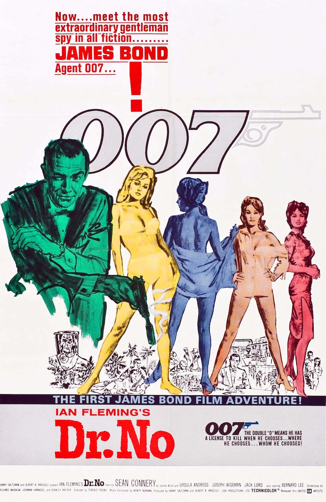
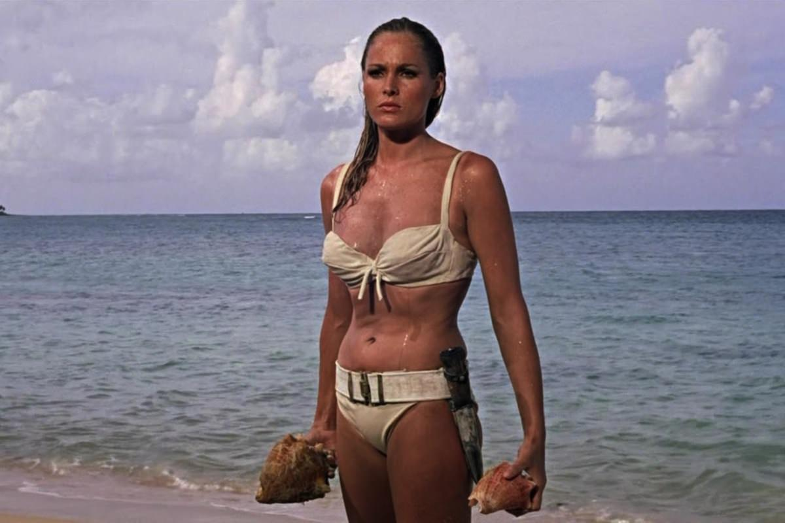
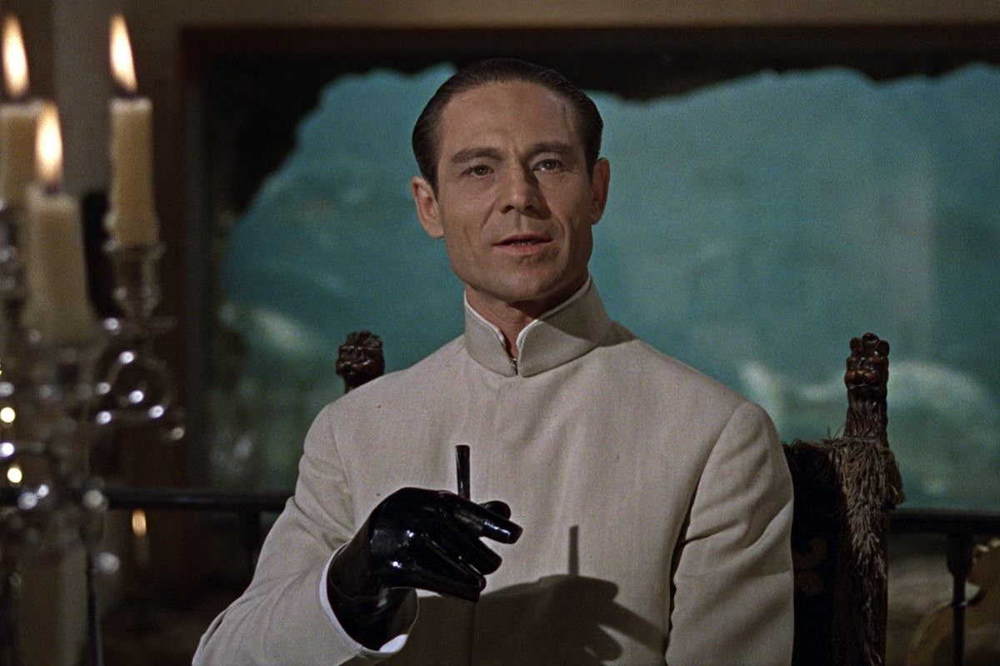

+++
titre = "<em>James Bond 007 contre Dr. No</em>, Terence Young"
title = "James Bond 007 contre Dr. No, Terence Young"
url = "/james-bond-007-contre-dr-no-young"
date = "2012-12-23T14:13:44"
Lastmod = "2013-05-11T09:51:25"
cover = "james-bond-007-dr-no-sean-connery.jpg"
categorie = [ "À voir" ]
tag = [ "Action", "Blockbuster", "Espionnage", "James Bond" ]
createur = [ "Terence Young" ]
acteur = [ "Joseph Wiseman", "Sean Connery", "Ursula Andress" ]
annee = [ "1962" ]
weight = 1962
saga = [ "James Bond" ]

+++

Le film qui allait lancer la saga <em>James Bond</em> et sa vingtaine de films a été réalisé avec un budget équivalent à 285 000 € d’aujourd’hui. Personne ne croyait à ce projet jugé trop britannique et trop adulte par Hollywood. <em>James Bond 007 contre Dr. No</em> n’est pas encore tout à fait un <em>James Bond</em>, mais c’est le premier d’entre eux et le long-métrage de Terence Young impose de nombreuses tendances pour la suite. Tout n’est pas encore là, les Aston Martin et les gadgets restent encore à imaginer — faute de moyens certainement —, mais l’esprit est là. Cinquante ans plus tard, ce film tranquille ne rivalise pas avec les productions actuelles sur le plan de l’action, bien évidemment, mais on ne peut qu’être frappé par tous les éléments encore présents dans la saga. <em>James Bond 007 contre Dr. No</em> mérite amplement d’être (re)vu par tous les fans du plus célèbre agent secret britannique…

Le premier film de la saga n’est pas le premier roman écrit par Ian Fleming et il faudra attendre 2006 et <a href="http://voiretmanger.fr/2012/11/18/casino-royale-campbell/" title="Casino Royale, Martin Campbell - À voir et à manger"><em>Casino Royale</em></a> pour enfin voir les débuts de l’agent 007 <a href="#footnote_0_7984" id="identifier_0_7984" class="footnote-link footnote-identifier-link" title="Les d&eacute;buts officiels, une version alternative et comique sort d&egrave;s 1967.">1</a>. Dans <em>James Bond 007 contre Dr. No</em>, l’agent 007 a déjà une dizaine d’années au service du MI6 et c’est un espion rompu à l’exercice qui part en mission en Jamaïque. L’agence britannique a perdu contact avec l’un de ses agents partis enquêter sur un mystérieux signal qui vient perturber le lancement d’une fusée américaine. James se rend sur place et découvre vite que de nombreuses personnes lui en veulent… à mort. L’agent finit par concentrer ses recherches sur l’énigmatique île du Dr. No qui ne laisse personne poser le pied sur son île où il mène des recherches secrètes et forcément suspectes. On s’en doute, ce Dr. No évoqué dès le titre du film fera tout pour empêcher l’agent secret de lui nuire… 

Un homme avance sur le côté et tire face à lui, vers le spectateur, dans un cercle qui se ferme. Cette séquence d’ouverture devenue un passage obligé de la saga <em>James Bond</em> est déjà présente, tout comme la musique mondialement célèbre qui identifie dès les premières notes l’agent 007. <em>James Bond 007 contre Dr. No</em> impressionne d’emblée par la concentration d’éléments distinctifs de la saga. Quelques minutes après le début du film, on découvre justement l’espion dans un casino et il dit pour la première fois le fameux « <em>Bond. James Bond.</em> » qui deviendra ensuite un élément distinctif, répété de film en film. Le film de Terence Young poursuit la liste sans fin : on a déjà des passages obligés, le débriefing avec M et après une courte séquence avec la secrétaire Moneypenny, la session armes et gadgets est elle aussi présente, même si ce n’est pas encore ça — il manque Q et James Bond n’a droit qu’à un seul élément, une arme toute bête, mais un <a href="http://fr.wikipedia.org/wiki/Walther_PPK">Walther PP</a> déjà. On retrouve aussi des courses-poursuites, sans Aston Martin toutefois, l’agent secret couche déjà avec trois filles successives et Ursula Andress impose un certain style pour toutes les James Bond Girls suivantes avec son interprétation de Honey Rider. <em>James Bond 007 contre Dr. No</em> peut aussi compter sur la présence, déjà, du SPECTRE, ce regroupement de méchants qui sera très souvent de la partie dans la saga. Plus important encore peut-être, même si ces détails forment l’ambiance de la saga, le film de Terence Young introduit un personnage mythique. 

<em>James Bond 007 contre Dr. No</em> doit imposer un personnage encore inconnu du public, le rendre mythique ou en tout cas lui offrir une chance de revenir sur les écrans. Le choix de l’acteur et son jeu étaient primordiaux et comme souvent le candidat retenu n’était pas le premier souhait des équipes. Qu’importe, Sean Connery incarne le premier l’agent secret et il impose son style à l’ensemble de la saga, si bien que tous ses successeurs n’auront d’autres choix que de jouer par rapport à lui, que ce soit sous la forme d’hommage ou au contraire en se distinguant au maximum. Terence Young opte pour la carte du flegme britannique et son agent secret sait rester toujours parfaitement calme, même quand les conditions sont difficiles. <em>James Bond 007 contre Dr. No</em> ne ménage en effet pas son personnage principal qui a droit à une captivité assez dure et une sortie meurtrie. L’agent 007 conserve toujours son flegme et n’hésite pas à sortir une petite plaisanterie sur le mode de l’ironie, comme les Anglais savent si bien le faire. Même si l’humour est encore rare dans ce premier épisode, ses prémices sont là, notamment à travers quelques piques de l’agent qui recommande de surveiller un cadavre pour ne pas le laisser s’échapper, ou encore quand il commente l’accident mortel de ses poursuivants en indiquant simplement qu’ils allaient à un enterrement. En quelques plans qui sont devenus cultes, Sean Connery parvient à offrir à James Bond une place incontournable sur les écrans et il n’est guère étonnant que l’acteur — et la saga — revienne deux ans plus tard seulement avec <em>Bons baisers de Russie</em>.

On l’évoquait, <em>James Bond 007 contre Dr. No</em> est un film d’action fauché. Les contraintes financières justifient beaucoup d’aspects dans le long-métrage de Terence Young, jusqu’au choix même du roman de Ian Fleming qui a été adapté. Cette histoire reste en effet très simple, avec en gros un seul lieu d’action et finalement assez peu de scènes d’action qui sont toujours très coûteuses. L’argent a été plutôt bien dépensé et même si certaines scènes ont mal vieilli — celle du dragon est assez ridicule, par exemple —, l’ensemble reste aujourd’hui très agréable à regarder. Le design minimaliste de la base du Dr. No par exemple est resté dans l’air du temps et l’utilisation minimale d’effets spéciaux évite le côté vieillot trop souvent présent dans les films de cette époque. Terence Young est parvenu à faire un film qui tient la route cinquante ans après, mais le plus impressionnant reste la <a href="http://www.amazon.fr/gp/product/B009R4KWGW/ref=as_li_ss_tl?ie=UTF8&#038;tag=leblogdenic07-21&#038;linkCode=as2&#038;camp=1642&#038;creative=19458&#038;creativeASIN=B009R4KWGW">bande originale</a>. Composée par Monty Norman, elle introduit le fameux thème James Bond, sans doute l’un des plus connus de l’histoire du cinéma, celui qui a peut-être le plus duré en tout cas. Présent dès 1962, il n’a quasiment pas bougé jusqu’à aujourd’hui et même <a href="http://voiretmanger.fr/2012/10/27/skyfall-mendes/" title="Skyfall, Sam Mendes - À voir et à manger"><em>Skyfall</em></a> construit sa propre musique autour de ce thème. Une belle performance, tant d’années après… Belle performance, indéniablement !

On ne fait plus de blockbusters d’action comme celui-ci, c’est une évidence, mais <em>James Bond 007 contre Dr. No</em> a étonnamment bien vieilli. Il faut dire que le nombre d’éléments communs à toute la saga déjà présents dans ce premier film est ahurissant et témoigne d’excellents choix de la part de l’équipe du film. Sean Connery impose le personnage de 007 et même après son départ au profit d’autres acteurs, son interprétation reste dans les mémoires. Quant à Terence Young, il réalise un film très honorable par rapport à son budget limité et compose un film culte, à (re)découvrir. 

<strong>James Bond reviendra dans… <a href="http://voiretmanger.fr/2012/12/30/bons-baisers-russie-young/" title="Bons baisers de Russie, Terence Young"><em>Bons baisers de Russie</em></a></strong>

<h3>Vous voulez m’aider ?<a href="#footnote_1_7984" id="identifier_1_7984" class="footnote-link footnote-identifier-link" title="&Agrave; propos de la publicit&eacute;&hellip;">2</a></h3>
<ul>
<li><a href="http://www.amazon.fr/gp/product/B001D45CHS/ref=as_li_ss_tl?ie=UTF8&#038;tag=leblogdenic07-21&#038;linkCode=as2&#038;camp=1642&#038;creative=19458&#038;creativeASIN=B001D45CHS">Acheter le film en Blu-Ray sur Amazon</a></li>
<li><a href="http://www.amazon.fr/gp/product/B000QUUQZS/ref=as_li_ss_tl?ie=UTF8&#038;tag=leblogdenic07-21&#038;linkCode=as2&#038;camp=1642&#038;creative=19458&#038;creativeASIN=B000QUUQZS">Acheter le film en DVD sur Amazon</a></li>
<li><a href="https://itunes.apple.com/fr/movie/james-bond-007-contre-dr./id561630851">Acheter ou louer le film sur l’iTunes Store</a></li>
</ul>
<ul>
<li><a href="http://www.amazon.fr/gp/product/B008U6R9B4/ref=as_li_ss_tl?ie=UTF8&#038;tag=leblogdenic07-21&#038;linkCode=as2&#038;camp=1642&#038;creative=19458&#038;creativeASIN=B008U6R9B4">Acheter la trilogie complète en Blu-Ray sur Amazon</a></li>
<li><a href="http://www.amazon.fr/gp/product/B008U6R93C/ref=as_li_ss_tl?ie=UTF8&#038;tag=leblogdenic07-21&#038;linkCode=as2&#038;camp=1642&#038;creative=19458&#038;creativeASIN=B008U6R93C">Acheter la trilogie complète en DVD sur Amazon</a></li>
</ul>

<ol class="footnotes"><li id="footnote_0_7984" class="footnote">Les débuts officiels, une version alternative et comique sort dès 1967. [<a href="#identifier_0_7984" class="footnote-link footnote-back-link">&#8617;</a>]</li><li id="footnote_1_7984" class="footnote"><a href="http://voiretmanger.fr/soutien/">À propos de la publicité…</a> [<a href="#identifier_1_7984" class="footnote-link footnote-back-link">&#8617;</a>]</li></ol>
