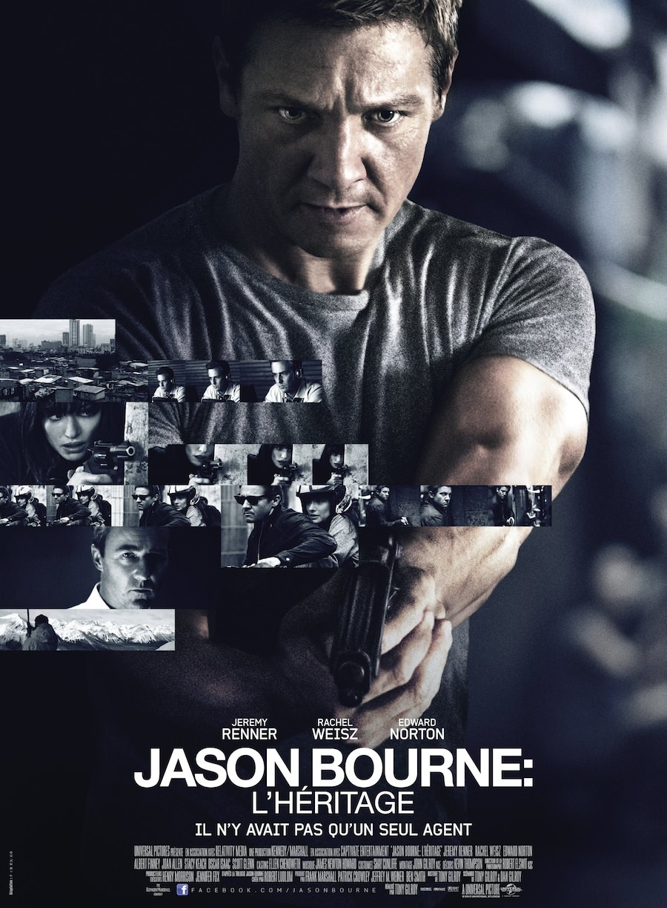
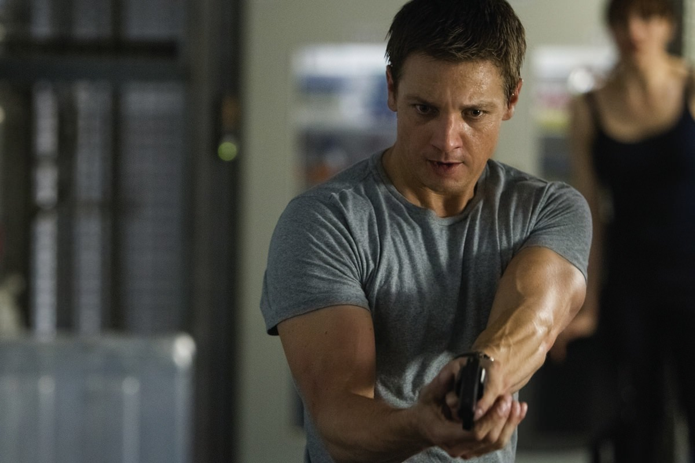

+++
type = "post"
titre = "<em>Jason Bourne : l&rsquo;héritage</em>, Tony Gilroy"
title = "Jason Bourne : l'héritage, Tony Gilroy"
url = "/jason-bourne-heritage-gilroy"
date = "2012-09-19T00:42:26"
Lastmod = "2013-06-30T18:01:57"
cover = "gilroy-jason-bourne-heritage.jpeg"
categorie = [ "À voir" ]
tag = [ "Action", "Blockbuster", "Espionnage", "Violence", "Vite oublié" ]
createur = [ "Tony Gilroy" ]
acteur = [ "Edward Norton", "Jeremy Renner", "Rachel Weisz" ]
annee = [ "2012" ]
weight = 2012
saga = [ "Jason Bourne" ]
pays = [ "États-Unis" ]
original = "The Bourne Legacy"

+++

Comment prolonger le succès d&rsquo;une trilogie qui a imposé de nouvelles règles devenues incontournables pour tous les films d&rsquo;action sortis depuis ? Le scénariste des trois films qui composent la trilogie <em>Jason Bourne</em> tente d&rsquo;apporter une réponse avec ce nouveau long-métrage qui entend assurer sa filiation dès son titre. <em>Jason Bourne : l&rsquo;héritage</em> aimerait sûrement avoir Jason Bourne sur son affiche, mais Matt Damon n&rsquo;a pas voulu poursuivre l&rsquo;aventure et c&rsquo;est Jeremy Renner qui prend la relève. Tony Gilroy a inventé un nouveau personnage, plus fort et plus puissant encore que Jason Bourne, mais surtout très proche, finalement. Le résultat est sans surprise : un blockbuster rythmé qui assure sa fonction de divertissement sans faire d&rsquo;étincelles…

<em>Jason Bourne : l&rsquo;héritage</em> commence en parallèle de la trilogie initiale. Jason Bourne est en fuite, les services secrets sont à ses trousses et l&rsquo;opération Treadstone est découverte par l&rsquo;opinion publique. Pam Landy s&rsquo;est concentrée sur un homme, passant à côté de l&rsquo;essentiel : les agences gouvernementales ne se sont pas contentées d&rsquo;un seul homme, elles ont mis en place plusieurs programmes, dont Outcome composé de neuf membres. Avec l&rsquo;affaire Bourne, ce programme devient trop dangereux et ses concepteurs décident d&rsquo;y mettre un terme en tuant les neuf agents et tous ceux qui travaillaient sur leur formation. Aaron Cross est l&rsquo;un des agents de ce programme et il suit un programme d&rsquo;entraînement et de survie en Alaska quand la fin d&rsquo;Outcome est mise en place. Il échappe de justesse à la mort et parvient à s&rsquo;enfuir ; il devient le second fugitif avec Jason Bourne et tente de survivre en allant chercher de l&rsquo;aide auprès d&rsquo;une médecin qui participait elle aussi au programme. Une véritable course contre la montre se met alors en place, entre les instigateurs d&rsquo;Outcome et Aaron qui essaie de survivre et de comprendre l&rsquo;étendue de ces forces très spéciales.

L&rsquo;intégration des trois premiers films est peut-être la meilleure idée de Tony Gilroy. Contrairement à ce que son titre pouvait laisser entendre, <em>Jason Bourne : l&rsquo;héritage</em> n&rsquo;est pas une suite, mais plutôt une histoire parallèle. Connaître la trilogie <em>Jason Bourne</em> n&rsquo;est évidemment pas indispensable pour comprendre ce film — on est quand même en présence d&rsquo;un blockbuster —, mais les références sont nombreuses et elles donnent vraiment le sentiment d&rsquo;un film pensé avec les précédents. On retrouve même certaines scènes piochées dans <em>La Mort dans la peau</em> ou dans <em>La Vengeance dans la peau</em>, comme l&rsquo;assassinat dans la gare ou les auditions autour de Treadstone. Malin, le scénario établit l&rsquo;action de ce film loin des caméras des journalistes, de l&rsquo;Alaska à Manille, de quoi ajouter du crédit à l&rsquo;idée que la fuite d&rsquo;Aaron se soit fait en parallèle de celle de Jason, sans jamais être publique. On retrouve ainsi des moments clés qui inscrivent explicitement <em>Jason Bourne : l&rsquo;héritage</em> dans l&rsquo;ensemble, même si les deux histoires sont bien différentes. Aaron ne rencontre jamais Jason, il ne le connaît même pas et les hommes et femmes à ses trousses ne sont pas les mêmes. Reste que la saga gagne ainsi en homogénéité, un bon point qui permet à Tony Gilroy de dépasser le simple argument commercial.

Si la recherche de continuité et de liens avec la trilogie <em>Jason Bourne</em> est incontestablement une bonne idée, le risque était d&rsquo;être trop proche et de donner dans la redite. Sur ce point, force est de constater que le bilan est mitigé. Tony Gilroy a choisi de moins accentuer la part d&rsquo;action dans <em>Jason Bourne : l&rsquo;héritage</em>, ce qui offre à ce dernier un rythme et une ambiance un peu différente de ses prédécesseurs. Aaron est censé être une version stabilisée de Jason Bourne et cela se voit : il est plus posé, moins brutal et se fond mieux dans la masse. D&rsquo;aucuns regretteront certainement cette orientation nouvelle de la saga, orientation renforcée par l&rsquo;intrigue secondaire des médicaments qui prend beaucoup de place sur les 2h15 du film. On ne peut pas reprocher au cinéaste toutefois d&rsquo;avoir voulu faire différemment et d&rsquo;imposer sa marque. Il faut dire qu&rsquo;il ne pouvait pas vraiment faire autrement : quand <em>Jason Bourne : l&rsquo;héritage</em> revient dans sa dernière partie à l&rsquo;action brute qui a fait la marque de fabrique de la saga, Tony Gilroy montre ses faiblesses et fait dans la caricature du style de Paul Greengrass. Non seulement son personnage principal et son film deviennent vraiment trop proches des originaux, mais l&rsquo;action est en outre assez brouillonne, non content d&rsquo;être sans grande originalité. Au total, ce blockbuster ne satisfait jamais vraiment : tout ce qui concerne les organisations et les agents secrets gagnerait à être développé, enrichi et précisé, tandis que l&rsquo;action qui finit par dominer est assez peu convaincante. <em>Jason Bourne : l&rsquo;héritage</em> n&rsquo;est en tout cas pas aussi convaincant que ses prédécesseurs et il laisse un sentiment d&rsquo;inachevé, tout en restant malgré tout très efficace.

Troisième réalisation pour Tony Gilroy, <em>Jason Bourne : l&rsquo;héritage</em> tranche avec ses deux films précédents. <a title="Duplicity, Tony Gilroy" href="http://voiretmanger.fr/2009/04/04/duplicity-tony-gilroy/"><em>Duplicity</em></a> comme <em>Michael Clayton</em> avant lui n&rsquo;étaient pas du tout des films d&rsquo;action, mais des blockbusters bien ficelés. On l&rsquo;a déjà évoqué, le cinéaste n&rsquo;est pas très à l&rsquo;aise quand il s&rsquo;agit de filmer de l&rsquo;action et il se contente ici de reprendre le travail de son prédécesseur. N&rsquo;est pas Paul Greengrass qui veut toutefois et ses courses-poursuites à moto ou sur les toits de Manille ne valent pas celles de la trilogie originale, elles sont brouillonnes et manquent surtout de fraicheur et de naturel. Le film reste malgré tout plaisant et assure le spectacle, ce qui est après tout le minimum pour un blockbuster de cette envergure. Pour remplacer Matt Damon, Jeremy Renner assure, mais son personnage plus monocorde est bien moins intéressant. Autour de lui, Rachel Weisz s&rsquo;en sort bien, mais les méchants à la poursuite d&rsquo;Aaron sont assez mal exploités.

<em>Jason Bourne : l&rsquo;héritage</em> souffre de son héritage qu&rsquo;il met pourtant en avant avec tant de force. L&rsquo;idée d&rsquo;une poursuite parallèle à celle de Jason Bourne est intéressante et Tony Gilroy l&rsquo;exploite très bien. Le cahier des charges prévoyait aussi une bonne dose d&rsquo;action, malheureusement : c&rsquo;est manifestement le point faible du cinéaste et cela se sent lors des courses-poursuites finales. On aurait préféré un film tourné vers l&rsquo;intérieur, vers les cellules de crise qui tentent de régler le problème avant sa sortie publique. <em>Jason Bourne : l&rsquo;héritage</em> aurait sans doute été moins efficace, mais peut-être plus intéressant. À défaut, il faut se contenter d&rsquo;un blockbuster qui assure le spectacle à défaut de rester dans les mémoires. De quoi, au moins, donner envie de revoir les trois films originaux…

<h3>Vous voulez m&rsquo;aider ?<a href="#footnote_0_7468" id="identifier_0_7468" class="footnote-link footnote-identifier-link" title="&Agrave; propos de la publicit&eacute;&hellip;">1</a></h3>
<ul>
<li><a href="http://www.amazon.fr/gp/product/B009CAMJWQ/ref=as_li_ss_tl?ie=UTF8&#038;tag=leblogdenic07-21&#038;linkCode=as2&#038;camp=1642&#038;creative=19458&#038;creativeASIN=B009CAMJWQ">Acheter le film en Blu-Ray sur Amazon</a></li>
<li><a href="http://www.amazon.fr/gp/product/B009CAMJFS/ref=as_li_ss_tl?ie=UTF8&#038;tag=leblogdenic07-21&#038;linkCode=as2&#038;camp=1642&#038;creative=19458&#038;creativeASIN=B009CAMJFS">Acheter le film en DVD sur Amazon</a></li>
<li><a href="https://itunes.apple.com/fr/movie/jason-bourne-lheritage/id566479860">Acheter ou louer le film sur l&rsquo;iTunes Store</a></li>
</ul>
<ul>
<li><a href="http://www.amazon.fr/gp/product/B009PPMXTW/ref=as_li_ss_tl?ie=UTF8&#038;tag=leblogdenic07-21&#038;linkCode=as2&#038;camp=1642&#038;creative=19458&#038;creativeASIN=B009PPMXTW">Acheter la saga <em>Jason Bourne</em> en Blu-Ray sur Amazon</a></li>
<li><a href="http://www.amazon.fr/gp/product/B009PPMX42/ref=as_li_ss_tl?ie=UTF8&#038;tag=leblogdenic07-21&#038;linkCode=as2&#038;camp=1642&#038;creative=19458&#038;creativeASIN=B009PPMX42">Acheter la saga <em>Jason Bourne</em> en DVD sur Amazon</a></li>
</ul>

<ol class="footnotes"><li id="footnote_0_7468" class="footnote"><a href="http://voiretmanger.fr/soutien/">À propos de la publicité…</a> [<a href="#identifier_0_7468" class="footnote-link footnote-back-link">&#8617;</a>]</li></ol>
