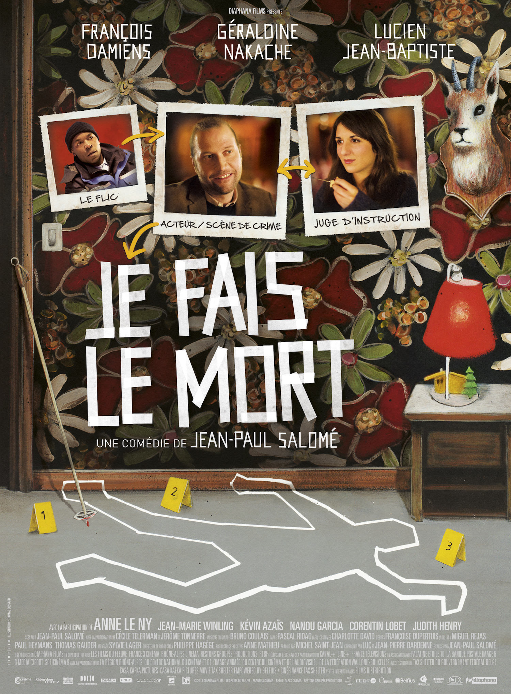
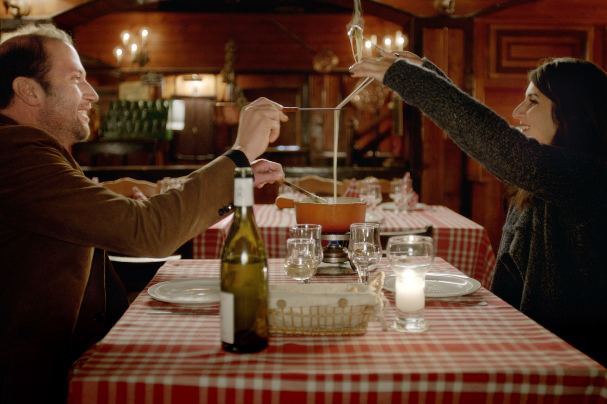

+++
titre = "<em>Je fais le mort</em>, Jean-Paul Salomé"
title = "Je fais le mort, Jean-Paul Salomé"
url = "/je-fais-le-mort-salome"
date = "2014-10-26T22:27:14"
Lastmod = "2014-10-27T09:02:37"
cover = "je-fais-le-mort-salome-francois-damiens.jpg"
categorie = [ "À voir" ]
tag = [ "Acteurs", "Ambiance", "Amour", "Comédie", "Drame", "Enquête", "Metafilm", "Mort", "Polar", "Police" ]
createur = [ "Jean-Paul Salomé" ]
acteur = [ "Anne Le Ny", "Corentin Lobet", "François Damiens", "Géraldine Nakache", "Jean-Marie Winling", "Kévin Azaïs", "Lucien Jean-Baptiste", "Nanou Garcia" ]
annee = [ "2013" ]
weight = 2013
pays = [ "France" ]

+++

Jean Renault s&rsquo;appelle presque comme le célèbre acteur français, mais tout est dans le presque. Ce comédien quarantenaire a connu son heure de gloire trop jeune, il a pris la grosse tête, refusé les propositions quand il en avait… et quand il s&rsquo;est rendu compte qu&rsquo;il n&rsquo;en aurait pas longtemps, c&rsquo;était déjà trop tard. Quand <em>Je fais le mort</em> commence, il n&rsquo;a plus que sa réputation de perfectionniste pénible et les seuls seconds rôles qu&rsquo;il obtient encore sont coupés au montage. Ses enfants ont honte de ses publicités pour des médicaments digestif et quand l&rsquo;ANPE lui propose un contrat pour jouer le mort sur des scènes de crime reconstituées par la justice, il n&rsquo;a pas d&rsquo;autres choix que d&rsquo;accepter. À la clé, Jean-Paul Salomé signe un long-métrage qui sait prendre son temps pour imposer son humour atypique, sur fond d&rsquo;ambiance plombante de station d&rsquo;hiver hors saison. Une œuvre atypique et réussie.

Le personnage principal de <em>Je fais le mort</em> est un acteur et c&rsquo;est aussi l&rsquo;un des sujets du film. En ce sens, le dernier long-métrage de Jean-Paul Salomé a quelque chose du « meta-film » : le scénario ne cesse de poser la question de la mise en scène, mais aussi celle de l&rsquo;histoire. Comment raconter une histoire, comment la présenter et puis, comment raconter une histoire de manière crédible ? Dans la toute première scène, on découvre Jean Renault alors qu&rsquo;il joue sur le tournage d&rsquo;une autre série policière. Il incarne un policier, un rôle secondaire totalement insignifiant, dans une scène également sans intérêt, où son rôle se résume en gros à ouvrir la portière d&rsquo;une voiture. Mais cet acteur, qui a une très haute opinion de lui-même et qui veut toujours être entièrement dans un personnage, exige de la part de la réalisatrice des explications complètes. Comment ouvrir cette portière ? Il y a dix manières d&rsquo;ouvrir une portière ! Finalement, il sera coupé au montage et viré du tournage, mais cette scène est intéressante par rapport à ce qui suit. <em>Je fais le mort</em> déroule ensuite son intrigue principale : Jean est obligé d&rsquo;accepter de jouer le mort pour la justice, ce qui est en théorie le pire boulot pour un acteur. Il faut accepter de participer de mettre son talent en veilleuse dans des scènes où l&rsquo;objectif n&rsquo;est pas de développer un quelconque sens artistique, mais de reproduire la réalité de la manière la plus fidèle possible, pour essayer de vérifier les déclarations des uns et des autres, en vue du procès. Pour un acteur qui veut s&rsquo;affirmer autant que Jean, c&rsquo;est le cauchemar, mais pourtant, sa personnalité revendicatrice va faire avancer l&rsquo;enquête.

Alors que le long-métrage commence comme une comédie légère et peut-être un peu facile, Jean-Paul Salomé sème rapidement le trouble et mélange les genres. Quand il déplace l&rsquo;action et nous fait entrer à Megève en hiver, mais hors saison, le vide et l&rsquo;ambiance humide et triste n&rsquo;appelle plus du tout à rire, en tout cas plus sur le mode léger de la comédie que l&rsquo;on attendait. De fait, <em>Je fais le mort</em> évolue doucement et c&rsquo;est l&rsquo;enquête qui finit par prendre le dessus sur tout le reste. En refusant d&rsquo;incarner bêtement le rôle qu&rsquo;on lui assigne, Jean Renault découvre sans vraiment le vouloir que les conclusions de l&rsquo;enquête menée un an plus tôt par la gendarmerie étaient peut-être un peu hâtives. La victime n&rsquo;a pas pu rester là sans entendre le meurtrier entrer, elle n&rsquo;a pas pu mourir sans chercher à se défendre et justement, elle avait de quoi se battre à porter de mains, alors pourquoi ne l&rsquo;aurait-elle pas fait ? La juge d&rsquo;instruction reste d&rsquo;abord hermétique à ces questions incessantes et elle aussi est un peu agacée face à cet acteur qui ne veut pas faire son travail sans discuter, mais elle finit par accepter que, peut-être, il y a du vrai dans ce qu&rsquo;il dit. Et petit à petit, elle rouvre l&rsquo;enquête et découvre qu&rsquo;il avait raison. Naturellement, Jean-Paul Salomé n&rsquo;évite pas la romance, mais <em>Je fais le mort</em> n&rsquo;est absolument pas de ces comédies romantiques où l&rsquo;histoire amoureuse prend le dessus et où le reste n&rsquo;est que prétexte. Ce long-métrage est décidément plus original qu&rsquo;il ne pourrait en avoir l&rsquo;air et, jusqu&rsquo;au bout, son humour si original et son enquête restent au cœur des enjeux, tandis que l&rsquo;intrigue amoureuse reste reléguée au second plan.

Porté par un François Damiens en grande forme — l&rsquo;acteur ne cabotine pas, il est précisément là où il doit être, mais il est exactement là où il faut, c&rsquo;est impressionnant —, <em>Je fais le mort</em> est un film surprenant. Tantôt comédie sociale, tantôt comédie romantique, c&rsquo;est aussi un polar avec une vraie enquête et du suspense — chapeau si vous devinez qui est le coupable avant la fin ! — et c&rsquo;est également un film sur la condition d&rsquo;acteurs. Jean-Paul Salome signe-là un long-métrage protéiforme maîtrisé et juste.

<h3>Vous voulez <a href="http://voiretmanger.fr/soutien/">m&rsquo;aider</a> ?</h3>
<ul>
<li><a href="http://www.amazon.fr/gp/product/B00HWGKM9Y/ref=as_li_ss_tl?ie=UTF8&amp;tag=leblogdenic07-21&amp;linkCode=as2&amp;camp=1642&amp;creative=19458&amp;creativeASIN=B00HWGKM9Y">Acheter le film en Blu-ray sur Amazon</a></li>
<li><a href="http://www.amazon.fr/gp/product/B00HWGKM8A/ref=as_li_ss_tl?ie=UTF8&amp;tag=leblogdenic07-21&amp;linkCode=as2&amp;camp=1642&amp;creative=19458&amp;creativeASIN=B00HWGKM8A">Acheter le film en DVD sur Amazon</a></li>
<li><a href="https://itunes.apple.com/fr/movie/je-fais-le-mort/id839924639">Acheter ou louer le film sur l&rsquo;iTunes Store</a></li>
</ul>

