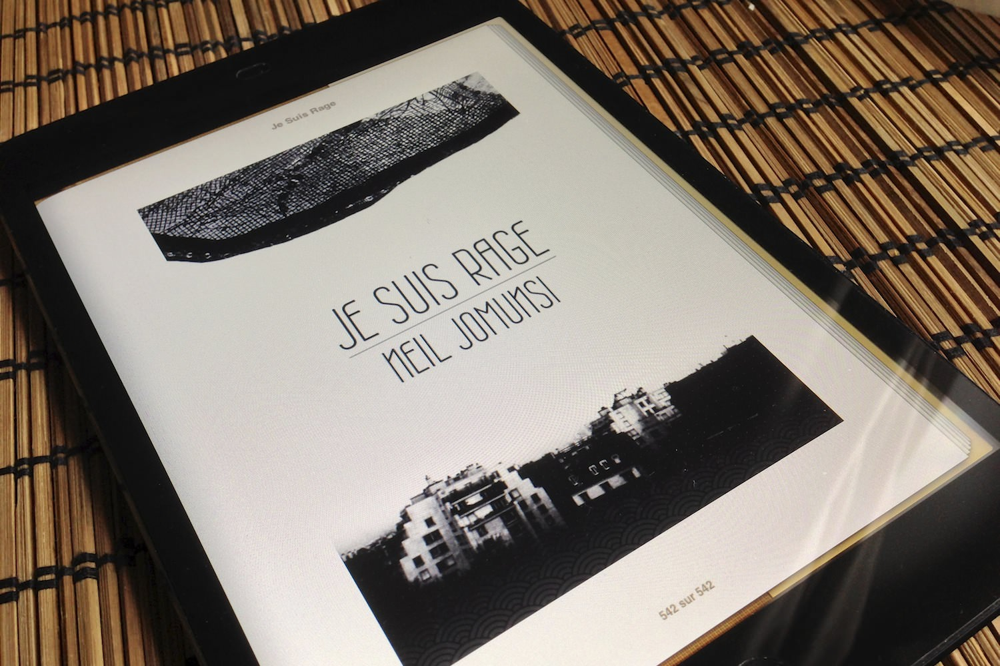
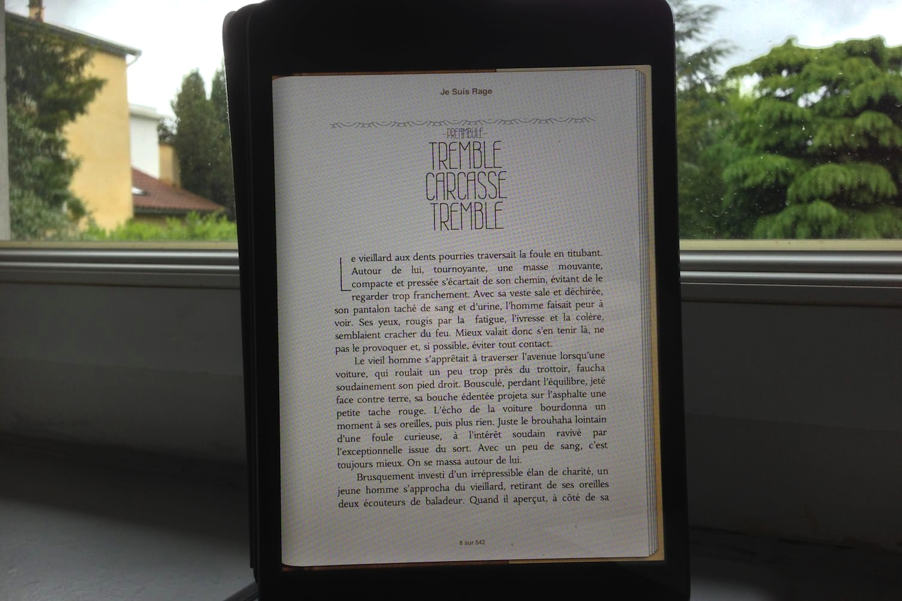

+++
type = "post"
titre = "<em>Je suis Rage</em>, Neil Jomunsi"
title = "Je suis Rage, Neil Jomunsi"
url = "/je-suis-rage-jomunsi"
date = "2013-05-22T11:32:55"
Lastmod = "2013-05-29T22:36:14"
cover = "neil-jomunsi-je-suis-rage.jpg"
categorie = [ "À lire" ]
tag = [ "Fantastique", "Heroïc-Fantasy", "Humour noir", "Mort", "Peur", "Roman", "Société" ]
createur = [ "Neil Jomunsi" ]
annee = [ "2013" ]
weight = 2013
pays = [ "France" ]

+++

<blockquote class="pull-quote">
Ainsi se définit l’esprit humain, et il serait bien inutile de chercher la complexité là où elle n’existe pas. L’humanité, restreinte en quatre principes, se trouve ainsi résumée.

Cette affirmation ne souffrira d’aucune contestation.<cite class="author"> — Neil Jomunsi, Je suis rage, Chapitre 1</cite>

</blockquote>

<em>Je suis Rage</em> peut bien commencer par cette affirmation qui entend ne pas être contestée, le premier roman de Neil Jomunsi est de fait inclassable et ne peut être résumé à un seul genre. C’est sans doute ce qui fait sa force, c’est en tout cas ce qui déroutera tous ceux qui essaient de s’y attaquer. On ne sait jamais vraiment où on va en suivant ce récit bizarre où un anti-héros tout ce qu’il y a de plus ordinaire produit une créature qui n’a rien à envier à l’Alien de <a href="/saga/alien/">la saga du même nom</a>, avant de s’engager dans une sorte de grande bataille comme seul l’heroïc-fantasy sait en produire. Voilà bien un roman qui ne laissera personne indifférent, à défaut de convaincre tout le monde : si vous aimez les lectures originales, ne ratez pas ce <em>Je suis Rage</em> vraiment étonnant. 

L’humour potache de la série <a href="/jesus-contre-hitler-jomunsi/" title="Jésus contre Hitler, Neil Jomunsi"><em>Jésus contre Hitler</em></a> est bien loin et c’est tout à fait sensible dès les premières pages du roman. Neil Jomunsi a manifestement cherché à ne pas se répéter et c’est très bien ainsi. <em>Je suis Rage</em> est tout d’abord plus long avec ses 400 pages environ et il est surtout plus ambitieux. Les habitués retrouveront l’écriture de l’auteur et ce style qui hésite souvent entre sérieux et second degré. D’ailleurs, on ne sait pas trop que penser des premiers chapitres et le lecteur oscille constamment entre un premier degré qui risque de sombrer dans le ridicule — le regroupement de l’humanité en quatre classes différentes est un peu simplet — et un second degré très noir qui avance souvent sans donner son nom. Le ton est en fait donné, <em>Je suis Rage</em> se veut totalement inclassable et il multiplie les genres différents jusqu’à la fin. L’histoire commence comme une sorte de chronique sociale au vitriol : dans le préambule, on suit les pas d’un vieillard qui vit dans la rue et qui scande des horreurs à tous les passants, avant de s’intéresser à celui qui, faute de mieux, fait office de héros du récit. Hermann Heliophas est d’emblée qualifié par l’auteur de misanthrope : « <em>Dire à propos d’Hermann Heliophas qu’il haïssait profondément l’humanité eut été une approximation confinant à l’euphémisme.</em> » (<em>Je suis Rage</em>, chapitre 2). Ce personnage qui hait ses semblables souffre aussi de terribles migraines quand commence le roman, alors que dans le même temps, de terribles incidents se déroulent un petit peu partout dans Paris, la capitale française faisant office de décor. Le roman de Neil Jomunsi commence ainsi également avec une sorte d’enquête policière en suivant cette fois l’inspecteur Legrasse qui semble d’ailleurs incapable de faire quoi que ce soit pour contrer ces vagues de violence qui prennent subitement à des habitants normaux. Pour finir, <em>Je suis Rage</em> introduit rapidement Lucie qui fait office d’héroïne si Hermann est le héros. Si ce dernier est un misanthrope, elle est maladivement peureuse, à tel point qu’elle ne sort plus tout de chez elle : « <em>Lucie était ce que l’on pourrait appeler une fille peureuse. On pourrait même dire, sans exagérer, qu’elle était complètement rongée par la peur, la grande peur, celle qui bouche toute possibilité de vie, celle qui croque les tripes.</em> » (<em>Je suis Rage</em>, chapitre 5). Deux anti-héros, une situation de crise exceptionnelle qui secoue le tout Paris : le cadre général est posé et l’histoire extraordinaire peut commencer.

Difficile de résumer l’intrigue de <em>Je suis Rage</em>, déjà parce l’on ne voudrait pas en dévoiler des passages clé, mais aussi parce qu’elle est beaucoup trop alambiquée pour la résumer en quelques mots. Disons simplement que Neil Jomunsi mène ses lecteurs à la baguette et les porte vers des genres très différents. On a une enquête policière avec la violence spontanée dans les rues parisiennes, un conte fantastique avec l’univers de Lucie, de l’horreur avec la Rage, puis finalement une sorte de grande épopée heroïc-fantasy autour du combat entre la Rage et la Peur. Le principe de départ est que Hermann et Lucie produisent, chacun de leur côté, une créature fantastique qui soit le double de leur personnalité. Le premier expulse de son crâne la Rage, une créature arachnéenne très puissante et destructrice. Lucie s’enferme dans un monde imaginaire parfait, mais qui va créer la Peur, une créature humanoïde dotée de pouvoirs importants. Une fois ces deux entités créées, <em>Je suis Rage</em> abandonne le ton réaliste qu’il empruntait parfois au profit d’un récit beaucoup plus axé sur le fantastique : les morts vont se réveiller, on va découvrir un univers de clochard sous la ville, etc. Pendant la lecture, on se demande souvent où l’on va et comment va finir le roman : c’est un gage de qualité, mais c’est aussi parfois un petit peu frustrant. Le récit imaginé par Neil Jomunsi est bouillonnant et parfois un peu brouillon, mais qui passe toujours très bien, du moins à condition d’accepter de lire quelque chose de totalement déjanté. Le mieux, c’est de se laisser porter par <em>Je suis Rage</em> et de ne pas s’arrêter aux multiples bizarreries du récit. Il faut bien reconnaître que l’on a rarement l’occasion de lire quelque chose d’aussi original et qui déjoue constamment nos attentes, ce qui est de toute manière une bonne chose. 

<em>Je suis Rage</em> adopte un ton totalement nouveau et après des nouvelles et des livres dont vous être le héros, Neil Jomunsi réussit plutôt bien sa transition au roman. C’est un récit plus ambitieux et surtout marqué par la surprise constante de la part d’un auteur qui semble prendre un malin plaisir à nous emmener là où l’on ne s’y attend pas. C’est souvent déroutant, mais c’est naturellement voulu : à découvrir si vous aimez les lectures surprenantes. 

<h3>Vous voulez m&rsquo;aider ?<a href="#footnote_0_9511" id="identifier_0_9511" class="footnote-link footnote-identifier-link" title="&Agrave; propos de la publicit&eacute;&hellip;">1</a></h3>
<ul>
<li><a href="https://itunes.apple.com/fr/book/je-suis-rage/id622544469?mt=11">Acheter le livre sur l&rsquo;iBookstore</a></li>
<li><a href="http://www.amazon.fr/gp/product/B00BW1IPS0/ref=as_li_ss_tl?ie=UTF8&tag=leblogdenic07-21&linkCode=as2&camp=1642&creative=19458&creativeASIN=B00BW1IPS0">Acheter le livre au format Kindle sur Amazon</a></li>
<li><a href="http://store.walrus-books.com/je-suis-rage/"><em>Je suis Rage</em> sur le site de l&rsquo;éditeur</a></li>
</ul>

<ol class="footnotes"><li id="footnote_0_9511" class="footnote"><a href="/soutien/">À propos de la publicité…</a> [<a href="#identifier_0_9511" class="footnote-link footnote-back-link">&#8617;</a>]</li></ol>
