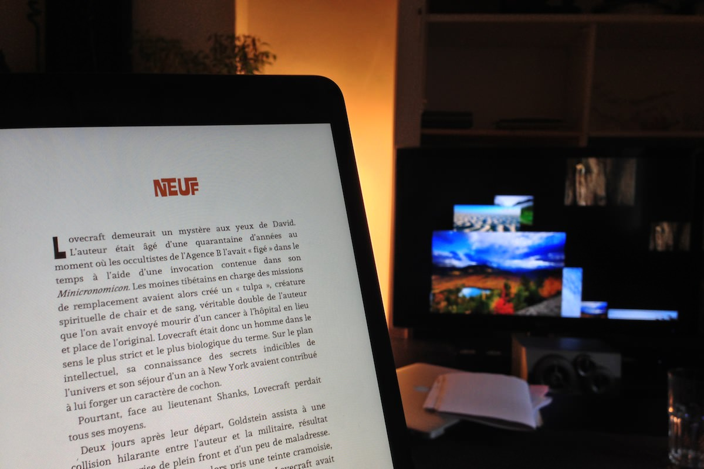
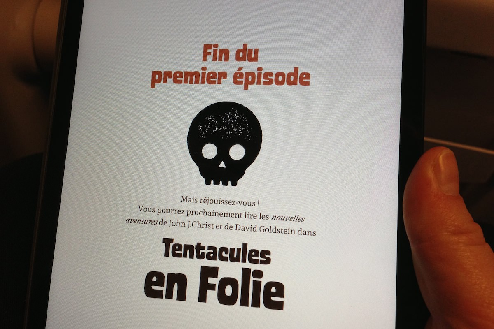
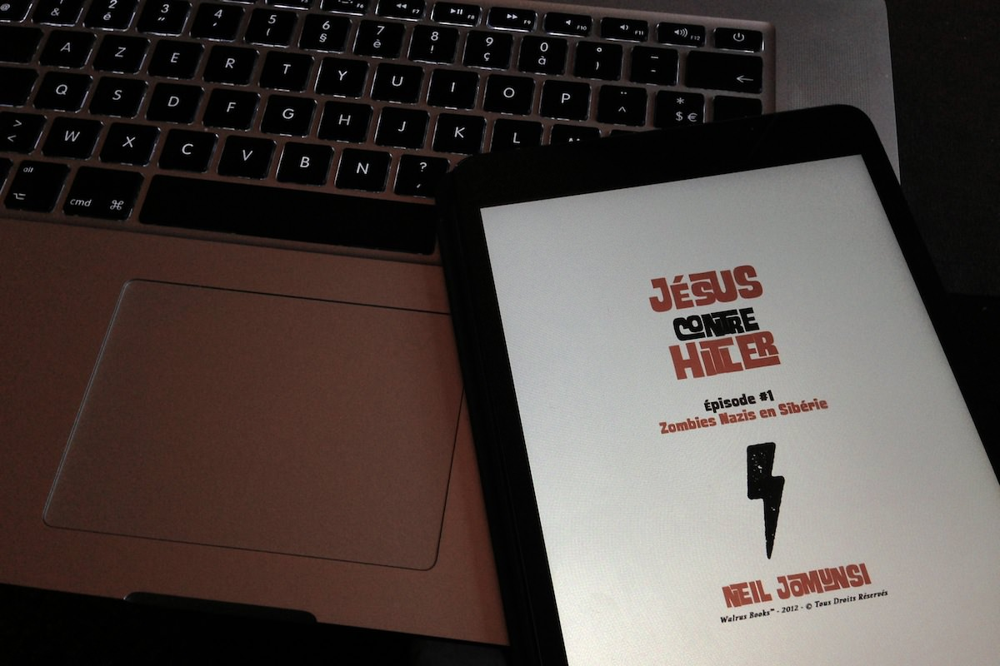

+++
type = "post"
titre = "<em>Jésus contre Hitler</em>, Neil Jomunsi"
title = "Jésus contre Hitler, Neil Jomunsi"
url = "/jesus-contre-hitler-jomunsi"
date = "2012-11-13T23:45:16"
Lastmod = "2013-09-15T16:12:47"
cover = "jesus-contre-hitler-jomunsi.jpg"
categorie = [ "À lire" ]
tag = [ "Fantastique", "Histoire", "Humour", "Religion", "Science-Fiction", "Série" ]
createur = [ "Neil Jomunsi" ]
annee = [ "2012" ]
weight = 2012
pays = [ "France" ]

+++

Si les séries connaissent le succès que l&rsquo;on sait depuis plusieurs années à la télévision, ce n&rsquo;est pas vraiment le cas en littérature. Les sagas comme <em>Harry Potter</em> ou <em>Twilight</em> se vendent par millions, mais il ne s&rsquo;agit pas de ces séries à l&rsquo;ancienne où chaque épisode peut être lu indépendamment des autres. C&rsquo;est justement ce genre un peu désuet que l&rsquo;éditeur exclusivement numérique Walrus a choisi de remettre au goût du jour avec <em>Jésus contre Hitler</em>. Rédigée par Neil Jomunsi, cette série assume son côté décalé dès son titre et affirme ensuite par ses récits loufoques où Jésus aide l&rsquo;armée américaine à combattre Adolf Hitler ressuscité son goût pour les histoires loufoques et les séries B. Si vous aimez les zombies nazis et les dieux poulpes, ne passez surtout pas à côté de <em>Jésus contre Hitler</em>. 

L&rsquo;histoire commence quand David Goldstein, un militaire américain sur-entraîné est convoqué par son supérieur hiérarchique dans les années 1960. Dans le bureau, un homme à l&rsquo;aspect négligé les attend. La trentaine, barbu et extrêmement mince, il regarde d&rsquo;un air dédaigneux le militaire et juge que ce n&rsquo;est pas une recrue digne de lui. Le lecteur ne peut pas encore le savoir avec certitude, même si le titre de la saga — <em>Jésus contre Hitler</em> – doit bien le faire douter un peu : cet homme qualifié de hippie par David n&rsquo;est autre que Jésus, le fils de Dieu crucifié dans les années 30. Dans l&rsquo;univers parallèle imaginé par Neil Jomunsi, Jésus est revenu sur Terre pour combattre le Mal avec un grand &laquo;&nbsp;m&nbsp;&raquo; : Adolf Hitler, rien que ça. John J. Christ, c&rsquo;est son nom d&rsquo;emprunt, a décidé de revenir pour combattre le nazi qui a manifestement trouvé comment ressusciter à chaque fois qu&rsquo;il meurt. John a mis en place l&rsquo;Agence B, un organisme secret chargé uniquement de la destruction de Hitler et de ses tentatives d&rsquo;instaurer le mal sur la planète. Depuis la fin de la Seconde Guerre mondiale, Jésus et Hitler mènent une lutte sans merci… ou plutôt un jeu de cache-cache permanent compliqué par leur propension à revenir systématiquement après la mort…

Faire s&rsquo;affronter Jésus et Hitler, il fallait oser ! Comme l&rsquo;explique l&rsquo;éditeur <a href="http://www.walrus-books.com/blog/2012/08/28/jesus-contre-hitler-1/">sur son blog</a> à l&rsquo;occasion de la sortie du premier épisode, le pari était de construire une série autour de deux figures qui représenteraient le Bien et le Mal, tout simplement. Le choix de Jésus et de Hitler s&rsquo;est rapidement imposé : qui, en effet, pourrait le mieux représenter cette opposition ? Restait toutefois à les rassembler dans un récit qui tienne la route et Neil Jomunsi a fait appel pour cela à l&rsquo;outrance. Jugez plutôt : <em>Zombies Nazis en Sibérie</em>, le premier épisode, permet de découvrir les deux personnages principaux — David Goldstein et John J. Christ — et leur ennemi —Hitler bien sûr — dans une usine de Sibérie où les nazis créent des zombies à partir de cadavres extraits de cimetières. Dans le second épisode, l&rsquo;imagination manifestement illimitée de l&rsquo;auteur s&rsquo;attaque à Cthulhu, un Dieu poulpe endormi, et il fait même intervenir H.P. Lovercraft, oui, l&rsquo;écrivain. 

On l&rsquo;aura compris, <em>Jésus contre Hitler</em> est une série humoristique et l&rsquo;humour est bien au rendez-vous. Il faut bien sûr accepter un récit loufoque où l&rsquo;irrévérence permanente se teinte de pointes de fantastique, voire d&rsquo;horreur cheap. Le récit de Neil Jomunsi fleure en permanence avec la série B et l&rsquo;auteur a le bon sens de ne jamais se prendre trop au sérieux. Pour ma part, j&rsquo;ai totalement adhéré à ce mélange de lutte ridicule contre le mal et de piques contre, non pas tant la religion elle-même, mais plutôt les enseignements bibliques. Le personnage de John n&rsquo;arrête pas de blasphémer son Père<a href="#footnote_0_7737" id="identifier_0_7737" class="footnote-link footnote-identifier-link" title="&Eacute;pisode 1, chapitre 18, l&rsquo;auteur fait prononcer ces mots &agrave; John&nbsp;: &laquo;&nbsp;Salue mon P&egrave;re si tu le vois. Et dis-lui bien que son Fils l&rsquo;emmerde&nbsp;&raquo;">1</a>, il rabaisse continuellement son importance et se moque de tous ceux qui le considèrent comme un Messie. Le Jésus de Neil Jomunsi est à des années-lumière de l&rsquo;image que l&rsquo;on peut en avoir dans la Bible, tandis que Hitler est présenté comme un gamin qui cherche en permanence à s&rsquo;en prendre au camp d&rsquo;en face. Le chef des nazis cherche surtout des solutions totalement loufoques, comme en témoigne bien <em>Zombies Nazis en Sibérie</em> : tout ça n&rsquo;est pas très sérieux, et c&rsquo;est même assez drôle.

Le style de Neil Jomunsi est simple, mais direct et très efficace. On ne perd pas son temps en explications et descriptions : le lecteur est plongé directement dans le récit et on embarque tout aussi rapidement dans les aventures loufoques du duo de personnages. Chaque épisode est assez bref — comptez une centaine de pages pour le premier, 130 pour le second — et on peut compter à chaque fois sur des chapitres très courts, parfaits pour lire dans les transports en commun. Ils sont aussi parfaitement adaptés à l&rsquo;esprit série B de l&rsquo;ensemble et on lit <em>Jésus contre Hitler</em> sans trop y penser, pour le plaisir simple, mais souvent trop rare, de suivre des aventures complètement folles. Les dialogues assez nombreux ajoutent beaucoup de dynamisme à l&rsquo;ensemble qui sera terminé en quelques minutes, une heure ou deux au maximum pour les deux épisodes sortis pour le moment. Un format idéalement adapté au format numérique et qui s&rsquo;appréciera sur toutes les tailles d&rsquo;écran. 

<em>Zombies Nazis en Sibérie</em>, le premier épisode de <em>Jésus contre Hitler</em>, est proposé gratuitement par son éditeur sur toutes les plateformes de téléchargement légal. Si vous possédez une liseuse, une tablette ou même un smartphone et que vous aimez les séries B et les aventures épiques, vous n&rsquo;avez aucune raison de ne pas télécharger cet épisode et de découvrir l&rsquo;imagination débordante de Neil Jomunsi. Ce récit sans prétention et même souvent ridicule — c&rsquo;est là tout son intérêt — pourrait bien vous plaire tant que vous voudrez lire <em>Tentacules en folie</em>, la suite. Et quand vous aurez fini ce deuxième épisode, il ne vous restera plus qu&rsquo;à patienter pour le troisième <a href="https://twitter.com/studiowalrus/status/268397625420697600" target="_blank">en cours de relecture</a> et motiver l&rsquo;auteur <a href="https://twitter.com/#!/NeilJomunsi">sur Twitter</a> pour le quatrième. Vous serez alors devenu accroc à <em>Jésus contre Hitler</em>, mais rassurez-vous, ce n&rsquo;est pas très grave…

<h3>Vous voulez m&rsquo;aider ?<a href="#footnote_1_7737" id="identifier_1_7737" class="footnote-link footnote-identifier-link" title="&Agrave; propos de la publicit&eacute;&hellip;">2</a></h3>
<ul>
<li><a href="http://www.amazon.fr/gp/product/B0090KEIFY/ref=as_li_ss_tl?ie=UTF8&tag=leblogdenic07-21&linkCode=as2&camp=1642&creative=19458&creativeASIN=B0090KEIFY">Télécharger l&rsquo;épisode 1 gratuitement sur Amazon (format Kindle)</a></li>
<li><a href="http://www.amazon.fr/gp/product/B009KMLE7M/ref=as_li_ss_tl?ie=UTF8&tag=leblogdenic07-21&linkCode=as2&camp=1642&creative=19458&creativeASIN=B009KMLE7M">Acheter l&rsquo;épisode 2 sur Amazon (format Kindle)</a></li>
<li><a href="http://www.amazon.fr/gp/product/B00AGY7WEM/ref=as_li_ss_tl?ie=UTF8&tag=leblogdenic07-21&linkCode=as2&camp=1642&creative=19458&creativeASIN=B00AGY7WEM">Acheter l&rsquo;épisode 3 sur Amazon (format Kindle)</a></li>
<li><a href="http://www.amazon.fr/gp/product/B00EHECNU0/ref=as_li_ss_tl?ie=UTF8&tag=leblogdenic07-21&linkCode=as2&camp=1642&creative=19458&creativeASIN=B00EHECNU0">Acheter l&rsquo;épisode 4 sur Amazon (format Kindle)</a></li>
<li><a href="https://itunes.apple.com/fr/book/jesus-contre-hitler-lintegrale/id687259746?mt=11">Acheter les quatre épisodes sur l&rsquo;iBookstore</a></li>
</ul>

<ol class="footnotes"><li id="footnote_0_7737" class="footnote">Épisode 1, chapitre 18, l&rsquo;auteur fait prononcer ces mots à John : « <em>Salue mon Père si tu le vois. Et dis-lui bien que son Fils l&rsquo;emmerde</em> » [<a href="#identifier_0_7737" class="footnote-link footnote-back-link">&#8617;</a>]</li><li id="footnote_1_7737" class="footnote"><a href="http://voiretmanger.fr/soutien/">À propos de la publicité…</a> [<a href="#identifier_1_7737" class="footnote-link footnote-back-link">&#8617;</a>]</li></ol>
