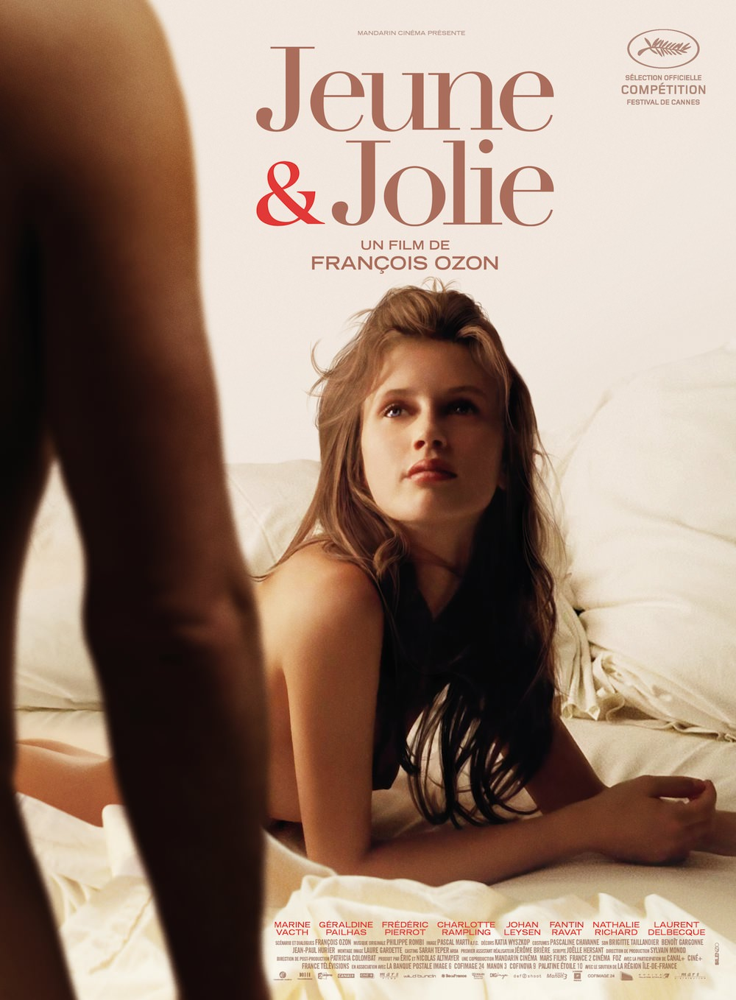

+++
titre = "<em>Jeune &#038; Jolie</em>, François Ozon"
title = "Jeune &#038; Jolie, François Ozon"
url = "/jeune-et-jolie-ozon"
date = "2013-06-05T00:55:15"
Lastmod = "2013-08-20T16:41:58"
cover = "jeune-et-jolie-ozon-marine-vacth-geraldine-pailhas.jpg"
categorie = [ "À voir" ]
tag = [ "Adolescence", "Argent", "Drame", "Famille", "Prostitution", "Sexe", "Société" ]
createur = [ "François Ozon" ]
acteur = [ "Charlotte Rampling", "Fantin Ravat", "Géraldine Pailhas", "Marine Vacth" ]
annee = [ "2013" ]
weight = 2013
pays = [ "France" ]

+++

« <em>Le portrait d’une jeune fille de 17 ans en 4 saisons et 4 chansons.</em> » : certains synopsis en disent beaucoup trop sur les films, pas celui de <em>Jeune &#038; Jolie</em>. Le quinzième film de François Ozon s’attache en effet à décrire le parcours complexe d’une adolescente de 17 ans qui décide de… se prostituer. Loin des portraits caricaturaux que l’on aurait pu retrouver ailleurs, le cinéaste prolifique et inclassable exploite la prostitution avec finesse pour mieux montrer la période difficile de l’adolescence. Un très beau film, tout en finesse autour d’une jeune actrice très impressionnante.

Isabelle, à peine dix-sept ans, découvre le sexe lors de ses vacances en famille sur la Côte d’Azur. Elle y fait la rencontre de Felix, un jeune homme plus âgé qu’elle et qui la séduit et finit par lui faire l’amour un soir, sur la plage. François Ozon tire son film de cette première expérience très décevante : rentrée à Paris et au lycée Henri IV où elle continue sa scolarité, l’héroïne de <em>Jeune &#038; Jolie</em> cherche de meilleures expériences. Elle pourrait faire comme tout le monde, fréquenter les garçons de sa classe, aller aux soirées et en choisir un pour « sortir avec lui ». Sauf qu’un jour, un homme croisé dans la rue lui propose du sexe rémunéré et la jeune adolescente en quête d’expériences extrêmes se laisse tenter. Très vite, Isabelle se prend au jeu et multiplie les rendez-vous facturés 300 € à chaque fois ; elle obtient rapidement de grosses sommes et parvient à garder le secret vis-à-vis de sa famille, jusqu’au jour où l’un de ses clients, plus âgé, meurt alors qu’elle est avec lui. François Ozon exploite ce sujet polémique — une interview mal comprise l’a d’ailleurs bien prouvé en marge de Cannes — avec à la fois beaucoup de réalisme et de finesse. Le cinéaste s’est documenté sur la question et cela se voit : <em>Jeune &#038; Jolie</em> est un film parfaitement réaliste sur la prostitution d’une mineure. S’il évoque naturellement ses dangers ou ses aspects déplaisants avec les clients pervers ou ceux qui payent mal, François Ozon ne fait pas un pamphlet contre les dangers de la prostitution, ni une dénonciation en règle d’Internet qui permet à son personnage de se prostituer. Son long-métrage est bien plus complexe et plus intéressant précisément pour cette raison : son héroïne ne se prostitue pas par besoin, mais par plaisir. Le cinéaste a choisi une famille parisienne très aisée et Isabelle appartient à la bourgeoisie qui peut se permettre d’habiter un très grand appartement sans doute dans le cinquième arrondissement, qui envoie ses enfants à Henri IV et qui va au théâtre plutôt qu’au cinéma. L’argent n’a ainsi jamais été une motivation pour l’héroïne de <em>Jeune &#038; Jolie</em> et c’est très intéressant d’éviter ce cliché. D’ailleurs, si l’adolescente récolte plusieurs milliers d’euros grâce à ses rendez-vous, elle ne les dépense pas et se contente de les cacher parmi ses vêtements pour que sa mère ne tombe pas dessus par hasard. Quand elle sera découverte, elle s’inquiétera de l’avenir de son argent plus par principe que par réelle nécessité. 

Au fond, si l’argent compte pour elle, c’est qu’il participe de son fantasme : ce que François Ozon dit très bien, c’est que cette jeune femme de 17 ans aime la prostitution, pas forcément l’acte sexuel lui-même, mais le fait d’avoir une relation tarifée, l’interdit à braver, le fait de prendre un rendez-vous, de découvrir un hôtel et de quitter un homme après lui avoir offert son corps. Il fallait oser représenter ainsi la prostitution, d’autant que <em>Jeune &#038; Jolie</em> n’évite pas du tout les scènes de nu et devient même de moins en moins pudique. Alors que la toute première scène de sexe se résume à une paire de fesses masculines dans l’obscurité, le long-métrage en dévoile de plus en plus, surtout en ce qui concerne le corps de Marine Vacth. La jeune actrice est vraiment surprenante dans ce premier rôle majeur, un rôle difficile qu’elle incarne avec un naturel confondant et sans la moindre trace de vulgarité. François Ozon filme des nus, mais paradoxalement toujours de façon pudique. <em>Jeune &#038; Jolie</em> n’a rien d’un film pornographique et la prostitution n’est en fait qu’une excuse pour parler d’abord et avant tout de l’adolescence. Le personnage principal est attiré par des expériences extrêmes et si elles sont en l’occurrence sexuelles, elles auraient très bien pu être de la drogue ou autre chose. À cet égard, la très belle fin que l’on ne dévoilera fin témoigne bien d’une évolution et, en quelque sorte, du passage de l’adolescence à l’âge adulte pour Isabelle. François Ozon fait évoluer son film avec toute la subtilité requise et il peut compter sur le talent de son actrice principale qui est en outre très bien entourée. Géraldine Pailhas incarne admirablement sa mère, bourgeoise coincée qui n’arrive pas à comprendre comment sa fille a pu se prostituer et qui s’en veut pour ce qu’elle considère comme la pire des dérives. Citons aussi le nom de Fantin Ravat qui incarne très bien le petit frère d’Isabelle, un personnage important aussi dans <em>Jeune &#038; Jolie</em>.

La musique de Françoise Hardy rythme <em>Jeune &#038; Jolie</em> et ses quatre saisons, mais loin de tout dispositif un peu lourd, François Ozon signe un film tout en légèreté. Certes, le sujet est grave avec la prostitution d’Isabelle, mais le long-métrage n’en fait pas des tonnes et surtout montre bien que ce n’est pas finalement l’essentiel. Le plus important, c’est plutôt une héroïne en pleine crise d’adolescence et qui se cherche : le faire autour de la prostitution était gonflé, mais <em>Jeune &#038; Jolie</em> prouve que c’était une bonne idée. La dernière réalisation de François Ozon n’oublie pas aussi d’être drôle par moments et c’est un film réussi, à voir. 

<em>Sortie en salles le 21 août</em>

