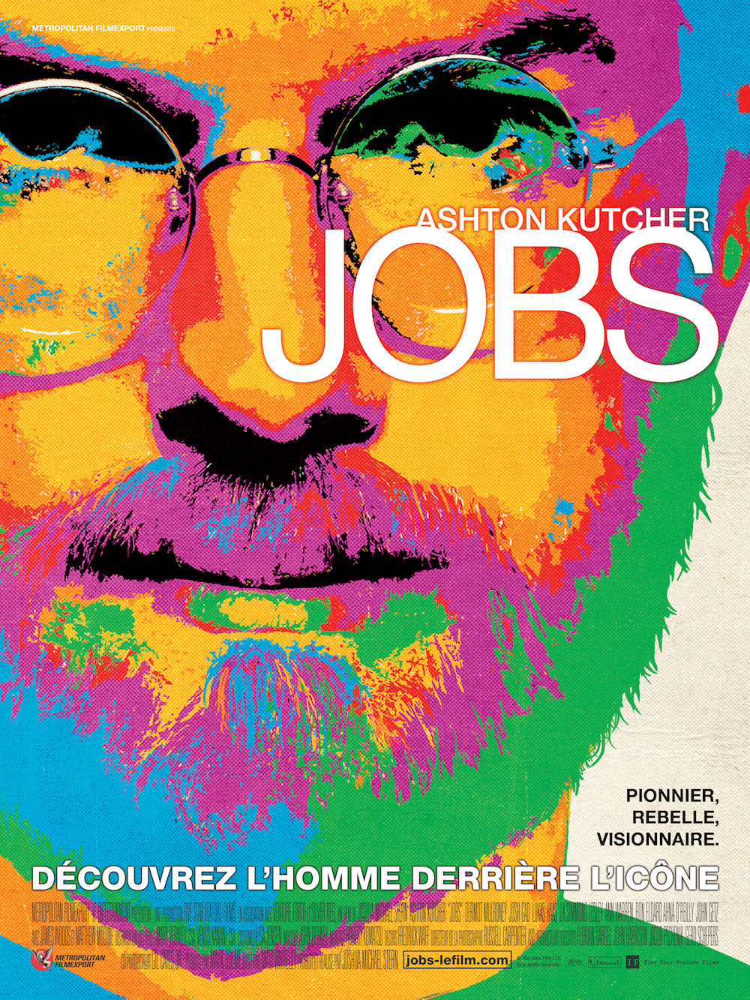
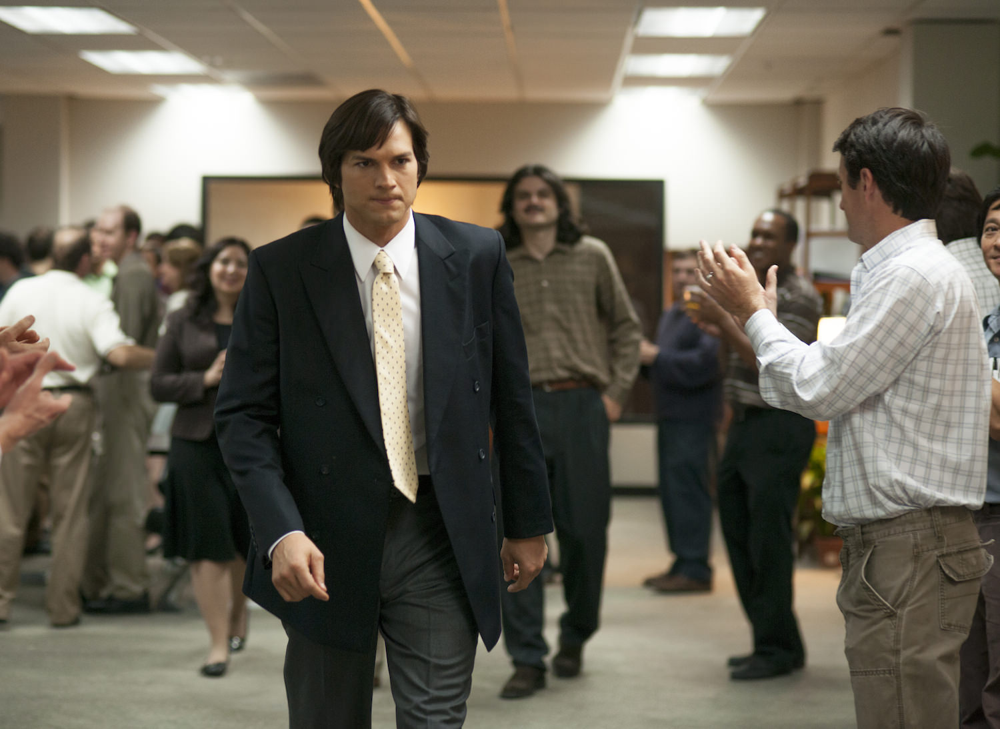
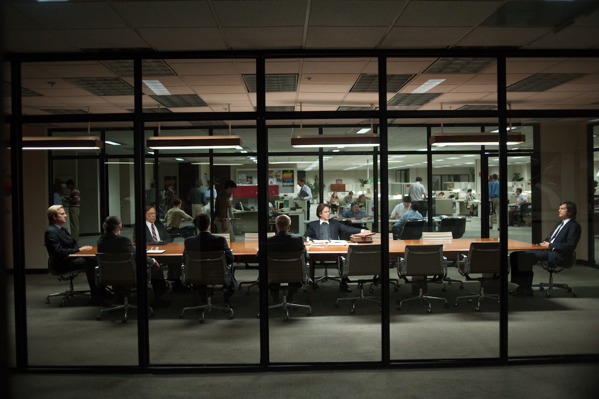

+++
titre = "<em>Jobs</em>, Joshua Michael Stern"
title = "Jobs, Joshua Michael Stern"
url = "/jobs-stern"
date = "2013-08-22T18:45:06"
Lastmod = "2014-10-30T22:28:27"
cover = "jobs-ashton-kutcher.jpg"
categorie = [ "À voir" ]
tag = [ "Apple", "Biopic", "Histoire vraie", "Informatique", "Sorties du mois", "Steve Jobs", "Vite oublié" ]
createur = [ "Joshua Michael Stern" ]
acteur = [ "Ashton Kutcher", "Dermot Mulroney", "Giles Matthey", "J.K. Simmons", "Josh Gad", "Matthew Modine" ]
annee = [ "2013" ]
weight = 2013
pays = [ "États-Unis" ]

+++

Depuis la mort de Steve Jobs, à l’automne 2011, on attendait les biopics sur celui qui a fondé Apple et transformé pour toujours l’informatique grand public. Premier long-métrage sur le sujet<a href="#fn-10145-1" rel="footnote">1</a>, <em>Jobs</em> est un biopic traditionnel qui s’intéresse à la vie de l’homme depuis la création de l’entreprise dans les années 1970 jusqu’au retour de Steve Jobs à la tête d’Apple au cœur des années 1990. Vingt années de sa vie qui sont sans aucun doute parmi les plus intéressantes, celles en tout cas qui sont les plus faciles à transposer au cinéma. Entre vie privée difficile et le génie de l’informatique qui se fait virer de sa propre entreprise, la matière ne manquait pas et le projet, certes classique, pouvait donner un beau film. Malheureusement, Joshua Michael Stern, qui signe sa première réalisation à sortir en salles en France, n’est pas David Fincher et <em>Jobs</em> n’est pas <a href="http://voiretmanger.fr/social-network-fincher/" title="The Social Network, David Fincher"><em>The Social Network</em></a>. Incomplet, le long-métrage semble se concentrer sur Steve Jobs plutôt qu’Apple, mais peine à passionner par ses choix souvent étranges. Un biopic qui risque de décevoir autant les fans par ses lacunes et ses erreurs, que les néophytes qui ne comprendront pas grand-chose.

Symbole par excellence du renouveau de cette entreprise passée à deux doigts de la faillite, c’est la présentation de l’iPod en 2001 qui ouvre <em>Jobs</em>. Un choix judicieux pour introduire Steve Jobs : le patron d’Apple a alors une quarantaine d’années et il est sur le point de placer son entreprise dans les plus hautes sphères de l’industrie. Joshua Michael Stern commence avec ce symbole, avant d’effectuer un retour en arrière et de reprendre son récit une trentaine d’années plus tôt. On y retrouve le jeune Steve Jobs, alors étudiant désœuvré. Il a arrêté son cursus scolaire et traîne sur le campus, allant à certains cours un peu par hasard. <em>Jobs</em> enchaîne très rapidement les éléments clés qui composent la légende du personnage : sa rencontre déterminante avec la calligraphie, celle non moins importante avec les drogues et avec l’ésotérisme, son voyage en Inde… Dans cette première partie, le film va très vite, quitte à perdre les spectateurs dans une série d’images envoyées comme autant de flash. Première ellipse dans le récit et on retrouve Steve Jobs employé d’Atari, éditeur de jeux en vogue à l’époque dans la Silicon Valley. Le film en profite pour introduire Steve Wozniak, un ami qui lui vient en aide et invente pour lui le casse-brique. Cette première collaboration ouvre la voie à la création de l’Apple Computer I dans le fameux garage de la famille Jobs et Joshua Michael Stern a d’ailleurs eu l’opportunité de filmer dans le vrai garage plutôt que dans un studio. À l’image de l’histoire qu’il raconte, le film s’emballe ensuite avec la création d’une entreprise grâce aux fonds d’un investisseur, puis la présentation d’un deuxième ordinateur, le succès qui fait passer Apple du garage au siège social de Cupertino où l’entreprise réside toujours et Steve Jobs de la misère aux millions. Si le scénario pouvait prendre son temps au début, il s’attache par la suite à des moments : travail sur le premier Macintosh, départ forcé de Jobs et puis enfin son retour qui clôt par la même occasion <em>Jobs</em>. La suite, le succès fulgurant de l’iPod, puis celui de l’iPhone et de l’iPad, n’intéresse pas le cinéaste, peut-être parce que l’histoire récente d’Apple est plus lisse, sans doute parce que l’on manque encore de recul et d’informations.

<em>Jobs</em> est-il un film sur Apple ou sur Steve Jobs ? La question paraît incongrue, puisqu’il s’agit d’un biopic qui, par définition, consiste à raconter la vie d’une personne. Elle mérite pourtant d’être posée dans le cas du long-métrage de Joshua Michael Stern. À première vue pourtant, le scénario est clairement tourné vers Steve Jobs et non son entreprise. On suit le futur patron d’Apple sur le campus universitaire avec ses conquêtes féminines et ses expériences mystiques à base de LSD. Plus tard, le film s’attache à raconter sa vie personnelle et surtout sa relation très compliquée avec sa femme et sa fille, Lisa, qu’il ne reconnaît pas pendant plusieurs années. En parallèle, l’évolution de Steve Jobs dans sa propre entreprise occupe l’essentiel du film : on découvre un personnage colérique et extrêmement sûr de lui, un mélange explosif qui le conduit à virer son meilleur développeur simplement parce qu’il osait remettre en cause l’importance d’ajouter des polices de caractère. <em>Jobs</em> s’attarde aussi longuement sur les relations conflictuelles de son personnage avec le Conseil d’administration, jusqu’à son départ en 1985 et le long-métrage décrit plutôt bien l’isolement toujours plus important de Steve Jobs qui se voit d’abord retirer le projet Lisa, un nouvel ordinateur qu’il affectionne tout particulièrement. Alors qu’on imaginait découvrir les années qui suivent, la création de NeXT pour remplacer Apple ou encore sa participation à l’aventure Pixar, Joshua Michael Stern opte pour une ellipse qui nous amène directement à 1995. L’entreprise qu’il a lancée près de vingt ans plus tôt est au plus mal et fait appel à son fondateur pour trouver un nouveau départ. Cette ellipse montre bien que le film est ambigu et s’il s’intéresse à Steve Jobs, c’est aussi pour parler d’Apple. Au fond, on a le sentiment que les scénaristes n’ont pas su choisir entre les deux pistes qu’ils pouvaient suivre et le film n’est ni tout à fait une biographie de Steve Jobs, ni vraiment l’historique d’Apple. Cet entre-deux ne profite pas à <em>Jobs</em>, au contraire même, il est essentiel pour comprendre l’échec partiel du projet.

Faute de choisir entre deux projets différents, <em>Jobs</em> ne sait pas non plus choisir sa cible et échoue ainsi à satisfaire totalement tous ses spectateurs. Les amateurs d’Apple, tous ceux qui suivent l’entreprise de près, s’informent des nouveautés et s’intéressent à l’histoire de l’entreprise seront forcément déçus par les coupes franches du scénario, les ellipses un peu faciles et les multiples erreurs historiques. Établir une liste n’est pas très intéressant, mais certains éléments sont grossiers dans le long-métrage, comme le rôle de Steve Wozniak, bras droit de Steve Jobs réduit ici à quelques scènes et à un rôle presque insignifiant. De même, comment justifier l’absence flagrante du conflit entre Apple et Microsoft, résumé dans ce film à une scène de colère assez caricaturale et expédiée en quelques secondes ? Le téléfilm <a href="http://voiretmanger.fr/pirates-silicon-valley-burke/" title="Les Pirates de la Silicon Valley, Martyn Burke"><em>Les Pirates de la Silicon Valley</em></a> sorti en 1999 portait justement sur ce point et il apportait un éclairage bien plus intéressant sur ce sujet passionnant et qui n’est tout simplement pas traité. On pourrait encore citer le cas de NeXT ou de Pixar, mais après tout, un biopic n’a pas à être exhaustif et <em>Jobs</em> s’adresse aussi bien à un public qui connaît mal la vie de Steve Jobs et espère en apprendre plus. Malheureusement, eux aussi seront probablement déçus par la réalisation de Joshua Michael Stern qui manque souvent d’explications et risque de perdre bon nombre de spectateurs. On ne comprend pas pourquoi le Macintosh est aussi important, sans doute parce qu’il aurait fallu parler de Xerox, le véritable inventeur de l’interface graphique moderne. Pis, <em>Jobs</em> est mauvais quand il s’agit d’expliquer pourquoi le conseil d’administration d’Apple vire son fondateur au milieu des années 1980. Le cinéaste se complait à longuement filmer des scènes où le vocabulaire financier ne manque pas, sans prendre la peine d’expliquer ce qui se passe exactement. Au total, c’est la frustration qui guette le public néophyte qui risque bien de passer à côté d’éléments pourtant essentiels…<a href="#fn-10145-2" rel="footnote">2</a>

Ce biopic de Steve Jobs n’est pas aussi mauvais qu&rsquo;on a pu le lire. Ashton Kutcher est excellent dans le mimétisme et il parvient vraiment à incarner le patron d’Apple, même s’il en fait parfois un peu trop et même s’il est meilleur quand son personnage est encore jeune. De manière générale <em>Jobs</em> est un divertissement sans intérêt cinématographique, mais qui sait rester efficace, même s’il est très conventionnel et porté par une bande originale aussi peu originale qu’envahissante. Le film se tient et on ne s’ennuie pas pendant deux heures, mais Joshua Michael Stern ne passionnera personne. Certaines scènes sont réussies — en particulier la rencontre avec le designer Jonathan Ive (Giles Matthey, épatant) à la fin —, mais le projet dans son ensemble manque d’ambition, de souffle et surtout d’une direction claire. <em>Jobs</em> a tendance à ressembler à une illustration de la page Wikipédia de Steve Jobs et c’est un peu dommage. Trop simpliste pour les fans, trop imprécis pour les néophytes, ce biopic se laisse regarder, mais sera oublié sitôt la séance terminée…

<h3>Vous voulez <a href="http://voiretmanger.fr/soutien/">m&rsquo;aider</a> ?</h3>
<ul>
<li><a href="http://www.amazon.fr/gp/product/B00ESBTSVO/ref=as_li_ss_tl?ie=UTF8&amp;camp=1642&amp;creative=19458&amp;creativeASIN=B00ESBTSVO&amp;linkCode=as2&amp;tag=leblogdenic07-21">Acheter le film en Blu-ray sur Amazon</a></li>
<li><a href="http://www.amazon.fr/gp/product/B00ESBTSL4/ref=as_li_ss_tl?ie=UTF8&amp;camp=1642&amp;creative=19458&amp;creativeASIN=B00ESBTSL4&amp;linkCode=as2&amp;tag=leblogdenic07-21">Acheter le film en DVD sur Amazon</a></li>
<li><a href="https://itunes.apple.com/fr/movie/jobs/id757241328">Acheter ou louer le film sur l&rsquo;iTunes Store</a></li>
</ul>

<ol>
<li id="fn-10145-1">
En fait, le premier au cinéma. Il y a quelques mois, un site internet a réalisé en une semaine une parodie de biopic de Steve Jobs avec <a href="http://voiretmanger.fr/isteve-funny-or-die/" title="iSteve, Ryan Perez (Funny or Die)"><em>iSteve</em></a>…&#160;<a href="#fnref-10145-1" rev="footnote">&#8617;</a>
</li>
<li id="fn-10145-2">
Si la vie de Steve Jobs vous intéresse, la référence reste <em>Steve Jobs</em>, la biographie de Walter Isaacson (<a href="http://www.amazon.fr/gp/product/2709638320/ref=as_li_ss_tl?ie=UTF8&#038;tag=leblogdenic07-21&#038;linkCode=as2&#038;camp=1642&#038;creative=19458&#038;creativeASIN=2709638320">Amazon</a>/<a href="https://itunes.apple.com/fr/book/steve-jobs/id470912437?mt=11">iBookstore</a>).&#160;<a href="#fnref-10145-2" rev="footnote">&#8617;</a>
</li>
</ol>

