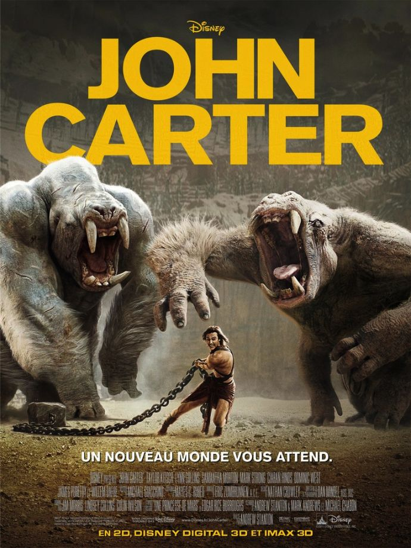
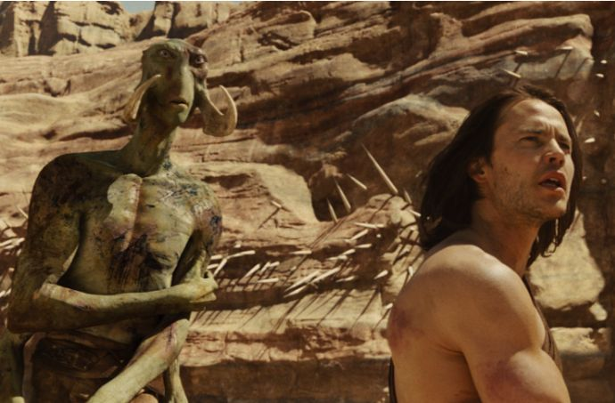
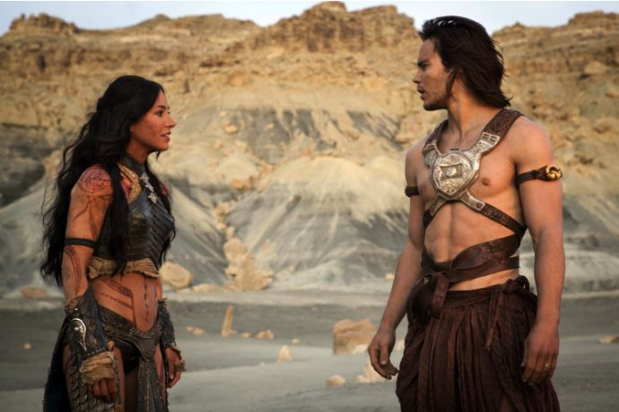

+++
type = "post"
titre = "<em>John Carter</em>, Andrew Stanton"
title = "John Carter, Andrew Stanton"
url = "/john-carter-stanton"
date = "2012-03-07T00:23:02"
Lastmod = "2015-05-20T23:14:27"
cover = "kitsch-john-carter.jpg"
categorie = [ "À voir" ]
tag = [ "Amour", "Blockbuster", "Guerre", "Heroïc-Fantasy", "Science-Fiction", "Vite oublié" ]
createur = [ "Andrew Stanton" ]
acteur = [ "Ciarán Hinds", "Lynn Collins", "Mark Strong", "Samantha Morton", "Taylor Kitsch" ]
annee = [ "2012" ]
weight = 2012
pays = [ "États-Unis" ]

+++

S&rsquo;agit-il du premier épisode d&rsquo;une nouvelle longue saga au cinéma ? Andrew Stanton le souhaite plus que tout au monde : ce grand fan d&rsquo;Edgar Rice Burroughs aimerait adapter l&rsquo;intégralité du <em><a href="http://fr.wikipedia.org/wiki/Cycle_de_mars">Cycle de Mars</a></em> et il commence cette année avec <em>John Carter</em>. Ce film suit l&rsquo;intrigue du premier volume du cycle et raconte ainsi la découverte par le capitaine John Carter d&rsquo;un monde extraterrestre sur la planète Mars. Un film à grand spectacle malheureusement distribué par Walt Disney. Si la richesse de l&rsquo;univers est manifeste, elle n&rsquo;est que trop peu exploitée par un scénario trop commun. À ne pas vouloir prendre de risque, Andrew Stanton passe à côté d&rsquo;un bon film.

John Carter cherche de l&rsquo;or en Arizona à la fin du XIXe siècle. Il a entendu parler d&rsquo;une mystérieuse grotte pleine d&rsquo;or et il consacre sa vie à la chercher, en vain. Jusqu&rsquo;au jour où, attaqué par des Apaches, il tombe sur ce lieu si mystérieux. À l&rsquo;intérieur, il découvre un étrange être qui l&rsquo;attaque et qu&rsquo;il tue d&rsquo;une balle, avant de se retrouver dans un lieu mystérieux. John Carter l&rsquo;apprendra vite, il s&rsquo;est trouvé propulsé sur la planète Mars, appelée Barsoom par les êtres qui le peuplent. Barsoom est en effet loin du caillou rouge sans vie que l&rsquo;on imagine : bien au contraire, la planète est peuplée par différents types de martiens. John Carter se retrouve, bien malgré lui, au cœur d&rsquo;enjeux qui le dépassent totalement, mais qui mettent en jeu la survie de la planète même. Au départ totalement désintéressé, il change de regard sur la planète et ses habitants en tombant amoureux de la belle princesse Dejah Toris.

On le sent d&rsquo;emblée, l&rsquo;univers de <em>John Carter</em> est d&rsquo;une richesse rare au cinéma. On a affaire à une histoire d&rsquo;héroïc-fantasy teintée de science-fiction avec des groupes humains différents, des conflits et surtout une histoire que l&rsquo;on sent particulièrement ancienne et présente. La planète Barsoom voit s&rsquo;opposer depuis des siècles et des siècles deux clans de martiens rouges, Hélium et Zodanga, tandis que des martiens verts subissent ce conflit, tout en s&rsquo;opposant également entre bandes. Si ces derniers s&rsquo;éloignent de la forme humaine stricte, tout en gardant de nombreux attributs humanoïdes, les premiers sont très proches des humains terrestres. John Carter est ainsi quasiment identique aux rouges et ce n&rsquo;est pas pour rien s&rsquo;il s&rsquo;entiche de l&rsquo;une d&rsquo;entre elles. C&rsquo;est pour tenter de retourner sur Terre qu&rsquo;il va découvrir un curieux endroit qui prend la forme d&rsquo;un rocher, mais qui est en fait constitué de centaines de milliers de formes bleues capables de changer l&rsquo;aspect du lieu ou encore de représenter le système solaire. Ce système semble particulièrement important, mais <em>John Carter</em> n&rsquo;en dévoile rien, ou presque. L&rsquo;amateur de science-fiction sera certainement déçu par les trop nombreux silences du film. On sent qu&rsquo;un univers extrêmement riche est présent, mais Andrew Stanton le masque en grande partie par sa romance. Les questions sont là, on a parfois des bribes de réponses, mais <em>John Carter</em> n&rsquo;y répond pas vraiment et s&rsquo;avère plutôt frustrant.

Au-delà de la science-fiction et de l&rsquo;univers d&rsquo;héroïc-fantasy, <em>John Carter</em> est d&rsquo;abord une histoire d&rsquo;amour assez banale. Le capitaine John Carter est un ancien soldat américain ayant participé à la guerre de Secession sur Terre, il devient un véritable héros sur Barsoom. La faible gravité aidant, il est capable de faire de prodigieux bonds dans les airs, tandis que sa force déjà grande (sa musculature puissante en atteste) se trouve décuplée. C&rsquo;est ainsi qu&rsquo;il parvient à survivre après sa capture par les thark, c&rsquo;est ainsi qu&rsquo;il s&rsquo;échappe ensuite et c&rsquo;est sans surprise ainsi qu&rsquo;il séduit la belle Dejah Toris. Dès le sauvetage de cette dernière, l&rsquo;amour est immédiat et évident. <em>John Carter</em> ne s&rsquo;embarrasse pas de considérations psychologiques : l&rsquo;amour est présent dès les premières minutes et il ne quittera plus le film d&rsquo;Andrew Stanton. Autant le dire, l&rsquo;originalité de leur rencontre qui se déroule sur Mars n&rsquo;est jamais exploitée et leur histoire d&rsquo;amour est d&rsquo;un ennui total. Les deux tourtereaux ne sont d&rsquo;ailleurs pas les personnages les plus intéressants du film, même s&rsquo;ils en occupent la majeure partie. Les martiens verts sont bien plus intéressants, même s&rsquo;ils sont sous-exploités par le film.

<em>John Carter</em> n&rsquo;est pas aidé par sa longueur : plus de deux heures, c&rsquo;est trop pour un tel scénario. Andrew Stanton s&rsquo;en tire pourtant plutôt yen en évitant l&rsquo;ennui du spectateur, mais son œuvre souffre forcément de problèmes de rythme. Alors que l&rsquo;intrigue patine parfois avec des scènes attendues qui sont enfilées les unes derrière les autres, la fin de <em>John Carter</em> est au contraire bien trop expéditive et déçoit ainsi en expliquant ce que l&rsquo;on avait déjà compris, et en passant sous le silence beaucoup trop d&rsquo;autres éléments. Ancien de chez Pixar, le réalisateur a manifestement oublié tout ce qui a fait le succès des films d&rsquo;animation du studio : d&rsquo;excellents scénarios. Ici, il est correct au mieux, bien trop marqué par la volonté de Disney de plaire au plus grand nombre et il échoue de ce fait de plaire tout court. C&rsquo;est dommage, les éléments étaient là, mais <em>John Carter</em> peine à réellement passionner. Son duo d&rsquo;acteurs phare n&rsquo;aide pas, il faut dire : Taylor Kitsch n&rsquo;a vraiment que ses muscles pour lui et Lynn Collins ne vaut pas beaucoup mieux. Sur le plan technique, Andrew Stanton est en permanence à deux doigts du ridicule de <em><a href="http://voiretmanger.fr/2011/11/29/green-lantern-campbell/">Green Lantern</a></em>, mais parvient miraculeusement à l&rsquo;éviter et se rapproche assez de l&rsquo;esthétique de la saga <em>Star Wars</em>. Il se dit que George Lucas aurait été inspiré par le <em>Cycle de Mars</em> et cela se confirme assez ici…

<em>John Carter</em> peut finalement difficilement dépasser son statut de film Disney. Andrew Stanton a beau se déclarer fan de la saga originale qui a inspiré ce premier film, il ne réalise pas moins un blockbuster à grand spectacle qui se veut d&rsquo;abord familial. Le résultat est étonnamment très proche, tant sur le plan visuel que pour le scénario, de <em><a href="http://voiretmanger.fr/2010/05/19/prince-persia-sable-temps-newell/">Prince of Persia Les Sables du Temps</a></em>, mais avec un résultat moins fun. C&rsquo;est vraiment dommage, d&rsquo;autant que la richesse de l&rsquo;univers aurait pu donner quelque chose de vraiment bien. Espérons qu&rsquo;Andrew Stanton saura offrir une meilleure suite à <em>John Carter</em>, si le succès est au rendez-vous du moins.

<h3>Vous voulez m&rsquo;aider ?</h3>
<ul>
<li><a href="http://www.amazon.fr/gp/product/B0078YB2NA/ref=as_li_ss_tl?ie=UTF8&#038;tag=leblogdenic07-21&#038;linkCode=as2&#038;camp=1642&#038;creative=19458&#038;creativeASIN=B0078YB2NA">Acheter le film en Blu-Ray sur Amazon</a></li>
<li><a href="http://www.amazon.fr/gp/product/B0078YB1JA/ref=as_li_ss_tl?ie=UTF8&#038;tag=leblogdenic07-21&#038;linkCode=as2&#038;camp=1642&#038;creative=19458&#038;creativeASIN=B0078YB1JA">Acheter le film en DVD sur Amazon</a></li>
<li><a href="http://itunes.apple.com/fr/movie/john-carter/id525319177">Acheter ou louer le film sur l&rsquo;iTunes Store</a></li>
</ul>

