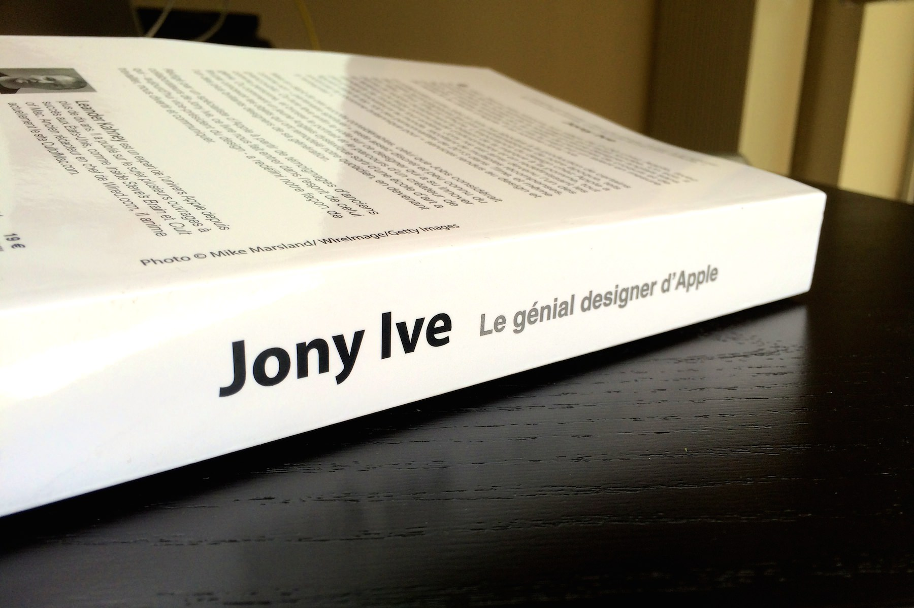
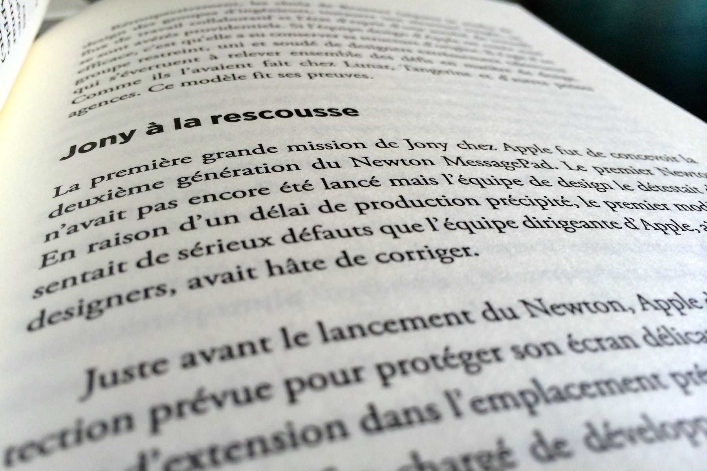
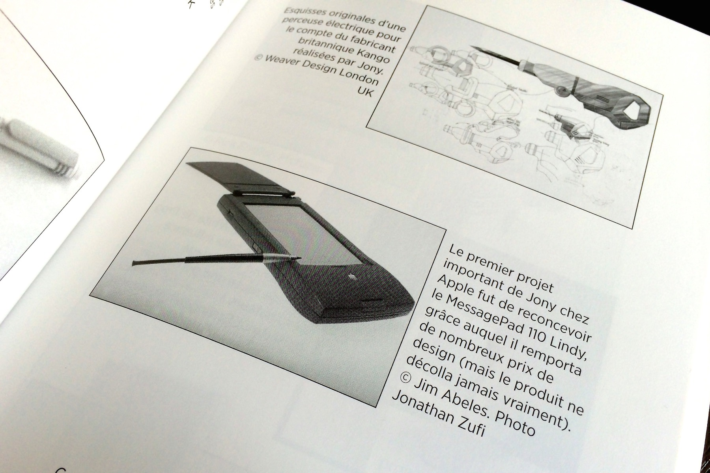
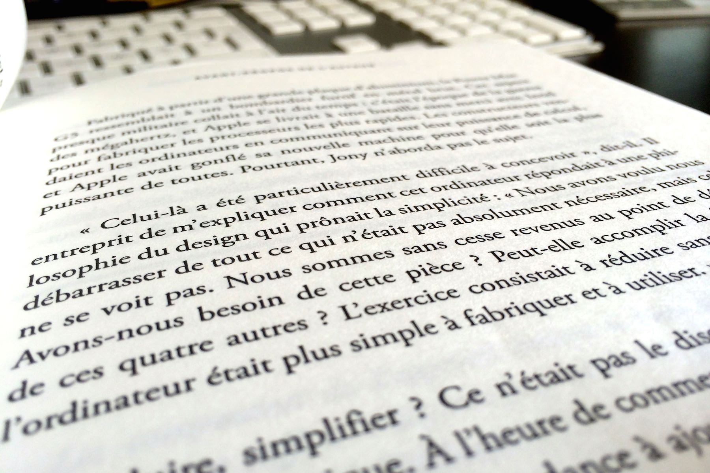

+++
titre = "<em>Jony Ive &#8211; Le génial designer d&rsquo;Apple</em>, Leander Kahney"
title = "Jony Ive &#8211; Le génial designer d'Apple, Leander Kahney"
url = "/jony-ive-genial-designer-apple-kahney"
date = "2014-04-03T07:38:25"
Lastmod = "2014-04-02T22:43:04"
cover = "jony-ive-le-genial-designer-apple-leander-kahney.jpg"
categorie = [ "À lire" ]
tag = [ "Apple", "Biographie", "Histoire vraie", "Jonathan Ive" ]
createur = [ "Leander Kahney" ]
annee = [ "2014" ]
weight = 2014
pays = [ "États-Unis" ]
original = "Jony Ive: The Genius Behind Apple's Greatest Products"

+++

Apple est une entreprise fascinante pour bien des raisons, mais peut-être surtout par son insolent succès. Depuis le retour de Steve Jobs à la fin des années 1990, l’entreprise a accumulé les réussites, de l’iPod à l’iPhone et maintenant l’iPad et rien ne semble pouvoir l’arrêter. La <a href="http://voiretmanger.fr/steve-jobs-1955-2011/" title="Soyez insatiables, soyez fous">mort prématurée</a> de son cofondateur a ajouté une épaisseur au mystère et les œuvres se multiplient sur le constructeur. Au cinéma, <a href="http://voiretmanger.fr/jobs-stern/" title="Jobs, Joshua Michael Stern">un biopic assez moyen</a> est déjà sorti et un autre est en préparation, mais c’est surtout sur papier que l’on voit se multiplier les sorties. Plutôt que de reproduire la biographie « officielle » de Steve Jobs été <a href="http://www.amazon.fr/gp/product/2253168521/ref=as_li_ss_tl?ie=UTF8&amp;tag=leblogdenic07-21&amp;linkCode=as2&amp;camp=1642&amp;creative=19458&amp;creativeASIN=2253168521">publiée par Walter Isaacson</a> peu après la mort de l’ancien PDG, Leander Kahney a eu la bonne idée de choisir un autre angle pour parler de l’entreprise. Comme son titre l’indique bien, <em>Jony Ive &#8211; Le génial designer d’Apple</em> est une biographie de Jonathan Ive, designer britannique qui est rapidement devenu un ami de Steve Jobs et surtout celui qui a imaginé tous les produits siglés d’une pomme ces dernières années. Un angle plus original et particulièrement intéressant pour mieux comprendre ce qui distingue Apple du reste de l’industrie. Si cette biographie n’évite pas certains écueils du genre, elle reste très plaisante à lire et celui qui veut en savoir un petit peu plus sur l’entreprise devrait y trouver son compte…

En guise de préambule, Leander Kahney raconte sa première rencontre avec Jonathan Ive, qu’il appelle toujours « Jony ». C’était en 2003, à l’occasion de la Macworld Expo, ces salons qui rassemblaient Apple et tous ceux qui suivaient l’entreprise autour des nouveaux produits et l’auteur de cette biographie était alors simple journaliste. <em>Jony Ive &#8211; Le génial designer d’Apple</em> commence sur cette rencontre assez originale, où celui qui était déjà bien connu pour son travail sur les Mac et les iPod a porté le sac du journaliste intimidé et ahuri par la simplicité du designer. Une séquence plus importante qu’il n’y paraît. Au-delà de l’anecdote charmante, c’est aussi une manière, pour l’auteur, de prouver la modestie de son sujet et en même temps d’affirmer son amour pour Jonathan Ive. Certains auteurs écrivent des biographies acerbes, ce n’est certainement pas le cas de Leander Kahney qui apprécie tout particulièrement son sujet. Sans être proche du designer — après tout, il n’a obtenu aucune faveur et aucune interview pour alimenter son livre —, il ne manque pas d’éloges à son sujet et le titre de l’ouvrage est, à cet égard, extrêmement clair. On pourra difficilement critiquer le génie de l’homme qui a activement participé à relancer Apple en créant des produits si simples qu’ils semblaient évidents. L’idée de résumer un téléphone à son écran tactile, c’est lui et même si c’est une évidence aujourd’hui, ça ne l’était pas avant la sortie de l’iPhone. <em>Jony Ive &#8211; Le génial designer d’Apple</em> prouve bien que, depuis son enfance, Jonathan Ive est très doué pour le design et que, peu importe le sujet, il conçoit toujours des objets extrêmement bien pensés. Les premiers chapitres consacrés à l’éducation du jeune Jony sont intéressants pour cette raison et les illustrations, bien que trop rares malheureusement, ne sont pas de trop pour mettre des images sur les inventions du jeune homme. Difficile, dès lors, de contester qu’il était, sur certains points, très en avance sur son temps.

<em>Jony Ive &#8211; Le génial designer d’Apple</em> ne fait pas de mystère sur le génie de son sujet, mais on a parfois le sentiment que Leander Kahney en fait un peu trop, ou manque de critique. Embauché chez Apple au cours des années 1990, avant le retour de Steve Jobs donc, Jonathan Ive commence par travailler sur le <a href="http://fr.wikipedia.org/wiki/Apple_Newton">Newton</a>, un assistant personnel qui préfigure par certains aspects le futur iPhone. L’auteur n’a que des compliments à faire sur le travail effectué par le designer et il attribue l’échec de ce produit exclusivement sur le mauvais positionnement marketing du produit, soulignant au passage assez lourdement que Jonathan Ive n’avait rien à voir dans cette affaire. La traduction française assez lourde n’aide pas, mais ce n’est pas la seule responsable : Leander Kahney a parfois tendance à en faire un peu trop et à volontairement simplifier certains moments clés, notamment lors du retour de Steve Jobs. On sait que celui qui avait créé Apple une vingtaine d’années plus tôt a failli passer à côté de Ive et embaucher un autre designer, mais l’auteur fait passer cela pour une simple négligence de la part de Jobs qui n’aurait pas été informé que les designers étaient dans un autre bâtiment. Plus tard, <em>Jony Ive &#8211; Le génial designer d’Apple</em> soulève un point très intéressant, mais ne le développe pas tout à fait. Le goût de Jony pour le design vient en grande partie de son père, artisan, comme l’auteur le montre vraiment très bien dans un premier temps. On voit comment la transmission s’est effectuée du père vers le fils et on comprend, notamment, que son goût pour les belles choses vient de cette proximité. Bien plus tard, Leander Kahney note que Jonathan Ive n’a jamais invité ses enfants dans l’atelier de design d’Apple et que, devenu père, il n’a pas assumé son rôle de transmission. C’est un point passionnant, mais qui est simplement évoqué et noyé avec le reste, ce qui est un peu dommage.

Au-delà de Jonathan Ive, <em>Jony Ive &#8211; Le génial designer d’Apple</em> est un livre qui intéressera tous les curieux qui veulent en savoir plus sur le constructeur. Au fond, Leander Kahney a trouvé un angle pour aborder le vrai sujet, qui est le mystère Apple. Si on connaît très bien l’entreprise à ses débuts, du mythique garage au succès du Macintosh, on ne sait rien, ou presque, de l’entreprise aujourd’hui. À son retour, Steve Jobs a institué comme une règle indépassable et primordiale le secret : un employé ne devait absolument rien dire et toute information divulguée à l’extérieur, même la moins intéressante, était motif de licenciement. Très vite, tous ceux qui travaillaient chez Apple et tenaient à garder leur travail ont appris à ne rien dire, pas même à leur conjoint, si bien que l’on sait assez peu de choses depuis les années 2000. L’auteur de cette biographie ne sait pas tout non plus, mais il est l’un des mieux documentés sans doute, en particulier sur la conception de l’iPod. À partir des informations publiques et avec quelques autres éléments recueillis de la part d’anciens employés notamment, Leander Kahney offre un regard relativement précis de la conception des produits chez Apple. <em>Jony Ive &#8211; Le génial designer d’Apple</em> nous plonge dans le studio de design où l’équipe travaille sur fond de techno à haut volume. La biographie rassemble quelques anecdotes amusantes, mais qui montrent aussi un changement profond qui explique en grande partie le succès d’Apple aujourd’hui. Steve Jobs parti, Apple est peu à peu devenu une entreprise dominée par des ingénieurs où le design se contentait d’entourer le produit avec du plastique beige. Steve Jobs de retour, il inverse totalement les rôles et fait du design l’élément principal, à tel point que les composants étaient parfois choisis en fonction de la taille d’une boîte vide<a href="#fn-11468-1" rel="footnote">1</a>. Le design est au cœur des enjeux, mais comme le montre bien Leander Kahney, il ne s’agit pas seulement de faire un produit joli, mais aussi pratique. Sur ce point, <em>Jony Ive &#8211; Le génial designer d’Apple</em> ne manque pas d’exemples sur des détails, comme les fermetures magnétiques des Mac portables, ou bien encore sur la molette de l’iPod, qui ont nécessité énormément de travail et qui ont fait le succès des produits.

Si elle n’est pas sans défauts, cette biographie de Jonathan Ive n’est pas mauvaise. Assez bien écrite et plaisante à lire, elle offre un bon aperçu de l’importance du design chez Apple et de la vie de son designer. <em>Jony Ive &#8211; Le génial designer d’Apple</em> s’adresse à tous ceux qui s’intéressent à Apple, mais pas à ceux qui ont déjà tout lu sur l’entreprise. De l’aveu même de son auteur, ses sources étaient limitées et Leander Kahney s’est souvent contenté de compiler d’autres informations de première main. Si vous avez déjà tout lu et en particulier le très rare <a href="http://www.amazon.fr/gp/product/1888001259/ref=as_li_ss_tl?ie=UTF8&amp;tag=leblogdenic07-21&amp;linkCode=as2&amp;camp=1642&amp;creative=19458&amp;creativeASIN=1888001259"><em>AppleDesign</em></a>, vous risquez de vous ennuyer avec ce nouveau livre, voire <a href="http://www.macg.co/aapl/2014/03/pourquoi-les-livres-sur-apple-sont-ils-si-mauvais-80944">le trouver mauvais</a>. Sinon, c’est un livre facile à lire que l’on conseillera à tous les amateurs de la pomme…

<h3>Vous voulez <a href="http://voiretmanger.fr/soutien/">m&rsquo;aider</a> ?</h3>
<ul>
<li><a href="http://www.amazon.fr/gp/product/2754059776/ref=as_li_ss_tl?ie=UTF8&amp;tag=leblogdenic07-21&amp;linkCode=as2&amp;camp=1642&amp;creative=19458&amp;creativeASIN=2754059776">Acheter le livre sur Amazon</a></li>
<li><a href="https://itunes.apple.com/fr/book/jony-ive-le-genial-designer/id844705456">Acheter le livre sur l&rsquo;iTunes Store</a></li>
</ul>

<ol>
<li id="fn-11468-1">
L’exemple donné par Leander Kahney est fascinant. Quand Apple a imaginé le <a href="http://fr.wikipedia.org/wiki/Mac_mini">Mac mini</a>, Jonathan Ive et Steve Jobs ont choisi la taille souhaitée avec des boîtes vides, uniquement en jugeant de la taille nécessaire selon eux. Ce n’est qu’après qu’ils ont choisi les composants à y placer, en fonction de l’espace disponible. C’est pourquoi l’ordinateur a été équipé d’un petit disque dur de portable, plutôt que d’un disque dur d’ordinateur de bureau…&#160;<a href="#fnref-11468-1" rev="footnote">&#8617;</a>
</li>
</ol>

