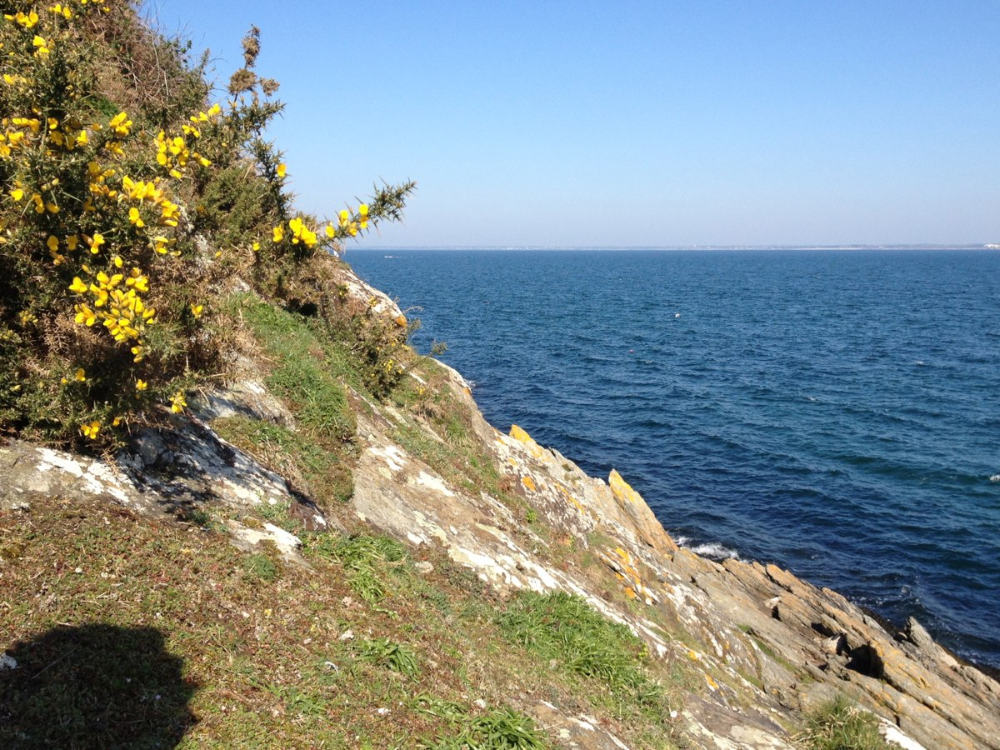
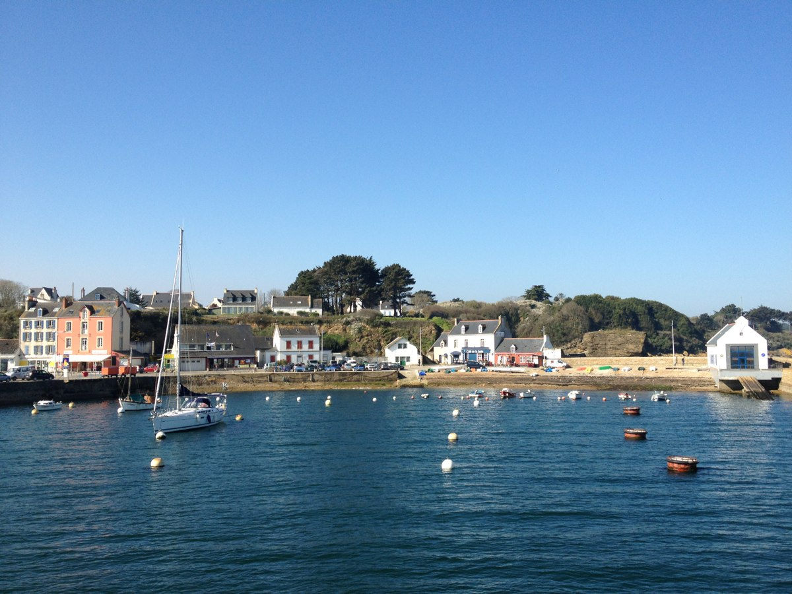
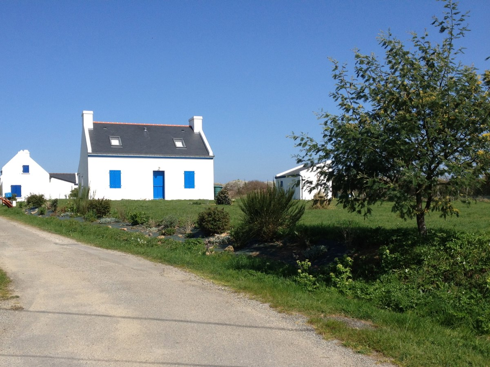
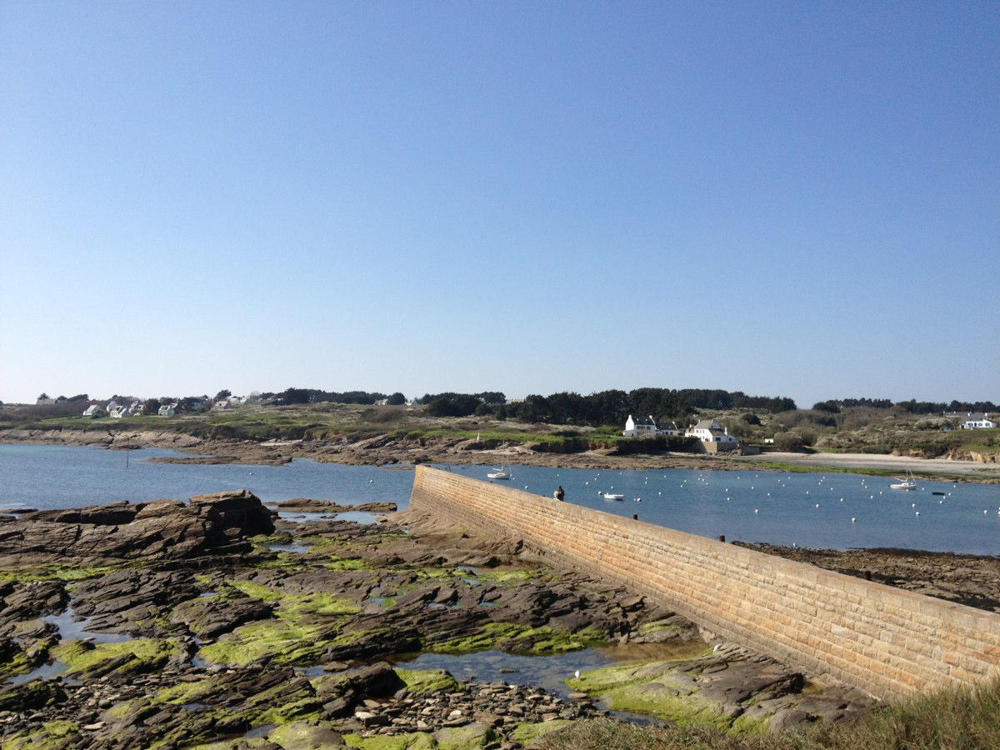
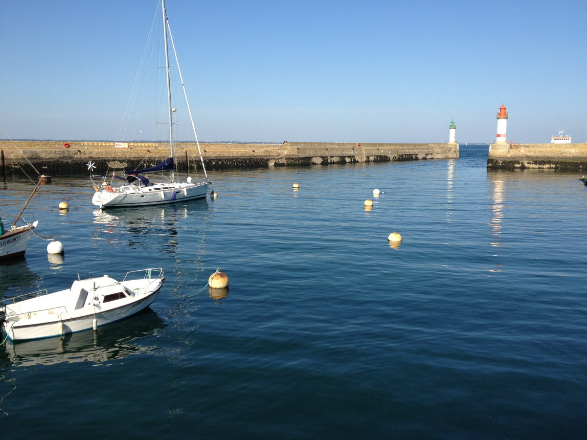

+++
titre = "Une journée sur l&rsquo;île de Groix"
title = "Une journée sur l'île de Groix"
url = "/journee-ile-groix"
date = "2012-03-30T09:58:29"
Lastmod = "2012-03-30T10:00:59"
cover = "groix-morbihan.jpg"
tag = [ "Bretagne", "Île", "Nature", "Paysage", "Tourisme" ]

+++

Moins connue que Belle-Île, l&rsquo;île de Groix est aussi beaucoup plus petite, moins peuplée et plus accessible pour y passer une journée. Si le beau temps est au rendez-vous et si le vélo ne vous fait pas peur, c&rsquo;est même un excellent choix au sud de la Bretagne. Une journée suffit à faire le tour de l&rsquo;île à vélo, mais ce sera peut-être un peu juste pour s&rsquo;y baigner. Entourée de falaises, Groix n&rsquo;est de toute manière pas le lieu idéal pour passer une journée sur la plage…

L&rsquo;île de Groix n&rsquo;est accessible, sans surprise, qu&rsquo;en bateau. Une liaison régulière relie les insulaires à Lorient, été comme hiver. C&rsquo;est le moyen le plus simple et le moins cher de se rendre sur place : il faut <a href="http://www.compagnie-oceane.fr/presentation/index.asp?rub_code=79&amp;thm_id=39&amp;gpl_id=">compter</a> moins de 30 € au maximum pour l&rsquo;aller et le retour, avec des tarifs avantageux pour les jeunes et seniors. Vous pouvez même embarquer votre voiture ou autre véhicule, mais le prix de la traversée est alors beaucoup plus important et à moins de rester plusieurs jours sur place, l&rsquo;intérêt reste discutable. Le départ se fait de Lorient : le ferry part d&rsquo;un embarcadère situé assez loin dans la baie, après le port de commerce. La distance entre Groix et le continent est minime — environ 5,5 km —, mais le choix de Lorient augmente la distance à parcourir et donc le temps de trajet : comptez environ 45 minutes dans chaque sens. En saison, d&rsquo;autres entreprises privées font le trajet et vous pouvez même opter pour un bateau taxi pour vous emmener sur l&rsquo;île. Les tarifs ne sont toutefois pas les mêmes…

Vous arriverez sur l&rsquo;île à Port-Tudy, le plus gros port de Groix. Ancien port de pêche, il sert aujourd&rsquo;hui essentiellement au tourisme avec un quai réservé aux ferrys qui viennent du continent et de nombreux voiliers et autres petits bateaux de plaisance. Comme on peut le constater au-dessus, Port-Tudy est constitué de maisons et petits immeubles tous dédiés à l&rsquo;accueil et à l&rsquo;hébergement des touristes : on y trouve plusieurs hôtels, des restaurants et bars, mais aussi trois ou quatre entreprises de location de vélos. Longue de 8 km, large de 3 km au maximum, l&rsquo;île de Groix n&rsquo;est pas gigantesque — moins de 15 km² — et peut se visiter à pied. Comme partout en Bretagne, les côtes ne sont pas droites toutefois et le sentier côtier qui fait le tour est long. Trop pour espérer le parcourir en une journée et revenir à temps pour le dernier ferry, à moins de le faire au pas de course… Le vélo reste ainsi plus intéressant pour se rendre rapidement à un point intéressant et ensuite marcher pour s&rsquo;approcher de la mer, les sentiers et routes étant en général en retrait. Vous pourrez également louer des scooters ou des 4&#215;4, mais ce serait vraiment dommage de gâcher ainsi le calme insulaire.

Vous êtes arrivés à Groix, vous avez loué un vélo — comptez une dizaine d&rsquo;euros la journée — et vous commencez votre journée par une belle côte. L&rsquo;île est assez plate vue du ciel ou sur <a href="http://upload.wikimedia.org/wikipedia/commons/9/94/Groix_topographic_map-fr.svg">une carte</a> : son point culminant ne dépasse pas les 50 mètres au-dessus de la mer. N&rsquo;espérez pas rouler toute la journée sur des chemins parfaitement plats toutefois : comme souvent en Bretagne, on monte et on descend peu, mais en permanence. La première côte permet de passer du niveau de la mer à celui du Bourg, c&rsquo;est-à-dire le centre de la commune de Groix où se trouvent église et mairie. C&rsquo;est un passage obligé qui met d&rsquo;entrée de jeu les jambes des moins sportifs à rude épreuve. Disons-le, cette première étape est assez pénible, et pas seulement pour la côte. Il faut commencer dans la parte urbanisée de l&rsquo;île et la circulation est alors étonnamment importante. La commune compte plus de 2000 Groisillons et cela représente mine de rien un grand nombre de véhicules avec lesquels il faut partager la route les premiers kilomètres. Les rues étant étroites, ce n&rsquo;est pas toujours évident, d&rsquo;autant que vous serez entouré de nombreux autres touristes fraichement arrivés sur place.

Fort heureusement, cette première étape ne dure pas. Une fois le Bourg dépassé, vous vous retrouverez vite dans la partie plus sauvage de Groix. Très vite, c&rsquo;est un bocage breton typique qui prend le relais et vous pourrez être parfaitement seuls, du moins hors de la période estivale. Le nord de l&rsquo;île, face au continent, est plus sauvage que le sud où l&rsquo;occupation humaine est un peu plus importante. L&rsquo;extrémité ouest, face au large, constitue la zone la plus vide, nonobstant quelques phares, sémaphores ou encore des zones militaires. Entre les deux, vous alternerez entre champs, espaces vierges et souvent protégés sur les côtes et de charmants petits hameaux constitués de quelques maisons avec souvent beaucoup de caractère. Les volets bleus constituent la règle et les maisons en pierre sont nombreuses : l&rsquo;ensemble a beaucoup de charme. Le vélo est pratique pour se déplacer rapidement, mais il ne faut pas hésiter à le laisser et marcher vers la mer : on découvre alors des coins sublimes au-dessus des petites falaises de l&rsquo;île. À propos de vélo, on peut regretter le manque d&rsquo;effort de la commune pour indiquer les chemins accessibles à deux roues : certains sont clairement interdits aux vélos, mais les indications sont rares et mieux vaut être muni d&rsquo;une bonne carte pour s&rsquo;y retrouver.

Si vous aimez les beaux paysages, l&rsquo;île de Groix est incontestablement un très bon choix pour une journée dans la nature et le calme. Une fois sortis de la zone urbanisée, vous vous retrouverez vite dans un univers sauvage, face à la mer. Sauvage en apparence seulement : la densité de l&rsquo;île reste élevée et vous retrouverez toujours rapidement des traces humaines. C&rsquo;est, du reste, très pratique si vous avez sous-estimé la quantité d&rsquo;eau à emporter, par exemple. Si vous êtes plutôt plage de sable fin et bronzage, Groix est peut-être moins indiquée, même si la plage des Grands Sables, à l&rsquo;est de Port-Tudy, a bonne réputation.

