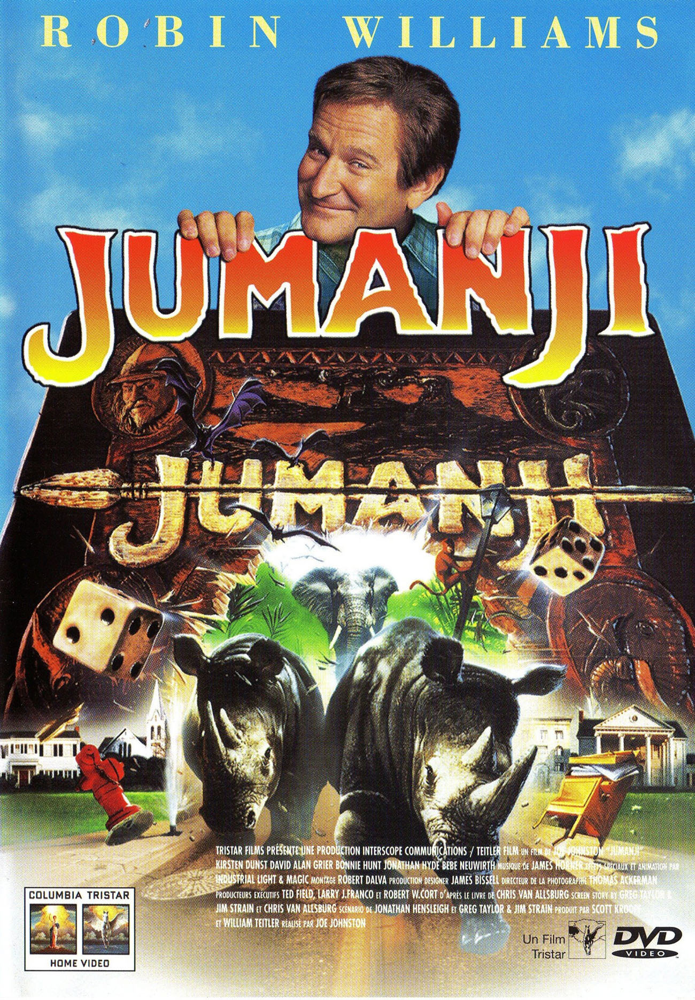
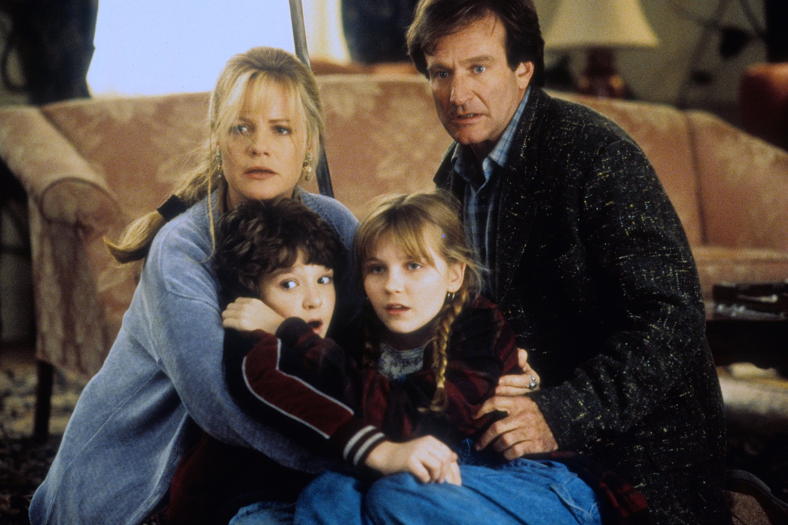
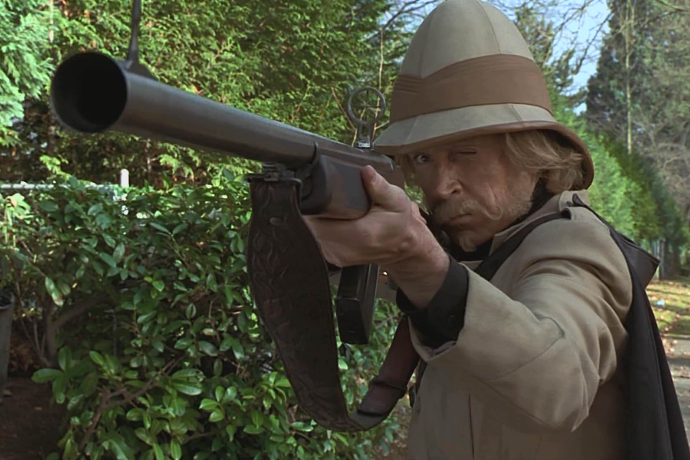

+++
type = "post"
titre = "<em>Jumanji</em>, Joe Johnston"
title = "Jumanji, Joe Johnston"
url = "/jumanji-johnston"
date = "2014-08-24T01:03:03"
Lastmod = "2014-08-24T01:06:57"
cover = "jumanji-joe-johnston.jpg"
categorie = [ "À voir" ]
tag = [ "Action", "Adaptation littéraire", "Animaux", "Aventure", "Blockbuster", "Enfance", "Famille", "Fantastique", "Jeu" ]
createur = [ "Joe Johnston" ]
acteur = [ "Bonnie Hunt", "David Alan Grier", "Jonathan Hyde", "Kirsten Dunst", "Robin Williams" ]
annee = [ "1995" ]
weight = 1995
pays = [ "États-Unis" ]

+++

<em>Jumanji</em>, c&rsquo;est d&rsquo;abord un bon concept. Le nom du film est aussi celui d&rsquo;un jeu très ancien qui a des implications directes dans le présent. Quand on commence une partie, on peut affronter un chasseur, divers créatures de la jungle ou de la savane, quand il ne s&rsquo;agit pas d&rsquo;une plante très énergique ou une mousson meurtrière. Ce n&rsquo;est qu&rsquo;un jeu en apparence, mais il a un impact très clair sur le quotidien et on peut même… en mourir. Joe Johnston adapte ici un roman et compose un film familial typique des années 1990. Les effets spéciaux sont datés et le film est techniquement complètement dépassé, mais ce n&rsquo;est pas très grave. Près de vingt ans après, <em>Jumanji</em> reste toujours aussi efficace, ce qui est bien la preuve que le concept original était bon.

Malin, le scénario commence d&rsquo;abord par instaurer un climat de peur avec une scène qui se déroule au XIXe siècle. On découvre deux jeunes qui enterrent une boîte encore bien mystérieuse et Joe Johnston nous fait déjà entendre un bruit de tambour sourd qui est instantanément inquiétant. <em>Jumanji</em> saute alors dans le temps et lance son intrigue dans les années 1960. Un garçon découvre un jour sur un chantier la boîte enterrée dans le passé. Il la sort et il s&rsquo;avère que c&rsquo;est un jeu de société qui semble très ancien. Avec une copine, il commence une partie… erreur fatale. Dès le premier tour, il est absorbé par le jeu avec une règle surprenante : il n&rsquo;en sortira pas tant qu&rsquo;un joueur ne fait pas un 5 ou un 8. Malheureusement pour lui, le jeu est oublié dans la maison, abandonnée après sa disparition et il se passe encore une vingtaine d&rsquo;années. C&rsquo;est au cour des années 1990 que l&rsquo;intrigue reprend, cette fois pour de bon : une nouvelle famille s&rsquo;installe dans la maison et les deux enfants découvrent immanquablement le jeu dans le grenier. Faute de lire attentivement la notice, ils commencent eux aussi une partie… ou plutôt s&rsquo;ajoutent à la partie précédente qui ne venait que de commencer. Faisant d&rsquo;emblée un 5, ils libèrent Alan, le garçon prisonnier qui est devenu un homme après avoir vécu vingt ans dans la jungle. Mais les règles du jeu sont très claires : la partie doit être terminée, et il faut le faire dans l&rsquo;ordre, en respectant les règles. L&rsquo;enfer de <em>Jumanji</em> commence ainsi à se répandre sur la bourgade fictive du film : éléphants, plantes carnivores, lion, araignées, chauve-souris… Joe Johnston s&rsquo;en donne à cœur joie.

Le plaisir de <em>Jumanji</em> vient d&rsquo;abord de toutes ces peurs communes à tous les enfants, réunies en un concentré d&rsquo;une heure quarante-cinq. Le concept permet aux scénaristes d&rsquo;imaginer les pires cauchemars et de les imposer aux quatre joueurs piégés dans cette partie infernale, mais aussi à la petite ville tranquille où se déroule l&rsquo;action. On se délecte ainsi à voir un troupeau d&rsquo;animaux africains ravager une maison, puis le centre-ville. On s&rsquo;amuse de ces singes trop intelligents qui détruisent tout sur leur passage, quand ils ne volent pas les voitures de la police. Que dire de ces moustiques si puissants qu&rsquo;ils peuvent casser le verre des pares-brises ? Et de cette plante si puissante qu&rsquo;elle colonise l&rsquo;intégralité de la maison en quelques secondes et mange des voitures qu&rsquo;elle brise en deux comme si c&rsquo;était une brindille ? Joe Johnston a à sa disposition une quantité d&rsquo;idées impressionnante et le cinéaste s&rsquo;en donne à cœur joie. C&rsquo;est une vraie réussite, avec des scènes qui feront sans conteste peur aux plus jeunes tout en amusant les plus grands. <em>Jumanji</em> est à cet égard une œuvre familiale réussie, et tant pis si les effets n&rsquo;ont pas apprécié le poids des années. À l&rsquo;époque, le travail réalisé par ILM sur les animaux qui sont tous exclusivement numériques a impressionné les spectateurs. Aujourd&rsquo;hui, on pense plus à des peluches ou à des modèles en plastique sortis tout droit d&rsquo;une boutique de farce et attrape. Il faut reconnaître que ces singes sont assez moches, que ces araignées sont plus ridicules qu&rsquo;effrayantes… mais le plaisir du film reste intact et compense largement ces défauts.

<em>Jumanji</em> a mal vieilli sur le plan technique, c&rsquo;est incontestable, mais le plaisir procure par le long-métrage de Joe Johnston n&rsquo;a pas pris une ride. Le concept de base était très bon et le film peut aussi compter sur le talent de Robin Williams et des autres acteurs, en particulier la toute jeune Kirsten Dunst. Un remake est <em>a priori</em> prévu, et on imagine qu&rsquo;on aura des effets spéciaux bien plus réalistes, mais il n&rsquo;est pas dit que le résultat soit meilleur pour autant. Quoi qu&rsquo;il en soit, ce divertissement reste une valeur sûre que l&rsquo;on peut revoir aujourd&rsquo;hui, en famille.

<h3>Vous voulez <a href="http://voiretmanger.fr/soutien/">m&rsquo;aider</a> ?</h3>
<ul>
<li><a href="http://www.amazon.fr/gp/product/B004VRK3ZU/ref=as_li_ss_tl?ie=UTF8&amp;tag=leblogdenic07-21&amp;linkCode=as2&amp;camp=1642&amp;creative=19458&amp;creativeASIN=B004VRK3ZU">Acheter le film en Blu-ray sur Amazon</a></li>
<li><a href="http://www.amazon.fr/gp/product/B000C4AD56/ref=as_li_ss_tl?ie=UTF8&amp;tag=leblogdenic07-21&amp;linkCode=as2&amp;camp=1642&amp;creative=19458&amp;creativeASIN=B000C4AD56">Acheter le film en DVD sur Amazon</a></li>
<li><a href="https://itunes.apple.com/fr/movie/jumanji/id496795822">Acheter ou louer le film sur l&rsquo;iTunes Store</a></li>
</ul>

