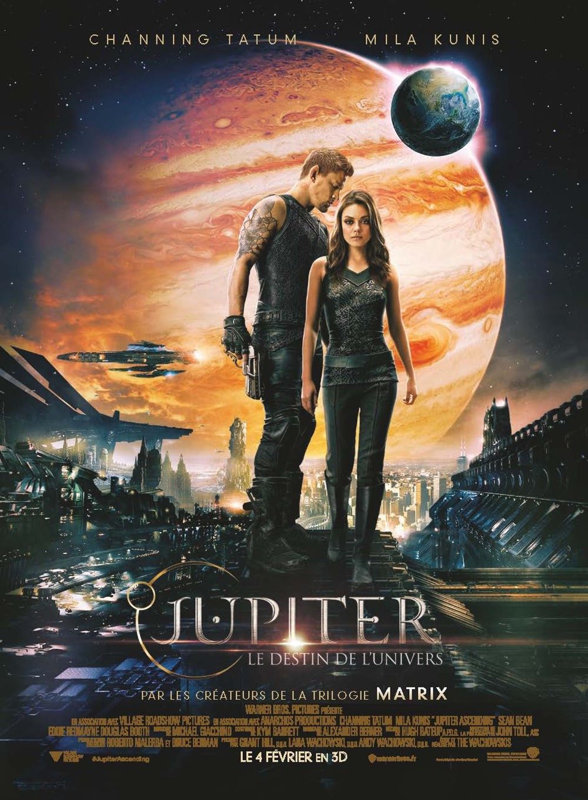
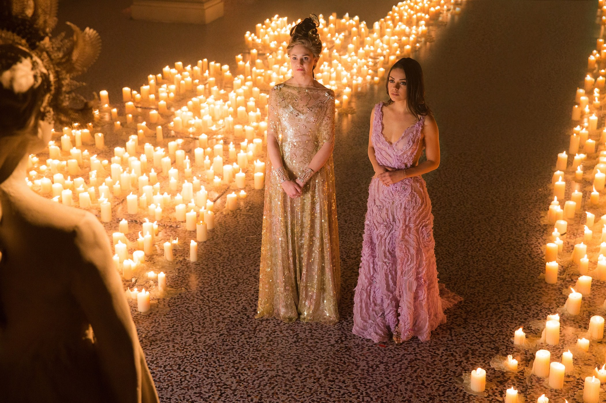
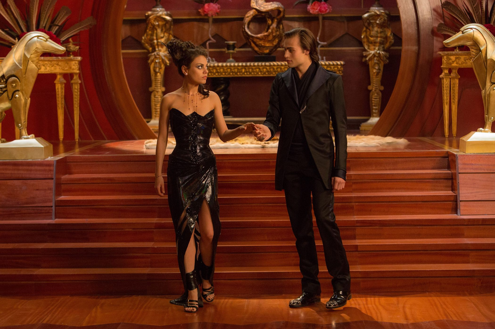
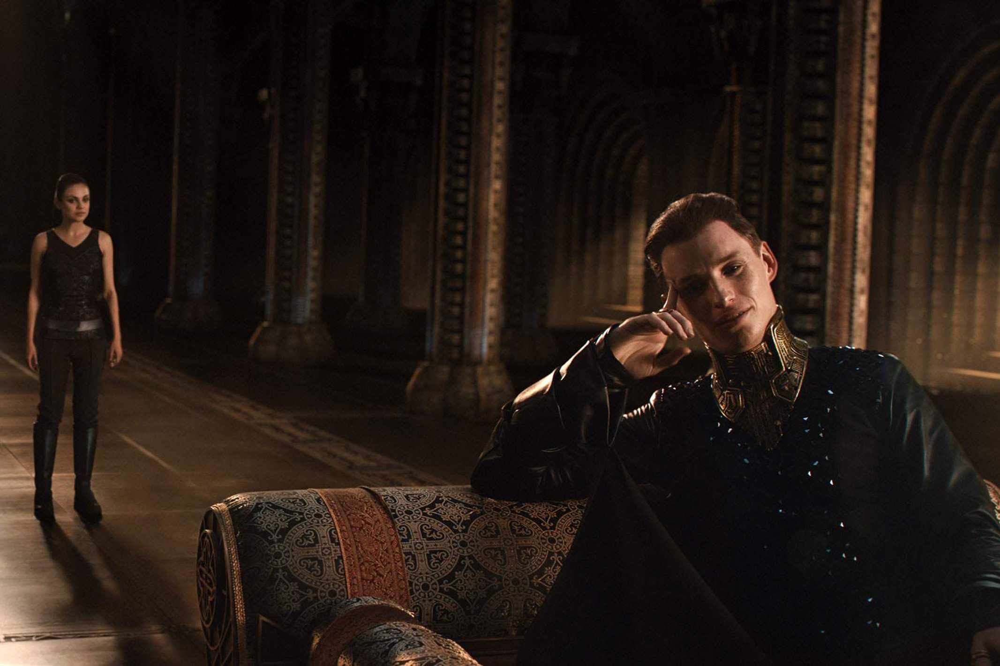

+++
titre = "<em>Jupiter : Le Destin de l&rsquo;univers</em>, Lana et Andy Wachowski"
title = "Jupiter : Le Destin de l'univers, Lana et Andy Wachowski"
url = "/jupiter-destin-univers-wachowski"
date = "2015-02-06T00:16:41"
Lastmod = "2015-02-06T00:28:38"
cover = "jupiter-destin-univers-wachowski-channing-tatum-mila-kunis.jpg"
categorie = [ "À voir" ]
tag = [ "Action", "Amour", "Blockbuster", "Espace", "Extra-terrestre", "Kitsch", "Science-Fiction", "Sorties du mois", "Space Opera" ]
createur = [ "Andy et Lana Wachowski" ]
acteur = [ "Channing Tatum", "Douglas Booth", "Eddie Redmayne", "Maria Doyle Kennedy", "Mila Kunis", "Sean Bean", "Tuppence Middleton" ]
annee = [ "2015" ]
weight = 2015
pays = [ "États-Unis" ]
original = "Jupiter Ascending"

+++

Dès le début du projet, les ambitions étaient très claires : une douzaine d&rsquo;années après la <a href="http://voiretmanger.fr/trilogie-matrix-wachowski/">trilogie <em>Matrix</em></a> qui les avait propulsé sur le devant de la scène, Lana et Andy Wachowski devaient fonder une nouvelle saga. Avec <a href="http://voiretmanger.fr/saga/star-wars/"><em>Star Wars</em></a> dans le viseur, <em>Jupiter : Le Destin de l&rsquo;univers</em> frappe ainsi d&rsquo;entrée de jeu par son ambition. La science-fiction est un genre populaire au cinéma, mais les Space Opera sont beaucoup plus rares et ceux qui espèrent être aussi porteurs que l&rsquo;univers créé par George Lucas sont rarissimes. Est-ce pour cette raison que le duo Wachowski a imaginé une histoire d&rsquo;amour sur la base du conte de princesse, une idée très proche en apparence de celle déployée dans <a href="http://voiretmanger.fr/star-wars-episode-4-nouvel-espoir-lucas/" title="Star Wars, Épisode IV : Un nouvel espoir, George Lucas"><em>Star Wars, Épisode IV : Un nouvel espoir</em></a> ? Quoi qu&rsquo;il en soit, le résultat n&rsquo;est pas le même, sans doute parce que le scénario de <em>Jupiter : Le Destin de l&rsquo;univers</em> est à la fois confus et simpliste. Si l&rsquo;on ne peut être qu&rsquo;émerveillé par l&rsquo;univers esquissé dans le film et par sa forme absolument ébouriffante, la dernière réalisation de Lana et Andy Wachowski déçoit pour tout le reste et ne parvient pas à convaincre.

Comment résumer un tel film sans raconter toute l&rsquo;histoire dans le détail ? Lana et Andy Wachowski ont tant à montrer et à raconter que l&rsquo;on a un peu le sentiment d&rsquo;avoir vu une trilogie condensée en deux heures. Le fil conducteur de <em>Jupiter : Le Destin de l&rsquo;univers</em> est pourtant assez simple. Une fille apparemment tout à fait banale, si ce n&rsquo;est qu&rsquo;elle se prénomme Jupiter, se retrouve mêlée à une histoire intergalactique parce qu&rsquo;elle a, par le plus grand des hasard, exactement le même code génétique que la reine d&rsquo;un immense royaume de l&rsquo;espace. Dans cet univers créé de toute pièce, mais qui s&rsquo;inspire de tout ce que la science-fiction a déjà produit comme c&rsquo;est souvent le cas, les humains ne sont pas les seuls dans l&rsquo;univers, il y a au contraire des milliers et des milliers de planètes habitées. On finit par comprendre au fur et à mesure du film que des familles nobles se partagent les planètes et les contrôlent dans un but bien précis : chacune d&rsquo;entre elles est programmée pour créer la vie, et cette vie est ensuite exploitée pour créer une sorte d&rsquo;elixir de jeunesse. Résultat, les nobles en question vivent éternellement jeunes. Le socle de base est déjà assez complexe, mais <em>Jupiter : Le Destin de l&rsquo;univers</em> en rajoute une couche en utilisant, non pas un, mais trois personnages différents et en conflits. Deux frères et une sœur qui veulent tous mettre la main sur Jupiter, car la jeune fille qui nettoie des toilettes au début du film peut en fait revendiquer son titre de Reine et prendre leur pouvoir, pour faire simple. Lana et Andy Wachowski imaginent ainsi une lutte entre les trois membres de la fratrie qui veulent tous mettre la main sur Jupiter en premier, et bloquer les deux autres. Mais naturellement, c&rsquo;est sans compter sur l&rsquo;intervention d&rsquo;un prince charmant, ou plutôt de Caine Wise, un ancien militaire mi-homme, mi-loup et avec des ailes greffées dans le dos.

Vous vous sentez un petit peu dépassés par les événements ? C&rsquo;est normal, et c&rsquo;est encore pire dans le film lui-même. Dès le départ, <em>Jupiter : Le Destin de l&rsquo;univers</em> vous noie sous les références et les noms et on voit très vite quel est le principal problème du film. En deux heures, on ne peut pas tout dire et le duo Wachowski essaie précisément de le faire. Lana et Andy pèchent par excès, ils veulent trop rapidement imposer leur univers qui est incontestablement très riche et oublient au passage qu&rsquo;ils ont des spectateurs à convaincre. Là où Georges Lucas présentait son univers avec un premier épisode extrêmement simple, avec deux camps bien distincts et quelques personnages clés seulement, on est ici immédiatement plongé dans une complexité un peu décourageante. Alors certes, on finit par comprendre ce qui se passe et <em>Jupiter : Le Destin de l&rsquo;univers</em> donne envie d&rsquo;en connaître plus sur cet univers original, où les planètes sont comme du terreau pour planter des êtres vivants réduits ensuite à l&rsquo;état de médicament. <em>Star Wars</em> ne traitait pas d&rsquo;économie et placer le capitalisme au cœur du film est très intéressant. On aurait aimé en savoir plus, mais il aurait fallu pour cela nettement plus que deux heures. On pourrait rétorquer que l&rsquo;idée est justement d&rsquo;établir une nouvelle saga, mais ce premier épisode en dit soit trop, soit pas assez. Reste surtout de la frustration et le sentiment que l&rsquo;on a perdu du temps avec des futilités. Il faut dire que la brièveté du long-métrage empêche aussi un bon développement des personnages. Ils sont nombreux, mais ils sont tous superficiels et creux, on ne s&rsquo;intéresse vraiment à aucun, pas même à cette héroïne un peu bêtasse, encore moins à celui qui va la sauver et qui semble ne rien éprouver du tout.

Au fond, c&rsquo;est bien le problème majeur de <em>Jupiter : Le Destin de l&rsquo;univers</em> et c&rsquo;est, de manière assez étonnante, le même problème que celui de George Lucas. Comme ce dernier, Lana et Andy Wachowski savent indéniablement créer des univers riches et passionnants, mais ils ne savent pas très bien y déployer une histoire. Le scénario est brouillon et les dialogues sont mal écrits, si bien que l&rsquo;on n&rsquo;y croit jamais vraiment. Il y a des incohérences internes énormes, sans même parler des idées de science-fiction si osées qu&rsquo;elles sont un peu ridicules. Inutile de lister tous les détails qui ne fonctionnent pas, évoquons simplement le principe même du film qui veut que l&rsquo;héroïne visite successivement la sœur, puis les deux frères. D&rsquo;une part, cette juxtaposition est un peu facile et on aurait préféré voir plus d&rsquo;interactions à l&rsquo;intérieur de la fratrie. Mais surtout, comment croire qu&rsquo;elle se fasse avoir trois fois de suite ? Jupiter est-elle vraiment aussi stupide ? Non, décidément, le scénario n&rsquo;est pas le fort de <em>Jupiter : Le Destin de l&rsquo;univers</em>, pas plus que ses personnages écrits à la va-vite et qui manquent tous de crédibilité. Le dernier film de Lana et Andy Wachowski se rattrape toutefois sur la réalisation et la mise en scène, du moins en partie. Certains décors sont peut-être un peu kitsch, mais il faut reconnaître que l&rsquo;ensemble est extrêmement cohérent et même si on n&rsquo;apprécie pas tous les choix esthétiques, on est souvent bluffé par l&rsquo;inventivité déployée dans le film. Du design des vaisseaux aux créatures, en passant par une séquence parodique au cœur d&rsquo;une administration délicieusement rétro, <em>Jupiter : Le Destin de l&rsquo;univers</em> ose tout et cela lui convient plutôt bien. Seul regret à noter sur la forme, les scènes de combat sont censées être rapides, mais elles sont surtout illisibles. À aller trop vite, on perd totalement le fil, à tel point que l&rsquo;on se lasse de ces séquences qui paraissent interminables, mais qui restent, fort heureusement, assez rares.

<em>Jupiter : Le Destin de l&rsquo;univers</em> est ambitieux, on ne peut pas lui retirer ça, et le film est séduisant par certains aspects. Son univers est très développé, c&rsquo;est sensible pendant toute sa durée, et c&rsquo;est agréable de retrouver un univers aussi complet au cinéma. Visuellement très chatoyant, on peut ne pas adhérer, mais l&rsquo;ensemble est cohérent et original, ce qui ne fait pas de mal. Tous ces bons aspects sont hélas handicapés par beaucoup de défauts. Lana et Andy Wachowski n&rsquo;ont pas su écrire un scénario clair et cohérent, ils multiplient les problèmes et surtout ils sont passés à côté de leurs personnages. Les acteurs semblent constamment se demander ce qu&rsquo;ils font là, ils récitent leur texte sans trop y croire et on ne se passionne jamais pour eux. C&rsquo;est bien dommage, car <em>Jupiter : Le Destin de l&rsquo;univers</em> reste une proposition de cinéma passionnante, mais que l&rsquo;on peut difficilement recommander. Et c&rsquo;est d&rsquo;autant plus frustrant que <a href="http://voiretmanger.fr/cloud-atlas-wachowski-tykwer/" title="Cloud Atlas, Lana et Andy Wachowski et Tom Tykwer"><em>Cloud Atlas</em></a> était construit sur une idée tout aussi complexe, pour un résultat autrement plus cohérent. S&rsquo;il y a une suite, espérons qu&rsquo;elle soit plus simple et surtout plus claire…

