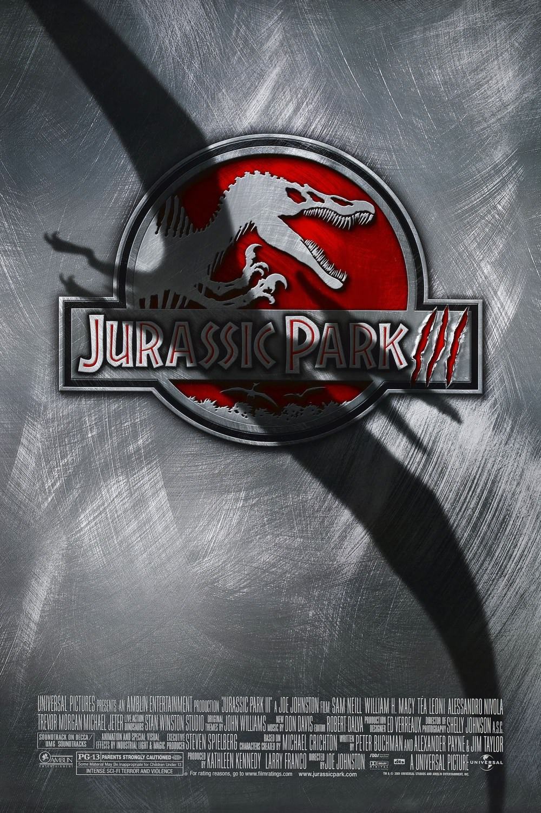
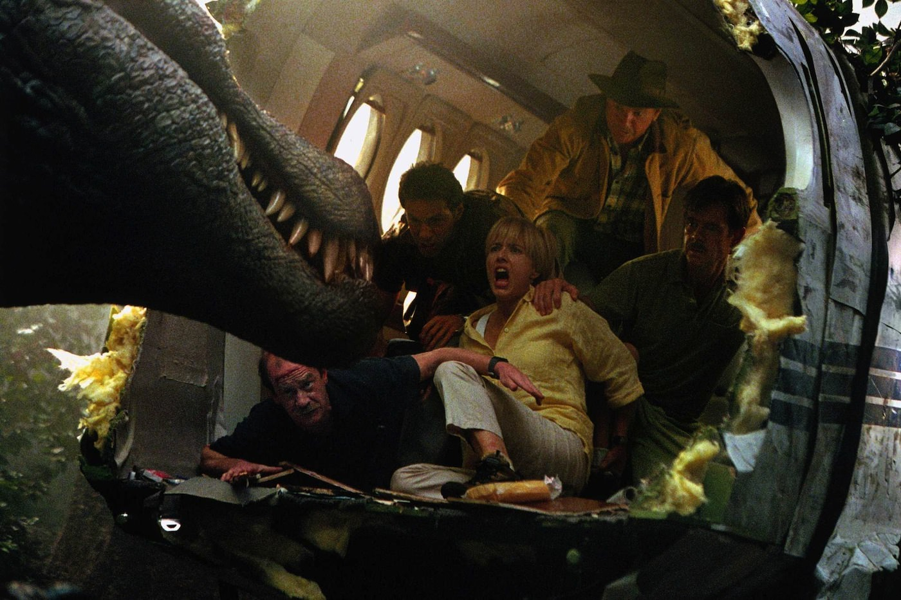
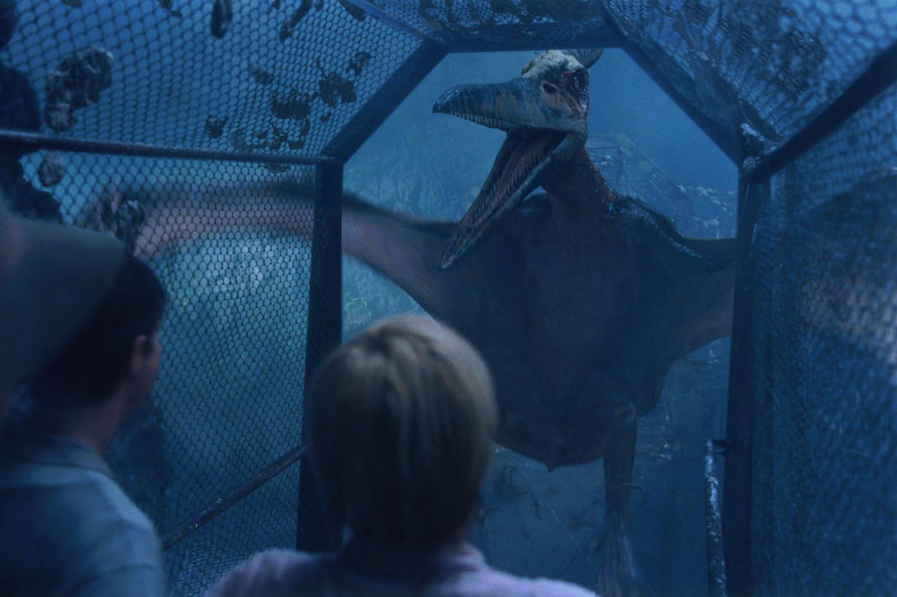

+++
titre = "<em>Jurassic Park III</em>, Joe Johnston"
title = "Jurassic Park III, Joe Johnston"
url = "/jurassic-park-iii-johnston"
date = "2013-05-10T10:32:21"
Lastmod = "2014-12-15T23:04:44"
cover = "jurassic-park-iii-sam-neill-joe-johnston.jpg"
categorie = [ "À voir" ]
tag = [ "Action", "Blockbuster", "Dinosaure", "Science-Fiction", "Vite oublié" ]
createur = [ "Joe Johnston" ]
acteur = [ "Alessandro Nivola", "Sam Neill", "Tea Leoni", "William H. Macy" ]
annee = [ "2001" ]
weight = 2001
saga = [ "Jurassic Park" ]
pays = [ "États-Unis" ]

+++

Le succès de <a href="http://voiretmanger.fr/le-monde-perdu-jurassic-park-spielberg/" title="Le Monde Perdu : Jurassic Park, Steven Spielberg"><em>Le Monde Perdu : Jurassic Park</em></a> appelait une suite, mais le projet n’a pas été porté par Steven Spielberg comme les deux premiers de la licence. Même si le cinéaste est resté proche en tant que producteur exécutif, ce n’est pas lui qui réalise ce troisième volet et <em>Jurassic Park III</em> n’est pas non plus adapté d’un livre de Michael Crichton. Dans ces conditions, la saga avait-elle une chance de faire aussi bien que l’excellent <a href="http://voiretmanger.fr/jurassic-park-spielberg/" title="Jurassic Park, Steven Spielberg"><em>Jurassic Park</em></a> ? Sans surprise, non : Joe Johnston réalise un blockbuster où l’action coule à flots, mais où le suspense a totalement disparu au profit d’une intrigue téléphonée sans grand intérêt. À trop vouloir jouer avec ses bêtes toujours plus grandes, <em>Jurassic Park III</em> oublie un élément essentiel : une histoire.

Le premier volet permettait de découvrir les dinosaures du parc avec un film centré sur quelques personnages. La suite proposait plus de dinosaures et plus d’action, pour un résultat en demi-teinte, mais qui s’inscrivait parfaitement dans la continuité de son prédécesseur. Quatre ans après, <em>Jurassic Park III</em> invente une nouvelle situation qui permet de tourner à nouveau un film sur les îles infestées de bestioles sorties directement de la préhistoire. Un garçon et un homme survolent l’île du Costa-Rica qui fait office de réserve protégée pour tous les dinosaures qui y vivent depuis quatre ans. Une série d’évènements malheureux les force pourtant à atterrir sur l’île. Huit semaines plus tard, ses parents montent une expédition de recherche faute d’avoir convaincu les autorités de le faire. Il leur faut un spécialiste pour les aider et ils tentent de convaincre Alan Grant de partir avec eux. Ce paléontologue qui a particulièrement souffert huit ans auparavant, lors de la première découverte du parc, n’a évidemment aucune intention de repartir, mais il est rapidement convaincu en échange d’un financement de ses recherches et contre la promesse qu’il ne s’agit que de survoler l’île. Le but de l’expédition étant évidemment de récupérer le fils perdu, <em>Jurassic Park III</em> se déroule entièrement sur une île que l’on connaît déjà bien, puisqu’on l’a découverte dans <em>Le Monde Perdu : Jurassic Park</em>. L’un des personnages clés de cette nouvelle aventure est en outre le héros de <em>Jurassic Park</em> et il est toujours interprété par Sam Neill. Joe Johnston réunit une équipe qui rappelle évidemment les deux équipes précédentes, avec des profils différents, et toujours un problème de famille, en l’occurrence deux parents qui viennent chercher leur enfant qui a peut-être survécu. Autant dire que ce troisième opus débute avec la crainte de revoir une deuxième fois la même chose, même si le scénario modifie certains éléments.

Comment renouveler l’intérêt du spectateur ? Joe Johnston pense à un moyen évident : offrir encore plus. On pouvait déjà critiquer <em>Le Monde Perdu : Jurassic Park</em> pour sa surenchère d’action et de dinosaures, mais ce n’est rien à côté de ce qui attend les personnages et les spectateurs de <em>Jurassic Park III</em>. L’avion est à peine posé sur l’île depuis quelques minutes que le premier dinosaure se pointe : le Spinosaurus. Ce nouveau venu dans la saga remplace le T. rex bien exploité par Steven Spielberg, une idée plutôt bonne sur le papier et le réalisateur offre d’ailleurs à ce dernier une fin honorable dans un combat avec sa propre mascotte. Symboliquement, le grand méchant de la saga disparaît de l&rsquo;affiche et il est mis à mort pour céder sa place au nouveau méchant qui est non seulement plus gros et plus puissant, mais aussi beaucoup plus intelligent. Pendant toute la durée du film, il suit les personnages, sans que l’on sache très bien pourquoi. C’est peut-être le dinosaure le plus humanisé, même si <em>Jurassic Park III</em> se distingue justement par une tendance à approcher tous les animaux des humains, ou du moins d’animaux que l’on a l’habitude de voir aujourd’hui. Un bon exemple concerne les vélociraptors qui sont finalement les vraies stars de la saga en apparaissant dans chaque épisode : ici encore, ils ont un rôle en première ligne et ils sont même le principal sujet d’étude du docteur Alan Grant qui travaille sur un spécimen fossile et qui développe au début une théorie selon laquelle ces dinosaures étaient plus intelligents que des primates. Ils le prouvent tout au long du long-métrage et Joe Johnston les présente non plus comme des êtres sanguinaires prêts à tout pour manger, mais comme une famille attentionnée qui veut seulement récupérer ses œufs. Le problème, c’est qu’on ne craint plus ces prédateurs censés être terribles et tous les dinosaures présentés, jusqu’au ptérodactyle qui a aussi une place de choix sur l’affiche et dans <em>Jurassic Park III</em>, ne sont pas vraiment effrayants. Ils sont tenaces, efficaces souvent, mais ils ne font pas peur comme pouvait effrayer le T. rex de <em>Jurassic Park</em>. C’est sans doute parce qu’on les voit trop, mais aussi, et surtout parce que, les progrès technologiques aidant, on les voit de près et ils sont plus réalistes et du coup moins effrayants. Sous la forme de silhouettes et d’ombres, ils en imposaient beaucoup plus qu’ici où ce défilé incessant de dinosaures lasse plus qu’autre chose…

<em>Jurassic Park III</em> ne manque pas d’idées pour restaurer la nouveauté de la saga, on le voit, mais rien ne fonctionne. À trop en faire, le film passe totalement à côté de ce qui faisait l’intérêt des précédents : pas uniquement de l’action décérébrée, mais aussi une bonne dose de suspense et un peu de fond. Joe Johnston se contente de donner vie à des créatures mythiques, on sent que c’est un peu son rêve de gosse, mais un rêve qu’il ne partage pas vraiment. <em>Jurassic Park III</em> n’est qu’un blockbuster de plus, pas un bon qui plus est : les amateurs de dinosaures apprécieront les reconstitutions et pourront rapidement l’oublier.

<h3>Vous voulez m&rsquo;aider ?</h3>
<ul>
<li><a href="http://www.amazon.fr/gp/product/B007MFUG7I/ref=as_li_ss_tl?ie=UTF8&#038;tag=leblogdenic07-21&#038;linkCode=as2&#038;camp=1642&#038;creative=19458&#038;creativeASIN=B007MFUG7I">Acheter le film en Blu-Ray sur Amazon</a></li>
<li><a href="http://www.amazon.fr/gp/product/B004FRP4YQ/ref=as_li_ss_tl?ie=UTF8&#038;tag=leblogdenic07-21&#038;linkCode=as2&#038;camp=1642&#038;creative=19458&#038;creativeASIN=B004FRP4YQ">Acheter le film en DVD sur Amazon</a></li>
<li><a href="https://itunes.apple.com/fr/movie/jurassic-park-iii/id453236136">Acheter ou louer le film sur l&rsquo;iTunes Store</a></li>
</ul>
<ul>
<li><a href="http://www.amazon.fr/gp/product/B008HQYM8K/ref=as_li_ss_tl?ie=UTF8&#038;tag=leblogdenic07-21&#038;linkCode=as2&#038;camp=1642&#038;creative=19458&#038;creativeASIN=B008HQYM8K">Acheter la trilogie en Blu-Ray sur Amazon</a></li>
<li><a href="http://www.amazon.fr/gp/product/B008HQYLVS/ref=as_li_ss_tl?ie=UTF8&#038;tag=leblogdenic07-21&#038;linkCode=as2&#038;camp=1642&#038;creative=19458&#038;creativeASIN=B008HQYLVS">Acheter la trilogie en DVD sur Amazon</a></li>
</ul>

