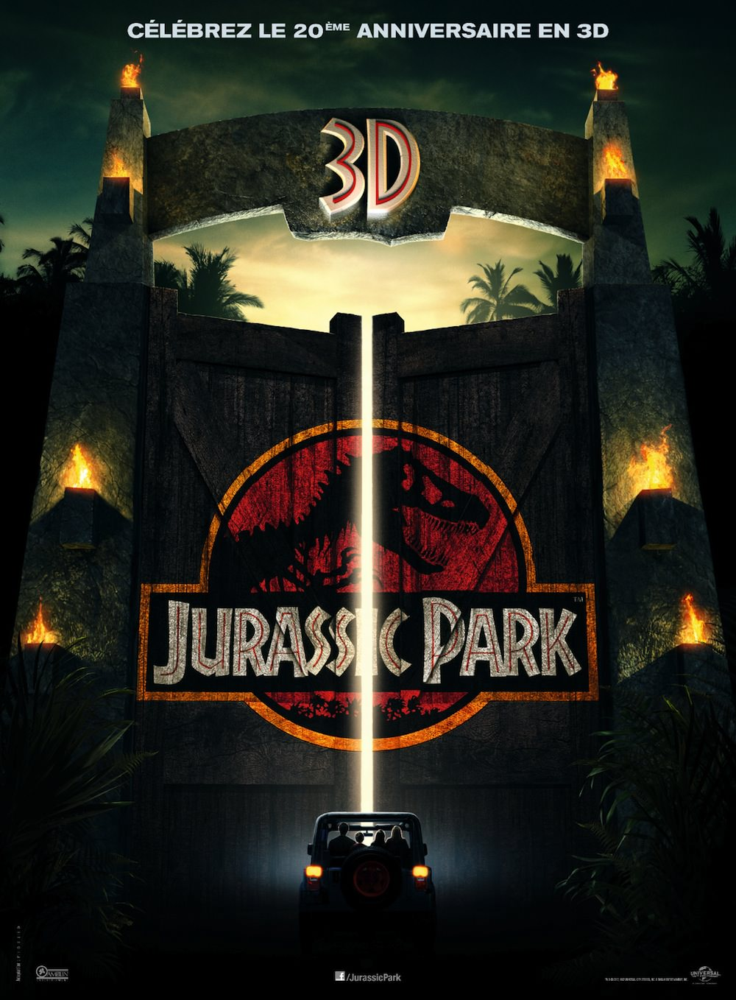
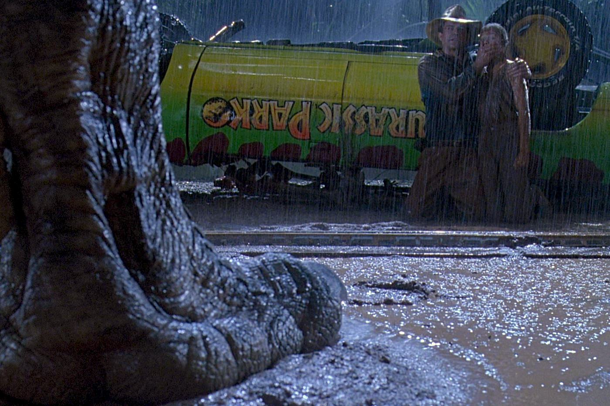
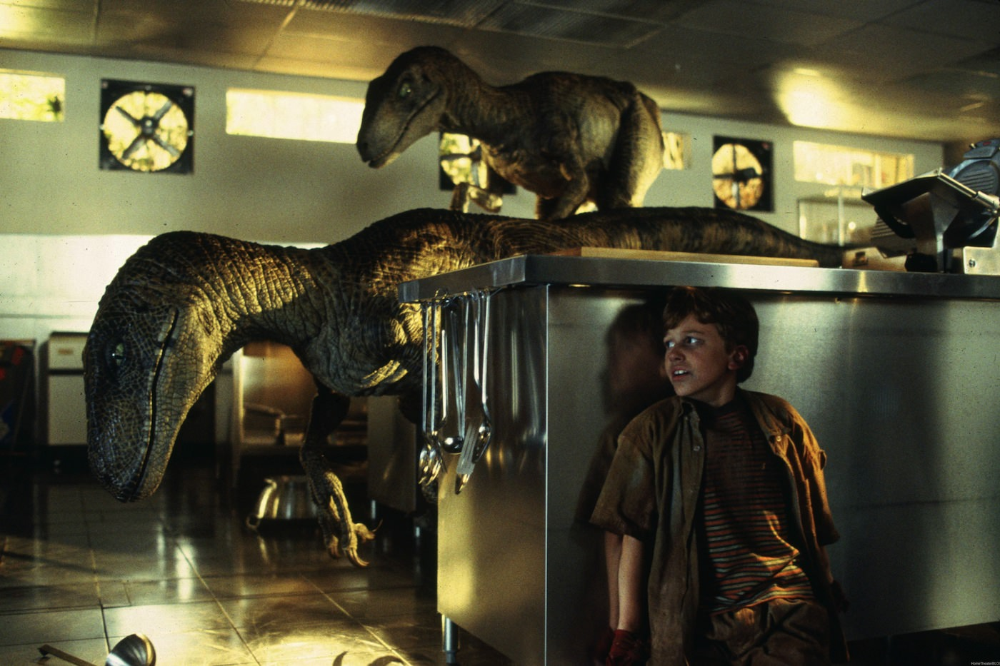

+++
type = "post"
titre = "<em>Jurassic Park</em>, Steven Spielberg"
title = "Jurassic Park, Steven Spielberg"
url = "/jurassic-park-spielberg"
date = "2013-05-06T18:49:19"
Lastmod = "2014-10-08T23:16:50"
cover = "jurassic-park-steven-spielberg.jpg"
categorie = [ "À voir" ]
tag = [ "Action", "Aventure", "Blockbuster", "Dinosaure", "Drame", "Nature", "Science-Fiction", "Technologies" ]
createur = [ "Steven Spielberg" ]
acteur = [ "Jeff Goldblum", "Joseph Mazzello", "Laura Dern", "Richard Attenborough", "Sam Neill" ]
annee = [ "1993" ]
weight = 1993
saga = [ "Jurassic Park" ]
pays = [ "États-Unis" ]

+++

Vingt ans après, <em>Jurassic Park</em> reste un film culte et un monument du cinéma populaire. Blockbuster époustouflant, divertissement populaire qui a rassemblé des millions de spectateurs à son époque, il n’a pas pris une ride et beaucoup de réalisateurs apprendraient beaucoup en revoyant ce classique. Steven Spielberg a associé son nom au principe même du blockbuster, mais <em>Jurassic Park</em> est peut-être sa plus grande réussite dans ce domaine. Au-delà de la prouesse technologique qui a, contre toute attente, très bien vieillie, on retrouve concentrés ici tous les ingrédients du divertissement familial, à la fois film d’aventures à l’ancienne, film d’épouvante équilibré par une pointe de comédie. Steven Spielberg est parvenu en 1993 à trouver un équilibre proche de la perfection et le long-métrage mérite d’être (re)vu aujourd’hui.

<em>Jurassic Park</em>, c’est d’abord un rêve de gosse, celui de Steven Spielberg sans doute : ressusciter, au cinéma, les dinosaures disparus de la surface terrestre et qui font rêvé toutes les générations. Pour cela, le cinéaste s’inspire d’un récit de Michael Crichton qui concrétise ce rêve avec un personnage capable de rendre la vie aux dinosaures. Dans sa première partie, le film sait ménager son suspense et on ne comprend pas dès le départ de quoi il s’agit, même si le but du long-métrage est bien entendu connu. John Hammond est un homme extrêmement riche : ce concepteur de plusieurs attractions et parcs dans sa vie entend la finir en beauté avec le parc ultime. Sur une île située au large du Costa Rica, il a réussi à recréer un environnement du Jurassique avec plusieurs dinosaures nés d’un ADN préservé pendant toutes ces années par une couche d’ambre très protectrice. Ces animaux mythiques, il entend les partager et en faire un parc d’attractions extraordinaire, où les visiteurs se déplaceraient dans toute l’île à bord de véhicules automatisés pour avoir le sentiment de revivre, pendant quelques heures, à une époque disparue. Une bien belle idée, mais qui inquiète naturellement les investisseurs : la sécurité des visiteurs sera-t-elle assurée face à des bêtes aussi énormes et dangereuses que peut l’être le fameux <em>Tyrannosaurus rex</em>, surnommé ici « T. rex » ? Hammond décide de faire visiter son parc à plusieurs spécialistes, et notamment au docteur Alan Grant, paléontologue réputé. Bien entendu, rien ne se passera comme prévu et une tempête tropicale doublée d’un traitre dans l’équipe du parc fera de <em>Jurassic Park</em> le blockbuster intense qu’il est.

Fidèle au genre qu’il a contribué à populariser, Steven Spielberg réunit dans son film la palette de personnages nécessaires à son aventure. <em>Jurassic Park</em> se construit ainsi autour du paléontologue que l’on a évoqué, mais aussi du docteur Ellie Sattler, une spécialiste de la biologie de l’époque paléolithique, du mathématicien Ian Malcom et de Lex et Tim, les deux petits-enfants de John Hammond. Un ensemble hétéroclite et des personnages fortement caractérisés, comme c’est toujours le cas ici. Dès le départ, Ian Malcom annonce son scepticisme quant au projet et surtout prévoit sa dangerosité ; il s’oppose ainsi à Alan Grant qui semble ravi de découvrir en chair et en os les animaux qui l’ont occupé toute sa vie. La figure paternelle, centrale dans l’œuvre de Steven Spielberg, a une place de choix avec ces deux enfants, mais aussi avec John Hammond qui fait figure de double du cinéaste. Tous les deux donnent vie aux dinosaures, mais dans le film, le créateur du parc assiste à la naissance de toutes les créatures qu’il considère comme ses propres enfants. Plus tard, c’est le docteur Grant qui devra assumer un rôle de père qu’il ne désirait pas en s’occupant, seul, des deux petits-enfants. Ces derniers ne sont plus vraiment des enfants, ce ne sont pas encore tout à fait des adolescents et ils représentent mieux que quiconque l’attraction du film et de son idée. Même les plus grands toutefois ne peuvent qu’être émerveillés par le travail réalisé sur <em>Jurassic Park</em>. Steven Spielberg nous embarque dans une aventure extraordinaire et on n’a qu’une envie : voir des dinosaures. Avant de les voir, l’introduction sert au cinéaste à poser ses personnages et à donner quelques explications pour ajouter de la crédibilité à son projet. On veut voir des dinosaures, certes, mais on veut y croire et le film essaie d’expliquer très simplement la renaissance des bêtes à partir de leur ADN. Quand ils passent enfin les immenses portes du parc, l’excitation est à son comble, pour les personnages, comme pour les spectateurs.

Malin, Steven Spielberg retarde autant que possible la première apparition des dinosaures qui nous intéressent le plus : le fameux T. rex n’apparaît qu’au bout d’une heure environ, à la moitié du long-métrage donc. Ce clou du spectacle est cependant à la hauteur de l’attente : à sa sortie en 1993, <em>Jurassic Park</em> repoussait très loin en avant les capacités techniques du cinéma. On n’avait jamais vu de telles créatures mythiques se déplacer et agir avec autant de réalisme et ce dinosaure vraiment méchant et assez malin a marqué plus d’un spectateur. Vingt ans plus tard, les effets numériques utilisés ont nécessairement un peu vieilli, mais la réalisation Steven Spielberg ne souffre pas de la comparaison. En effet, si les effets créés par ordinateur permettent aujourd’hui de montrer tout sans aucune limite, si ce n’est celle de l’imagination, <em>Jurassic Park</em> savait manier l’intensité de son récit à la perfection. Le montage est extrêmement maîtrisé et il sait provoquer la tension aux bons moments, sans en faire des tonnes. Rétrospectivement, on est frappé notamment par l’utilisation de la musique : l’excellente <a href="http://www.amazon.fr/gp/product/B000002OOY/ref=as_li_ss_tl?ie=UTF8&tag=leblogdenic07-21&linkCode=as2&camp=1642&creative=19458&creativeASIN=B000002OOY">bande originale composée par John Williams</a> est un exemple du genre, avec son thème facilement reconnaissable et ses montées en puissance bien dosées, mais la grande force du film est précisément… de ne pas trop l’utiliser. Les plus grands moments de tension dans <em>Jurassic Park</em> se font en silence, ou du moins sans musique : le bruit de l’eau qui tombe, le souffle haletant des personnages ou des dinosaures suffisent à provoquer un état de stress palpable, sans qu’une musique martiale vienne les appuyer. Tout, du scénario à la mise en scène, est pensé ici pour provoquer les sensations attendues d’un tel divertissement. On a peur avec les personnages, on courre avec eux, c’est une réussite incontestable et un film a rarement été aussi prenant… tout en montrant finalement peu de choses.

En effet, <em>Jurassic Park</em> reste un film grand public qui évite logiquement de tomber dans les effusions de sang et de chair dignes des films d’horreur. À quelques exceptions près — dont un bras nettement ensanglanté —, Steven Spielberg ne montre pas de scènes violentes, mais suggère en permanence le risque qui pèse sur les humains. Une scène devenue mythique, à la fin, résume bien cet esprit : alors que les personnages ont réussi à s’enfuir de l’île désormais contrôlée par les dinosaures, le gigantesque T. rex détruit l’entrée du parc où trônent les ossements de ses pairs dénichés par les paléontologues et se dresse une dernière fois pour hurler, alors qu’un bandeau marqué « <em>Quand les dinosaures régnaient sur le monde</em> » tombe devant lui. Une image forte, tout un symbole pour ce film qui n’est pas aussi stupide qu’il pourrait n’y paraître. C’est le propre des grands films de proposer un divertissement accessible à tous immédiatement, tout en se basant sur des idées et des théories plus complexes. <em>Jurassic Park</em> de la même manière défend une théorie qui est loin d’être simpliste. Certes, recréer sur une île un environnement de l’époque des dinosaures, c’est amusant et n’importe qui pourrait le désirer. Mais comme Ian Malcolm, le mathématicien de la bande, le souligne dès les premières minutes, c’est aussi extrêmement dangereux. Les dinosaures se sont éteints dans un lent processus de sélection naturelle et si la nature a choisi de les effacer de la surface terrestre, c’est pour une bonne raison. Jouer à dieu comme le fait John Hammond n’est pas la chose à faire, car on ne sait pas comment ces bêtes vont réagir face aux humains. Tout <em>Jurassic Park</em> sert de fait de démonstration pour prouver qu’il avait raison sur toute la ligne. Le T. rex et son instinct de chasseur l’incitent à refuser la chèvre qu’on lui offre et à lui préférer ces humains qui courent en hurlant. Très intelligents, les Vélociraptors deviennent vite de dangereux adversaires, beaucoup plus puissants que les humains et capables de déjouer toutes leurs astuces. Il faudra la concurrence d’un dinosaure plus puissant pour les arrêter : quel meilleur symbole de la victoire de la nature sur les hommes ?

Devenu instantanément culte, <em>Jurassic Park</em> reste encore aujourd’hui l’un des plus grands blockbusters de l’histoire du cinéma. Steven Spielberg a trouvé un équilibre parfait pour plaire à toute la famille avec un divertissement très réussi, qui fait peur tout en étant fun et qui est immédiatement accessible sans être stupide. Dans le genre, on a rarement fait aussi bien et on peut nettement déterminer un avant et un après <em>Jurassic Park</em>. Une fois encore, le cinéaste a modifié en profondeur son cinéma avec un film culte, à voir et à revoir.

<h3>Vous voulez m&rsquo;aider ?<a href="#footnote_0_9345" id="identifier_0_9345" class="footnote-link footnote-identifier-link" title="&Agrave; propos de la publicit&eacute;&hellip;">1</a></h3>
<ul>
<li><a href="http://www.amazon.fr/gp/product/B007MFUG3W/ref=as_li_ss_tl?ie=UTF8&tag=leblogdenic07-21&linkCode=as2&camp=1642&creative=19458&creativeASIN=B007MFUG3W">Acheter le film en Blu-Ray sur Amazon</a></li>
<li><a href="http://www.amazon.fr/gp/product/B000A0GD6K/ref=as_li_ss_tl?ie=UTF8&tag=leblogdenic07-21&linkCode=as2&camp=1642&creative=19458&creativeASIN=B000A0GD6K">Acheter le film en DVD sur Amazon</a></li>
<li><a href="https://itunes.apple.com/fr/movie/jurassic-park/id453015331">Acheter ou louer le film sur l&rsquo;iTunes Store</a></li>
</ul>
<ul>
<li><a href="http://www.amazon.fr/gp/product/B008HQYM8K/ref=as_li_ss_tl?ie=UTF8&tag=leblogdenic07-21&linkCode=as2&camp=1642&creative=19458&creativeASIN=B008HQYM8K">Acheter la trilogie en Blu-Ray sur Amazon</a></li>
<li><a href="http://www.amazon.fr/gp/product/B008HQYLVS/ref=as_li_ss_tl?ie=UTF8&tag=leblogdenic07-21&linkCode=as2&camp=1642&creative=19458&creativeASIN=B008HQYLVS">Acheter la trilogie en DVD sur Amazon</a></li>
</ul>

<ol class="footnotes"><li id="footnote_0_9345" class="footnote"><a href="http://voiretmanger.fr/soutien/">À propos de la publicité…</a> [<a href="#identifier_0_9345" class="footnote-link footnote-back-link">&#8617;</a>]</li></ol>
