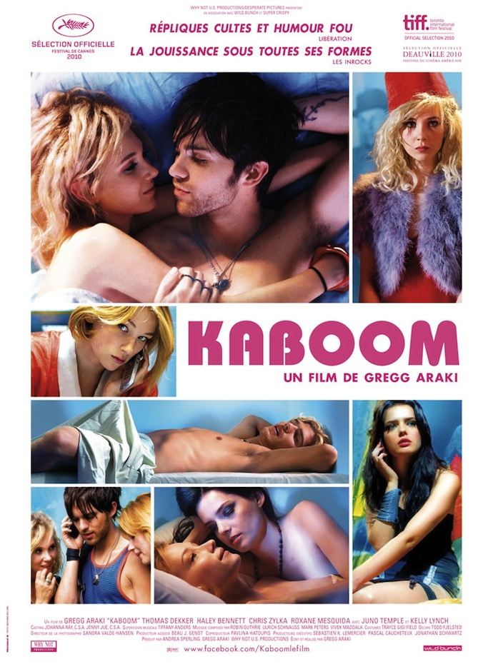

+++
type = "post"
titre = "Kaboom, Gregg Araki"
title = "Kaboom, Gregg Araki"
url = "/kaboom-araki"
date = "2010-10-08T10:54:55"
Lastmod = "2012-04-08T10:46:42"
cover = "kaboom-araki-dekker.jpg"
categorie = [ "À voir" ]
tag = [ "Adolescence", "Amour", "Drogue", "Fantastique", "Sexe", "Vite oublié" ]
createur = [ "Gregg Araki" ]
acteur = [ "Thomas Dekker" ]
annee = [ "2010" ]
weight = 2010
pays = [ "États-Unis" ]

+++

<em>Kaboom</em>, le dernier film de Gregg Araki, promet dès son affiche de la couleur acidulée, une ambiance pop et du sexe. Si tout cela compose bien ce film, <em>Kaboom</em> se révèle aussi être un film complètement barré. Commençant comme un teenage movie assez classique, quoique fort décomplexé, <em>Kaboom</em> dévie vers un délire toujours plus énorme. Complètement barré donc, plaisant, pas inoubliable, comme une sucrerie consommée rapidement…

<a href="http://www.allocine.fr/film/fichefilm_gen_cfilm=173662.html">

</a>

Difficile de résumer l&rsquo;histoire de <em>Kaboom</em>, tant elle part vite dans tous les sens. Son point de départ est pourtant simple : on suit les aventures de Smith, jeune ado américain de 18 ans qui fait des études dans une université, manifestement sur la côte ouest des États-Unis. Comme le dit sans détour sa meilleure amie, London, cette période de leur vie est faite pour expérimenter et baiser. Smith ne s&rsquo;en prive pas, surtout avec des hommes, mais aussi avec des femmes. Il fantasme notamment sur Thor, son colocataire aussi blond que bête et musclé, mais qui est également totalement hétérosexuel. Il craque également pour Stella, jeune fille que l&rsquo;on qualifiera de peu farouche et qui semble plutôt douée au lit. Bref, la vie banale d&rsquo;un étudiant extraverti sur un campus tout à fait classique.

C&rsquo;est au moins ainsi que commence <em>Kaboom</em>. Car plus le film avance, plus le délire devient central. Au départ, ce sont juste des cauchemars de Smith, notamment un rêve récurrent qu&rsquo;il fait et où il déambule dans un long couloir vide où se trouvent sa mère, son amie et d&rsquo;autres personnes inconnues et qui aboutit sur une porte derrière laquelle se trouve une poubelle rose. Un rêve mystérieux, mais on n&rsquo;est alors pas au bout de nos peines. Le film dérive vite vers un grand délire à base d&rsquo;hallucinations, de malfaiteurs dissimulés derrière des masques d&rsquo;animaux un peu grotesques et aussi d&rsquo;un complot visant à renouveler toute l&rsquo;humanité et voir émerger une aube nouvelle. Le film de Gregg  Araki plonge ainsi dans un univers de n&rsquo;importe quoi qui laisse pour le moins pantois, d&rsquo;autant qu&rsquo;il le fait avec un sérieux et un apparent premier degré constants.

Au départ plutôt comédie de mœurs, le film évolue inexorablement vers le fantastique tendance ridicule assumé. Au départ, on peut être pris un peu au dépourvu, sentiment partagé par la salle à en croire les rires gênés. Je crois que l&rsquo;on était nombreux, moi le premier, à découvrir l&rsquo;univers du réalisateur américain, et la première approche peut être un peu rude. Il faut dire que <em>Kaboom</em> maintient en permanence le doute sur sa nature : comédie ridicule involontairement ou ridicule assumé de la parodie de film de genre ? Ce doute est une force du film, en même temps qu&rsquo;une gêne à la vision : on ne sait pas trop quoi penser de ces explications qui se veulent logiques aux hallucinations du personnage principal. L&rsquo;histoire de cette secte prête à exploser le monde entier pour imposer ses idéaux, mais qui agit soi-disant secrètement en utilisant des masques d&rsquo;animaux pour se cacher est totalement loufoque. Pendant un temps, on en vient quand même à se demander si <em>Kaboom</em> n&rsquo;est pas un film au premier degré, ce qui serait un véritable problème. La fin, abrupte et ridicule au possible, ôte néanmoins tout doute restant : il s&rsquo;agit bien là d&rsquo;un délire complet. Délire qui annihile toute ambition sociétale du film : alors que <em>Kaboom</em> évoque le quotidien de quelques adolescents, leur vie sur un campus, leur sexualité…, mais tous ces thèmes sont comme écrasés par le penchant fantastico-ridicule du film. Ce n&rsquo;est pas un problème en soi, c&rsquo;est le choix du réalisateur, mais je dois dire que c&rsquo;est surprenant quand on ne s&rsquo;y attend pas, et quand le (court) générique de fin arrive, on est un peu… déboussolés. L&rsquo;impression générale étant quand même que le scénario se compose de bouts d&rsquo;idées jetées un peu au hasard, même si une astuce à un moment donné du film remet en perspective toute la suite, mais je ne veux pas dévoiler la clé de l&rsquo;histoire.

Gregg Araki ose tout avec son scénario, mais aussi avec sa réalisation. <em>Kaboom</em> est un film déjanté jusque sa forme, très colorée et vive. Les raccords les plus fous sont utilisés (les mêmes que ceux proposés par les logiciels de montage grand public) tandis qu&rsquo;Akari filme, <a href="http://voiretmanger.fr/2010/10/03/amours-imaginaires-dolan/">lui aussi</a>, des scènes de sexe avec un filtre de couleur. Ça n&rsquo;est pas toujours du meilleur goût, mais là encore le ridicule est totalement assumé et passe plutôt bien, même si c&rsquo;est parfois au prix d&rsquo;une certaine lourdeur. Cela étant, <em>Kaboom</em> est un film globalement léger, comme une petite sucrerie avalée rapidement. C&rsquo;est plaisant, on passe un bon moment en salle avant de prestement oublier le film.

<em>Kaboom</em> réussit un difficile travail d&rsquo;équilibriste, entre vie débridée d&rsquo;étudiants, fantastique bourré aux substances illicites et délire à base de théorie du complot. Gregg Araki parvient à maintenir le doute quasiment sur toute la durée de son film, si bien que l&rsquo;on ne sait jamais trop qu&rsquo;en penser. Un malaise qui était inattendu pour ma part, et qui se révèle payant. Si le film n&rsquo;est pas inoubliable, on passe un moment plaisant à se demander jusqu&rsquo;où <em>Kaboom</em> va aller dans le n&rsquo;importe quoi. Qu&rsquo;on se le dise, il va très loin.

<h3>Vous voulez m&rsquo;aider ?<a href="#footnote_0_4132" id="identifier_0_4132" class="footnote-link footnote-identifier-link" title="&Agrave; propos de la publicit&eacute;&hellip;">1</a></h3>
<ul>
<li><a href="http://www.amazon.fr/gp/product/B006LNA8QG/ref=as_li_ss_tl?ie=UTF8&#038;tag=leblogdenic07-21&#038;linkCode=as2&#038;camp=1642&#038;creative=19458&#038;creativeASIN=B006LNA8QG">Acheter le film en Blu-Ray sur Amazon</a></li>
<li><a href="http://www.amazon.fr/gp/product/B006LNA8D4/ref=as_li_ss_tl?ie=UTF8&#038;tag=leblogdenic07-21&#038;linkCode=as2&#038;camp=1642&#038;creative=19458&#038;creativeASIN=B006LNA8D4">Acheter le film en DVD sur Amazon</a></li>
</ul>

<ol class="footnotes"><li id="footnote_0_4132" class="footnote"><a href="http://voiretmanger.fr/a-propos/publicite/">À propos de la publicité…</a> [<a href="#identifier_0_4132" class="footnote-link footnote-back-link">&#8617;</a>]</li></ol>
