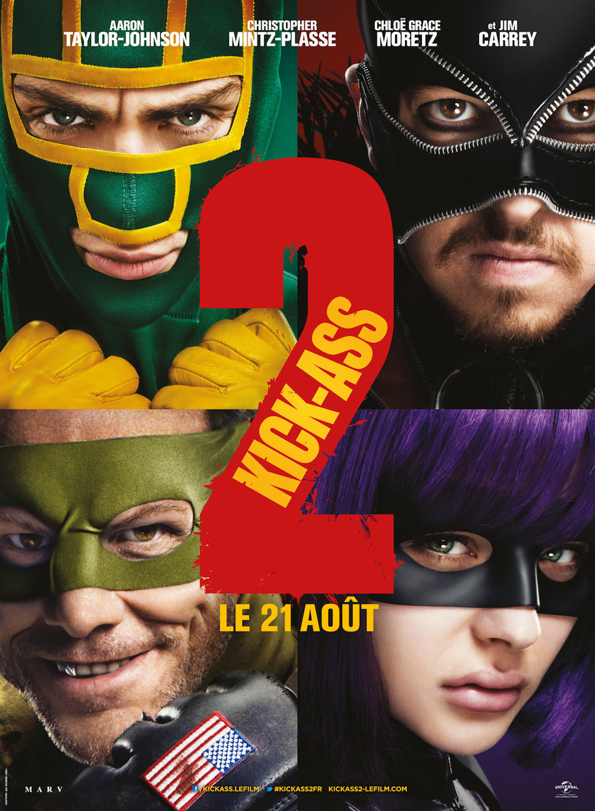
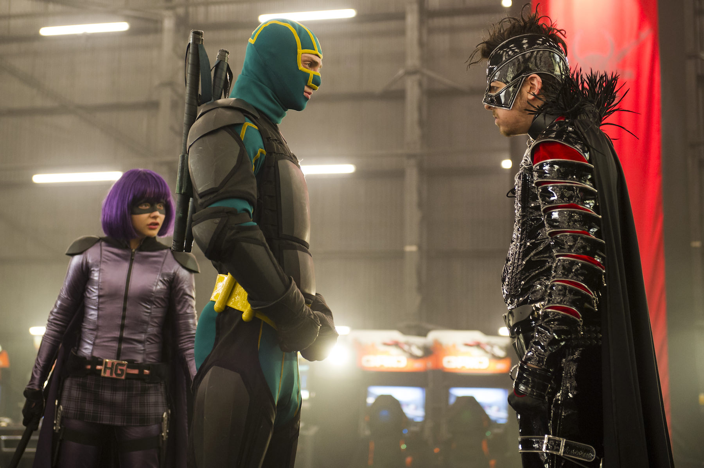

+++
titre = "<em>Kick-Ass 2</em>, Jeff Wadlow"
title = "Kick-Ass 2, Jeff Wadlow"
url = "/kick-ass-2-wadlow"
date = "2013-12-29T18:31:40"
Lastmod = "2013-12-29T18:39:16"
cover = "kick-ass-2-wadlow-chloe-grace-moretz-aaron-taylor-johnson.jpg"
categorie = [ "À voir" ]
tag = [ "À oublier", "Adolescence", "Blockbuster", "Comics", "Superhéros", "Teen Movie", "Violence" ]
createur = [ "Jeff Wadlow" ]
acteur = [ "Aaron Taylor-Johnson", "Chloë Grace Moretz", "Christopher Mintz-Plasse", "Jim Carrey" ]
annee = [ "2013" ]
weight = 2013
saga = [ "Kick-Ass" ]
pays = [ "États-Unis" ]

+++

Trois ans après <a href="http://voiretmanger.fr/kick-ass-vaughn/" title="Kick-Ass, Matthew Vaughn"><em>Kick-Ass</em></a>, un film de superhéros pas très léger, mais assez fun par sa manière de caricaturer le genre, <em>Kick-Ass 2</em> doit assurer la relève. Malgré le succès commercial du premier volet, Matthew Vaughn a été remercié et remplacé par Jeff Wadlow qui n’était pas connu comme un grand cinéaste avant, et qui ne sera pas plus retenu après ce long-métrage. À défaut de légèreté, <em>Kick-Ass</em> avait pour lui un sens de l’autodérision qui permettait de pardonner toutes les fautes de goût qu’il accumulait. Cette suite est désespérément au premier degré et c’est son mauvais goût qui ressort avec plus de force encore : des blagues scatologiques à des scènes extrêmement douteuses, <em>Kick-Ass 2</em> n’est pas drôle et même pénible à regarder. Évitez-vous cette peine… 

La bonne idée du premier film de la série était de faire d’un adolescent assez banal un superhéros raté, puis de l’opposer à deux vrais superhéros, dont une petite fille qui cachait bien son jeu. Pour la suite, les scénaristes de <em>Kick-Ass 2</em> n’avaient pas trop le choix : il fallait trouver un moyen de permettre aux premiers héros de continuer leur tâche. Le film commence ainsi alors que Hit Girl et Kick-Ass s’entraînent pour devenir de vrais héros plutôt que d’aller au lycée. En face, leur ennemi abandonne son rôle de Red Mist au profit de « <em>Motherfucker</em> » (sic), un méchant. Le gamin tue sa mère dans les premières minutes et devient immensément riche, une fortune qu’il met à profit pour constituer une armée de méchants. L’heure étant aux réunions, Jeff Wadlow imagine que Kick-Ass rejoint sa bande de superhéros pour faire le bien à plusieurs. L’idée de passer du héros solitaire au groupe n’est pas très originale — Marvel l’a déjà expérimentée avec <a href="http://voiretmanger.fr/avengers-whedon/" title="Avengers, Joss Whedon"><em>Avengers</em></a> après tout — et elle aurait pu fonctionner. Sauf que <em>Kick-Ass 2</em> a oublié un élément essentiel : l’autodérision. Le film tente bien de retrouver l’humour de son prédécesseur, mais le scénario s’arrête au niveau pipi-caca, littéralement, et ce n’est jamais drôle. Si l’on est très bon public, on pourra sourire ici ou là, mais on sera surtout très gêné devant quelques scènes très très limites. Symbole du ratage du long-métrage, cette scène de viol empêché par l’impuissance du méchant est embarrassante et on se demande bien comment les producteurs ont pu la laisser. Ce n’est pas de l’impertinence, car tout est pris au pied de la lettre et Jeff Wadlow en fait des tonnes pour un résultat d’une lourdeur inimaginable. Le résultat est sans appel : on s’ennuie face à ce spectacle d’une fadeur infinie et que rien, ni personne, ne parvient à sauver. Jim Carrey est mis en avant sur l’affiche, mais l’acteur excellent par ailleurs est ici tout juste médiocre. Même Chloë Grace Moretz qui avait surpris dans le premier volet incarne une adolescente transparente, tandis qu’Aaron Taylor Johnson est aussi insipide que prévu. 

<em>Kick-Ass</em> était un projet dangereux, mais qu’un heureux accident avait sauvé grâce à un scénario qui savait ne pas trop se prendre au sérieux. Un tel accident ne pouvait survenir deux fois et <em>Kick-Ass 2</em> concrétise tout ce que l’on pouvait déjà craindre avec le précédent volet. Lourd, pas drôle et même souvent indigeste, cette suite est un <em>Teen Movie</em> stupide qui ne s’assume pas et c’est un film sans intérêt, à éviter…

<h3>Vous voulez m&rsquo;aider ?<a href="#footnote_0_10802" id="identifier_0_10802" class="footnote-link footnote-identifier-link" title="&Agrave; propos de la publicit&eacute;&hellip;">1</a></h3>
<ul>
<li><a href="http://www.amazon.fr/gp/product/B00EDGDCKW/ref=as_li_ss_tl?ie=UTF8&#038;tag=leblogdenic07-21&#038;linkCode=as2&#038;camp=1642&#038;creative=19458&#038;creativeASIN=B00EDGDCKW">Acheter le film en Blu-Ray sur Amazon</a></li>
<li><a href="http://www.amazon.fr/gp/product/B00EDGDA2M/ref=as_li_ss_tl?ie=UTF8&#038;tag=leblogdenic07-21&#038;linkCode=as2&#038;camp=1642&#038;creative=19458&#038;creativeASIN=B00EDGDA2M">Acheter le film en DVD sur Amazon</a></li>
<li><a href="https://itunes.apple.com/fr/movie/kick-ass-2/id734810030?l=en">Acheter ou louer le film sur l&rsquo;iTunes Store</a></li>
</ul>

<ol class="footnotes"><li id="footnote_0_10802" class="footnote"><a href="http://voiretmanger.fr/soutien/">À propos de la publicité…</a> [<a href="#identifier_0_10802" class="footnote-link footnote-back-link">&#8617;</a>]</li></ol>
