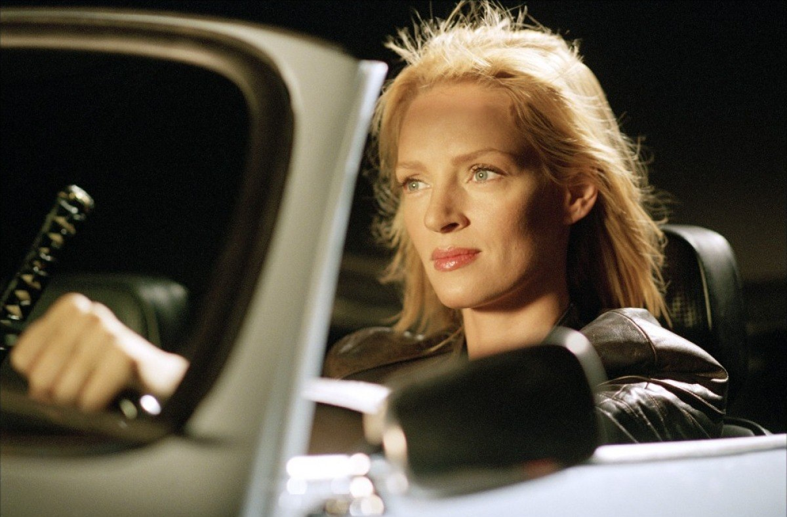
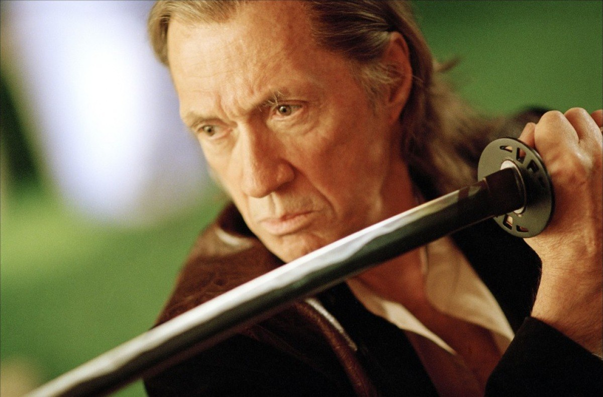

+++
titre = "<em>Kill Bill</em>, Quentin Tarantino"
title = "Kill Bill, Quentin Tarantino"
url = "/kill-bill-tarantino"
date = "2012-05-12T01:10:05"
Lastmod = "2014-02-18T14:03:01"
cover = "uma-thurman-quentin-tarantino-kill-bill.jpg"
categorie = [ "À voir" ]
tag = [ "Action", "Famille", "Hommage", "Mélange", "Parodie", "Vengeance", "Violence" ]
createur = [ "Quentin Tarantino" ]
acteur = [ "Daryl Hannah", "David Carradine", "Gordon Liu", "Lucy Liu", "Uma Thurman" ]
annee = [ "2003", "2004" ]
weight = 2003
pays = [ "États-Unis" ]

+++

Conçu comme un seul film, mais sorti en salles en deux volumes sous la pression des producteurs, <em>Kill Bill</em> est certainement le film le plus ambitieux de Quentin Tarantino à ce jour. Cet amoureux des films de genre, des séries B et autres films d&rsquo;exploitation a choisi de se faire plaisir avec ce quatrième long-métrage. La trame narrative de <em>Kill Bill</em>, une histoire de vengeance, importe en fait peu, elle sert d&rsquo;abord de prétexte pour multiplier les clins d&rsquo;œil et références parfois parodiques au cinéma qu&rsquo;aime Quentin Tarantino. Il s&rsquo;est fait plaisir, mais il a fait plaisir à ses spectateurs cinéphiles par la même occasion : <em>Kill Bill</em> est un vrai bonheur pour les amateurs de cinéma, une œuvre bourrée de référence qui assume totalement son statut de film culte.

<em>Kill Bill</em> ouvre sur le visage tuméfié d&rsquo;une jeune femme. L&rsquo;image en noir et blanc ne parvient pas à dissimuler le niveau de violence qu&rsquo;elle a subi. Une voix grave et glaciale à la fois se fait alors entendre, quelques mots avant le coup de feu en pleine tête. Quentin Tarantino plonge d&rsquo;emblée ses spectateurs dans l&rsquo;univers violent de son film. Sa filmographie est parcourue d&rsquo;accès de violence, les scènes d&rsquo;exécutions de <em>Pulp Fiction</em> sont devenues mythiques, on peut aussi évoquer le terrible accident qui sépare <em><a href="http://voiretmanger.fr/2011/06/26/boulevard-de-la-mort-tarantino/">Boulevard de la Mort</a></em> en deux. <em>Kill Bill</em> est peut-être l&rsquo;œuvre la plus violente, avec une concentration dans le premier volume où le sang coule à flot. Le film n&rsquo;hésite d&rsquo;ailleurs pas à tendre à la parodie de films d&rsquo;horreur cheap en faisant couler des litres d&rsquo;hémoglobine, quand les blessures ne sont pas à l&rsquo;origine de geysers sanglants. Cette première partie commence, après la scène d&rsquo;introduction, par la première mise à mort d&rsquo;une longue série et Quentin Tarantino n&rsquo;hésite pas au contraire à tendre vers le réalisme. Cette première violence réaliste tranche ensuite singulièrement avec les dizaines de corps ensanglantés du grand combat qui sert d&rsquo;épilogue à la bataille finale de ce premier volume. La deuxième partie de <em>Kill Bill</em> semblerait presque sage en comparaison et les images violentes y sont moins fréquentes, mais aussi plus brutales. L&rsquo;ensemble de l&rsquo;œuvre reste de toute manière déconseillé aux plus jeunes et l&rsquo;interdiction aux moins de 16 ans lors de la sortie du film en salles semble assez logique…

L&rsquo;intrigue de <em>Kill Bill</em> n&rsquo;est pas essentielle, mais cela ne veut pas dire qu&rsquo;il n&rsquo;y en a pas du tout. Comme toujours avec Quentin Tarantino, le scénario est même particulièrement travaillé avec un récit qui n&rsquo;avance pas toujours de manière chronologique et un film découpé en chapitres explicités par des cartons à l&rsquo;écran. À l&rsquo;origine de l&rsquo;histoire, le meurtre de B pendant la répétition de son mariage. L&rsquo;homme qu&rsquo;elle aime, Bill, est le père de l&rsquo;enfant qu&rsquo;elle porte alors, mais ce n&rsquo;est pas lui qu&rsquo;elle veut épouser. Comme quatre autres, B est une tueuse à gages de talent dirigée par Bill, mais elle veut protéger son enfant de cette violence et décide ainsi de couper les ponts. Blessé par le choix de celle qu&rsquo;il aime, Bill lui tire dans la tête… sans la tuer pour autant. B se retrouve &laquo;&nbsp;seulement&nbsp;&raquo; dans le coma pendant quelques années et à son réveil, elle n&rsquo;a qu&rsquo;une idée en tête : se venger en tuant Bill et ses employés. Le titre de <em>Kill Bill</em> est ainsi plutôt clair concernant les enjeux : il s&rsquo;agit de tuer Bill. L&rsquo;héroïne procède étape par étape avec à chaque fois un chapitre de l&rsquo;œuvre associé à un, ou deux personnages. On le disait, le scénario n&rsquo;est pas linéaire, mais ce découpage en chapitre permet de s&rsquo;y retrouver sans peine. De fait, Quentin Tarantino ne propose pas un puzzle complexe qu&rsquo;il faudrait réorganiser, mais il entretient ainsi le mystère en dévoilant certaines informations en retard.

Film de vengeance, <em>Kill Bill</em> est aussi et d&rsquo;abord un film tantôt d&rsquo;hommage, tantôt de parodie à plusieurs genres cinématographiques. Quentin Tarantino signe de ce fait une œuvre qui tend parfois au best of, une collection de tous ses goûts dans un patchwork qui a toujours été présent dans son travail, mais qui atteint ici une sorte d&rsquo;apogée. <em>Kill Bill</em> s&rsquo;ouvre comme un film d&rsquo;exploitation, c&rsquo;est-à-dire comme un film américain des années 1970 conçu pour être diffusé avec un autre film de série B en deuxième partie. Ce procédé exploité plus sérieusement par <em>Boulevard de la Mort</em> n&rsquo;est ici qu&rsquo;un clin d&rsquo;œil, mais il donne le ton. Le cinéma que préfère Quentin Tarantino, c&rsquo;est celui des années 1960 et 1970 et on le retrouve dans tous ses états dans <em>Kill Bill</em>. Les deux volumes se distinguent aussi à ce niveau : la première partie cite volontiers le cinéma asiatique, les films de sabres et de samouraïs alors que le second volume évoque plutôt les westerns spaghettis ou bien encore les films de kung-fu. Les références ou hommages sont en tout cas nombreux et ils transforment un peu <em>Kill Bill</em> en une sorte de jeu pour cinéphiles avec, à la clé, souvent une belle leçon d&rsquo;humilité. Reste un tour de force pour Quentin Tarantino : son film évite absolument de ne ressembler qu&rsquo;à une collection d&rsquo;hommages et <em>Kill Bill</em> est aussi un vrai film à part entière.

Les emprunts à des genres aussi différents que peuvent l&rsquo;être le western spaghetti et le kung-fu ne pouvaient pas passer inaperçus à l&rsquo;écran. Quentin Tarantino est un spécialiste des mélanges et des références, mais il condense dans <em>Kill Bill</em> le meilleur de son art. Les deux volumes constituent une œuvre protéiforme où l&rsquo;on passe d&rsquo;une scène en couleur à une autre en noir et blanc, du cinéma filmé au film d&rsquo;animation, du réalisme à la parodie, du kung-fu au western, etc. Inutile d&rsquo;essayer de fixer le film ou de le ranger dans une catégorie, le quatrième projet de Quentin Tarantino est inclassable et complètement fou. Il fallait oser faire appel aux créateurs de <em>Ghost in the Shell</em> pour raconter l&rsquo;histoire de l&rsquo;un des personnages, mais ce choix risqué s&rsquo;avère payant et offre à <em>Kill Bill</em> un cachet unique. Le réalisateur prouve ici encore qu&rsquo;il est un excellent cadreur avec des plans toujours parfaitement travaillés, tandis que le montage rendu complexe par le choix d&rsquo;une narration restructurée reste parfaitement lisible. Il faut dire que le choix des cartons, outre le fait d&rsquo;être une référence des plus, permet de situer l&rsquo;action et aide indéniablement à la compréhension de l&rsquo;ensemble. Le travail d&rsquo;écriture de <em>Kill Bill</em>, dont les scénarios parfaitement maîtrisés constituent la base du deuxième volume, doit être salué. Quentin Tarantino prend son temps pour construire son histoire, si bien que les deux films peuvent paraître longs, malgré les accès de violence et l&rsquo;action vive qu&rsquo;ils contiennent aussi. Les dialogues sont ici encore excellents, mais leur réussite tient d&rsquo;abord des acteurs choisis par le cinéaste : Uma Thurman est excellente en miraculée en quête de vengeance, tandis que David Carradine, le héros de centaines de films de kung-fu, s&rsquo;imposait pour interpréter Bill. On ne saurait évoquer un film de Quentin Tarantino sans parler de sa musique : celle de <em>Kill Bill</em> est d&rsquo;ores et déjà culte avec une bande originale qui démontre bien tout le talent du cinéaste…

D&rsquo;une durée totale de plus de quatre heures, <em>Kill Bill</em> est non seulement le film de Quentin Tarantino le plus long, mais aussi le plus ambitieux. Le cinéaste reprend des principes qui avaient fait son succès depuis <a href="http://voiretmanger.fr/2013/01/16/reservoir-dogs-tarantino/" title="Reservoir Dogs, Quentin Tarantino"><em>Reservoir Dogs</em></a>, mais il va beaucoup plus loin en réunissant dans un même film tout le cinéma qu&rsquo;il affectionne, tout en réussissant à maintenir une véritable histoire. <em>Kill Bill</em> est un film à part entière et c&rsquo;est un long-métrage culte pour de nombreux cinéphiles : un film à voir et à revoir, ou a découvrir sans plus attendre…

<h3>Vous voulez m&rsquo;aider ?<a href="#footnote_0_6428" id="identifier_0_6428" class="footnote-link footnote-identifier-link" title="&Agrave; propos de la publicit&eacute;&hellip;">1</a></h3>
<ul>
<li><a href="http://www.amazon.fr/gp/product/B002KMW8DS/ref=as_li_ss_tl?ie=UTF8&amp;tag=leblogdenic07-21&amp;linkCode=as2&amp;camp=1642&amp;creative=19458&amp;creativeASIN=B002KMW8DS">Acheter les deux films en Blu-Ray sur Amazon</a></li>
<li><a href="http://www.amazon.fr/gp/product/B000GUJWFS/ref=as_li_ss_tl?ie=UTF8&amp;tag=leblogdenic07-21&amp;linkCode=as2&amp;camp=1642&amp;creative=19458&amp;creativeASIN=B000GUJWFS">Acheter les deux films en DVD sur Amazon</a></li>
<li><a href="http://itunes.apple.com/fr/album/kill-bill-vol.-1-original/id308689784">Acheter la bande originale de <em>Kill Bill vol. 1</em> sur l&rsquo;iTunes Store</a></li>
<li><a href="http://itunes.apple.com/fr/album/kill-bill-vol.-2-original/id316226888">Acheter la bande originale de <em>Kill Bill vol. 2</em> sur l&rsquo;iTunes Store</a></li>
</ul>

<ol class="footnotes"><li id="footnote_0_6428" class="footnote"><a href="http://voiretmanger.fr/a-propos/publicite/">À propos de la publicité…</a> [<a href="#identifier_0_6428" class="footnote-link footnote-back-link">&#8617;</a>]</li></ol>
