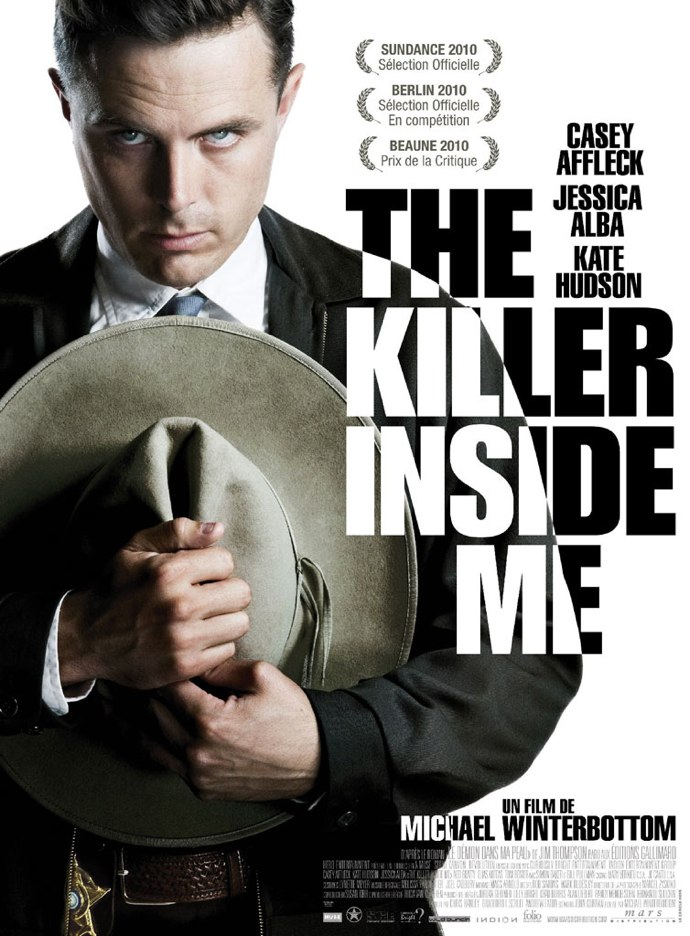
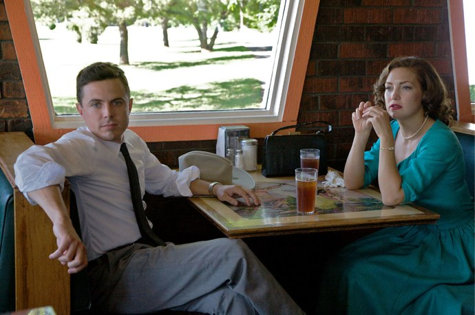

+++
titre = "The Killer Inside Me, Michael Winterbottom"
title = "The Killer Inside Me, Michael Winterbottom"
url = "/killer-inside-me-winterbottom"
date = "2010-08-19T00:19:39"
Lastmod = "2010-08-19T00:25:28"
cover = "the-killer-inside-me-casey-affleck.jpg"
categorie = [ "À voir" ]
tag = [ "Drame", "Société", "Thriller" ]
createur = [ "Michael Winterbottom" ]
acteur = [ "Casey Affleck", "Jessica Alba" ]
annee = [ "2010" ]
weight = 2010
pays = [ "États-Unis" ]

+++

Michael Winterbottom est un réalisateur au moins multiple. Là où certains font invariablement le même film, parfois sur des modes différents, le Britannique fait preuve d&rsquo;un éclectisme ébouriffant. Sa <a href="http://fr.wikipedia.org/wiki/Michael_Winterbottom#R.C3.A9alisateur">filmographie</a> impressionne, on y trouve pêle-mêle des documentaires (<em>La Stratégie du Choc</em>, sorti également cette année), des docufictions (<em>Road To Guantanamo</em>), des adaptations de monuments littéraires (<em>Tournage dans un jardin anglais</em>, issu du fameux <em>Tristram Shandy</em> de Stern)… Dernier en date, <em>The Killer Inside Me</em> est un thriller qui dévoile le psychopathe qui sommeille (peut-être) chez tout le monde. Un film qui met mal à l&rsquo;aise, ce qui est certainement la preuve de sa réussite.

<a href="http://www.allocine.fr/film/fichefilm_gen_cfilm=140586.html">

</a>

Lou est l&rsquo;archétype du gars sympa, celui à qui tous les pères rêveraient d&rsquo;offrir la main de leur fille. Shérif dans une petite ville texane dans les années 1950, il aime son travail et le fait avec soin. Tout le monde l&rsquo;aime bien, il a une fiancée qu&rsquo;il a prévu d&rsquo;épouser… bref tout va pour le mieux dans le meilleur des mondes pour Lou. Mais un grain de sable raye cette photo idyllique : alors qu&rsquo;il doit inciter gentiment, mais fermement, une prostituée à partir loin de la petite ville tranquille, il trouve cette dernière très séduisante. Il faut dire qu&rsquo;elle lui laisse assouvir sa passion cachée, enfouie même depuis l&rsquo;enfance : Lou, en effet, est &laquo;&nbsp;un peu&nbsp;&raquo; dominateur et il aime frapper les femmes avant de leur faire l&rsquo;amour. Rien ne lui fait plus plaisir qu&rsquo;une bonne fessée et cette fille semble bien apprécier ses fessées. Loin de la dégager de ce trou paumé, Lou revient la voir tous les jours pendant deux semaines. La situation pourrait perdurer ainsi, mais le jeune homme voit là un moyen de se venger de la riche famille du coin qu&rsquo;il suspecte d&rsquo;avoir facilité la mort de son demi-frère, quelques années auparavant. Sa vengeance implique de battre à mort la prostituée en faisant croire que le fils de cette famille l&rsquo;a battue et que la femme s&rsquo;est vengée en le tuant d&rsquo;un coup de revolver. Un plan supposé parfait, mais qui est contrarié par plusieurs détails gênants qui prouvent tous sa culpabilité.

<em>The Killer Inside Me</em> est bien un thriller, avec un meurtre et une enquête pour le résoudre, mais un thriller un peu particulier. On sait en effet d&rsquo;emblée qui est le tueur et d&rsquo;ailleurs tout le film emprunte son point de vue, de sorte l&rsquo;on connaît aussi ses motifs, mais que l&rsquo;on ignore tout de l&rsquo;enquête. L&rsquo;intrigue ne consiste donc pas à savoir qui a tué ou pourquoi, mais plutôt comment l&rsquo;étau va se resserrer autour du tueur pour le démasquer. Le plan soigneusement établi par Lou est ainsi pièce par pièce démantelé, tandis que les pistes semblent se rejoindre inexorablement et pointer vers lui. Michael Winterbottom ne fait pas dans l&rsquo;originalité dans le domaine, faisant avancer son récit par étape : on soumet au meurtrier un indice qu&rsquo;il nie immédiatement, avant de voir arriver un nouvel indice encore plus accablant, et ainsi de suite jusqu&rsquo;à la dénonciation finale. Le spectateur se demande à chaque fois, amusé, comment le personnage pourra s&rsquo;en sortir cette fois et il faut bien avouer que Lou est doué pour retourner des situations pourtant mal engagées pour lui.

Thriller, certes, mais l&rsquo;intrigue de <em>The Killer Inside Me</em> n&rsquo;est en fait pas l&rsquo;élément le plus intéressant du film. Tout est joué d&rsquo;avance, on sait d&rsquo;emblée que le tueur sera démasqué et le récit strictement policier est quasiment totalement évacué du film. Il y a bien un inspecteur curieux, un intrigant syndicaliste qui a tout compris dès le départ et fait pression sur le tueur… mais l&rsquo;enquête est en permanence hors champ, comme si elle était totalement secondaire. Il faut dire que <em>The Killer Inside Me</em> est surtout un film sur la violence qui, semble dire le film, peut se tapir en chacun de nous. Ce film raconte l&rsquo;histoire d&rsquo;un type normal qui, à un moment donné, dérape et devient violent. Lou frappe une femme, y prend un plaisir énorme, même si la première fois il est un peu honteux pour ce qu&rsquo;il a fait. Mais cette violence fait l&rsquo;effet d&rsquo;une drogue sur lui, il en a besoin, d&rsquo;abord comme stimulant sexuel comme dans un grand nombre de couples, mais cela ne suffit plus. Quand il tue à la seule force de ses poings, son visage est illuminé par son acte, comme s&rsquo;il avait attendu 29 ans pour découvrir ce qu&rsquo;il aimait vraiment faire. Dès lors, il n&rsquo;aura de cesse de chercher la violence et de cacher ses actes en même temps. Il se met à frapper sa fiancée durant leurs ébats sexuels, avant de la frapper à mort elle aussi. <em>The Killer Inside Me</em> est donc le récit de la naissance d&rsquo;un psychopathe, plus que celui d&rsquo;une enquête pour résoudre un meurtre. Winterbottom se fait avare sur les explications, tout au plus esquisse-t-il quelques liens avec l&rsquo;enfance (un père dominateur et une compagne qui encourage Lou à la frapper comme son père) à travers des flashbacks qui restent heureusement rares. Le spectateur sera sans doute frustré de ne pas en savoir plus, mais je ne crois pas que le film avait besoin de plus amples explications. La violence naît naturellement, d&rsquo;elle-même, sans forcement d&rsquo;explication logique, sans raison. C&rsquo;est une idée très dérangeante quand on y pense et il n&rsquo;est alors guère étonnant que Michael Winterbottom mette si mal à l&rsquo;aise avec <em>The Killer Inside Me</em>.

Le malaise ressenti devant le film vient aussi des images très crues et surtout soudaines qu&rsquo;il présente. Le visage tuméfié de la première victime est ainsi tout à fait visible et cet accès de violence inattendu est vraiment très fort (le film n&rsquo;est pas interdit au moins de 12 ans pour rien). La prestation de Casey Affleck y est aussi pour beaucoup : le jeune acteur avait déjà eu l&rsquo;occasion de montrer l&rsquo;étendue de son talent, notamment dans le mémorable <em>Assassinat de Jesse James par le lâche Robert Ford</em>. Il compose ici un policier psychopathe époustouflant, capable de passer de l&rsquo;innocence au meurtre en un clin d&rsquo;œil et qui conserve en permanence un visage à la fois agréable et inquiétant. Le film tient en grande partie sur ses épaules, son regard froid et son exaltation quand il devient violent font froid dans le dos.

<em>The Killer Inside Me</em> découvre la violence au sein d&rsquo;un univers en apparence calme, et dévoile un psychopathe là où les apparences ne présentaient qu&rsquo;un honnête homme. Ce dévoilement de la violence est plutôt bien vu et le spectateur est peu à peu pris par le malaise. L&rsquo;intrigue policière, l&rsquo;enquête qui découvre finalement l&rsquo;identité du tueur, importe peu, pas plus d&rsquo;ailleurs que les raisons profondes de cette violence. Le film de Michael Winterbottom n&rsquo;en pâtit néanmoins pas, au contraire même. Cette opacité participe au malaise et je pense que le film aurait bénéficié d&rsquo;un format plus court et encore moins explicatif. <em>The Killer Inside Me</em> est un film intéressant, à défaut d&rsquo;être un grand film.

Nombreux avis très positifs sur la toile, à l&rsquo;image de <a href="http://www.plan-c.fr/article-critique-the-killer-inside-me-de-michael-winterbottom-55295144.html">Plan-C</a> qui parle même de &laquo;&nbsp;<em>grand film incompris</em>.&nbsp;&raquo; Autres avis positifs sur <a href="http://myscreens.fr/2010/cinema/the-killer-inside-me-critique/">MyScreens</a> ou chez <a href="http://www.toujoursraison.com/2010/08/killer-inside-me.html">Rob Gordon</a> qui décrit très bien le malaise qui s&rsquo;empare de tous les spectateurs qui voudraient fuir, mais restent, comme s&rsquo;ils reproduisaient les comportements sado-maso acceptés par les compagnes du tueur. Bien vu.

