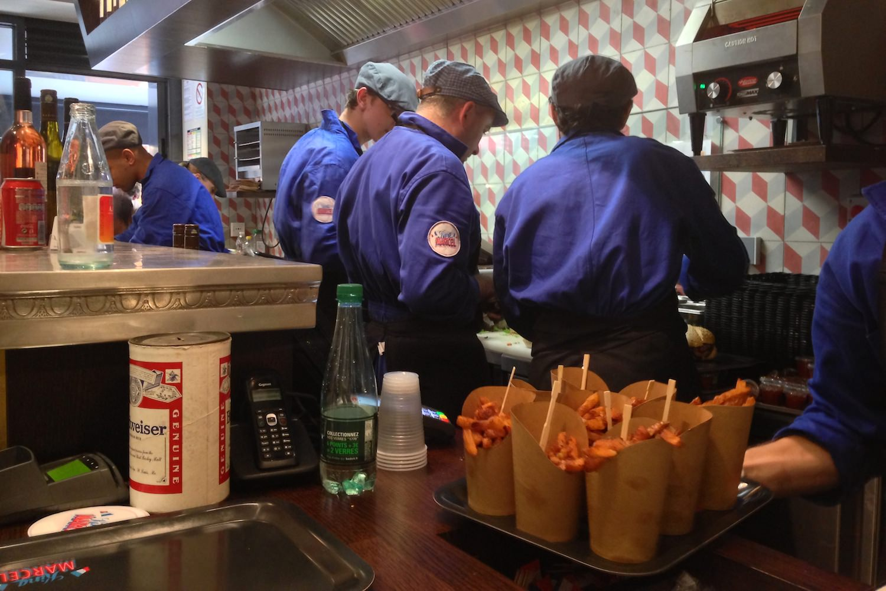
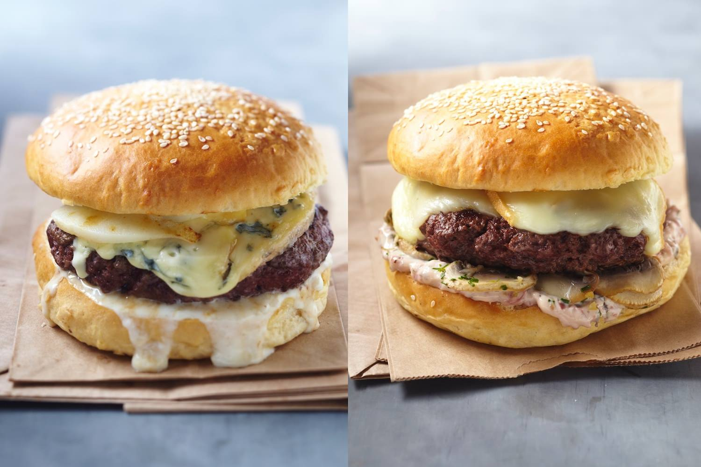
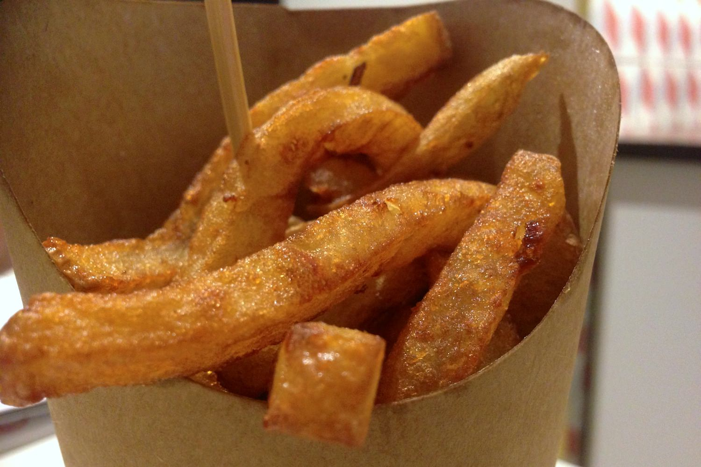

+++
type = "post"
titre = "King Marcel à Lyon"
title = "King Marcel à Lyon"
url = "/king-marcel-lyon"
date = "2013-06-18T19:01:10"
Lastmod = "2013-07-04T22:49:04"
cover = "king-marcel-lyon.jpg"
categorie = [ "À manger" ]
tag = [ "Cuisine américaine", "Cuisine française", "Fast-food", "Hamburger" ]

+++

Ouvert depuis près d’un mois, <a href="http://www.kingmarcel.fr"><strong>King Marcel</strong></a> est un nouveau fast-food très ambitieux à Lyon. Située dans la très fréquentée rue Mercière du deuxième arrondissement, l’une des zones de Lyon où la densité en restaurants est la plus élevée, cette nouvelle adresse entend proposer des hamburgers, certes, mais des hamburgers français irréprochables sur la qualité. Un pari audacieux, alors que l’offre en burgers ne fait qu’augmenter, mais c’est une réponse aux fast-foods traditionnels, souvent pointés du doigt pour leur mauvaise qualité. D’ailleurs, <strong>King Marcel</strong> se distingue d’eux en s’auto-proclamant « premier fast good lyonnais » : que valent ces burgers de qualité française ? 

Le patron invitait ce midi-là quelques journalistes et blogueurs pour tester son nouveau restaurant. <strong>King Marcel</strong> était donc très plein, plus sans doute qu’en temps normal, et la salle tout en longueur et assez exiguë incitait à la proximité. Comme dans bon nombre de lieux dédiés à la restauration rapide, la cuisine est située dans l’entrée, prête à servir tous ceux qui voudraient acheter des burgers à emporter, puisque c’est aussi possible. Tout en longueur elle aussi, la zone cuisine est pleine d’hommes en bleu de travail et bérets qui s’activent et annoncent la couleur. Point de décor moderne et aseptisé ici, c’est le rétro qui est mis en avant. Les vieilles lampes rouillées surplombent le bar, au fond on a des lavabos avec le savon dur que l’on trouvait dans les écoles… Le restaurant joue astucieusement cette carte rétro, tout en mêlant tous les clichés sur la France : les touristes, nombreux dans le coin, apprécieront sans doute. Étant données les conditions exceptionnelles, il est difficile en tout cas de juger du confort de la salle qui reste de toute manière très simple — on ne vient pas manger pendant des heures dans un fast-food —, ni de la rapidité du service. Il faudrait en juger dans des conditions normales, mais tout est cuisiné à la dernière minute chez <strong>King Marcel</strong>, ce qui est un gage de qualité et de burgers bien frais, du pain à la viande. 

Parlons-en, justement, de ces burgers. À la carte, six hamburgers différents et uniquement ceux-là : <strong>King Marcel</strong> a fait le choix d’en proposer peu, mais de proposer le meilleur. Chaque jour, un burger spécial est malgré tout ajouté pour varier les plaisirs, même s’il y a déjà de quoi faire en l’état. Puisque l’on est chez Marcel ici, chaque burger est nommé selon un artiste ou une célébrité : on a le Marcel Proust, le Marcel Duchamp ou encore le Marcel Pagnol. À l’exception de ce dernier qui est conçu avec un filet de poulet, tous les burgers sont garnis d’un généreux steak de bœuf charolais. Élément clé d’un bon burger, la viande justement est cuite à la perfection après avoir été hachée sur place et cela se sent : elle est excellente, tout simplement. Bien juteuse et goûteuse, on est à des années-lumière des chaînes de fast-food bien connues, mais ce n’est pas tout. Les buns sont produits par une boulangerie et sont livrés deux fois par jour pour plus de fraicheur, tandis que les fromages qui prennent beaucoup de place chez <strong>King Marcel</strong> viennent de chez La Mère Richard, une référence à Lyon. Cette recherche de qualité paye : les sandwiches sont savoureux, juteux et… gourmands grâce, entre autres, aux fromages qui ont vraiment un bon goût. S’ils sont vendus un peu cher pour des hamburgers (11 €, sauf pour le Marcel du jour vendu 9,5 €), ils calent bien et sont bien meilleurs qu’ailleurs. Dommage toutefois de devoir encore ajouter 4 € pour des frites par ailleurs très réussies — elles ont un bon goût de pomme de terre — et une boisson (formule à 15 €, uniquement le midi). Au total, la note est un peu élevée et même si la qualité est au rendez-vous, il faut quand même accepter de payer deux fois plus que dans les enseignes industrielles. Au passage, les tartelettes aux pralines — spécialités lyonnaises par excellence — étaient vraiment bonnes et fraiches du jour. 

<strong>King Marcel</strong> est une enseigne très prometteuse pour qui veut manger de bons hamburgers à Lyon. Les sandwiches servis par les cuisiniers en bérets sont vraiment bons, à des années de ce que l’on peut trouver habituellement dans les fast-foods. La qualité se paye toutefois et les prix — 15 € pour un menu le midi, comptez une vingtaine d&rsquo;euros le soir — sont peut-être un peu élevés. Quoi qu&rsquo;il en soit, c&rsquo;est un bon candidat pour figurer dans la liste des meilleurs hamburgers lyonnais, une adresse à tester en somme !

