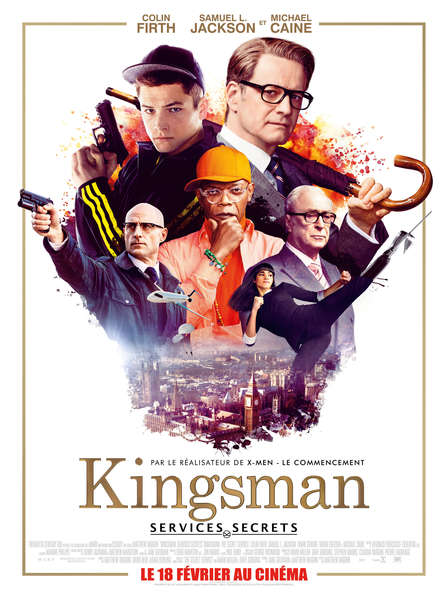
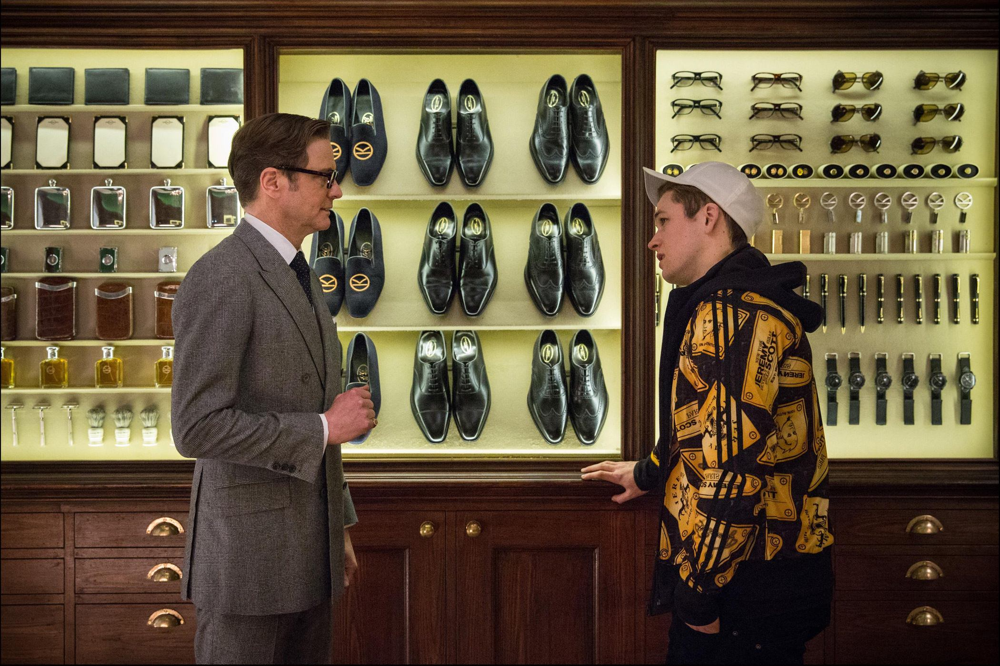
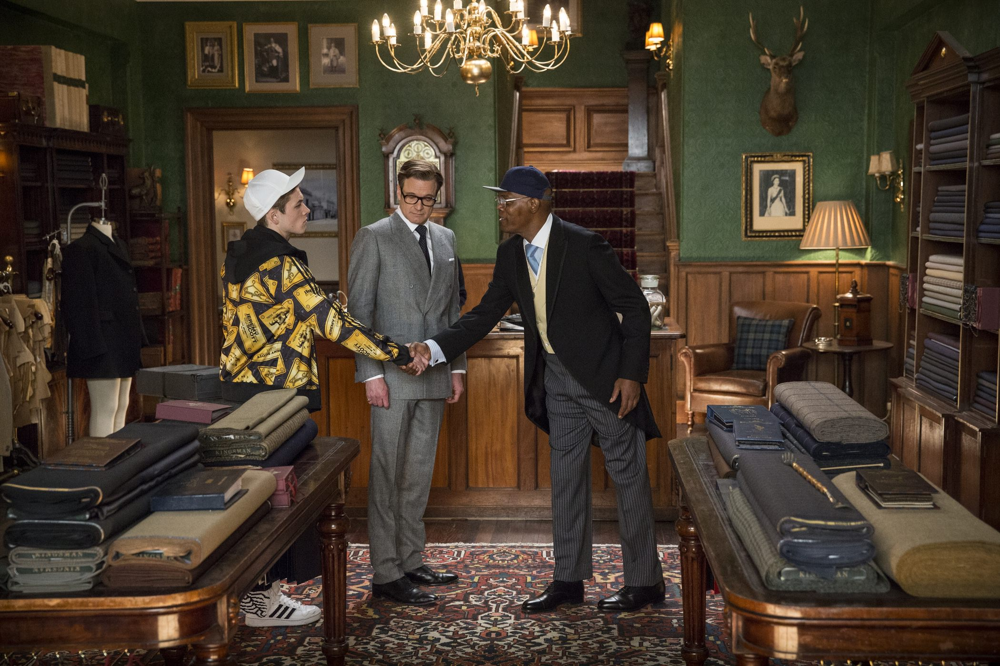

+++
type = "post"
titre = "<em>Kingsman : Services secrets</em>, Matthew Vaughn"
title = "Kingsman : Services secrets, Matthew Vaughn"
url = "/kingsman-services-secrets-vaughn"
date = "2015-02-22T16:24:06"
Lastmod = "2015-02-22T16:29:00"
cover = "kingsman-services-secrets-colin-firth-taron-egerton.jpg"
categorie = [ "À voir" ]
tag = [ "Action", "Adaptation bande-dessinée", "Apprentissage", "Blockbuster", "Comics", "Espionnage", "Kitsch", "Sorties du mois", "Violence" ]
createur = [ "Matthew Vaughn" ]
acteur = [ "Colin Firth", "Mark Strong", "Michael Caine", "Samuel L Jackson", "Taron Egerton" ]
annee = [ "2015" ]
weight = 2015
pays = [ "États-Unis" ]
original = "Kingsman: The Secret Service"

+++

Matthew Vaughn s&rsquo;était déjà fait remarquer en 2010 avec <a href="/kick-ass-vaughn/" title="Kick-Ass, Matthew Vaughn"><em>Kick-Ass</em></a>, un film de superhéros atypiques, puisque dépourvus de pouvoirs. À l&rsquo;arrivée, le cinéaste signait un long-métrage très fun, entre violence exacerbée et parodie du genre. <em>Kingsman : Services Secrets</em> signe son retour au comics, et à nouveau, le réalisateur n&rsquo;opte pas pour un traitement premier degré. Avec cette histoire d&rsquo;espions tellement britanniques qu&rsquo;ils sont totalement ridicules, Matthew Vaughn signe un film d&rsquo;espionnage à l&rsquo;ancienne, qui rappelle les <a href="/saga/james-bond/"><em>James Bond</em></a> des débuts, avec un grand méchant et un plan diabolique et avec tout le flegme britannique. Un divertissement très plaisant, à condition de ne pas perdre de vue le second degré…

<em>Kingsman : Services Secrets</em> ouvre dans les années 1970 et même si l&rsquo;action se déplace ensuite à notre époque, le film semble rester jusqu&rsquo;au bout dans le passé. Sans être totalement parodique, le dernier film de Matthew Vaughn entretient une part de références, notamment en proposant une intrigue très simple comme on n&rsquo;en fait plus. Adapté d&rsquo;un comics, le scénario suit les pas d&rsquo;Eggsy, un jeune de la banlieue populaire de Londres incarné par le jeune et prometteur Taron Egerton. Sa vie est à la dérive jusqu&rsquo;au jour où il rencontre Harry Hart, dit Galaad — Colin Firth, égal à lui-même. Avec son costume sur-mesure et son parapluie, il est l&rsquo;archétype même de l&rsquo;Anglais peut-être noble, du moins snob. Comme on le découvre vite, il ne paye peut-être pas de mine, mais il appartient aux Kingsmen, une organisation secrète qui participe depuis la fin du XIXe siècle à l&rsquo;espionnage mondial, indépendamment de tout gouvernement ou pouvoir politique. Galaad cherche justement à remplacer un ancien collègue quand commence le film et il propose à Eggsy de venir les rejoindre. Sélection à la dure et apprentissage jusqu&rsquo;au moment où il devient digne d&rsquo;entrer dans le groupe : le scénario de <em>Kingsman : Services Secrets</em> ne brille pas par son originalité. Ce n&rsquo;est pas son objectif toutefois, car le film tout entier est une sorte de référence, voire d&rsquo;hommage, à une certaine idée du cinéma. Assez proche à cet égard du travail de Quentin Tarantino, Matthew Vaughn n&rsquo;a pas peur de revenir aux bases et de proposer une histoire qui peut être la plus simple qui soit, du moment qu&rsquo;elle lui permet de rassembler tous ses délires en deux heures.

De fait, il ne faudra pas prendre <em>Kingsman : Services Secrets</em> trop au sérieux, sous peine d&rsquo;être bien déçu. Le dernier long-métrage de Matthew Vaughn est outrancier au point de devenir kitsch et certaines scènes sont même laides. Mais tout cela ne compte pas vraiment si on adhère au point de vue du réalisateur et que l&rsquo;on accepte que, dans l&rsquo;esprit de <em>Kick Ass</em>, on ne sera jamais tout à fait au premier degré et systématiquement dans le décalage. Ceci posé, on s&rsquo;amusera de ce groupe d&rsquo;espions britanniques si distingués qu&rsquo;ils feraient passer James Bond pour un type vulgaire, de leurs gadgets inattendus — le stylo ne contient pas une bombe, mais il active un poison à distance… il fallait y penser — ou encore de ce grand méchant à la fois si caricatural et si atypique. D&rsquo;un côté, Richmond Valentine a envie de tuer la majorité de l&rsquo;humanité sous prétexte de sauver la planète face au réchauffement climatique — à cet égard, le film est bien dans son temps — ; en même temps, ce méchant qui a un défaut de prononciation est présenté, non pas comme quelqu&rsquo;un de vraiment de dangereux, mais comme un éternel adolescent qui ne peut pas supporter la vue du sang. Interprété par un Samuel L. Jackson en grande forme, ce personnage est incontestablement un point fort du film. Son humour désamorce systématiquement ces scènes que l&rsquo;on trouverait beaucoup trop sérieuses sans cela, car il faut bien dire que Matthew Vaughn pousse systématiquement le bouchon un petit peu trop loin. <em>Kingsman : Services Secrets</em> n&rsquo;hésite pas à réquisitionner des clichés pour avancer, ou en faire des tonnes, à l&rsquo;image de cette scène — impressionnante, il faut le reconnaître — de massacre dans l&rsquo;église. Ou bien encore de la mort spectaculaire de ceux qui accompagnent le grand méchant : c&rsquo;est grossier, mais cela passe bien avec le reste, car rien n&rsquo;est très sérieux ici, au fond.

<em>Kingsman : Services Secrets</em> a tout du navet, mais son réalisateur en avait bien conscience et il fait tout, non pas pour l&rsquo;éviter, mais au contraire pour pousser au maximum dans cette direction. Matthew Vaughn signe une œuvre outrancière, volontairement ridicule, et à condition d&rsquo;accepter ce point de départ, c&rsquo;est une réussite. Il faut faire avec quelques scènes kitsch, voire laides, accepter quelques clichés accumulés moins par nécessité que par plaisir de l&rsquo;accumulation, mais l&rsquo;ensemble fonctionne plutôt bien. Taron Egerton est convaincant en jeune prolétaire qui apprend à devenir un gentleman et il est même bluffant quand il devient accompli à la fin et que, comme le modèle 007, il s&rsquo;arrange un plan sexe avec une femme qui passait par là. Une scène assez osée, pour un film gonflé : <em>Kingsman : Services Secrets</em> est un très bon divertissement !

