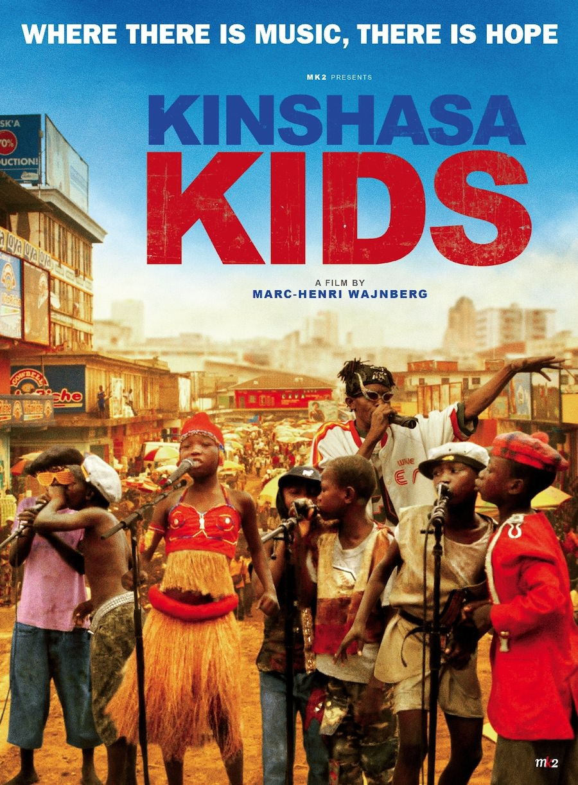
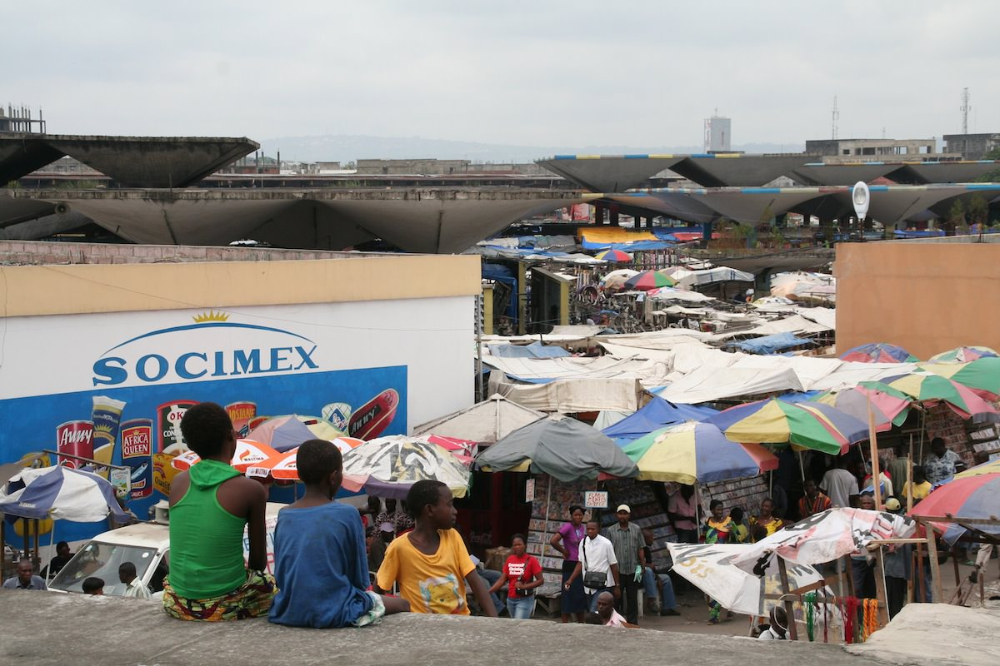

+++
type = "post"
titre = "Kinshasa Kids, Marc-Henri Wajnberg"
title = "Kinshasa Kids, Marc-Henri Wajnberg"
url = "/kinshasa-kids-wajnberg"
date = "2012-12-25T10:30:43"
Lastmod = "2013-04-02T08:47:41"
cover = "le-diable-n-existe-pas-marc-henri-wajnberg.jpg"
categorie = [ "À voir" ]
tag = [ "Docufiction", "Enfance", "Musique", "Rap", "Société" ]
createur = [ "Marc-Henri Wajnberg" ]
annee = [ "2013" ]
weight = 2013
pays = [ "République Démocratique du Congo" ]

+++

Documentariste belge, Marc-Henri Wajnberg est parti à Kinshasa avec l’intention de tourner un documentaire sur la musique congolaise. En arrivant sur place, le cinéaste n’a pas pu se contenter d’un documentaire sur la musique, il a voulu montrer la dure réalité de la vie dans la capitale de la République Démocratique du Congo et il en a fait un film de fiction. <em>Kinshasa Kids</em> reste toutefois centré sur la musique en racontant l’histoire de gamins de rue qui décident de former un groupe de rap pour survivre. Ce genre hybride est intéressant sur le papier, mais à l’écran il perturbe un peu le spectateur qui ne sait plus trop sur quel pied danser. Marc-Henri Wajnberg signe un long-métrage brouillon comme peut l’être la vie kinoise, un peu trop peut-être pour parvenir à intéresser complètement.

On l’ignore peut-être, mais la capitale de la République Démocratique du Congo est aussi une capitale culturelle et concentre des dizaines d’artistes africains, parmi lesquels Papa Wemba est certainement le plus célèbre. En posant ses caméras à Kinshasa, Marc-Henri Wajnberg voulait d’abord revenir avec des images de musique et de musiciens, mais il a préféré tisser autour de ce matériel une histoire fabriquée de toute pièce. Les rues de Kinshasa sont pleines d’enfants abandonnés, sans parents ni famille, et qui vivent en volant ou en faisant des petits boulots. <em>Kinshasa Kids</em> imagine qu’une poignée de ces enfants se réunissent pour faire du rap et finissent par convaincre Bebson, un artiste local un peu fantasque, de les aider à monter sur scène pour gagner un peu d’argent et sortir de la misère habituelle. Peu à peu, ils vont créer leur premier titre à partir de leur quotidien et de ce qu’ils aiment en matière de musique et ils vont tout faire pour monter sur scène, malgré les difficultés de la vie à Kinshasa.

Kinshasa en République Démocratique du Congo et la musique : si cette association vous rappelle quelque chose, c’est normal. <em>Kinshasa Kids</em> reprend exactement la même idée que <a href="/2010/07/29/benda-bilili-barret-tullaye/" title="Benda Bilili !, Renaud Barret et Florent de La Tullaye - À voir et à manger"><em>Benda Bilili !</em></a>, film plus documentaire sorti en 2010 sur le Staff Benda Bilili, un groupe de paraplégiques minois qui ont réussi, en partie grâce au film d’ailleurs, à connaître le succès et à sortir un <a href="https://itunes.apple.com/fr/album/tres-tres-fort/id338551376">premier album</a>. La démarche de Marc-Henri Wajnberg est assez similaire au départ, sauf qu’il s’agit d’une fiction et que son groupe n’existait pas avant son arrivée. Les enfants qu’il a rassemblés dans <em>Kinshasa Kids</em> ne se connaissaient même pas et c’est ainsi une invention de toute pièce. Invention, certes, mais le cinéaste belge s’est quand même d’abord inspiré de la réalité locale et de ses multiples voyages au Congo. Mieux, certaines séquences du film sont en fait de vrais plans de documentaires, sans aucun acteur et toute l’astuce du montage du film est de les relier aux scènes purement fictionnelles. Même si le procédé peut gêner — comment, dès lors, démêler le vrai du faux ? —, le résultat est plutôt efficace dans l’ensemble et permet effectivement au film d’en dire plus, sans trop s’éloigner du réalisme de la rue. Paradoxalement, <em>Benda Bilili !</em> parvenait à en faire autant avec un ton beaucoup plus proche du documentaire. Il faut dire que ce groupe de paraplégiques offrait des prestations vraiment intenses qui se suffisaient largement à elles-mêmes.

<em>Kinshasa Kids</em> ouvre sur une scène d’exorcisme sur des enfants qui met d’emblée dans le bain, quitte à en faire un peu trop d’ailleurs. Rendue très brève par le montage, cette séquence est très impressionnante : les enfants jugés habités par le démon par les habitants sont rassemblés dans une grande pièce où tout le village est également présent. L’exorcisme consiste à les asperger d’eau tout en hurlant des incantations, mais aussi à déposer sur le corps des enfants des viscères animales. Le choix du montage rapide permet d’écourter la scène, mais il contribue aussi à la rendre un peu éprouvante, à tel point qu’elle sonne faux, alors même qu’il s’agit d’un plan de documentaire. Marc-Henri Wajnberg a tendance à battre le froid et le chaud de manière un peu trop systématique et surtout avec des tendances trop opposées pour ne pas finir par gêner. À un moment du film, les enfants rient et s’amusent dans une scène nocturne qui se conclut… par un viol. Même si <em>Kinshasa Kids</em> parvient à échapper globalement au misérabilisme qui pourrait être de circonstance dans ce genre de film, ce mécanisme paraît un peu trop artificiel et semble n’exister que pour attirer la pitié du spectateur, une manipulation assez pénible. Fort heureusement, cette limite ne vient pas vraiment entacher un long-métrage qui reste passionnant, même s’il est parfois un peu brouillon.

On a déjà eu l’occasion à plusieurs reprises d’évoquer le montage, très serré dans <em>Kinshasa Kids</em>. Marc-Henri Wajnberg a été contraint de choisir parmi des heures et des heures de prise, il est d’ailleurs retourné à Kinshasa à plusieurs reprises pour refaire une scène ou deux, et le résultat est à la hauteur de cette richesse, d’autant que la plupart des scènes relèvent de la fiction. Le passage de la réalité à la fiction est un processus très intéressant dans le long-métrage, même s’il est très difficile à détecter correctement sans les explications du cinéaste. Marc-Henri Warjnberg a exploité la réalité tantôt de manière brute et simplement reliée au reste du film par la fiction — la scène de l’exorcisme —, tantôt en recréant avec la fiction une scène réelle. La République Démocratique du Congo est un pays compliqué à filmer, encore aujourd’hui et il a fallu beaucoup d’autorisations, mais aussi négocier individuellement avec de nombreux policiers, ravis de pouvoir toucher un petit quelque chose au passage. L’équipe était ainsi continuellement arrêtée par les forces de l’ordre et devait régulièrement se rendre au commissariat pour s’expliquer et <em>Kinshasa Kids</em> reprend cette scène à son compte, sur le mode de la fiction, mais avec le réalisme de la scène vécue. À un autre moment, un accident de la route interrompt un plan en voiture et cet accident n’était pas prévu par le cinéaste, mais il s’est servi de cette inclusion brutale du réel dans son long-métrage. Tout ce travail est vraiment fascinant, mais il faut reconnaître que <em>Kinshasa Kids</em> perd aussi en cohérence et a même tendance à perdre un peu son spectateur dans les rues salles de Kinshasa. Les jeunes acteurs, tous non professionnels évidemment, sont en revanche remarquables et leur musique est énergique, même si elle sera peut-être un peu trop dissonante. 

Ce film de fiction à la limite du documentaire sera inévitablement familier pour tous ceux qui ont vu <em>Benda Bilili !</em>, mais il ne faut pas s’arrêter à cette proximité. Si le sujet des deux films est plutôt similaire, le traitement proposé par Marc-Henri Wajnberg est assez différent. En mêlant intimement la fiction et le documentaire, il fait de <em>Kinshasa Kids</em> un film hybride, un peu brouillon, mais très intéressant malgré tout. 

<em>Sortie en salles le 3 avril 2013</em>

