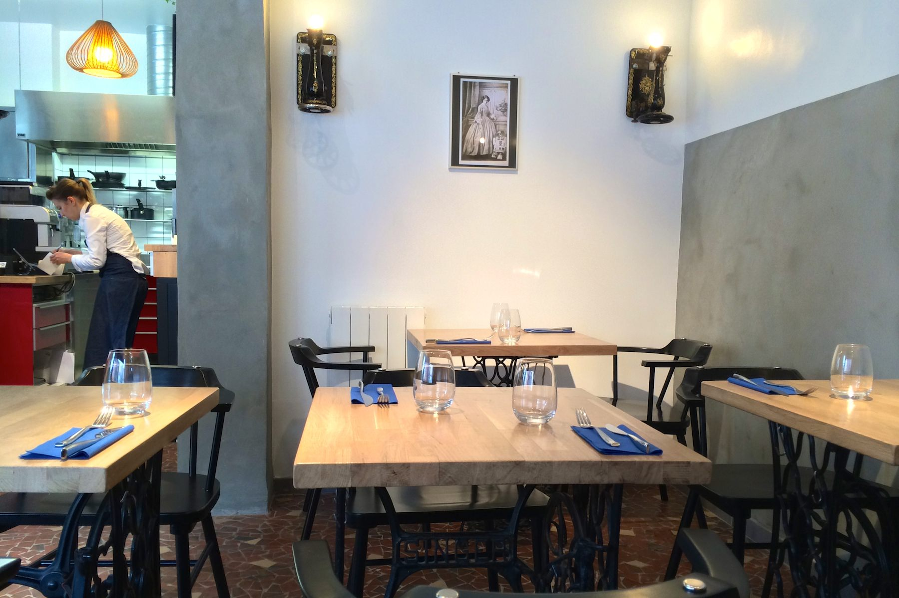
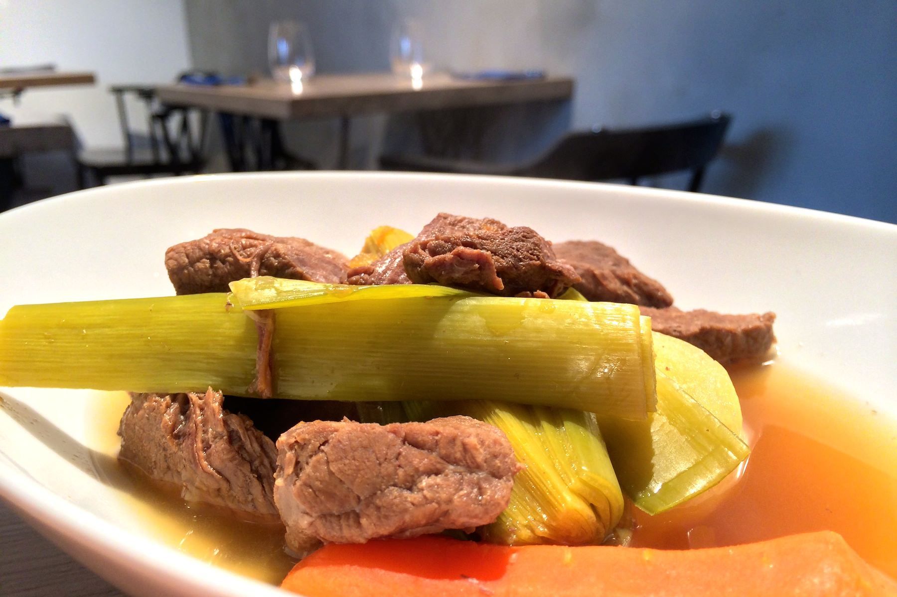
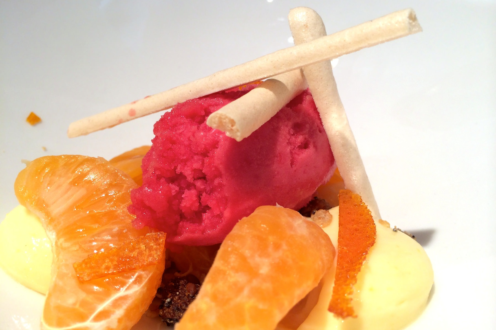

+++
type = "post"
titre = "Le Kitchen Café à Lyon"
title = "Le Kitchen Café à Lyon"
url = "/kitchen-cafe-lyon"
date = "2014-01-31T18:29:43"
Lastmod = "2015-03-15T00:45:34"
cover = "kitchen-cafe-lyon.jpg"
categorie = [ "À manger" ]
tag = [ "Cuisine française", "Cuisine moderne" ]

+++

Situé au croisement de la rue Chevreul et de la rue Sébastien Gryphe, non loin de la place et du métro Jean Macé, le <a href="https://www.facebook.com/lekitchencafe"><strong>Kitchen Café</strong></a> vient juste d’ouvrir. À sa tête, un couple de jeunes trentenaires qui a décidé de se lancer avec un salon de thé le matin et la journée et un restaurant le midi seulement. Un pari osé, pour un résultat surprenant : assiettes soignées, cuisine traditionnelle et pâtisserie inventive, le tout pour un prix qui reste raisonnable… une réussite !

Même si le restaurant est très bien placé, dans un quartier estudiantin vivant, au croisement de deux rues passantes, le <strong>Kitchen Café</strong> n’attire pas naturellement l’œil. La faute sans doute à <a href="/wp-content/2014/01/kitchen-cafe.jpg">une devanture</a> un peu triste au pied d’un immeuble banal. Derrière les vitres, la toute petite salle surprend par son mobilier original qui contraste avec une décoration assez pauvre. Les tables sont toutes constituées d’une ancienne machine à coudre dessous et d’un épais panneau de bois massif dessus, un mélange rétro très original qui fonctionne très bien. Sur les murs, nonobstant quelques lampes constituées également avec les restes d’anciennes machines à coudre, c’est dépouillé, un peu trop peut-être. Même si l’adresse est minuscule — on ne mange pas à plus de seize par service —, l’ambiance est vite bruyante à cause de l’acoustique. Dommage, même si on ne vient pas ici pour la salle, mais pour le contenu des assiettes.

À la carte, pas de longues listes de plats qui ne varient jamais, mais un menu du jour unique et qui change tous les jours. Deux entrées, deux plats et deux desserts sont proposés tous les jours, et c’est tout. Le <strong>Kitchen Café</strong> assume son nom et reste un salon de thé qui fait aussi restaurant et non l’inverse. Qu’importe, il y en a pour tous les goûts et on devrait trouver quelque chose de bon tous les midis. Ce jour-là, le <a href="/wp-content/2014/01/kitchen-cafe-menu-jour.jpg">menu du jour</a> proposait au choix un duo de choux fleur et romanesco ou un pâté de cochon maison pour commencer, un pot-au-feu ou une brandade de haddock en guise de plat de résistance et deux desserts fruités pour terminer. Les prix ne changent pas : 12 € pour le plat du jour seul, 16 € avec une entrée ou un dessert et 18 € pour la totalité du menu. Un tarif plutôt raisonnable à Lyon, d’autant que le pain et l’eau micro-filtrée (et éventuellement gazéifiée) sont fournis en abondance pour accompagner le repas.

Dans l’assiette, c’est le soin porté au dressage qui surprend dans un premier temps. À ce tarif, on ne s’attendait pas à des assiettes dressées avec autant de soin, mais les deux chefs du <strong>Kitchen Café</strong> savent indéniablement mettre leurs produits en valeur… Et il n’y en a pas que pour les yeux, les papilles sont aussi satisfaites. L’entrée uniquement végétale du jour, mélange d’une purée de choux-fleur tiède surmontée de pointes de choux-fleur et de choux romanesco crues, était excellente, dans la douceur et dans l’équilibre des saveurs — une pointe d’huile de truffe rehausse le tout — et de textures. En face, le payé de porc fait maison était savoureux et les épaisses tranches de pain bien frais de la boulangerie voisine était parfait en accompagnement. Le pot-au-feu du jour était lui aussi réussi, même s’il lui manquait peut-être la rondeur apportée par l’os à moelle. Le jus était toutefois savoureux comme il faut, la viande et les légumes cuits comme il faut… bref, un bon plat traditionnel et bien réalisé. La brandade de haddock, pas trop salée et avec une vraie purée maison, n’a appelé aucune critique. Dans ce repas, le plus surprenant est arrivé au moment du dessert. Loin d’être négligé, ce moment du repas a été tout particulièrement soigné par les propriétaires et on a eu droit à deux desserts à l’assiette tout à la fois beaux, savoureux et même surprenants. D’un côté, un ensemble parfaitement équilibré d’agrumes avec une crème de citron, des quartiers de clémentine et un sorbet à l&rsquo;orange sanguine, le tout relevé par des barons de meringues et quelques graines croquantes dans le fond. Dans l’autre assiette, des poires pochées au poivre long avec une crème pralinée à tomber, des tuiles de graines bien croquantes et surtout une étonnante purée de topinambours qui lie le tout. Une touche d’originalité qui fonctionne vraiment bien…

Difficile de ne pas être séduit par cette nouvelle adresse lyonnaise ! Le <strong>Kitchen Café</strong> surprend par une cuisine très ambitieuse et qui se donne les moyens de son ambition. Dans les assiettes, on a des plats traditionnels bien réalisés et des desserts inventifs qui surprennent dans ce cadre et à cette gamme de prix. Contrepartie de cette recette réussie, la minuscule salle est bien vite pleine et mieux vaut réserver pour être sûr d’y manger le midi. Le seul vrai regret finalement, c’est que ses concepteurs n’ouvrent ni les soirs, ni les week-end s(il faudra se contenter du mardi au samedi, de huit à dix-neuf heures). Si vous devez manger dans les environs un midi en semaine, c’est sans conteste l’adresse à essayer en ce moment.

