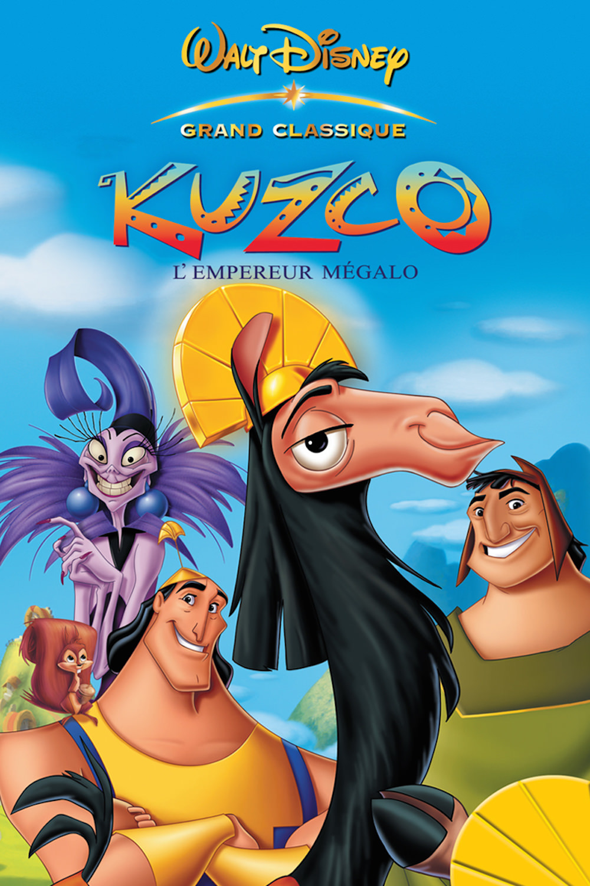
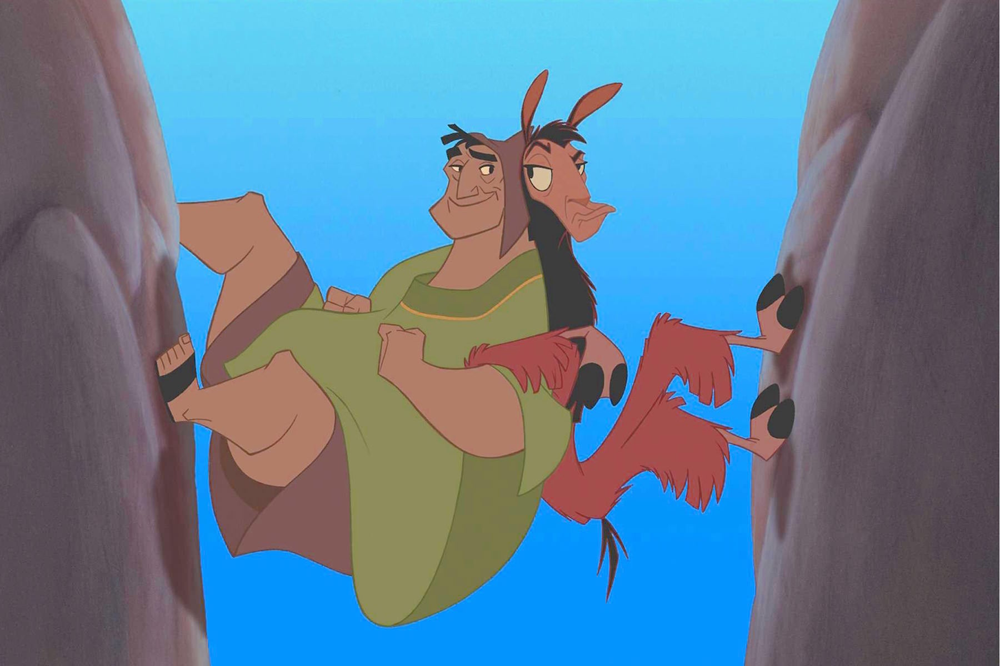
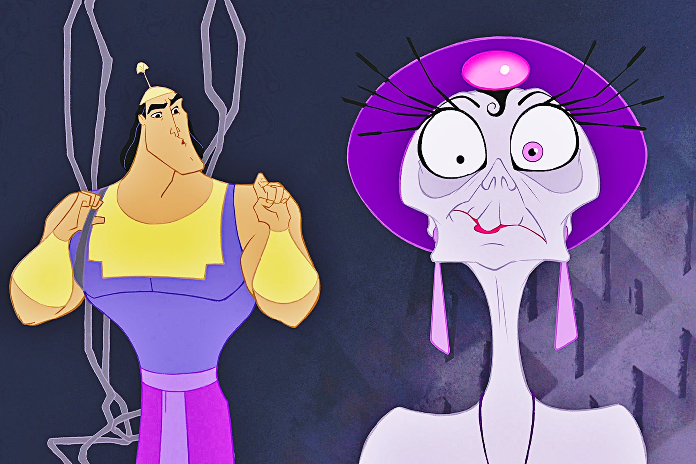

+++
type = "post"
titre = "<em>Kuzco, l&rsquo;empereur mégalo</em>, Mark Dindal"
title = "Kuzco, l'empereur mégalo, Mark Dindal"
url = "/kuzco-empereur-megalo-dindal"
date = "2014-07-11T10:48:55"
Lastmod = "2014-07-11T10:58:23"
cover = "kuzco-empereur-megalo-dindal.jpg"
categorie = [ "À voir" ]
tag = [ "Animation", "Animaux", "Comédie", "Histoire", "Humour" ]
createur = [ "Mark Dindal" ]
annee = [ "2001" ]
weight = 2001
saga = [ "Classiques d'animation Disney" ]
pays = [ "États-Unis" ]
original = "The Emperor's New Groove"

+++

<em>Kuzco, l’empereur mégalo</em> est un film à part parmi les <a href="/saga/classiques-danimation-disney/">classiques Disney</a>. Et pour cause, le quarantième classique tel qu’il est sorti en 2000 aux États-Unis n’avait plus rien à voir avec son projet original. Après le succès aussi énorme qu’inattendu du <a href="/roi-lion-allers-minkoff/"><em>Roi Lion</em></a>, Roger Allers qui l’avait co-signé lance un nouveau projet. On est alors au milieu des années 1990 et le studio donne carte blanche au réalisateur qui est un peu son prodige après le succès public et commercial de l’histoire de Simba. Il se lance alors dans un grand film, une nouvelle comédie musicale encore plus ambitieuse, portée par Sting après Elton John, bref l’un des plus gros projets du studio. Quelques années après, le projet a tellement patiné que l’on est très loin de la sortie prévue pour l’année 2000. Plutôt que de repousser la sortie comme le studio le faisait jusque-là, <em>Kuzco, l’empereur mégalo</em> est le premier à… tout changer. Nouveau réalisateur, nouvelle direction artistique : le film devient une comédie légère, bâclée en à peine deux ans. À l’image, cela se voit : le film de Mark Dindal n’a pas le niveau de finition d’autres classiques. Mais c’est aussi la seule vraie comédie Disney et le divertissement léger est au rendez-vous. Dans son genre, il est plutôt réussi.

Loin de l’ambitieuse histoire originale, le scénario de <em>Kuzco, l’empereur mégalo</em> se déploie autour d’une idée très simple et d’un nombre très restreint de personnages. On découvre ainsi Kuzco, jeune empereur de dix-huit ans qui a été pourri et gâté depuis son enfance et qui dirige son empire selon son bon désir, sans jamais tenir compte de l’intérêt de ses sujets, ni même du sens commun. Il est narcissique, ne pense qu’à son bon plaisir, et jette ceux qui l’entourent comme des objets vieillis et inutiles. D’ailleurs, quand commence l’histoire, Kuzco jette sa conseillère qui n’apprécie pas vraiment d’être ainsi mise sur la touche par ce jeune prétentieux et qui jure de se venger. Dans le même temps, il fait appel à un chef de village uniquement pour connaître la meilleure exposition au soleil de son village et le détruire ensuite pour se construire une piscine. À partir de cette situation initiale, <em>Kuzco, l’empereur mégalo</em> déploie sa farce avec une simplicité rafraichissante par rapport aux autres productions de l’époque. Ainsi, on suit deux couples de personnages : d’un côté, transformé en lama par sa conseillère qui était aussi une sorcière, Kuzco accompagné de Pacha, le chef du village qu’il voulait détruire ; de l’autre, la conseillère Yzma et Kronk, l’assistant débile qui l’accompagne partout. Le premier groupe tente de revenir au palais impérial, tandis que le second les poursuit pour les empêcher de revenir, justement. De fait, Mark Dindal filme une course-poursuite qui n’est pas sans rappeler, par certains aspects, l’esprit des <em>cartoons</em>.

L’intrigue de <em>Kuzco, l’empereur mégalo</em> n’est pas très importante : est-ce que l’empereur va pouvoir retrouver sa forme humaine ? On se doute bien dès le début que ce sera le cas, et le film ne fait rien pour nous surprendre avec son <em>happy-end</em> de circonstance et, il faut le dire, assez décevant. On préfère largement toute la première partie, d’une insolence rare pour les studios Disney. En quelques images, Mark Dindal dresse le portrait d’un insolent jeune homme, une tête à claques tout à fait détestable, mais qui s’assume totalement, ce qui est certainement la meilleure idée. L’ouverture du film est à cet égard une vraie réussite : en voix off, Kuzco nous raconte son histoire et on découvre d’abord un lama seul et trempé jusqu’aux os sous des trombes d’eau. Puis un flash-back nous ramène quelques jours avant, quand il était encore l’empereur craint de tous. La bonne idée, sur cette séquence, est de jouer à fond l’impertinence : l’empereur se présente comme une victime et ne reconnaît aucune de ses erreurs, alors qu’elles sont flagrantes. <em>Kuzco, l’empereur mégalo</em> joue jusqu’au bout la carte du personnage détestable et c’est plutôt agréable par rapport à bon nombre d’autres classiques. La transformation en lama ne change pas son côté désagréable et on a alors les meilleures scènes du film, avec quelques gags vraiment réussis. La suite est plus convenue : sous l’influence du chef du village, comme on s’en doute, Kuzco finit par changer de camp et devient gentil… et sans intérêt. Heureusement que l’autre duo du film reste excellent jusqu’au bout, en particulier le personnage de Kronk qui révèle progressivement tout son potentiel comique. La réussite plaisante et légère du film lui doit beaucoup.

<em>Kuzco, l’empereur mégalo</em> est un classique surprenant. Abandonnant pour la première fois depuis le début des années 1990 la comédie musicale — Sting n’apparaît finalement qu’à la toute fin, pour le générique, et aucun personnage n’a chanté avant cela —, il repose aussi pour la première fois sur une comédie pure. Nonobstant une fin plus conventionnelle, ses personnages déplaisants sont très originaux dans l’univers Disney et à cet égard, c’est une réussite. Peut-être que le projet initial, beaucoup plus ambitieux, était plus intéressant, mais le long-métrage réalisé par Mark Dindak est léger et plaisant. Certes, ce n’est pas le plus grand classique, mais il apporte une touche originale à la collection…

<h3>Vous voulez <a href="/soutien/">m’aider</a> ?</h3>
<ul>
<li><a href="http://www.amazon.fr/gp/product/B00HENR9Z0/ref=as_li_ss_tl?ie=UTF8&amp;tag=leblogdenic07-21&amp;linkCode=as2&amp;camp=1642&amp;creative=19458&amp;creativeASIN=B00HENR9Z0">Acheter le film en Blu-ray sur Amazon</a></li>
<li><a href="http://www.amazon.fr/gp/product/B00005QB3J/ref=as_li_ss_tl?ie=UTF8&amp;tag=leblogdenic07-21&amp;linkCode=as2&amp;camp=1642&amp;creative=19458&amp;creativeASIN=B00005QB3J">Acheter le film en DVD sur Amazon</a></li>
<li><a href="https://itunes.apple.com/fr/movie/kuzco-lempereur-megalo/id369590982">Acheter ou louer le film sur l’iTunes Store</a></li>
</ul>

