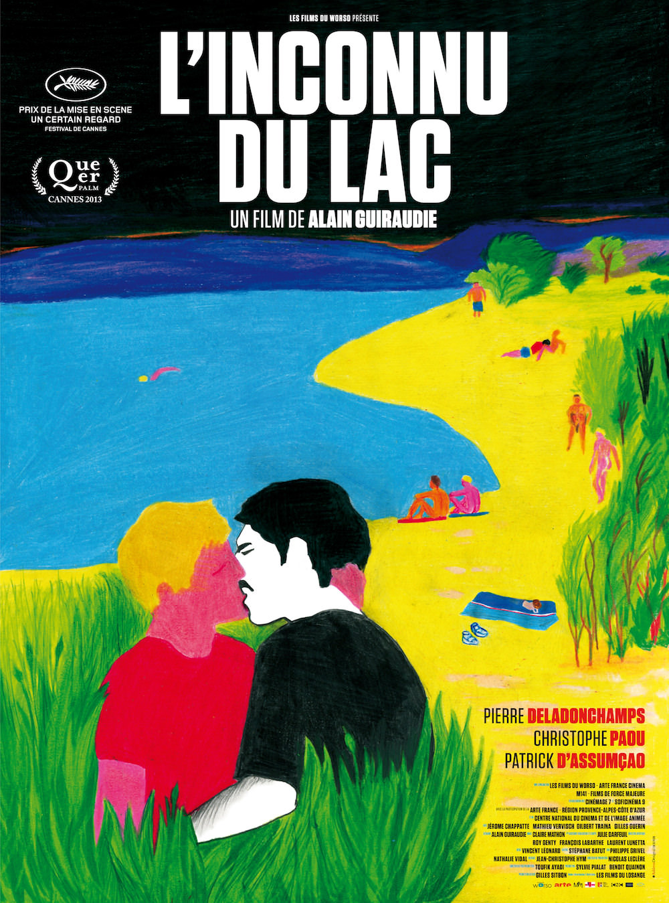

+++
type = "post"
titre = "<em>L&rsquo;Inconnu du lac</em>, Alain Guiraudie"
title = "L'Inconnu du lac, Alain Guiraudie"
url = "/l-inconnu-du-lac-guiraudie"
date = "2013-06-16T11:37:13"
Lastmod = "2014-01-01T12:48:26"
cover = "l-inconnu-du-lac-alain-guiraudie.jpg"
categorie = [ "À voir" ]
tag = [ "Amour", "Drame", "Enquête", "Homosexualité", "Huis clos", "Police", "Sexe", "Thriller" ]
createur = [ "Alain Guiraudie" ]
acteur = [ "Christophe Paou", "Jérôme Chappatte", "Patrick d'Assumçao", "Pierre Deladonchamps" ]
annee = [ "2013" ]
weight = 2013
pays = [ "France" ]

+++

Rendu célèbre par la polémique suscitée par son affiche, <em>L’Inconnu du lac</em> est intéressant pour plus que cela. Le dernier long-métrage d’Alain Guiraudie se déroule sur les bords d’un lac, un lieu naturiste de drague homosexuelle et si le sexe y est bien présent, ce n’est absolument pas un film pornographique pour autant. Ce huis clos tend en fait, étonnamment, au thriller psychologique, ou encore au conte fantastique. Le cinéaste fait de l’économie de moyens de ce film très minimaliste une richesse, pour un résultat vertigineux et passionnant. Un très beau film, à ne pas rater.

Alain Guiraudie filme l’arrivée de Franck comme un rituel immuable. Chaque jour, au volant de sa Renault 25, il vient se garer sur un parking sauvage, sort de la voiture pour rejoindre la plage de galets au bord d’un lac. Une petite dizaine d’hommes, nus pour la plupart, l’y attendent et se retournent pour jauger le nouvel arrivant. Franck pose sa serviette, se déshabille et profite lui aussi du soleil, de l’eau du lac et… du corps d’un homme de temps en temps. <em>L’Inconnu du lac</em> se déroule exclusivement au bord de ce lac naturiste qui est aussi un lieu de drague gay. On n’en sort jamais et tout ce qui est extérieur au lac n’est que mentionné, on ne le voit jamais et cela n’a pas tellement d’importance. L’essentiel, c’est ce qui se déroule sur cette petite plage et le film d’Alain Guiraudie est d’abord construit de rencontres et de dialogues. Franck connaît quelques habitués, certains qu’il salue d’un mot, d’autres qu’il embrasse. Le lieu précis n’est jamais mentionné, mais c’est un petit monde où tout le monde se connaît un peu. En cette période estivale, il y a deux nouveaux parmi les habitués. Henri d’abord, la quarantaine, reste à l’écart du groupe, il ne se déshabille pas, ne se baigne pas et ne semble pas chercher la compagnie d’autres hommes. Franck vient malgré tout le voir, par curiosité, puis par sympathie pour cet homme manifestement mal à l’aise avec ses rondeurs, un peu bougon. Michel ensuite, qui pourrait être l’extrême opposé : bien fichu, bronzé, il exhibe fièrement ses attributs et c’est le coup de foudre pour Franck. Puisqu’il s’agit d’un lieu de drague, le personnage principal de <em>L’Inconnu du lac</em> essaie de l’approcher pour du sexe, certes, mais il espère aller plus loin. 

Le cérémonial est bien en place — on voit Franck arriver en voiture une dizaine de fois pendant tout le film —, mais il est perturbé par un évènement tragique. Un jour, un homme disparaît et la police ne tarde pas à venir s’intéresser à ce lieu de drague notoire où il aurait pu mourir, noyé ou assassiné. Pendant son heure et demie, <em>L’Inconnu du lac</em> bascule du côté du thriller, ou du moins du film policier avec cette enquête menée par un enquêteur coriace qui sent que les habitués du lieu ne lui disent pas tout. Ce serait assez classique, si Alain Guiraudie n’avait pas la malice de montrer ce qui s’est passé à son personnage principal, et aux spectateurs par la même occasion. Dès le deuxième jour, Franck reste sur place pour observer discrètement l’objet de ses désirs qui nage avec son amant du moment. La nuit commence à tomber, mais il aperçoit très bien que Michel enfonce et maintient la tête de son compagnon jusqu’à disparition du corps sous l’eau. On sait alors, autant que Franck, que c’est un type dangereux, mais cela ne va pas empêcher le personnage principal de <em>L’Inconnu du lac</em> de poursuivre sa relation avec lui. À partir de ce moment, l’ambiance change dans le film. Commencé sur le ton du badinage et du sexe sans lendemain, le climat s’y fait plus oppressant et une sorte de menace vient se poser sur les bords du lac. La nature très présente — le vert et le bleu dominent dans le film, en plus du rose naturellement — se fait plus menaçante et Alain Guiraudie le rend très bien en filmant pourtant toujours les mêmes arbres, les mêmes herbes hautes, les mêmes galets. La mise en scène suffit, sans la moindre musique d’ailleurs, à passer d’une vue tranquille et reposante à une vue menaçante où le spectateur sent que quelque chose de tragique pourrait arriver. L’inspecteur n’est pas le plus dangereux dans ce contexte : quand la mort est passée par là, tout devient menace potentielle, même une question apparemment banale sur la Renault 25 de Franck, posée par un Michel qui cherche peut-être à sympathiser, mais surtout à savoir s’il a été vu. 

<em>L’Inconnu du lac</em> est vraiment remarquable de finesse dans sa manière de filmer l’arrivée d’un danger sur la plage et le lac, c’est aussi un film sur l’amour et le sexe. L’amour est plus fort que la menace et après avoir découvert la vérité, Franck désire toujours autant Michel. Ce dernier accepte justement de coucher avec lui, mais sans l’aimer pour autant. Alain Guiraudie filme une déception amoureuse : l’un aimerait aller plus loin et voir son amoureux loin du lac, en ville ou dans son lit ; l’autre, mystérieux, ne veut pas entendre parler d’une relation approfondie et préfère en rester aux bosquets du bois près du lac. Leur relation est torride et le cinéaste n’en perd pas une goutte — l’interdiction aux moins de 16 ans du film n’est pas de trop —, mais ce n’est que du sexe. Une forme de triangle amoureux se met alors en place entre Franck, Michel et Henri qui ne cherche pas de sexe, lui, mais qui tombe amoureux de Franck. Ce personnage est peut-être le plus beau de <em>L’Inconnu du lac</em>, le plus touchant sans doute. On sent parfaitement sa solitude et on sent qu’elle lui pèse, mais il ne semble rien faire pour la contrer. Il reste à l’écart, boudeur, mais c’est presque pour mieux être repéré par les autres. Et s’il n’est pas très bavard, il vise juste en posant les bonnes questions à Franck. Saluons d’ailleurs les choix judicieux d’Alain Guiraudie pour ses acteurs : Pierre Deladonchamps, Christophe Paou et Patrick d’Assumçao sont tous les trois excellents dans leurs rôles. 

Avec des hommes nus qui s’aiment et baisent, Alain Guiraudie crée un film extrêmement riche. C’est peut-être parce qu’il est minimaliste que <em>L’Inconnu du lac</em> s’avère finalement aussi complexe : la simplicité formelle permet aux cinéastes de faire un film sur l’amour en même temps qu’un thriller où la menace pèse sur tous les personnages. On ne l’a pas évoqué, mais on pourrait aussi parler de l’humour présent dans le film, un humour noir plein de sarcasmes, mais qui ajoute encore une richesse à l’œuvre, surtout avec l’hilarant personnage de l’inspecteur. Impossible de résumer <em>L’Inconnu du lac</em> aux scènes de sexe explicites qu’il contient, c’est une œuvre bien plus riche et qui mérite d’être vue pour bien d’autres raisons…

<h3>Vous voulez m&rsquo;aider ?<a href="#footnote_0_9741" id="identifier_0_9741" class="footnote-link footnote-identifier-link" title="&Agrave; propos de la publicit&eacute;&hellip;">1</a></h3>
<ul>
<li><a href="http://www.amazon.fr/gp/product/B00E8WL48S/ref=as_li_ss_tl?ie=UTF8&#038;tag=leblogdenic07-21&#038;linkCode=as2&#038;camp=1642&#038;creative=19458&#038;creativeASIN=B00E8WL48S">Acheter le film en DVD sur Amazon</a></li>
<li><a href="https://itunes.apple.com/fr/movie/linconnu-du-lac/id754631253">Acheter ou louer le film sur l&rsquo;iTunes Store</a></li>
</ul>

<ol class="footnotes"><li id="footnote_0_9741" class="footnote"><a href="http://voiretmanger.fr/soutien/">À propos de la publicité…</a> [<a href="#identifier_0_9741" class="footnote-link footnote-back-link">&#8617;</a>]</li></ol>
