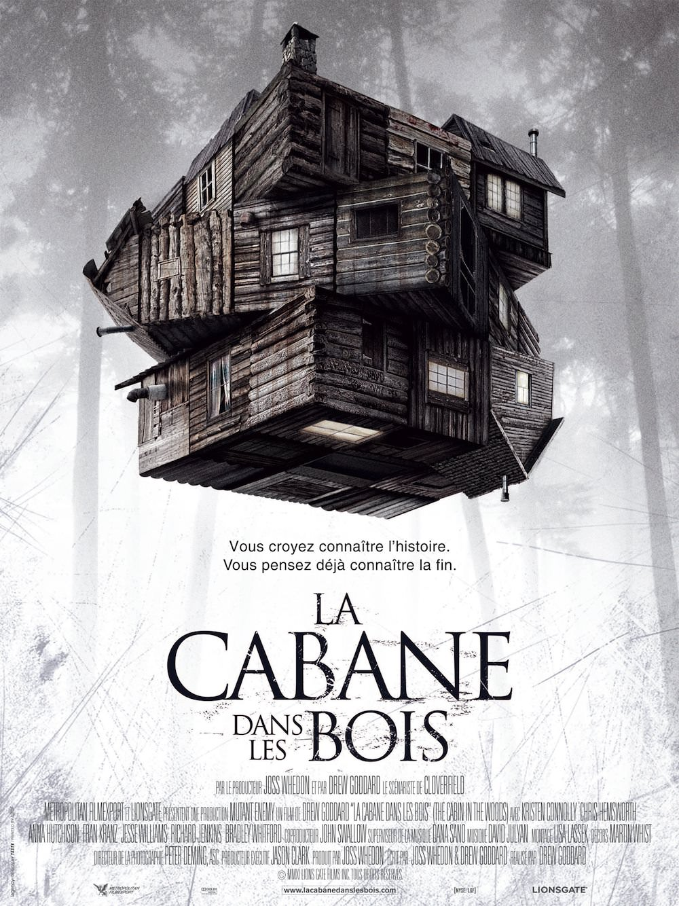
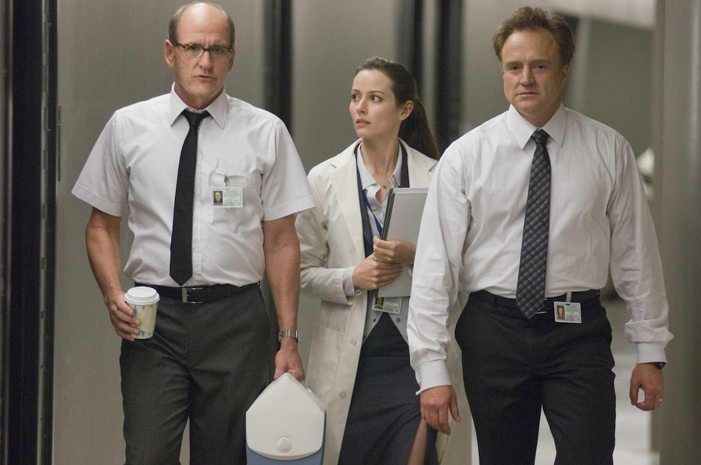

+++
type = "post"
titre = "La cabane dans les bois, Drew Goddard"
title = "La cabane dans les bois, Drew Goddard"
url = "/la-cabane-dans-les-bois-goddard"
date = "2013-03-27T22:23:10"
Lastmod = "2013-03-27T22:28:16"
cover = "la-cabane-dans-les-bois-drew-goddard.jpg"
categorie = [ "À voir" ]
tag = [ "Horreur", "Mort", "Parodie", "Teen Movie", "Violence", "Vite oublié" ]
createur = [ "Drew Goddard" ]
acteur = [ "Chris Hemworth", "Fran Kranz", "Kristen Connolly", "Richard Jenkins" ]
annee = [ "2012" ]
weight = 2012
pays = [ "États-Unis" ]
original = "The Cabin in the Woods"

+++

« <em>Vous croyez connaître l’histoire. Vous pensez déjà connaître la fin.</em> » De fait, quand <em>La cabane dans les bois</em> commence, on voit déjà le film défiler. Une bande de cinq jeunes, trois hommes et deux femmes, qui part pour un week-end dans une mystérieuse cabane reculée dans une région boisée. On s’attend à un film d’horreur classique, un <em>slasher</em> où tous les personnages meurent l’un après l’autre dans un carnage ensanglanté. Drew Goddard est toutefois plus retors et son premier film en tant que réalisateur se transforme vite en un jeu où l’enjeu est de déjouer les attentes des spectateurs pour mieux les surprendre. Le résultat part dans tous les sens et ne s’avère pas aussi fun qu’espéré, mais <em>La cabane dans les bois</em> mérite d’être vu ne serait-ce que pour son imagination débordante…

Difficile d’évoquer précisément son scénario sans dévoiler des éléments clés de l’intrigue. Disons simplement que <em>La cabane dans les bois</em> commence exactement comme n’importe quel film d’horreur, ou plutôt comme une parodie de film d’horreur. Tout est trop net, les personnages sont tous trop marqués pour que l’ensemble ne soit pas suspect. Les jeunes sont tous des étudiants américains bien musclés du côté des mâles, avec une chevelure et une poitrine de rêve en face. Dans le lot, il y a bien évidemment le type un peu à part, Marty qui est en permanence drogué. Drew Goddard prend un grand soin à construire non pas des personnages, mais plutôt des archétypes et leur passage, attendu, dans la station-service glauque est un modèle du genre. Tout est outrancier, rien ne fait vrai et <em>La cabane dans les bois</em> semble clairement s’orienter vers la parodie ou une comédie dans l’esprit de <a href="http://voiretmanger.fr/2012/02/04/tucker-dale-fightent-mal-craig/" title="Tucker &#038; Dale fightent le mal, Eli Craig - À voir et à manger"><em>Tucker &#038; Dale fightent le mal</em></a>. Sauf que dès le départ, le film introduit un grain de sable dans cette mécanique trop bien huilée : quand les jeunes partent dans leur camping-car vers leur mort certaine, un homme mystérieux sur le toit prévient qu’ils sont bien partis. Avant cela, Drew Goddard avait ouvert son film sur une mystérieuse séquence de bureau qui ne semble pas coller au reste, mais c’est bien parce que le cinéaste est décidé à tout faire pour surprendre.

À partir du moment où les cinq jeunes arrivent dans la fameuse cabane, <em>La cabane dans les bois</em> suit un temps son schéma de film d’horreur trop parfait pour être sincère, mais il dérive vite vers le plus grand n’importe quoi. On comprend vite que ces jeunes sont manipulés à distance grâce à un astucieux mélange de scénario préparé à l’avance et de hasard. Une idée que l’on associe dans un premier temps à un jeu de télé-réalité, plutôt dans l’esprit de <a href="http://voiretmanger.fr/2012/04/09/hunger-games-ross/" title="Hunger Games, Gary Ross - À voir et à manger"><em>Hunger Games</em></a> cette fois, mais en beaucoup plus barré. Cette piste, comme toutes les précédentes, s’avère finalement erronée et le film nous emmène encore sur une autre idée, jusqu’à un final explosif… ou plutôt sanglant. Drew Goddard a la bonne idée de ne pas se prendre trop au sérieux, si bien que l’on assiste à cette explosion de violence apparemment totalement hors de contrôle avec un certain amusement, même si <em>La cabane dans les bois</em> s’avère plutôt décevant sur le plan de l’humour. On rigole assez peu pendant 1h30, peut-être justement parce que la profusion d’idées empêche le film de pousser les situations suffisamment loin pour qu’elles deviennent vraiment drôles. À défaut, les amateurs de film de genre pourront se délecter des références à l’horreur en général et à des dizaines d’autres œuvres. Le bestiaire filmé par Drew Goddard est lui aussi assez impressionnant, plus en tout cas que les cinq jeunes acteurs rassemblés ici qui sont aussi insipides que leurs personnages. À choisir, on préfère encore les employés de bureaux qui font des paris sur leurs marionnettes, à commencer par le trop rare Richard Jenkins que l’on apprécie de retrouver ici. 

<em>La cabane dans les bois</em> est un petit film qui a le mérite de surprendre constamment et de déjouer les attentes de ses spectateurs. Le premier long-métrage réalisé par Drew Goddard n’est pas beaucoup plus, et il n’est pas aussi fun qu’espéré. Reste que ce déchaînement de violence et surtout le concentré de clins d’œil à d’autres films d’horreur et de bestioles étonnantes fait mouche, avec un final plutôt réussi. <em>La cabane dans les bois</em> se regarde sans déplaisir, avant d’être rapidement oublié…

<h3>Vous voulez m’aider ?<a href="#footnote_0_8947" id="identifier_0_8947" class="footnote-link footnote-identifier-link" title="&Agrave; propos de la publicit&eacute;&hellip;">1</a></h3>
<ul>
<li><a href="http://www.amazon.fr/gp/product/B0089ZWECK/ref=as_li_ss_tl?ie=UTF8&#038;tag=leblogdenic07-21&#038;linkCode=as2&#038;camp=1642&#038;creative=19458&#038;creativeASIN=B0089ZWECK">Acheter le film en Blu-Ray sur Amazon</a></li>
<li><a href="http://www.amazon.fr/gp/product/B0089ZWE8E/ref=as_li_ss_tl?ie=UTF8&#038;tag=leblogdenic07-21&#038;linkCode=as2&#038;camp=1642&#038;creative=19458&#038;creativeASIN=B0089ZWE8E">Acheter le film en DVD sur Amazon</a></li>
<li><a href="https://itunes.apple.com/fr/movie/la-cabane-dans-les-bois-vost/id555242729">Acheter ou louer le film sur l’iTunes Store</a></li>
</ul>

<ol class="footnotes"><li id="footnote_0_8947" class="footnote"><a href="http://voiretmanger.fr/soutien/">À propos de la publicité…</a> [<a href="#identifier_0_8947" class="footnote-link footnote-back-link">&#8617;</a>]</li></ol>
