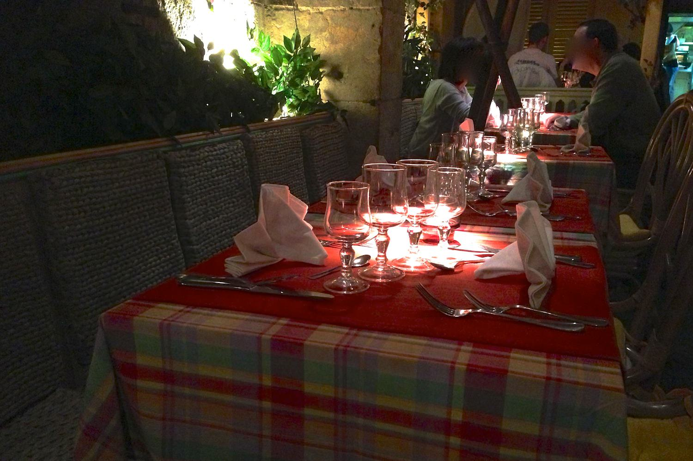
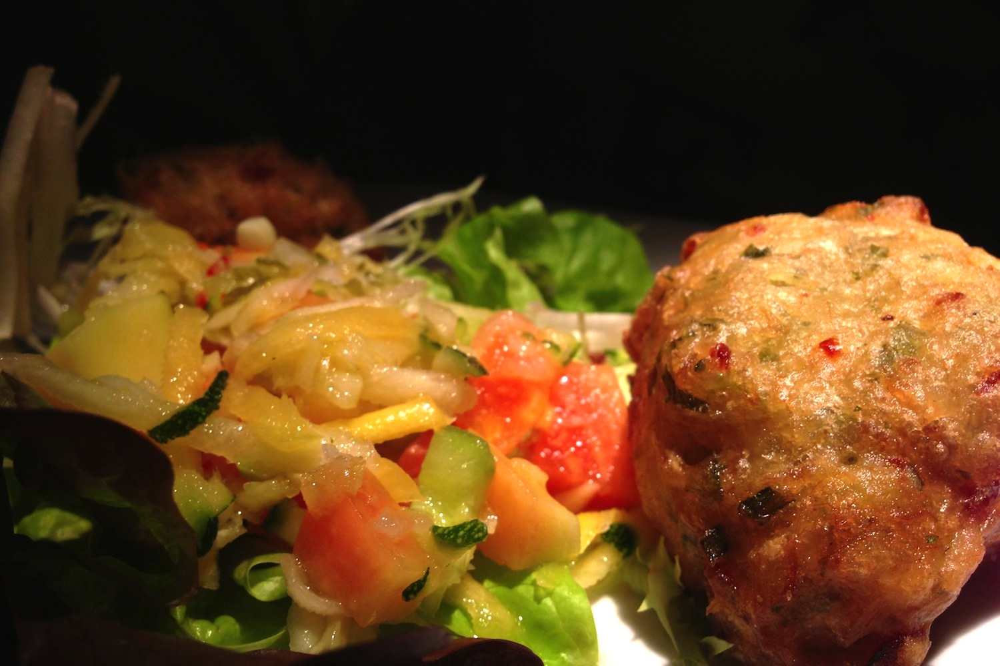
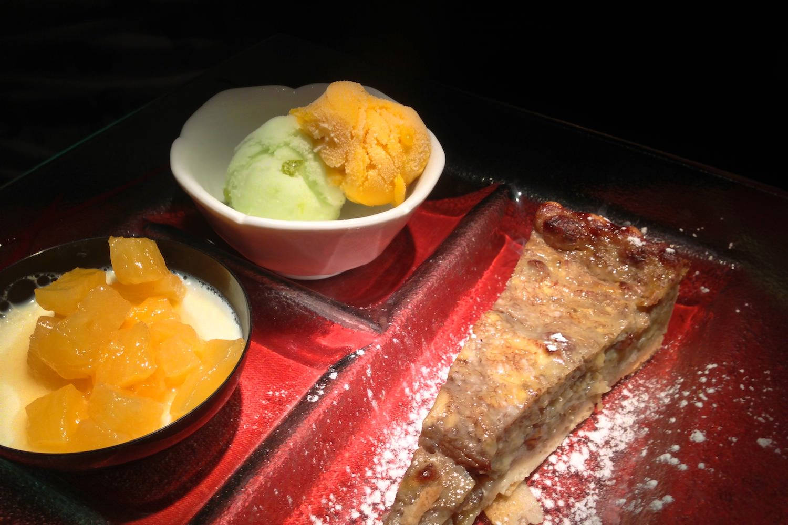

+++
type = "post"
titre = "La Cannelle à Lyon"
title = "La Cannelle à Lyon"
url = "/la-cannelle-lyon"
date = "2013-05-19T00:22:01"
Lastmod = "2013-05-19T00:28:14"
cover = "la-cannelle-lyon.jpg"
categorie = [ "À manger" ]
tag = [ "Cadre original", "Cuisine créole" ]

+++

Un peu en marge du Vieux Lyon, sur les bords de la Saône, <a href="http://www.lacannelle-lyon.com/index.html"><strong>La Cannelle</strong></a> propose depuis une trentaine d’années une cuisine créole traditionnelle. Un choix audacieux dans ce quartier où règnent les bouchons traditionnels et un dépaysement total. Passez la porte, vous arrivez dans une île des Antilles et la cuisine dépaysante est aussi au rendez-vous. Une très bonne adresse pour les amateurs d’exotisme, mais pensez à ne rien manger pendant 24 heures avant…

Derrière une façade sans particularité, <strong>La Cannelle</strong> frappe par sa salle assez grande, mais très intimiste avec son éclairage très léger. On est quasiment plongé dans le noir, même si chaque table est éclairée par un spot directif qui apporte toute la lumière nécessaire. L’effet est, en tout cas, très réussi et il cache le côté un peu kitsch du restaurant. On apprécie les murs végétalisés, même s’il ne s’agit pas de vraies plantes, les grands fauteuils avec une sorte de capote sont originaux et plutôt amusants, mais les nappes en carreaux colorés ne font pas très modernes. Dans l’ensemble, cette salle est convaincante et elle a une autre vertu : alors qu’elle est assez grande et dense, on n’a pas l’impression d’être nombreux dans le restaurant, un bon point. Ouvert seulement le soir et seulement du mardi au samedi, <strong>La Cannelle</strong> n’était pas complet en ce samedi soir de mai, mais il y avait du monde et l’ambiance était bonne. Rien de gênant toutefois, même pour un diner en amoureux : l’éclairage tamisé fonctionne à plein. 

On peut commander ses plats <a href="http://www.lacannelle-lyon.com/carte_restaurant_creole.php">à la carte</a>, mais le restaurant met en avant ses deux <a href="http://www.lacannelle-lyon.com/menus_restaurant_creole.php">formules de découverte</a>. Pour 30 € par personne et sept saveurs, ou 35 € par personne et dix saveurs, vous aurez un aperçu sans surprise, mais très complet, de la cuisine créole. <strong>La Cannelle</strong> parle de « saveurs » et non de plats, et pour cause : on n’a pas dix assiettes, mais deux fois moins avec deux à trois éléments à chaque fois pour un tour d’horizon de cette cuisine. Ce mode de dégustation est très séduisant, puisque l’on se laisse porter et que l’on peut goûter à beaucoup de choses différentes. Malheureusement, les éléments servis ne semblent pas varier d’un jour à l’autre, comme le ferait une adresse telle qu’<a href="/au-14-fevrier-lyon/" title="Au 14 février, Lyon"><strong>Au 14 février</strong></a> : c’est une initiation à la cuisine créole, mais il faudra plutôt piocher dans la carte pour varier les plaisirs. Cela tombe bien, il y a le choix et on commencera de toute manière avec un cocktail : tous les incontournables sont au rendez-vous et le rhum, élément de base dans tous les cocktails, est bien présent et très bon. 

Nous avons opté pour la formule la plus complète, histoire de satisfaire au mieux notre curiosité de cette cuisine exotique et découvrir un maximum de plats. On ouvre le repas avec des acras de morue accompagnés d’une salade exotique : les beignets juste cuits étaient croustillants et moelleux, avec un bon goût de poisson bien relevé, sans être trop piquants. Une première très bonne impression, mais les trois accrocs dans l’assiette remplissent déjà bien l’appétit. On enchaîne ensuite avec un petit boudin créole qui manquait peut-être d’épices, mais qui était accompagné d’une sauce tomate, une touche d’acide qui allait très bien avec le boudin. À côté, un petit pot avec du crabe farci avec un bon goût d’iode : non, ce n’est pas du surimi… Les assiettes défilent avec un poisson — un très bon filet blanc servi avec une sauce aux crustacés, du riz et une banane planteur — et deux viandes, ce soir-là du poulet au citron vert et un colombo de porc. La cuisine servie à <strong>La Cannelle</strong> est bonne et généreuse, un peu trop généreuse sans doute. Même si les quantités semblent raisonnables, ce n’est qu’une illusion et il faut vraiment un très gros appétit pour venir à bout du menu. J’ai calé au niveau des viandes, laissant la majorité du pourtant très bon gratin de <a href="https://fr.wikipedia.org/wiki/Chayote">christophine</a>, mais c’était pour mieux profiter du trio de desserts. Les deux boules de sorbet sont alors les bienvenues pour faire passer la très bonne tarte aux bananes et raisins secs qui s’est avérée moins bourrative qu’escomptée. La crème de noix de coco était toutefois le clou du spectacle et une très belle manière de conclure ce repas. 

On mange très bien à <strong>La Cannelle</strong>, mais on mange beaucoup : pensez à garer la voiture loin du restaurant (le quartier vous forcera la main de toute manière) et à manger léger à midi pour venir à bout des menus. Nonobstant cette générosité un peu trop grande, c’est une adresse à recommander pour qui veut quitter la cuisine lyonnaise et cherche un peu d’exotisme. Les assiettes de <strong>La Cannelle</strong> sont généreuses et savoureuses, ce n’est pas de la cuisine compliquée, mais c’est simple, sincère et plutôt bon marché. À essayer !

